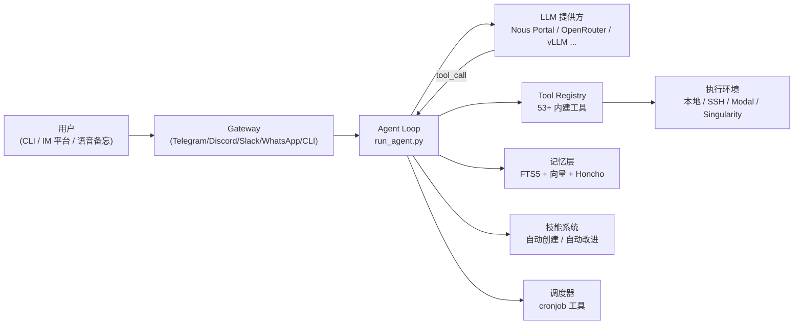

# Hermes Agent 是什么：定位与架构总览

## 前言

**C：** Hermes Agent 是 Nous Research 在 2026 年 2 月开源的自主 AI Agent。它不是 IDE 里的 copilot，也不是套在单个 API 上的聊天壳，而是一个**住在你服务器上、带记忆、能自建技能、通过任意平台找到你**的持续运行体。本篇先讲清它的定位和整体架构，后面几篇再拆安装、工具、记忆与技能。

<!-- more -->

## 它和常见 Agent 工具的区别

| 维度 | Cursor / Claude Code | LangChain / AutoGen | Hermes Agent |
| -- | -- | -- | -- |
| 运行位置 | IDE 内 | 你自己写应用嵌入 | **独立长期进程**（VPS、本地、GPU 集群均可） |
| 记忆 | 会话级 | 需自己接向量库 | 内置跨会话检索 + 周期性"写入"机制 |
| 技能 | 无 | 无 | **自动从复杂任务中沉淀可复用 skill** |
| 接入面 | IDE UI | HTTP / SDK | CLI、Telegram / Discord / Slack / WhatsApp / Signal 统一 gateway |
| 模型 | 绑定厂商 | 任意 | Nous Portal / OpenRouter / NVIDIA NIM / 本地 vLLM / 任意 OpenAI 兼容端点 |
| License | 闭源 | MIT | MIT |

一句话：**它把"个人专属 24h 在线 Agent"做成了基础设施**，不绑 IDE，不绑厂商。

## 核心能力清单

- **持久记忆**：FTS5 会话检索 + LLM 摘要做跨会话回忆；Honcho dialectic memory 建立关于"用户是谁"的模型。
- **技能系统**：解决过一次难题后，自动落盘为可复用的 skill 文档，下次可搜可用；内置 40+ 技能（MLOps、GitHub、图表、笔记等）。
- **工具注册表**：53+ 内建工具（browser、file、terminal、code_execution、delegation、memory、messaging、cron 等），开发者只需写一个 `tools/*.py` 即可扩展。
- **定时调度**：内置 cron scheduler，把每日报表、夜间备份、周审计派发到任意平台。
- **子 Agent 并行**：`delegate_task` 工具可 spawn 隔离子 Agent，多个工作流并行，只有最终摘要回流，**不污染主会话上下文**。
- **数据产线**：批量轨迹生成、Atropos RL 环境、trajectory 压缩，面向"训练下一代工具调用模型"。
- **本地优先**：所有记忆存在 `~/.hermes/`，无遥测、无云端锁定。

## 架构总览

主循环 `run_agent.py` 是心脏：它决定每轮要不要调工具、要不要查记忆、要不要写技能；工具注册表是"手脚"；记忆和技能是"沉淀层"；Gateway 是"进出口"。

## 执行环境与模型后端

- **执行环境**：本地 shell、SSH 远程、Modal、Singularity（HPC），同一个 Agent 可以在 `$5 VPS` 上跑，也能接到 GPU 集群上。
- **模型后端**：只要是 **OpenAI 兼容**的端点都能接；官方亲儿子是 Nous Portal（OAuth）；开源口的主力是 OpenRouter（200+ 模型）；私有化常见选 vLLM + Nemotron / Qwen / GLM / MiMo。

这种"正交设计"意味着你可以**在本地小 VPS 上长期跑 Agent，但把实际推理交给云端**——成本、延迟、隐私三者的权衡完全交给你。

## 适合什么样的场景

- 个人自动化：定时看邮件、写日报、跑备份、整理笔记、从 IM 里接活。
- 小团队助手：挂一个 Telegram/Discord bot，团队成员都能 @它做事，记忆跨人共用。
- MLOps / 训练数据：批量生成工具调用轨迹，喂给下一代 tool-use 模型的微调。
- 轻量科研脚手架：Atropos RL 环境 + trajectory 导出，天然适合"训 Agent 行为"的实验。

## 不适合的场景

- 想要**闭源合规审计**、必须走企业 SaaS 的团队 —— Hermes 的定位是**自托管**。
- **纯 IDE 内嵌助手**：它跟 Cursor/Claude Code 不是对位产品，强行替代反而麻烦。
- 极端低资源终端：最低也得能跑 Python 3.11 + 一定本地存储，并不是"嵌入式可用"级别。

## 本章后续安排

- `02-安装与快速上手`：从 `curl | bash` 到第一次 `hermes chat` 整条路打通。
- `03-工具系统与自定义工具开发`：读懂 tool registry，写一个自己的 `tools/mytool.py`。
- `04-记忆、技能与自我改进循环`：讲清 FTS5 检索、自动技能化、Honcho dialectic，以及如何把一次排错变成下次的"一键方案"。

## 小结

- Hermes Agent = **自托管 · 自我改进 · 工具可插拔**的开源 Agent。
- 架构上是「Gateway + Agent Loop + Tool Registry + 记忆/技能层 + 调度器」五件套。
- 它不与 IDE copilot 正面竞争，定位更偏"**长期在线的个人 AI 助理**"。

::: tip 延伸阅读

- 主页：[hermes-agent.nousresearch.com](https://hermes-agent.nousresearch.com)
- GitHub：[NousResearch/hermes-agent](https://github.com/NousResearch/hermes-agent)
- 下一篇：`02-安装与快速上手`

:::
