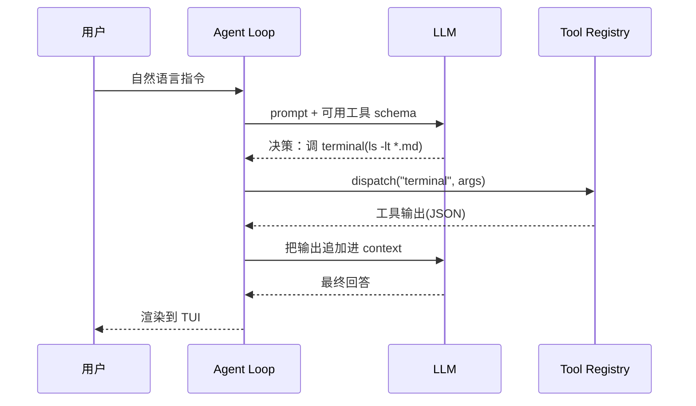

# Hermes Agent 安装与快速上手

## 前言

**C：** 这一篇走一遍"**零前置依赖 → 第一次对话 → 挂上 Telegram**"的完整路径。Hermes 官方把安装做得非常懒人——一条 `curl | bash`，内部帮你装 `uv`、拉 Python 3.11、克隆仓库、搭好 venv，但了解它背后在做什么，排错时才不至于瞎猜。

<!-- more -->

## 系统要求

| 项 | 要求 |
| -- | -- |
| OS | Linux / macOS / WSL2 / Android(Termux) |
| Python | 3.11（安装脚本会用 uv 自带装好） |
| 磁盘 | 至少 ~2 GB（venv + 依赖） |
| 网络 | 能访问 GitHub、所选 LLM 提供方端点 |
| 权限 | 普通用户即可，**不需要 sudo** |

## 一键安装

```bash
curl -fsSL https://raw.githubusercontent.com/NousResearch/hermes-agent/main/scripts/install.sh | bash
```

安装脚本会做的事：

1. 装 [`uv`](https://github.com/astral-sh/uv)（快速 Python 包管理器）
2. 用 uv 安装 Python 3.11（不会污染系统 Python）
3. 把仓库克隆到 `~/.local/share/hermes-agent/`（或等价位置）
4. 创建 venv，安装 `hermes-agent[all]`
5. 在 `~/.local/bin/hermes` 做软链

装完后按提示重载 shell：

```bash
source ~/.bashrc     # 或 ~/.zshrc
hermes --version
```

::: tip 手动/源码安装
如果习惯自己管环境，可以：

```bash
git clone https://github.com/NousResearch/hermes-agent.git
cd hermes-agent
./setup-hermes.sh    # 安装 uv、创建 venv、装 .[all]、symlink 到 ~/.local/bin/hermes
```
:::

## 交互式配置：`hermes setup`

第一次跑建议直接：

```bash
hermes setup
```

它是一个**设置向导**，会依次问你：

1. **选 LLM 提供方**：Nous Portal（OAuth 一键接入）、OpenRouter（填 API Key）、NVIDIA NIM、自托管 vLLM、任意 OpenAI 兼容端点。
2. **选默认模型**：根据上一步提供方列出可用模型，按工具调用能力排序。
3. **选 toolsets**：勾选想启用的工具集（`web`、`terminal`、`file`、`browser`、`code_execution`、`delegation` 等）。
4. **存储目录**：默认 `~/.hermes/`，可改。
5. **可选：配置 gateway**（IM 平台接入，稍后再讲）。

如果只想零散改某一项，用：

```bash
hermes model           # 换模型/提供方
hermes tools           # 改 toolsets
hermes config set key value
hermes doctor          # 体检：依赖、可达性、配置一致性
```

## 第一次对话

```bash
hermes
```

你会看到一个终端 TUI，左边是会话、右边是工具调用详情。试试：

```text
> 列一下当前目录下所有 markdown 文件，按修改时间倒序。
```

如果启用了 `terminal` 工具，Agent 会调用 shell，返回结果，再由它总结。初学时建议把**tool 调用详情栏**一直开着，这样能清楚看到它"想做什么 → 调了什么工具 → 工具返回了什么 → 它又怎么接"。



## 常用命令速查

| 命令 | 作用 |
| -- | -- |
| `hermes` | 开始对话（TUI） |
| `hermes chat --toolsets "web,terminal"` | 临时指定启用的工具集 |
| `hermes model` | 改 LLM 提供方与模型 |
| `hermes tools` | 改启用的工具集 |
| `hermes gateway setup` / `start` | 配置/启动 IM 平台网关 |
| `hermes update` | 升级到最新版 |
| `hermes doctor` | 诊断安装与配置 |
| `hermes claw migrate` | 从 OpenClaw 迁移 |

## 挂一个 Telegram Bot（可选）

想在手机上 @它干活，最常见的是挂 Telegram：

```bash
hermes gateway setup     # 填 BOT_TOKEN 等
hermes gateway start     # 前台跑；或配成 systemd service
```

Gateway 进程会把 IM 消息翻译成 Agent Loop 的输入，再把回复推回去；它**和 TUI 共享同一个记忆与技能库**，所以早上在电脑上教它的东西，晚上在地铁上手机里它还记得。

## 常见坑

- **`hermes: command not found`**：`~/.local/bin` 不在 `PATH`，加进去或重载 shell。
- **模型不支持 function calling**：某些开源模型 tool-use 训得差，工具调用会不稳；先按官方推荐模型试通再换。
- **网络不通**：OpenRouter / Nous Portal 有时区限制或需要代理，用 `hermes doctor` 先确认连通性。
- **Windows**：官方只支持 WSL2，不建议直接 PowerShell。

## 小结

- `curl | bash` 一条线装完；无 sudo、无污染系统 Python。
- `hermes setup` 一次配齐，零散改用 `model` / `tools` / `config` / `doctor`。
- `hermes` 进 TUI 看工具调用详情，是理解 Agent 行为的最佳入口。
- Gateway 把 Hermes 变成一个**跨平台的 IM bot**，背后仍是同一套记忆与技能。

::: tip 延伸阅读

- 官方文档：[hermes-agent.nousresearch.com/docs](https://hermes-agent.nousresearch.com/docs)
- 下一篇：`03-工具系统与自定义工具开发`

:::
