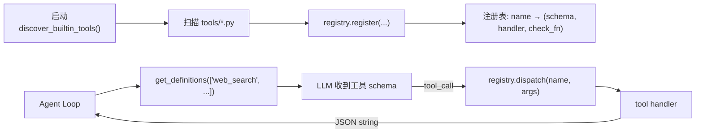

# Hermes Agent 工具系统与自定义工具开发

## 前言

**C：** Agent 能做多少事，全看它**手上有什么工具**。Hermes 内建了 53+ 工具，但真正有趣的是它把"加工具"这件事做得非常轻——一个 `tools/xxx.py` 文件，自动发现、自动注册、自动拼进模型的 function schema。这一篇讲清三件事：工具系统的组织、从零写一个自定义工具、以及 agent-level 工具的特殊之处。

<!-- more -->

## 工具系统的骨架

核心对象只有一个：`tools/registry.py` 里的 **`ToolRegistry`** 单例。它负责：

- 在启动时扫描 `tools/*.py`，把**顶层调用过 `registry.register()`** 的模块加入注册表。
- 暴露 `registry.get_definitions(tool_names)`：返回 OpenAI function calling 风格的 schema 列表，供 Agent Loop 拼进 prompt。
- 暴露 `registry.dispatch(name, args, **kw)`：把 LLM 的一次 `tool_call` 路由到真正的 handler。



## 内建 toolsets 一览

Hermes 把工具分组成 **toolset**，启用时按组启用，粒度合适：

| Toolset | 典型工具 | 用途 |
| -- | -- | -- |
| `browser` | `browser_navigate` / `browser_back` / `browser_cdp` 等 11 个 | 真实浏览器操作 |
| `file` | 读/写/列目录等 4 个 | 本地文件系统 |
| `terminal` | 2 个 | 跑 shell 命令 |
| `code_execution` | `execute_code` | **Python 脚本里再调 Hermes 工具**（见下） |
| `delegation` | `delegate_task` | spawn 子 Agent |
| `memory` / `session_search` / `skills` / `todo` | 状态类 | **agent-level 工具**，由主循环拦截 |
| `cronjob` | `cronjob` | 定时任务 |
| `moa` | `mixture_of_agents` | 多模型协作 |
| `web` | `web_search` 等 2 个 | 联网检索 |
| `homeassistant` / `feishu_*` / `image_gen` / `rl` / ... | 领域工具 | 按需启用 |

> `execute_code` 很特别：它让 LLM 写一段 **Python 脚本**，脚本内部再通过 RPC 调其它 Hermes 工具。适合"**需要 3+ 次工具调用 + 中间处理逻辑**"的任务，可以把一长串多步操作压成零上下文成本的一次调用。

## 写一个自己的工具

以一个"查天气"的工具为例，一个文件搞定：

```python
# tools/weather_tool.py
"""Weather Tool -- 根据城市名返回当前天气。"""
import json
import os
import aiohttp
from tools.registry import registry

def check_weather_requirements() -> bool:
    return bool(os.getenv("OPENWEATHER_KEY"))

async def _weather(location: str, units: str = "metric") -> str:
    key = os.environ["OPENWEATHER_KEY"]
    url = "https://api.openweathermap.org/data/2.5/weather"
    params = {"q": location, "units": units, "appid": key}
    async with aiohttp.ClientSession() as s:
        async with s.get(url, params=params) as r:
            data = await r.json()
    return json.dumps({
        "location": location,
        "temp":     data["main"]["temp"],
        "desc":     data["weather"][0]["description"],
    })

WEATHER_SCHEMA = {
    "type": "function",
    "function": {
        "name": "weather",
        "description": "Fetch current weather for a location.",
        "parameters": {
            "type": "object",
            "properties": {
                "location": {"type": "string", "description": "City name, e.g. 'Beijing'"},
                "units":    {"type": "string", "enum": ["metric", "imperial"], "default": "metric"},
            },
            "required": ["location"],
        },
    },
}

registry.register(
    name="weather",
    toolset="weather",
    schema=WEATHER_SCHEMA,
    handler=lambda args, **kw: _weather(
        args.get("location", ""),
        args.get("units", "metric"),
    ),
    check_fn=check_weather_requirements,
)
```

只要这个文件落在 `tools/` 下，重启 Hermes 时 `discover_builtin_tools()` 会自动把它收进来。`hermes tools` 里就能看到 `weather` toolset，启用后模型就会在需要时自己调用。

### 铁律三条

- **Handler 必须返回 `json.dumps()` 后的字符串**，不能是 dict 也不能 raise unhandled exception；否则 Agent Loop 无法把结果追加到 context。
- **`check_fn` 决定工具是否出现在 schema 列表**：返回 `False` 就**静默排除**（典型用法：依赖的环境变量/二进制没装好时隐藏工具）。
- **参数 `description` 字段决定模型怎么传值**：要说清单位、格式、取值范围——这是让 LLM"用对工具"的关键。

## Agent-Level 工具：为什么 `todo` / `memory` 特殊

有几个内建工具（`todo`、`memory`、`session_search`、`delegate_task`）是**被 Agent Loop 拦截的**：它们的 schema 仍挂在 registry，但 `run_agent.py` 会在进入 `handle_function_call()` 之前就处理它们。原因：

- 需要访问 agent 的**会话级状态**（todo 列表、记忆索引、子 Agent 句柄）。
- 需要跟主循环的上下文裁剪、轮次管理配合。

自己写工具时一般**不要**做成 agent-level；真要做，参考 `tools/todo_tool.py` 的模式，并通过 `handler` 的 `**kwargs` 里的 `task_id` 与主循环通信：

```python
def _handle(args, **kw):
    task_id = kw.get("task_id")
    return do_something(args["x"], task_id=task_id)
```

## 怎么调试

- `hermes doctor`：检查工具依赖是否满足（会跑每个工具的 `check_fn`）。
- 对话里直接说"**用 XXX 工具做 YYY**"，观察 TUI 里 tool call 栏的输入输出。
- 打日志：`import logging; logger = logging.getLogger(__name__)`，在 handler 里打关键字段。
- 复杂工具建议配一个**最小测试脚本**，直接 `python -c "from tools.weather_tool import _weather; ..."`，不要每次都起 Agent。

## 小结

- `tools/` 下一个文件 = 一个工具；schema + handler + check_fn + `registry.register()`。
- Handler 必须返回 JSON 字符串；`check_fn` 控制工具是否对模型可见。
- 参数 `description` 是 LLM 的"说明书"，写得越具体出错越少。
- 状态型工具优先走 agent-level 模式，但日常工具**不必涉及**这一层复杂度。

::: tip 延伸阅读

- 官方文档：*Adding Tools* / *Built-in Tools Reference*
- 下一篇：`04-记忆、技能与自我改进循环`

:::
