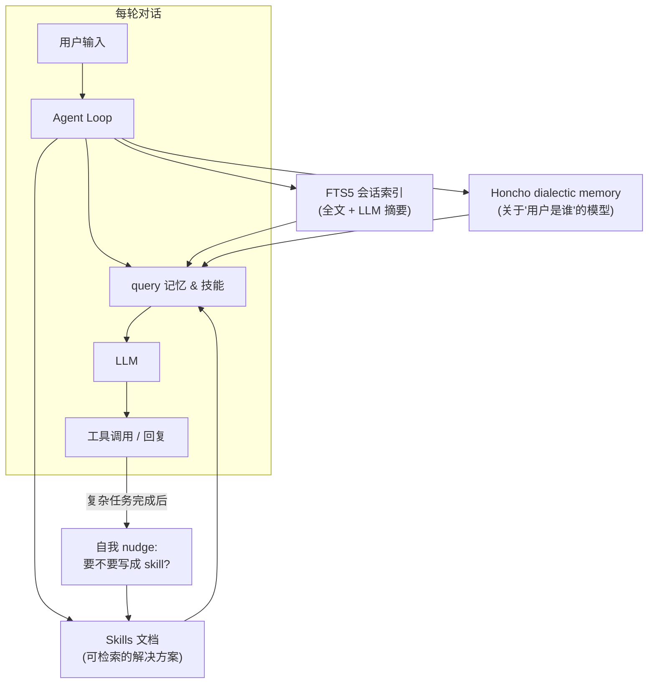
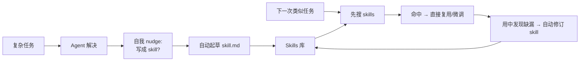

# Hermes Agent 记忆、技能与自我改进循环

## 前言

**C：** 绝大多数 Agent 聊完一轮就忘得干干净净。Hermes 做了一件更"长期主义"的事：把**记忆**、**技能**、**会话检索**三层拧在一起，让它在用的过程中**慢慢变成"了解你的助手"**。这一篇讲清这三层分别解决什么问题、怎么配合，以及如何把一次排错变成下次的"一键方案"。

<!-- more -->

## 三层叠加：一张图先看清



三层各司其职：

- **会话检索（FTS5 + 摘要）**：找"以前我们聊过什么"。
- **Honcho dialectic memory**：维护"**你是谁、偏好是什么**"的长期画像。
- **Skills 系统**：把"**怎么解决某类问题**"沉淀为可复用的 skill 文档。

## 会话检索：让 Agent 记得自己说过啥

所有会话都落在 `~/.hermes/` 下，通过 SQLite 的 **FTS5** 做全文索引，再由 LLM 对每段会话做**摘要**，摘要本身也入库。一次查询会：

1. 用关键词命中原文（FTS5）；
2. 用向量 / 摘要命中语义相近但措辞不同的片段；
3. 把最相关的几条塞进当前 prompt，作为"**我以前解决过 / 讨论过**"的证据。

对应的工具是 `session_search`（agent-level），LLM 在需要"回想"时自己调用；用户也能在 TUI 里直接触发。

::: tip 为什么加 LLM 摘要
直接 FTS5 对长对话效果差：你三个月前用"**服务器磁盘快满**"讨论的事，现在问"**那台机器清日志的脚本在哪**"可能一个关键词都不重合。摘要把事件标签化，**语义召回**才跑得动。
:::

## Honcho dialectic memory：关于"你是谁"的模型

Honcho 是另一条线：它不是在存"事件"，而是在建模"**用户画像**"。简单讲，它会在合适的时机做一轮"对话 → 抽取用户属性 → 合并到画像"的闭环：

- 你说"我在北京"、"我用 macOS"、"我讨厌邮件过多"——这些会变成持久属性。
- 下次你说"帮我看看项目能不能部署"，它知道默认是 macOS，不会默认用 apt。
- 画像会**自我纠偏**：如果新信息和旧画像矛盾，会记录变更而不是一直沿用旧值。

这一层的价值不是 "**让 Agent 显得懂你**"，而是**减少你每次都要重申背景的成本**。

## Skills：把"解法"写成可复用的文档

这是 Hermes 最有意思的部分。一次复杂任务完成之后，Agent 会**自我 nudge**：

> "这件事看起来值得沉淀成 skill，要不要我写一份？"

确认后，它自动生成一份 **skill 文档**（Markdown），包含：

- 适用场景描述
- 所需工具与前置条件
- 执行步骤（命令、参数、边界条件）
- 常见坑与回滚方式

这些文档统一存放，**可检索**、**可编辑**、**可自改进**——下次遇到相似任务，Agent 先搜一下 skills，命中就直接按 skill 走，不必从零推理；用过一次再发现需要补的地方，它也会顺手把 skill 升级掉。

内建已经带 40+ 个开箱即用的 skill，覆盖 MLOps、GitHub 操作、图表生成、笔记管理等。



::: tip Skill 不是模板，是"可执行说明书"
Skill 里通常写清了**调哪个工具、传什么参数、检查什么输出**，所以是半结构化的；它既给人看，也给 Agent 自己看。
:::

## 子 Agent：避免"一个会话里什么都塞"

记忆 + 技能让 Agent 变强，但上下文终究是有限的。`delegate_task` 工具让主 Agent 可以 spawn **隔离子 Agent**：

- 子 Agent 有**独立会话、独立工具集**；
- 主 Agent 只等它最终的 summary，**中间 tool 输出不占主上下文**；
- 多个子 Agent 可以并行跑，适合"清洗 10 份日志"、"批量改 50 个仓库"这类任务。

这是 Hermes 把"**长期记忆 + 当下专注**"这对矛盾化解开的关键机制。

## 调度：让 Agent 不等你开口

记忆和技能都很好，但还要有人"按按钮"。`cronjob` 工具让 Agent 能**给自己排日程**：

```text
> 每天 9 点汇总昨天所有 PR 的评审状态，发到我的 Telegram。
```

Agent 会：

1. 把这个意图拆成"拉 PR 列表 → 汇总 → 推送"三段；
2. 写成一个 skill（或复用已有的）；
3. 用 `cronjob` 注册定时任务；
4. 每天自动执行，结果经 Gateway 发到你手机上。

## 一条实用的最佳实践

- **让记忆写入有感**：发现 Agent 下次忘了重要偏好，主动说"记住：我喜欢 X / 这个项目里 Y"，触发画像更新。
- **主动 skill 化**：排完一次复杂故障，直接问它"把这个过程写成 skill"，不要等它 nudge。
- **定期审视 skills**：用 `skills` 工具列一遍，把过时的删掉；skill 多而散比少而精更影响效果。
- **敏感信息隔离**：记忆存 `~/.hermes/`，注意备份与权限；不要让它记录 token、密码等机密（或启用加密）。

## 小结

- 记忆层 = **FTS5 会话检索 + Honcho 用户画像**，让 Agent 记得你说过啥、也知道你是谁。
- 技能层 = **自动起草 + 可检索 + 自改进**的解决方案库，真正做到"用一次省一次"。
- 子 Agent + cron 让复杂任务**并行化、自动化**，同时不拖垮主会话上下文。
- 本章四篇合起来构成 Hermes Agent 的最小入门闭环：架构 → 安装 → 工具 → 记忆/技能。

::: tip 延伸阅读

- 官方文档：`memory`、`skills`、`session_search`、`delegate_task`、`cronjob` 各节
- 想进一步对比 MCP / LangGraph / AutoGen 的组织方式，可等本分册后续章节

:::
