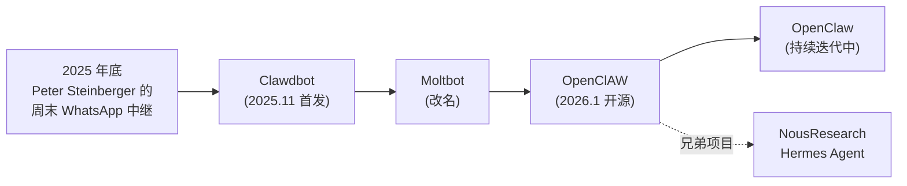

# OpenClaw 是什么：从 Clawdbot 到 OpenClaw

## 前言

**C：** OpenClaw 是一个火得很快的开源**自托管个人 AI Agent**——开源三个月就拿到 35.6 万 GitHub 星。它的设计取向跟上一节讲过的 Hermes Agent 很像（自托管、长周期运行、对接 IM），但走的是**另一条演化路径**。这一篇先把定位、历史、和 Hermes 的关系讲清楚，后面四篇再拆安装、记忆、扩展与安全。

<!-- more -->

## 一句话定位

> **OpenClaw = 一个常驻 daemon 的个人 AI Agent**，把任意 LLM（Claude / GPT / Kimi K2.5 / Ollama 本地模型）接到你日常用的 IM / 工具上，**不绑厂商、不要订阅**，只付 API 费用。

它的典型画面是：你在 WhatsApp 里甩一句"帮我整理下今天的日报"，手上的 Mac mini 或者一台小 VPS 上跑的 OpenClaw 接单，调模型、读文件、查邮件，然后把结果回推到同一个聊天窗口。

## 一段简短的历史

OpenClaw 的演化线很有意思，记住它的"名字谱系"就能理解为什么网上资料名字乱七八糟：

作者 Peter Steinberger 是 PSPDFKit 创始人。项目最早只是他自己**把 WhatsApp 接进 Claude 的周末项目**，意外地好用，随后开源并快速社区化。NousResearch 那边的 Hermes Agent 是独立重写的"学术/自改进"向版本，两者在工具和记忆思想上互通，Hermes 甚至提供了 `hermes claw migrate` 一键迁移。

## 核心特性

- **自托管 daemon**：后台常驻进程，开机自启、断网自恢复，**不是一次性 CLI**。
- **任意 LLM**：官方集成 Anthropic / OpenAI / Google / Moonshot，对 LiteLLM 兼容后端全面支持，Ollama 跑本地模型也一视同仁。
- **23+ 通讯平台**：WhatsApp / Telegram / Discord / Slack / Signal / iMessage 等都有官方 connector，走统一的 gateway 层。
- **三层记忆系统**：长期记忆（`MEMORY.md`）+ 每日笔记 + 实验性的 "Dreaming" 合并；下一篇细讲。
- **Skills 生态**：社区 `ClawHub` 提供可安装的 AgentSkills，装一个就多一项能力。
- **MCP 一等公民**：原生读 `mcp.servers` 配置，GitHub / Notion / 数据库 / 内部 API 想接就接。
- **Dashboard**：`openclaw dashboard` 一条命令打开 Web 仪表盘，查任务、看日志、改配置。

## 它和 Hermes Agent 的区别

两者血缘很近，但侧重点不一样：

| 维度 | OpenClaw | Hermes Agent |
| -- | -- | -- |
| 作者 | Peter Steinberger + 社区 | NousResearch |
| 入口 | **常驻 daemon + Web Dashboard** 为主 | **CLI TUI** 为主 |
| 安装 | `npm i -g openclaw` + `onboard` | `curl ... \| bash` |
| 消息平台 | **23+ 原生 connector**，强项 | 5~6 个主流平台 |
| 记忆 | MEMORY.md + daily + dreaming | FTS5 + Honcho dialectic |
| 自改进 | 依赖 skill 生态 | 内建自动 skill 化循环 |
| 训练口 | 一般 | 批轨迹 + Atropos RL |
| 生态 | ClawHub / 社区 skills / runbook | 官方 Nous 生态 |
| 定位 | **"你的个人 IM 助理"** | **"你的自我改进 Agent"** |

一个简单的选择建议：

- **想把 Agent 接到一堆 IM 上、有 Dashboard 更顺手** → OpenClaw。
- **想要自动技能化、偏开发者与研究者** → Hermes。
- **两个都想要** → 先 OpenClaw 用起来，后面用 `hermes claw migrate` 平滑切 Hermes。

## 它和 IDE 工具（Cursor / Claude Code）的区别

跟之前 vibe-coding 册里讲过的 Claude Code 类似，OpenClaw 不跟 IDE 助手**抢同一个位子**：

- **Cursor / Claude Code**：坐在代码库里帮你写代码。
- **OpenClaw**：坐在你生活里帮你管事——收信、查资料、做日报、监控价格、跑备份。

你完全可以**两边都用**：Claude Code 负责做 PR，OpenClaw 负责在你出差时帮忙盯着 PR 的 CI 状态然后 Telegram 推你。

## 适合什么样的场景

- 个人 7×24 助理：日报、备忘、搜索、日程、家居控制。
- 轻量自动化：价格监控、数据抓取、定时汇总、跨平台消息中转。
- 家庭 / 小团队共享机器人：挂一个 IM bot，全家/团队 @ 它干活。
- 偏"**生活化**"的自托管 AI：IoT、NAS、Home Assistant、记账等。

## 不适合的场景

- **重度代码工作流**：这不是它的主场，IDE Agent 更合适。
- **严监管合规环境**：它允许执行本地命令、联网、跑脚本；上生产前必须按第五篇做"安全加固"。
- **零资源硬件**：官方建议 Node.js 22.14+、推荐 Node 24；树莓派一类设备能跑但记忆系统会比较吃力。

## 本章后续安排

- `02-安装、onboard 与守护进程`：从 `npm i` 到 Dashboard 再到 Telegram 对话。
- `03-Skills、MEMORY.md 与三层记忆`：讲清楚"它怎么记事"。
- `04-多 Agent 与工具扩展：MCP 与子 Agent`：coordinator / worker、skill spawning、MCP 接入。
- `05-安全与生产部署`：配合 2026 初曝光的 CVE-2026-25253 案例讲"如何不把自己打开到公网"。

## 小结

- OpenClaw 血缘是 Clawdbot → Moltbot → OpenClaw，作者 Peter Steinberger，社区驱动。
- 和 Hermes Agent 是**兄弟项目**：思想接近，但 OpenClaw 偏 IM/Dashboard，Hermes 偏 CLI/自改进。
- 定位是"**常驻 daemon 的个人生活 Agent**"，不跟 IDE 助手抢位子。
- 选择它还是 Hermes，主要看你更愿意把 Agent 放在 IM 里用，还是放在终端里用。

::: tip 延伸阅读

- 官方：[docs.openclaw.ai](https://docs.openclaw.ai)
- 教学仓库：[czl9707/build-your-own-openclaw](https://github.com/czl9707/build-your-own-openclaw)（18 步从零到一造一个简化版 OpenClaw）
- 运维手册：[digitalknk/openclaw-runbook](https://github.com/digitalknk/openclaw-runbook)
- 下一篇：`02-安装、onboard 与守护进程`

:::
