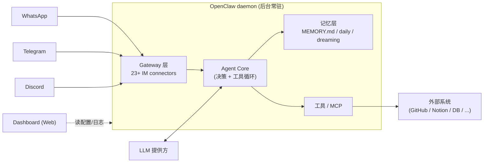

# OpenClaw 安装、onboard 与守护进程

## 前言

**C：** 这一篇目标：**15 分钟把 OpenClaw 装好、接一个 Telegram、发一条消息有回复**。过程里会顺带讲清它的守护进程模型、Dashboard 用法、以及几个你早晚会踩的配置细节。

<!-- more -->

## 系统要求

| 项 | 要求 |
| -- | -- |
| OS | macOS / Linux / Windows (建议 WSL2) |
| Node.js | **22.14+**（官方推荐 24） |
| 磁盘 | ≥ 2 GB（含 skills 与记忆文件） |
| 网络 | 能访问你选的 LLM 提供方 & IM 平台 |
| API Key | 至少一个：Anthropic / OpenAI / Google / Moonshot / OpenRouter，或本地 Ollama |

::: tip VPS / Mac mini 是理想落脚点
它要 24h 常驻，PC 主力机并不合适（休眠就断）。一台 4 GB 小 VPS 或闲置 Mac mini 是最常见的部署目标。
:::

## 一键安装与 onboard

```bash
npm install -g openclaw@latest
openclaw onboard --install-daemon
```

`onboard` 是一个交互向导，会依次问你：

1. **选 LLM 提供方**并填 API Key；
2. **选一个要接的 IM 平台**（Telegram 是最容易起步的）；
3. **是否把 OpenClaw 装成后台 daemon**（选 yes 就开机自启）。

装完后立刻验证：

```bash
openclaw gateway status       # 看 gateway 是否活着
openclaw dashboard            # 打开 Web Dashboard
```

Dashboard 是 OpenClaw 的"仪表盘"，能看到：

- Agent 当前在跑什么
- 连接了哪些 IM 平台、每个是否在线
- 配置文件、skills 列表、记忆文件
- 日志、错误、成本

## daemon 模型：它在后台做什么

OpenClaw 并不是"一次性运行的 CLI"，它更像一个**私人微服务**：



关键理解：

- **Gateway** 把多平台消息统一成内部事件喂给 core；回复走反方向。
- **Agent Core** 负责 LLM 调度、工具决策、记忆读写，是心脏。
- **Dashboard** 是独立前端，通过本地 API 看 daemon 状态，**不参与实际决策**。

## 接一个 Telegram（最快路径）

- 在 Telegram 里找 `@BotFather`，`/newbot` 起一个 bot，记下 token。
- 在 OpenClaw 里：

  ```bash
  openclaw connector add telegram
  # 按提示粘 bot token；也可以手动编辑 config.json 里 gateway.telegram 段
  ```

- `openclaw gateway restart`，然后去 Telegram 里向你的 bot 发一句 "ping"。

OpenClaw 会：

1. Gateway 收到消息 → 翻译成内部事件；
2. Core 载入对应会话记忆、工具集、skills；
3. 调模型得到回复 → 通过同一个 gateway 推回 Telegram。

其它平台（WhatsApp / Discord / Slack / Signal / iMessage …）流程一样，**只是 connector 不同**——这是 gateway 抽象的好处。

## 常用命令速查

| 命令 | 作用 |
| -- | -- |
| `openclaw onboard` | 首次（或重做）交互式配置 |
| `openclaw dashboard` | 打开 Web Dashboard |
| `openclaw gateway status / start / stop / restart` | 管守护进程 |
| `openclaw connector add <platform>` | 增加一个 IM 连接 |
| `openclaw connector list` | 查看所有已接平台 |
| `openclaw skill install <name>` | 从 ClawHub 装 skill |
| `openclaw skill list / remove` | 管 skill |
| `openclaw logs --follow` | 跟日志 |
| `openclaw doctor` | 自检依赖/配置/可达性 |
| `openclaw update` | 升级 |

## 配置文件在哪

默认在 `~/.openclaw/`：

```text
~/.openclaw/
├── config.json        # gateway、providers、全局偏好
├── MEMORY.md          # 长期记忆（见下一篇）
├── notes/             # 每日笔记
├── skills/            # 已安装 skills
├── logs/              # 日志
└── state/             # 运行时状态
```

::: warning 权限管好
`config.json` 里有 API Key、IM token 等机密；`chmod 700 ~/.openclaw` 是最低标准。
:::

## 跑在 VPS / Mac mini 上的注意点

- **开机自启**：`--install-daemon` 会在 macOS 上注册 `launchd`、Linux 上注册 `systemd` 单元。
- **静态 IP / 域名**：IM 方向是它主动连 IM 服务器，没公网 IP 也能跑；但 Dashboard 走本地 HTTP，远程要么走 SSH 端口转发、要么配反向代理 + 强鉴权。
- **资源规划**：一个常开 daemon + 本地嵌入式 DB 大概 200~500 MB；装 skills 后会多。
- **时区**：IM 通知和 daily notes 都依赖时区，装完先 `openclaw config set timezone Asia/Shanghai`。

## 第一次对话建议这样开场

onboard 完成后，在 IM 里先发几句"自我介绍"式的话，帮助它建立初始记忆：

```text
我是 XXX。我主要用的语言是中文，编码习惯用 pnpm、VS Code、macOS。
每天晚上 21:00 推送当天的 GitHub 通知汇总，超过 5 条时只保留跟我相关的。
不要未经允许修改 ~/work 之外的任何路径。
```

OpenClaw 会把这些写进 `MEMORY.md`，之后所有会话都能默认读到。这就自然过渡到下一篇要讲的**三层记忆**。

## 常见坑

- **Node 版本太老**：`EBADENGINE` 报错直接升 Node 到 24 LTS。
- **bot 不回消息**：`openclaw doctor` 跑一遍；80% 是 token 错、代理错、时间不同步。
- **Dashboard 打不开**：端口被占 / 没装完 / daemon 没起，按 `openclaw gateway status` 的结果走。
- **远程部署忘记改鉴权**：永远不要把 Dashboard 的默认端口直接暴露到公网；下一节（安全与生产部署）会具体讲。

## 小结

- `npm i -g openclaw` + `openclaw onboard --install-daemon` 就能起步。
- 它是 **daemon + Dashboard + Gateway** 三件套，理解这个模型后配置就有头绪。
- Telegram 是接 IM 最容易上手的路径；其它平台只是换 connector。
- 接好 IM 后别急着跑复杂任务，先用几句话**喂初始记忆**。

::: tip 延伸阅读

- 官方 Quickstart：`docs.openclaw.ai` 的 Installation / Onboard 章节
- 下一篇：`03-Skills、MEMORY.md 与三层记忆`

:::
