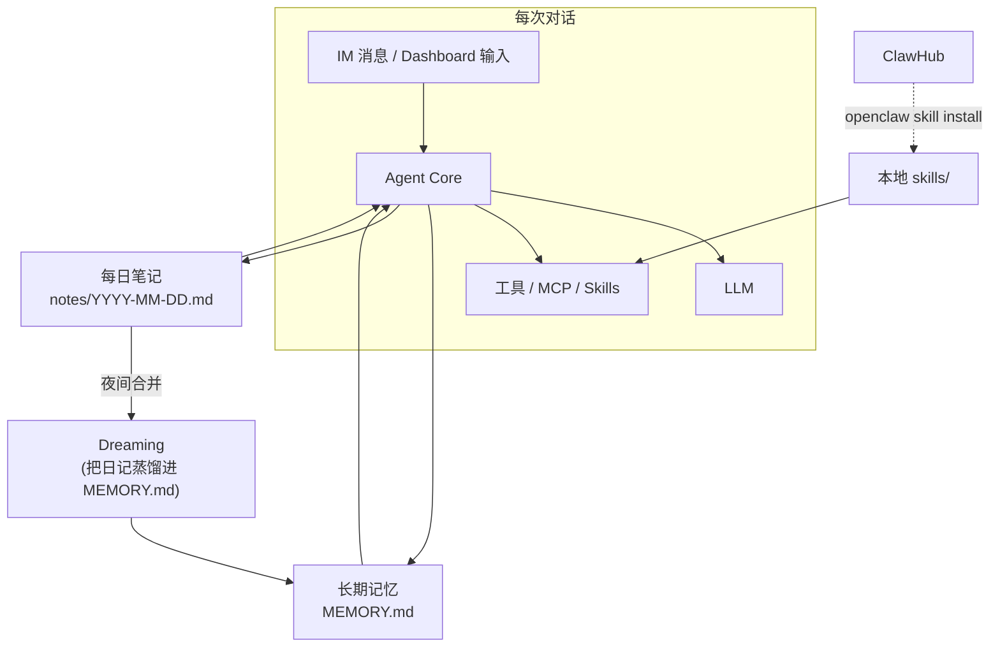
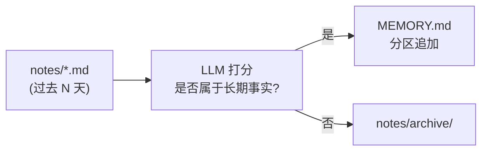
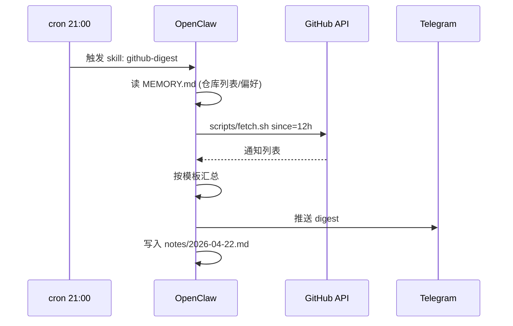

# OpenClaw Skills、MEMORY.md 与三层记忆

## 前言

**C：** Agent 会不会做事，不止看当前对话，更看**它记得什么**。OpenClaw 把记忆拆成三层：长期（`MEMORY.md`）、每日（daily notes）、实验性合并（dreaming）。再叠加 skills 作为"可装载的能力包"。这一篇讲清这四件东西各自解决什么问题、怎么配合。

<!-- more -->

## 先看一眼全局



三条线并行：

- **长期记忆**：跨天、跨会话都该记住的事。
- **每日笔记**：当天发生了什么，用完就该降权。
- **Dreaming**：定期"睡觉"，把日记里重要的事**蒸馏进长期记忆**，旧笔记归档。

Skills 则是"**往 Agent 工具箱里插新零件**"。

## 长期记忆：`MEMORY.md`

位置：`~/.openclaw/MEMORY.md`。Agent 每次启动和每次重要决策都会**自动把它加载进 context**。内容建议分区：

```markdown
# User Profile
- 昵称：阿易
- 时区：Asia/Shanghai
- 语言偏好：中文回复为主，代码保留英文注释

# Workflow
- 代码相关用 pnpm；不要主动 npm install
- 所有改动先跑 `pnpm lint && pnpm test`，再报成功

# Constraints
- 不要动 `~/work` 之外的任何路径
- 不能将 API key、个人邮箱写进任何输出

# Recurring Tasks
- 每天 21:00 汇总当日 GitHub 通知
- 每周一 09:00 整理上周 PR 评审反馈
```

维护哲学和 Claude Code 的 `CLAUDE.md` 一致：**踩坑就更新**。在 IM 里直接说：

```text
把"不要把我的邮箱出现在任何消息里"加到 MEMORY.md 的 Constraints。
```

Agent 会自己打开文件追加并保存——**你不用手工编辑**。

::: tip 别把 MEMORY.md 写成流水账
它是**高价值事实集合**，不是日记。每条都该是"下一次还会用到"的信息。写满了就精炼，**宁少勿多**。
:::

## 每日笔记：`notes/`

位置：`~/.openclaw/notes/YYYY-MM-DD.md`。每个自然日一份，记录：

- 当天 IM 对话里提炼出的关键事实和决定
- 执行过的任务、结果、花费
- 遇到的异常和处理方式

作用是"短期工作记忆"：今天问起"**刚才我让你查的那个东西呢**"它能答；一周后你问"**上周三聊的 X**"，它就会先去 `notes/2026-04-15.md` 找。

### 查笔记的典型交互

```text
> 我上周让你整理的开源 license 备选清单在哪？
```

Agent 会扫最近几天的 notes，命中后回复：

```text
在 notes/2026-04-16.md 的"license 选型"段落，你选了 MIT。
要我直接再发一遍给你吗？
```

## Dreaming：夜间蒸馏

"Dreaming" 是 OpenClaw 的实验性能力，本质上是一个**定时合并任务**：

1. 每天（或自定义周期）跑一次；
2. 读最近 N 天的 `notes/*.md`；
3. 让 LLM 按"**这条信息是否属于长期事实**"过一遍；
4. 把命中的写进 `MEMORY.md`，原笔记归档到 `notes/archive/`。

效果是：**MEMORY.md 永远只有高密度事实，notes 不会无限膨胀**。



默认关闭，建议用熟后再打开：

```bash
openclaw config set dreaming.enabled true
openclaw config set dreaming.cron "0 3 * * *"    # 每天凌晨 3 点
openclaw config set dreaming.look_back_days 7
```

::: warning Dreaming 会改动 MEMORY.md
生产强烈建议开 git 跟踪 `~/.openclaw/`（至少跟 `MEMORY.md`），出了错能一键回滚。
:::

## Skills：从 ClawHub 装能力包

Skills 结构和上一节 Claude Code 里讲的相近，一份 `SKILL.md` + 可选脚本/资源：

```text
~/.openclaw/skills/github-digest/
├── SKILL.md
├── scripts/
│   └── fetch.sh
└── templates/
    └── digest.md
```

`SKILL.md` frontmatter 决定何时触发：

```markdown
---
name: github-digest
description: 汇总 GitHub 通知。当用户说 "GitHub 通知 / PR 汇总 / today's GH digest" 时使用。
trigger_keywords: ["github 通知", "PR 汇总", "gh digest"]
---

# GitHub Digest Skill

## 步骤
1. `bash scripts/fetch.sh <since>` 拉最近通知
2. 按 `templates/digest.md` 渲染
3. 少于 5 条直接发；多于 5 条只保留跟当前用户相关的
4. 推送到默认 IM
```

安装与管理：

```bash
openclaw skill install github-digest           # 从 ClawHub 装
openclaw skill list
openclaw skill remove github-digest
openclaw skill new my-skill                    # 起一个本地 skill 模板
```

社区的 ClawHub 是 skills 分发中心，类似"Agent 版 brew formulas"，覆盖笔记、日历、家居、金融、开发等方向。

## 三者协作示例

给自己写一个"**工作日晚上 21:00 自动汇总 PR**"的闭环：

- **Skill**：`github-digest`，封装"怎么拉、怎么汇总、怎么推"的流程。
- **MEMORY.md**：放"我关心的仓库列表"、"不要在周末触发"、"优先推送到 Telegram"等长期偏好。
- **Notes**：每次运行把当天汇总的要点写进当天 notes，供之后"**昨天的 PR 汇总是什么来着**"回查。
- **Dreaming**：一周后自动判断"**近期最关心的仓库是否变了**"，把结论回写进 MEMORY.md。



## 维护这套系统的几条经验

- **别过度装 skill**：装了用不上的 skill 会稀释决策信号，定期 `skill list` 清理。
- **每个 skill 写好触发关键词**：自动路由靠它，模糊描述 = 自动失灵。
- **让 MEMORY.md 成为团队规范的一部分**：共享机器人场景下，把 `MEMORY.md` 进 git，PR 改规则，而不是各自嘴头说。
- **尊重 dreaming 的节奏**：如果发现它写了不该写的东西，改 prompt（配置里）或给它**禁写标签**，而不是关掉功能。

## 小结

- **MEMORY.md** = 高密度长期事实；**notes/** = 短期工作记忆；**dreaming** = 夜间蒸馏。
- **Skills** 是"能力包"，走 ClawHub 分发，靠 frontmatter 关键词触发。
- 四者组合起来，能把一次对话的价值**持续沉淀、持续复利**，这才是"**长期运行的 Agent**"的意义。

::: tip 延伸阅读

- 官方：OpenClaw *Memory* / *Skills* 文档
- ClawHub：社区 skills 市场
- 下一篇：`04-多 Agent 与工具扩展：MCP 与子 Agent`

:::
