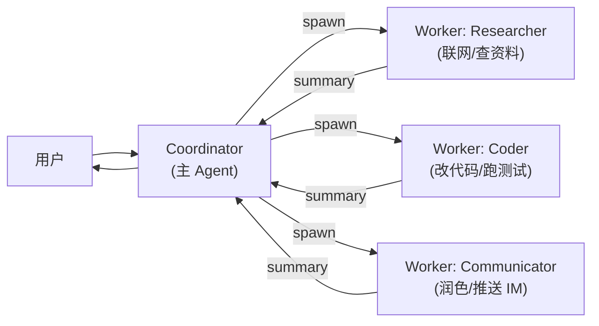
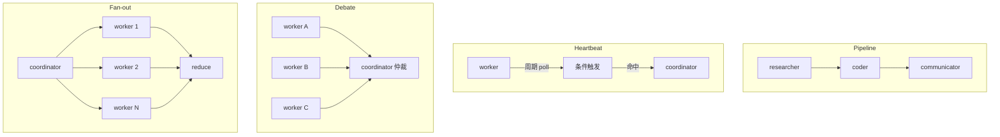

# OpenClaw 多 Agent 与工具扩展：MCP 与子 Agent

## 前言

**C：** OpenClaw 单 Agent 已经很能干，但真正把它变成"**24 小时个人运营团队**"的是两条路：**MCP 把外部系统接成工具**、**coordinator/worker 多 Agent 把复杂任务分工**。这一篇讲清两种机制的用法、边界，以及常见的 spawning 模式。

<!-- more -->

## 第一条线：MCP 工具扩展

OpenClaw 把 MCP（Model Context Protocol）当成**一等公民**，在 `config.json` 的 `mcp.servers` 段声明即可启用：

```json
{
  "mcp": {
    "servers": {
      "github": {
        "command": "npx",
        "args": ["-y", "@modelcontextprotocol/server-github"],
        "env": { "GITHUB_TOKEN": "${GITHUB_TOKEN}" }
      },
      "notion": {
        "command": "npx",
        "args": ["-y", "@modelcontextprotocol/server-notion"],
        "env": { "NOTION_TOKEN": "${NOTION_TOKEN}" }
      },
      "pg_ro": {
        "command": "npx",
        "args": ["-y", "@modelcontextprotocol/server-postgres",
                 "postgres://readonly@db.internal/app"]
      }
    }
  }
}
```

启用之后：

- Dashboard 的 **Tools** 页会列出每个 MCP server 暴露的工具 / 资源 / 提示；
- Agent 在需要时自动路由到对应工具（例如 `github.create_issue`、`pg_ro.query`）；
- Skill 也能在 `SKILL.md` 中显式声明"我需要 xxx MCP 工具"，便于安装时体检。

### 常见接入清单

| 领域 | 代表 MCP server | 用法 |
| -- | -- | -- |
| 代码协作 | `server-github` / `server-gitlab` | Issue / PR / 评论 |
| 文档笔记 | `server-notion` / `server-obsidian` | 查/写文档 |
| 数据库 | `server-postgres` / `server-sqlite` | **只读**优先，SQL 自动生成 |
| 浏览 | `server-playwright` | 真实浏览器自动化 |
| 文件 / 盘 | `server-filesystem` / `server-gdrive` | 读写文件 |
| IM | 各平台自带 connector | OpenClaw 原生集成 |
| 内部 API | 自研 MCP server | 把公司内部系统包装成工具 |

::: tip 先只读后读写
新接入一个 MCP server，**先只启用只读工具**，跑一周稳定了再开写操作。MCP 没做权限时，写操作 = 模型对世界的写权限。
:::

## 第二条线：多 Agent（coordinator / worker）

### 为什么需要

单 Agent 撑不下去的地方通常是**上下文污染**和**角色混乱**：

- 一个 Agent 既要"**高层协调**"又要"**动手干活**"，两种思维容易打架。
- 大量探索性 tool 输出挤爆主上下文，**核心决策反而没空间**。

解决办法：**一个 coordinator 拆任务，多个 worker 干活，各自会话隔离**。



### 基本配置

`agents.yaml` 或 `config.json` 里可以声明**多个 agent preset**，每个带不同模型、工具集、system prompt：

```yaml
agents:
  coordinator:
    model: claude-3-7-sonnet
    temperature: 0.2
    tools: [spawn, memory, notes]
    prompt: |
      你是 coordinator，只做拆解、编排、合并结论。
      不要直接调 heavy 工具，交给 worker。

  researcher:
    model: gpt-4o-mini
    tools: [web_search, fetch_url]
    prompt: "你是 researcher，专注收集证据并返回 markdown 摘要。"

  coder:
    model: claude-3-7-sonnet
    tools: [filesystem, terminal, github]
    prompt: "你是 coder，按 coordinator 给的规格改代码、跑测试。"
```

Coordinator 通过 `spawn` 工具派发任务：

```text
spawn(agent="researcher",
      task="收集 2026 Q1 开源 license 变化，按 MIT/Apache2/AGPL 分类，≤10 bullets")
```

子 Agent 有独立 context，干完只回一段 summary，主 Agent 不被污染。

### Spawning 的几种常见模式

digitalknk/openclaw-runbook 总结了几种实战模式，OpenClaw 社区默认直接可用：

- **流水线式**（pipeline）：`researcher → coder → communicator`，每一步的输出是下一步的输入；适合有明确阶段的任务。
- **心跳式**（heartbeat）：长期任务里派一个 worker 周期性"起床检查"，命中异常才唤醒 coordinator；适合监控类。
- **辩论式**（debate）：同一个问题 spawn 2~3 个 worker 用不同 prompt 回答，coordinator 做仲裁；适合决策类。
- **分片式**（fan-out）：大任务切 N 份并行 spawn，最后 reduce；适合批处理。

每种都能写成一个 **meta skill** 放进 skills/，后续复用时 coordinator 直接调。



## 模型选择与成本

多 Agent 往往意味着**多模型**：

- coordinator 用强模型（Claude 3.7 / GPT-4.x），**值得花钱**；
- worker 用便宜模型（Haiku / mini），因为任务小、反馈快；
- 本地模型（Ollama 上跑 Qwen / Llama）适合做非关键 worker，离线也能干活。

在配置里**严格限定每个 agent 的 max_tokens 和工具集**，可以让失控代价最小。Dashboard 里能直接看每个 agent 最近消耗、平均延迟，配合 `budget` 配置能在超支时自动降级。

## 把 OpenClaw 变成"被调用的服务"

除了 IM 入口，OpenClaw 本身还能作为**被其它系统调用**的服务：

- 本地 HTTP API（Dashboard 前端就是它的消费者）。
- IM 机器人互为中转：把一条 Slack 消息送进 OpenClaw → OpenClaw 做事 → 回复到另一个平台。
- **被 Hermes 调用**：Hermes Agent 里可以把 OpenClaw 的能力封装成工具，做"Agent 之上的 Agent"。

这些能力都基于同一套 gateway + daemon，属于 OpenClaw 最容易被低估的部分。

## 小结

- **MCP** 是 OpenClaw 对外的**能力入口**；先只读再读写，别一步到位。
- **多 Agent** 是 OpenClaw 对内的**分工机制**；coordinator 强、worker 轻。
- Pipeline / Heartbeat / Debate / Fan-out 四种 spawning 模式够覆盖 90% 场景。
- 模型成本上，coordinator 舍得花钱、worker 用便宜货，加 budget 兜底。

::: tip 延伸阅读

- digitalknk/openclaw-runbook 的 `examples/agent-prompts.md`、`examples/spawning-patterns.md`、`examples/heartbeat-example.md`
- MCP 官方列表：[modelcontextprotocol.io/servers](https://modelcontextprotocol.io/servers)
- 下一篇：`05-安全与生产部署`

:::
