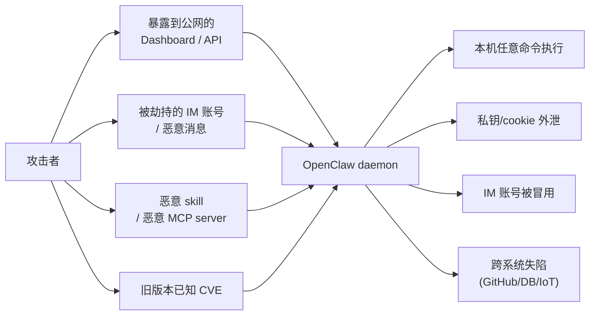

# OpenClaw 安全与生产部署

## 前言

**C：** OpenClaw 默认能**跑命令、访问文件、联网、调 API**，这些能力让它好用，也让它危险。2026 年 1 月曝光的 CVE-2026-25253（RCE）一次性影响了 13.5 万+ 部署，原因几乎都是"**装上就开着跑，没人管**"。这一篇给一份**非营销向**的生产加固清单：权限、成本、网络、密钥、升级五件事。

<!-- more -->

## 威胁模型：它到底能被怎么打



围绕这 4 条路径，下面一条条处理。

## 1. 网络边界：先把自己关进屋里

- **Dashboard 只绑 localhost**：

  ```bash
  openclaw config set dashboard.host 127.0.0.1
  openclaw config set dashboard.require_auth true
  ```

  想远程看：**SSH 端口转发**（`ssh -L 7373:127.0.0.1:7373 vps`），不要直接暴露公网。
- **反向代理也要有鉴权**：如果必须 Nginx/Caddy 放到公网，最低门槛是 **Basic Auth + IP 白名单 + HTTPS**，最好再叠一层 OAuth。
- **禁掉本机不用的 IM connector**：每个 connector 都是一条对外通路，用不上的就在 `config.json` 里删掉。
- **防火墙规则**：VPS 上 `ufw` / `firewalld` 只放行必要端口；默认拒绝入站比默认允许安全一个量级。

## 2. 工具权限：默认关，按需开

### 工具白名单

在 `config.json` 里可以限制"**整台机器能用哪些工具集**"：

```json
{
  "tools": {
    "allow": ["memory", "notes", "web_search", "github_ro", "telegram"],
    "deny":  ["filesystem_write", "terminal", "docker", "shell_exec"]
  }
}
```

原则：

- **默认拒绝**：`allow` 为空时不给工具，按需加。
- **读写分开**：能只读就不给写；例如 `pg_ro` 而不是 `pg_rw`。
- **危险工具独立 worker**：真要用 `terminal` / `filesystem_write`，放到**只被 coordinator 显式 spawn** 的专用 worker 里，**不要挂在默认 agent 上**。

### Skill 白名单

Skills 装了就默认可用，但 `SKILL.md` 里可以声明它需要的工具；生产环境建议再加一层：

```bash
openclaw skill review github-digest     # 列出 skill 需要哪些工具 / MCP
openclaw skill approve github-digest    # 审核过才允许自动触发
```

未批准的 skill 仅在用户**显式调用**时才跑，不会被关键词触发。

## 3. 密钥与凭据：别让 Agent 看到不该看的

- **用环境变量，不要写进 config**：把 API key、bot token 放进 systemd unit 的 `EnvironmentFile=` 或 launchd 的 plist；`config.json` 里用 `${ENV_VAR}` 引用。
- **`chmod 700 ~/.openclaw`**：这是最低标准，守住你自己。
- **`MEMORY.md` 禁写敏感项**：在 Constraints 里明确"**不要记录 token、邮箱、地址、密码**"；配合 hook 做二次过滤（下一条）。
- **定期轮换**：至少 bot token / API key 每季度轮一次；Dashboard 的成本页可以看到异常消耗，是轮换前的信号。

## 4. Hooks / 审计：事件入口上挡一道

OpenClaw 支持 `PreToolUse` / `PostToolUse` / `UserPromptSubmit` 等事件 hook：

```json
{
  "hooks": {
    "UserPromptSubmit": [
      {
        "type": "command",
        "command": ".openclaw/hooks/redact.sh"
      }
    ],
    "PreToolUse": [
      {
        "matcher": "terminal|shell_exec",
        "type": "command",
        "command": ".openclaw/hooks/cmd-guard.sh"
      }
    ]
  }
}
```

最常见的两类脚本：

- **Redactor**：在 Prompt 进入模型前，按正则把邮箱 / 手机号 / token 抹成占位符。
- **Cmd Guard**：拦截 `rm -rf /`、`curl ... | sh`、管道执行远程代码等；命中后退出码非 0，工具调用被阻止。

另外建议强制打开 **审计日志**：

```bash
openclaw config set audit.enabled true
openclaw config set audit.path /var/log/openclaw/audit.log
openclaw config set audit.include_tool_args true
```

出了问题可以 replay，没出问题也是合规素材。

## 5. 成本治理：别让账单炸

长期运行的 Agent 最容易"**悄悄烧钱**"：被 IM 垃圾消息触发、陷入 tool 循环、被对抗性提示拖着跑。几条硬防线：

- **每日硬上限**：

  ```bash
  openclaw config set budget.daily_usd 5
  openclaw config set budget.on_exceed "degrade"   # degrade / stop
  ```

  超了就降级到便宜模型或者直接停。
- **单次任务上限**：limit 每次 spawn 最多多少轮、多少 token，防止一个 worker 失控。
- **速率限制**：针对 IM 入口做 per-user 限频，避免有人狂刷。
- **账单告警**：Dashboard 的 budget 超过 80% 时主动推通知到你 IM 上，别等月结才发现。

## 6. 升级与 CVE 响应

- 订阅 GitHub Releases：`watch` `openclaw/core` 和 `openclaw/gateway`。
- **不要跳过安全版本**：CVE-2026-25253 就是"**很多人装上后半年没 `openclaw update`**"导致的放大。
- 大版本升级前：备份 `~/.openclaw/`（至少 `MEMORY.md` + `config.json`），再跑 `openclaw doctor`。
- 灰度：重要部署可以先在备机验证一个工作日再切主机。

## 7. 一份最小生产 checklist

打印出来贴机器旁边：

- [ ] Dashboard 只监听 127.0.0.1 / 走 SSH 转发
- [ ] 防火墙默认拒绝入站，明确放行端口
- [ ] `chmod 700 ~/.openclaw`
- [ ] API key / bot token 走环境变量，不入 git
- [ ] `tools.allow` / `tools.deny` 白/黑名单显式配置
- [ ] 危险工具放专用 worker，不挂默认 agent
- [ ] skill 只装必要的，未批准不自动触发
- [ ] `PreToolUse` / `UserPromptSubmit` hooks 上线
- [ ] `audit.enabled = true`，日志落到专用目录
- [ ] `budget.daily_usd` 设硬上限 + 告警
- [ ] 每日自动备份 `~/.openclaw/`（或至少 `MEMORY.md`）
- [ ] 订阅 Releases，安全版本及时升

## 部署形态一览

| 形态 | 适合 | 注意 |
| -- | -- | -- |
| Mac mini 本地 | 个人 / 家庭 | 睡眠会断，关电源管理 |
| 小 VPS (≥ 2C2G) | 个人 / 小团队 | 网络延迟低、能长开；按上面加固 |
| Docker 容器 | 更强隔离 | 把 `~/.openclaw` 挂 volume，失陷不会污染宿主 |
| 云 + 本地混合 | 工具拆分 | 只读工具放云上 daemon，写工具放本地 daemon，减爆炸半径 |

## 小结

- 默认部署 = 默认不安全；**上生产前一定过一遍加固清单**。
- 网络、工具权限、凭据、hooks/审计、成本、升级，**六件事缺一不可**。
- CVE-2026-25253 是血淋淋的教训：**不升级 = 主动把门开着**。
- 本章 5 篇合起来，是 OpenClaw 从"**装一下玩玩**"到"**长期放心托管**"的完整闭环。

::: tip 延伸阅读

- digitalknk/openclaw-runbook 的 `examples/security-hardening.md` 与 `examples/vps-setup.md`
- 官方 Security Advisories
- 想在同一台机器上跑 OpenClaw + Hermes：看本分册 `01-Hermes-Agent` 与本篇的网络端口与 budget 章节

:::
