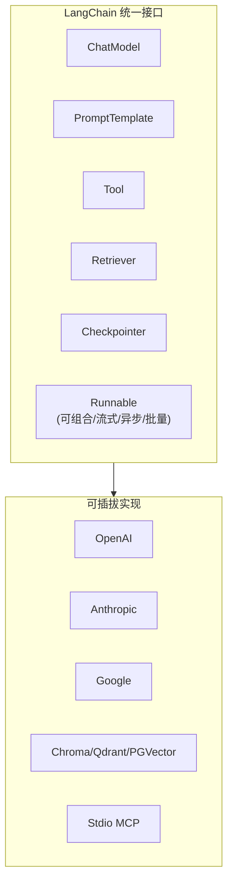
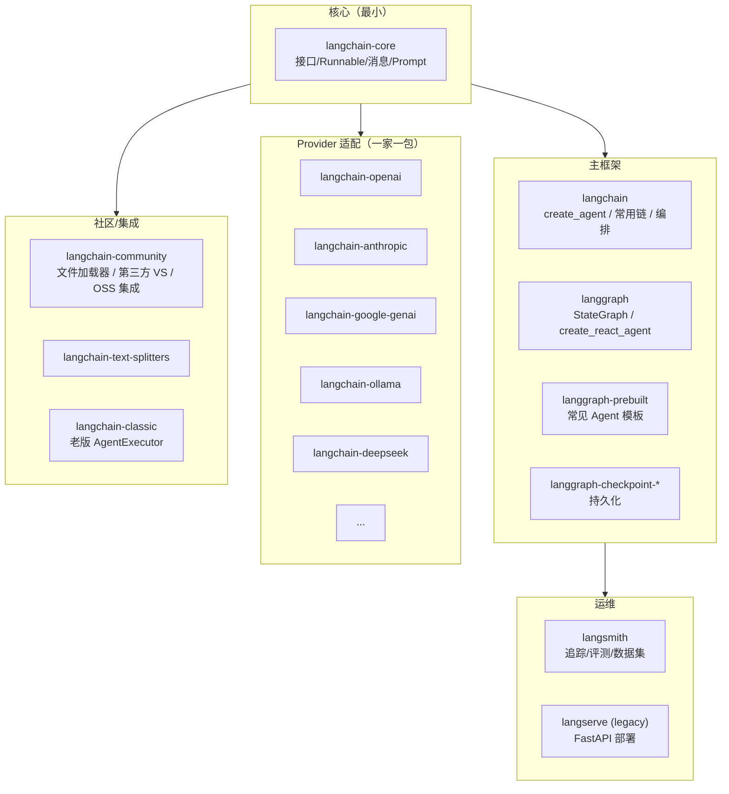
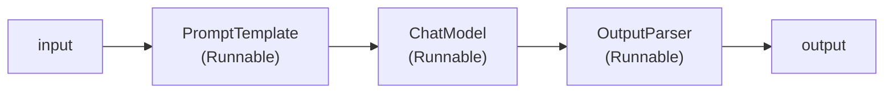

# LangChain 是什么：生态全貌与选型

## 前言

**C：** 这一章把 LangChain 当成一个**由多个包组成的生态**来讲——不是讲"一个 `from langchain import ...` 全搞定的魔法库"。2025 年 10 月 LangChain **1.0** 正式发布之后，边界已经大幅收敛，老教程里那些 `AgentExecutor / create_tool_calling_agent` 很多被归进 `langchain_classic`，**官方推荐新写法**已换了一代。先把地图画清，后面六篇才好按图索骥。

<!-- more -->

## 一、一句话先定位

> LangChain = 给 LLM 应用用的"**胶水框架**"：把**模型、Prompt、工具、检索、记忆、执行流**按统一接口组合在一起，让你写出**可替换、可测试、可观测**的应用。

类比：

- **Web 开发**里有 Spring / Django / Express——LangChain 之于 LLM 应用就是这个位置；
- **数据处理**里有 dbt / Airflow——LCEL（LangChain Expression Language）就是给 LLM 应用的**管道表达式**。

它**不是**：

- **不是**单一 LLM 的 SDK（那是 `openai` / `anthropic`）；
- **不是**向量数据库（那是 Chroma / Qdrant / pgvector）；
- **不是**部署平台（那是 LangServe / LangSmith Deployments / 自己的 FastAPI）；
- **不是**评测工具（那是 LangSmith）。

**LangChain 只提供"粘合剂"和"抽象"**，每一块底座你都可以换成别的。

## 二、为什么要有 LangChain

直接用 `openai` SDK 写一个 RAG 应用，真实痛点：

- **模型不可换**：从 GPT 切到 Claude，prompt / 消息结构都要手改；
- **工具散落**：一个 tool 是一段 Python 函数，一段 JSON Schema，一段调用粘合代码——**三处同步**；
- **检索链重复**：每个项目都要写 "加载 → 切片 → embedding → 存 → 检索 → 拼 prompt" 的六步流水；
- **执行不可观测**：一次调用到底走了几个工具、每步花多少 token，自己埋日志才能知道；
- **流式、异步、批量**三套代码各写一份。

LangChain 把这些**横切关注点**统一抽象成一组**接口**：



所有具体实现都**实现同一组接口**；你的业务代码面向接口编程，**换实现零成本**。

## 三、LangChain 1.0：生态全貌

LangChain 1.0 之后，**包拆得很干净**。你不会再装一个大包什么都有了。



### 3.1 核心四件套

| 包 | 装什么 | 什么时候装 |
| -- | -- | -- |
| `langchain-core` | 接口、Runnable、消息、PromptTemplate 等**抽象层** | **永远装**，其他包都依赖它 |
| `langchain` | `create_agent`、常用 chain、常用 loader 入口 | 做应用层时装 |
| `langgraph` + `langgraph-prebuilt` | 状态图、Agent 运行时 | 构建 Agent / 复杂流程时装 |
| `langchain-openai` / `langchain-anthropic` / ... | 具体 LLM 适配 | 按用哪家模型装 |

### 3.2 两种"Agent 写法"并存——选新的

历史原因，LangChain 现在**同时有两套 Agent 写法**：

| 写法 | 所在 | 地位 |
| -- | -- | -- |
| `AgentExecutor` + `create_tool_calling_agent` | `langchain-classic`（旧称 `langchain.agents`）| **Legacy**，新项目别用 |
| `langchain.agents.create_agent` | `langchain`（1.0 引入）| **现代**，生产推荐 |
| `langgraph.prebuilt.create_react_agent` | `langgraph-prebuilt` | **现代低阶**，需要自定义状态图时用 |

**判断原则**：新项目**一律**走 `create_agent` 或 `create_react_agent`。底层都是 LangGraph。

### 3.3 周边

- **LangSmith**：闭源的追踪 / 评测 / 数据集平台（有免费额度）；大多数生产项目会接；
- **LangServe**：把 Runnable 一行变 FastAPI endpoint；1.0 时代地位**下降**，很多团队直接手写 FastAPI；
- **LangChain Hub**：prompt / chain 的在线 registry；可选；
- **LangGraph Studio**：可视化 / 调试 graph 的桌面工具。

## 四、LangChain vs 其他 Agent 框架

常有人问："有 LlamaIndex / LiteLLM / CrewAI / AutoGen，还要 LangChain 吗？"先看一张正面清单：

| 维度 | LangChain | LlamaIndex | LiteLLM | CrewAI | AutoGen |
| -- | -- | -- | -- | -- | -- |
| 擅长 | 通用**LLM 应用编排** | **RAG 优先** | **多厂商代理层** | **多 Agent 角色** | **对话多 Agent** |
| Agent 支持 | 强（LangGraph）| 较弱 | 无 | 强（角色/任务）| 强（会话）|
| RAG | 够用但非一流 | **深** | 无 | 简单 | 简单 |
| 可观测 | **LangSmith 原生** | 弱 | 弱 | 弱 | 弱 |
| 生产成熟度 | 高 | 高（RAG）| 高（代理）| 中 | 中 |

真实工程里它们**不是互斥**：

- **LiteLLM**：做成**统一 LLM API 代理**，LangChain 通过 `langchain-openai` 指向 LiteLLM endpoint 即可；
- **LlamaIndex**：做索引侧的深功能，LangChain 做应用侧编排——**两边可以混搭**；
- **CrewAI / AutoGen**：如果你的工作流就是"多角色开会"，它们 DX 更好，但可观测和多模型切换比 LangChain 差一截。

## 五、何时该用 LangChain，何时**不**该用

### 5.1 合适的场景

- **多模型切换**：今天 GPT，明天 Claude / DeepSeek / 本地 Ollama；
- **复杂编排**：多步 RAG、条件分支、并发工具；
- **需要观测**：必须拿到 trace、成本、token、错误分类；
- **多工作流复用同一批抽象**：检索、内存、工具、prompt 集中管理。

### 5.2 **不**适合的场景

- **一次性脚本**：直接 `openai.chat.completions.create(...)` 二十行搞定；
- **极致性能敏感**：Runnable 有框架开销（每步几百微秒），超高并发时要评估；
- **只有一家模型**：你永远不会换厂商——LangChain 的"换模型红利"就不值那点抽象税；
- **你已经在用竞品框架**：别为了 LangChain 重写，"一以贯之"比"追最新"更重要。

## 六、心智模型：**面向 Runnable 编程**

如果说 LangChain 2023/2024 时代的心智是"**Chain 链子**"，那 1.0 之后心智收敛到一句话：

> **一切都是 `Runnable`**。

`Runnable` 是一个抽象接口，实现三件事：

- `invoke(input) -> output`：同步一次；
- `stream(input) -> Iterator[chunk]`：流式；
- `batch(inputs) -> list[output]`：批处理；
- 每种都带 `a` 前缀的异步版本（`ainvoke / astream / abatch`）。

只要实现了这套接口，就能用 `|` 拼起来：

```python
chain = prompt | model | parser
chain.invoke({"topic": "苹果"})
chain.stream({"topic": "苹果"})
chain.batch([{"topic": "苹果"}, {"topic": "橙子"}])
```

**LLM、Prompt、Tool、Retriever、Parser、你自己写的 Python 函数**——**全部**都能被包成 Runnable 拼到一起。这就是 LCEL 的全部哲学。



## 七、本章 7 篇的编排

| # | 主题 | 对应概念 |
| -- | -- | -- |
| **01** | 生态与选型（本篇） | 包结构 / 何时用 / Runnable 心智 |
| **02** | 第一个 Chain | 安装、ChatModel、Prompt、消息 |
| **03** | LCEL 详解 | Runnable 接口、组合算子、流式 |
| **04** | 工具调用 | `@tool`、`bind_tools`、`with_structured_output` |
| **05** | RAG 全栈 | Loader / Splitter / Embedding / VectorStore / Retriever |
| **06** | LangGraph & Agent | `create_agent`、StateGraph、HITL、持久化 |
| **07** | 生产化 | LangSmith、流式、缓存、部署 |

## 八、环境速览（为下一篇铺路）

```bash
# Python 3.10+
pip install "langchain>=1.0" "langchain-core>=1.0" \
            langchain-openai langchain-anthropic \
            langgraph langgraph-prebuilt \
            langchain-text-splitters \
            langsmith
```

环境变量：

```bash
export OPENAI_API_KEY=sk-...
export ANTHROPIC_API_KEY=sk-ant-...
# 若接 LangSmith
export LANGSMITH_API_KEY=lsv2_...
export LANGSMITH_TRACING=true
```

> 任何教程遇到 `from langchain.agents import AgentExecutor, create_tool_calling_agent` 这种导入，就知道它是 **pre-1.0** 的老写法。本章全部按 **1.0+** 讲。

## 九、小结

- LangChain 1.0 生态 = **`langchain-core` 抽象** + **`langchain / langgraph` 框架** + **Provider 一家一包**+ **`community` 集成** + **`langsmith` 运维**；
- **新写 Agent** 用 `create_agent` / `create_react_agent`，**老 `AgentExecutor` 别碰**；
- **心智模型**：一切皆 Runnable，用 `|` 拼起来就是应用；
- **合适用**：多模型、多步骤、需观测；**不合适**：单次脚本、一家模型固定、极致性能；
- 和 LlamaIndex / LiteLLM / CrewAI **不是互斥**，可以组合。

::: tip 延伸阅读

- [LangChain 官方文档](https://docs.langchain.com/)
- [LangChain 1.0 Announcement](https://blog.langchain.com/)
- [LangGraph 文档](https://langchain-ai.github.io/langgraph/)
- 下一篇：`02-安装与第一个 Chain`

:::
