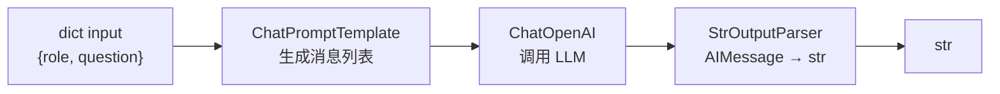

# 安装与第一个 Chain：Chat 模型与 Prompt 模板

## 前言

**C：** 上篇把 LangChain 的地图画好了；这篇**上手**。目标：装好依赖、跑通一个**三件套**——**Prompt 模板 + Chat 模型 + Output 解析器**，用 `|` 拼一条链，理解 Messages、Prompt、Runnable 的核心关系。这一篇跑完你就能解 80% 的"LLM 应用 Demo"需求。

<!-- more -->

## 一、装包

LangChain 1.0 已经把包拆得很细。**只装你要的**：

```bash
# 基础：核心抽象 + 主包 + 至少一家 Provider
pip install "langchain>=1.0" "langchain-core>=1.0" langchain-openai

# 如果还要用 Anthropic
pip install langchain-anthropic

# 国内常用补一套
pip install langchain-deepseek langchain-ollama
```

环境变量（放进 `.env`）：

```bash
OPENAI_API_KEY=sk-...
ANTHROPIC_API_KEY=sk-ant-...
```

加载（推荐 `python-dotenv`）：

```python
from dotenv import load_dotenv
load_dotenv()
```

## 二、第一条 Chain：Hello, LangChain

最短的可运行示例：

```python
from langchain_openai import ChatOpenAI
from langchain_core.prompts import ChatPromptTemplate
from langchain_core.output_parsers import StrOutputParser

model  = ChatOpenAI(model="gpt-4o-mini", temperature=0)
prompt = ChatPromptTemplate.from_messages([
    ("system", "你是一名专业{role}，回答尽量简洁。"),
    ("user",   "{question}"),
])
parser = StrOutputParser()

chain = prompt | model | parser

print(chain.invoke({
    "role": "Linux 运维",
    "question": "一行命令找出占用 CPU 最多的 5 个进程",
}))
```

这 10 行里，有整个 LangChain 的**核心三件**：



- `ChatPromptTemplate` 把 `dict` 变成 `list[BaseMessage]`；
- `ChatOpenAI` 吃 messages 返回 `AIMessage`；
- `StrOutputParser` 把 `AIMessage` 抽出 `.content` 变字符串；
- `|` 把三者串成一个 `Runnable`。

## 三、Chat 模型：`ChatOpenAI` / `ChatAnthropic` / ...

### 3.1 初始化

```python
from langchain_openai import ChatOpenAI

llm = ChatOpenAI(
    model="gpt-4o-mini",
    temperature=0.2,     # 默认 0.7
    max_tokens=512,
    timeout=30,
    max_retries=2,
    # base_url="https://..."  # 接代理/自建网关
)
```

```python
from langchain_anthropic import ChatAnthropic

llm = ChatAnthropic(
    model="claude-sonnet-4-5",
    temperature=0.2,
    max_tokens=1024,
)
```

**换一家模型，其余代码完全不动**——这就是上篇强调的"面向接口"。

### 3.2 一次直接对话

模型本身也是 Runnable，可以**不走 prompt 模板**直接调：

```python
from langchain_core.messages import SystemMessage, HumanMessage

resp = llm.invoke([
    SystemMessage("你是面试官"),
    HumanMessage("一道关于 B+ 树的题"),
])
print(resp.content)
print(resp.usage_metadata)   # 输入/输出/总 tokens
```

### 3.3 `init_chat_model`：字符串一行初始化

当不想写一堆 `from langchain_xxx import ChatXxx`：

```python
from langchain.chat_models import init_chat_model

llm = init_chat_model("openai:gpt-4o-mini", temperature=0)
llm = init_chat_model("anthropic:claude-sonnet-4-5")
llm = init_chat_model("deepseek:deepseek-chat")
```

**工具脚本 / 配置驱动**场景推荐用这个——模型来源变成一个字符串。

## 四、消息（Messages）：协议和 UI 两套"role"

LangChain 定义了一组消息类（`langchain_core.messages`）：

| 类 | 对应 OpenAI role | 用处 |
| -- | -- | -- |
| `SystemMessage` | `system` | 设定行为 / 身份 |
| `HumanMessage` | `user` | 用户输入 |
| `AIMessage` | `assistant` | 模型回复（可能含 `tool_calls`）|
| `ToolMessage` | `tool` | 工具返回 |
| `FunctionMessage` | `function` | 旧版 function calling（弃用中）|

每个消息都有 `.content`（文本 / 多模态 block）+ 可选的 `.name`、`.id`、`.tool_calls`、`.additional_kwargs`、`.usage_metadata`。

**多模态**长这样：

```python
HumanMessage(content=[
    {"type": "text",      "text": "这张图里有几只猫？"},
    {"type": "image_url", "image_url": {"url": "data:image/png;base64,..."}},
])
```

不同 Provider 支持度不同——LangChain 统一了**结构**，但**内容类型**能不能被模型理解取决于模型本身。

## 五、Prompt 模板：把 `dict` 变 `list[Message]`

### 5.1 `ChatPromptTemplate`（最常用）

```python
from langchain_core.prompts import ChatPromptTemplate

prompt = ChatPromptTemplate.from_messages([
    ("system", "你是{role}。"),
    ("user",   "{question}"),
])

prompt.invoke({"role":"运维","question":"..."})
# -> [SystemMessage("你是运维。"), HumanMessage("...")]
```

**变量用 `{name}`**（Jinja-ish，但不是 Jinja2 默认）。要用 Jinja2：

```python
ChatPromptTemplate.from_messages(
    [("user", "hello {{name}}")],
    template_format="jinja2",
)
```

### 5.2 `MessagesPlaceholder`：把一堆历史消息填进来

```python
from langchain_core.prompts import MessagesPlaceholder

prompt = ChatPromptTemplate.from_messages([
    ("system", "你是助手。"),
    MessagesPlaceholder("history"),
    ("user", "{question}"),
])

prompt.invoke({
    "history": [
        HumanMessage("北京有多大？"),
        AIMessage("1.6 万平方公里"),
    ],
    "question": "那里有几个行政区？",
})
```

对话场景**必用**——历史消息整体注入。

### 5.3 `PromptTemplate`（纯文本，老模型）

```python
from langchain_core.prompts import PromptTemplate

p = PromptTemplate.from_template("Translate {lang}: {text}")
p.invoke({"lang":"French","text":"hello"})
# -> StringPromptValue(text="Translate French: hello")
```

文本接口模型还有，但 2026 年你 95% 都用 ChatPromptTemplate。

### 5.4 少样本（Few-shot）模板

```python
from langchain_core.prompts import FewShotChatMessagePromptTemplate

examples = [
    {"input":"2+2","output":"4"},
    {"input":"3*5","output":"15"},
]

example_prompt = ChatPromptTemplate.from_messages([
    ("human","{input}"), ("ai","{output}"),
])

few = FewShotChatMessagePromptTemplate(
    examples=examples,
    example_prompt=example_prompt,
)

prompt = ChatPromptTemplate.from_messages([
    ("system","你是一个计算器。只输出结果。"),
    few,
    ("human","{input}"),
])
```

## 六、Output Parser：把 `AIMessage` 变你要的形状

最常用三种：

| Parser | 输入 | 输出 |
| -- | -- | -- |
| `StrOutputParser` | `AIMessage` | `str`（取 `.content`）|
| `JsonOutputParser` | `AIMessage` | `dict`（自动剥 `json`）|
| `PydanticOutputParser(model=Foo)` | `AIMessage` | `Foo` 实例 |

```python
from langchain_core.output_parsers import JsonOutputParser
from langchain_core.prompts import ChatPromptTemplate

parser = JsonOutputParser()

prompt = ChatPromptTemplate.from_messages([
    ("system","抽取 JSON。字段：name,age。只输出 JSON。"),
    ("user","{text}"),
])

chain = prompt | model | parser
chain.invoke({"text":"张三 32 岁"})
# -> {"name":"张三","age":32}
```

**但**——2026 年**结构化输出**更推荐 `model.with_structured_output(...)`（靠 tool call 机制，成功率更高）。这条 Parser 路线仍有用：**本地模型**、**老模型**、或故意要**松口解析**时。具体看第 04 篇。

## 七、流式输出

`Runnable` 天生支持流式。把 `invoke` 换成 `stream` 即可：

```python
for chunk in chain.stream({"role":"讲解者","question":"什么是 B+ 树"}):
    print(chunk, end="", flush=True)
```

如果 Parser 支持**增量解析**（`StrOutputParser` 就支持），你会一个字一个字看到打字机效果。

## 八、批处理与异步

### 8.1 批处理：一次多个输入

```python
chain.batch([
    {"role":"运维","question":"找 CPU 高的进程"},
    {"role":"DBA","question":"找慢 SQL"},
])
```

默认内部**并发**执行。`max_concurrency` 参数控制并发度：

```python
chain.batch(inputs, config={"max_concurrency": 5})
```

### 8.2 异步

前面所有方法都有 `a` 前缀版：

```python
import asyncio
await chain.ainvoke({"role":"...", "question":"..."})
async for chunk in chain.astream({"role":"...", "question":"..."}):
    ...
await chain.abatch(inputs, config={"max_concurrency": 10})
```

**上生产前**把同步代码改成异步——FastAPI 场景下立竿见影。

## 九、温度、种子、确定性

对于"抽取字段"这种不想要随机的任务：

```python
ChatOpenAI(
    model="gpt-4o-mini",
    temperature=0,
    model_kwargs={"seed": 42, "top_p": 1},
)
```

三件事一起干：

- `temperature=0`：贪心；
- `seed=42`：同样 prompt 多次返回相近；
- `top_p=1`：不做 nucleus 截断。

不同 provider 参数名可能不同——参考**上一册**"采样策略"那篇。

## 十、`.with_config`：把运行参数挂到 Runnable

别为了换 temperature 重新 new 一个模型：

```python
creative = chain.with_config(configurable={"temperature": 0.9})
strict   = chain.with_config(configurable={"temperature": 0.0})
```

要生效，模型初始化时得先声明可配置字段：

```python
from langchain_core.runnables import ConfigurableField

llm = ChatOpenAI(
    model="gpt-4o-mini",
).configurable_fields(
    temperature=ConfigurableField(id="temperature"),
)
```

这是 LCEL 的"**配置化**"入口，**多环境切换**时很好用。下一篇细讲。

## 十一、完整小项目：一键"多语种摘要"

把上面的零件合起来：

```python
from langchain_openai import ChatOpenAI
from langchain_core.prompts import ChatPromptTemplate
from langchain_core.output_parsers import StrOutputParser

llm    = ChatOpenAI(model="gpt-4o-mini", temperature=0)
prompt = ChatPromptTemplate.from_messages([
    ("system",
     "你是{lang}摘要师。把用户给的文本压缩到不超过 {max_len} 字。保留关键数字。"),
    ("user", "{text}"),
])

summarize = prompt | llm | StrOutputParser()

# 单次
summarize.invoke({
    "lang":"中文","max_len":80,
    "text":"LangChain 1.0 ... （长文）",
})

# 批量多语种
summarize.batch([
    {"lang":"中文","max_len":80,"text":"..."},
    {"lang":"English","max_len":60,"text":"..."},
    {"lang":"Français","max_len":60,"text":"..."},
])

# 流式
for chunk in summarize.stream({"lang":"中文","max_len":80,"text":"..."}):
    print(chunk, end="")
```

这一小段覆盖了**90% 的 LLM 应用**需求的 Shape。真正复杂的是后面几篇里要引入的——**工具调用、检索、Agent、持久化、评测**。

## 十二、小结

- **安装**：`langchain + langchain-core + 一家 Provider 包`，按需加 `anthropic / deepseek / ollama`；
- **模型**：`ChatOpenAI / ChatAnthropic / ...`，或 `init_chat_model("openai:gpt-4o-mini")`；
- **消息**：`SystemMessage / HumanMessage / AIMessage / ToolMessage`，multimodal 用 `content` 列表；
- **Prompt**：`ChatPromptTemplate.from_messages`，配 `MessagesPlaceholder` 填历史；
- **Parser**：`StrOutputParser` 最常用，`JsonOutputParser` 抽字段，结构化优先用 `with_structured_output`（第 04 篇）；
- **执行**：`invoke / stream / batch` + 各自的 `a-` 异步版；
- **心智**：一切是 Runnable，`|` 拼起来就是链。

::: tip 延伸阅读

- [ChatModel 文档](https://docs.langchain.com/oss/python/integrations/chat/)
- [Prompt Templates 文档](https://python.langchain.com/docs/concepts/prompt_templates/)
- 下一篇：`03-LCEL 详解：Runnable 与组合算子`

:::
