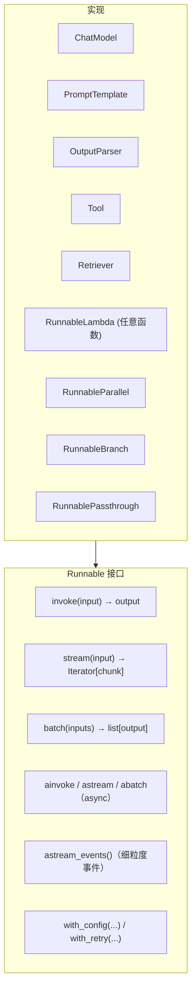
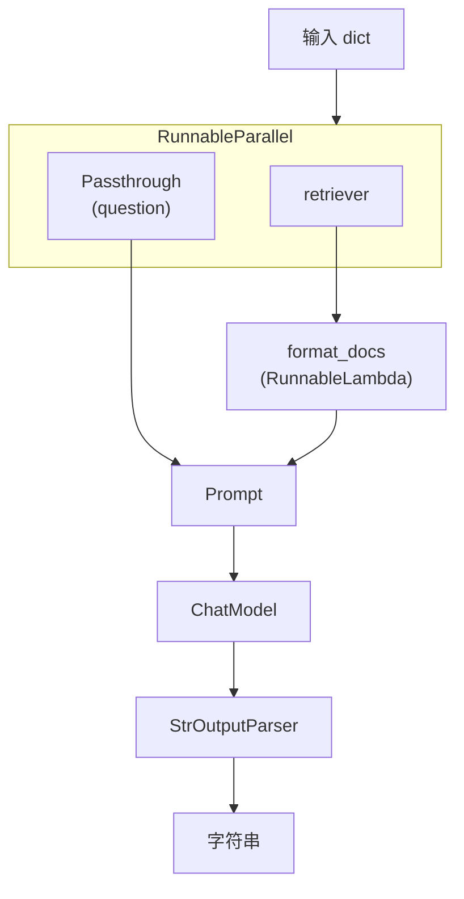

# LCEL 详解：Runnable 与组合算子

## 前言

**C：** LCEL（LangChain Expression Language）是 LangChain **最核心的抽象**——你看似在用 `|` 拼 chain，背后其实是一套完整的 "**可组合、可流式、可并发、可配置**" 的运算模型。这一篇把 Runnable 接口、几个关键组合算子、配置系统、以及几个典型的"**我该用哪个算子**"的问题讲清。

<!-- more -->

## 一、Runnable：LangChain 的底层接口

LangChain 中**所有能接进 chain 的东西**都实现同一个接口——`Runnable`。



所有方法都接受一个可选 `config: RunnableConfig`，里面可以塞 `callbacks`、`tags`、`metadata`、`run_name`、`configurable`——这些是追踪和配置化的入口（后面讲）。

## 二、`|`：从两个算子说起

`|` 是 Python 的位运算符；LangChain 重载了 `Runnable.__or__`：

```python
chain = a | b
# 等价于：
chain = a.pipe(b)
# 语义：chain.invoke(x) == b.invoke(a.invoke(x))
```

几个容易忽略的细节：

- `|` **左结合**：`a | b | c` = `(a | b) | c`；
- `|` 两边**必须都是 Runnable**（或自动装箱成 Runnable——字典会被包成 `RunnableParallel`，函数会被包成 `RunnableLambda`）；
- **返回值**是**新的 Runnable**；不修改 `a` 或 `b`。

### 2.1 字典**自动**装箱

```python
chain = {"summary": llm, "raw": RunnablePassthrough()} | another

# 等价于
chain = RunnableParallel({"summary": llm, "raw": RunnablePassthrough()}) | another
```

### 2.2 函数**自动**装箱

```python
def upper(s: str) -> str:
    return s.upper()

chain = prompt | model | StrOutputParser() | upper
```

`upper` 被自动包成 `RunnableLambda`。**注意**：函数只能接受**一个参数**，多参数请包成 dict。

## 三、三大组合算子

### 3.1 `RunnableParallel`：**并行分叉**

把一个输入**同时**喂给多个 Runnable，结果按 key 汇聚成 dict：

```python
from langchain_core.runnables import RunnableParallel

chain = RunnableParallel(
    summary=prompt_sum | model | parser,
    keywords=prompt_kw | model | parser,
    lang=RunnableLambda(lambda x: detect_lang(x["text"])),
)

chain.invoke({"text":"..."})
# → {"summary":"...", "keywords":[...], "lang":"zh"}
```

**这是整个 LCEL 里最重要的算子之一**——把"一份原料做几道菜"写成声明式。

### 3.2 `RunnablePassthrough`：原样通过

两种常见用法：

**（a）保留原始输入**

```python
chain = (
    {"q": RunnablePassthrough(), "docs": retriever}
    | prompt | model | parser
)
chain.invoke("LangChain 怎么做 RAG")
# 下游拿到 {"q":"LangChain...", "docs":[Document,...]}
```

**（b）给 dict 加一个字段**

```python
chain = (
    RunnablePassthrough.assign(
        context=lambda x: "\n".join(d.page_content for d in x["docs"]),
    )
    | prompt | model | parser
)
```

`assign` = "别的字段保留不动，我再加一个"。

### 3.3 `RunnableBranch`：条件分支

```python
from langchain_core.runnables import RunnableBranch

branch = RunnableBranch(
    (lambda x: x["lang"] == "zh", zh_chain),
    (lambda x: x["lang"] == "en", en_chain),
    default_chain,
)
```

**从上往下第一个匹配的条件**被选中。条件函数返回 bool 或**真值**。

## 四、两个"把普通东西变成 Runnable"的工具

### 4.1 `RunnableLambda`：包装任意函数

```python
from langchain_core.runnables import RunnableLambda

clean = RunnableLambda(lambda x: x.strip().lower())
chain = prompt | model | StrOutputParser() | clean
```

函数必须：

- 接受**单个参数**；
- 返回值会直接作为下一步输入；
- 支持 `async def`（自动走异步）；
- 想支持流式的话，返回一个生成器——后面讲。

### 4.2 `@chain` 装饰器：一步到位

```python
from langchain_core.runnables import chain

@chain
def rerank(inp: dict) -> list[str]:
    docs  = inp["docs"]
    query = inp["q"]
    return sorted(docs, key=lambda d: score(query, d))[:5]

pipe = retrieval | rerank | prompt | model | parser
```

比 `RunnableLambda(...)` 写起来干净。

## 五、`astream_events`：看穿 chain 内部

`stream` 只能拿到 chain 最后一步的流式 chunk。如果你想知道**哪个子步骤产出了什么**——用 `astream_events`：

```python
async for ev in chain.astream_events({"question":"..."}, version="v2"):
    et = ev["event"]       # "on_chat_model_start" / "on_chat_model_stream" / "on_tool_end" / ...
    name = ev["name"]
    data = ev["data"]
    if et == "on_chat_model_stream":
        print(data["chunk"].content, end="")
```

事件大类：

| 事件 | 触发 |
| -- | -- |
| `on_chain_start/stream/end` | chain 启动/流/结束 |
| `on_chat_model_start/stream/end` | LLM 每次调用 |
| `on_tool_start/end` | 工具调用 |
| `on_retriever_start/end` | 检索 |
| `on_prompt_start/end` | Prompt 构造 |

**做打字机 UI + "正在检索..." / "正在调用工具..." 提示**，这套事件是唯一干净的做法。

## 六、配置系统：`configurable_fields` 与 `configurable_alternatives`

### 6.1 字段级配置：动态改参数

```python
from langchain_core.runnables import ConfigurableField

llm = ChatOpenAI(model="gpt-4o-mini").configurable_fields(
    temperature=ConfigurableField(
        id="temperature", name="Temp", description="采样温度",
    ),
    model_name=ConfigurableField(id="model_name"),
)

# 一条链，多种环境跑
creative = llm.with_config(configurable={"temperature": 0.9})
strict   = llm.with_config(configurable={"temperature": 0.0})
cheap    = llm.with_config(configurable={"model_name":"gpt-4o-mini"})
premium  = llm.with_config(configurable={"model_name":"gpt-4o"})
```

### 6.2 整体替换：`configurable_alternatives`

```python
from langchain_core.runnables import ConfigurableField

llm = ChatOpenAI(model="gpt-4o-mini").configurable_alternatives(
    ConfigurableField(id="llm"),
    default_key="openai",
    anthropic=ChatAnthropic(model="claude-sonnet-4-5"),
    deepseek=init_chat_model("deepseek:deepseek-chat"),
)

chain.with_config(configurable={"llm": "anthropic"}).invoke(...)
```

**A/B 测不同模型**、**环境切换**，这是标配。

## 七、可靠性：retry、fallback、timeout

### 7.1 `with_retry`

```python
model_safe = model.with_retry(
    retry_if_exception_type=(TimeoutError, ConnectionError),
    stop_after_attempt=3,
    wait_exponential_jitter=True,
)
```

### 7.2 `with_fallbacks`

```python
primary   = ChatOpenAI(model="gpt-4o")
secondary = ChatAnthropic(model="claude-sonnet-4-5")

safe = primary.with_fallbacks([secondary])
```

第一家挂了自动转第二家。可以**堆多级**。

### 7.3 超时（通过 config）

```python
chain.invoke(x, config={"timeout": 10})
```

`timeout` 单位是秒，到时抛 `TimeoutError`，若外面再套 `with_retry` 就形成**超时重试**。

## 八、流式的"三档真相"

Runnable 的流式不是"全都行"，有三档：

| 档 | 典型算子 | 行为 |
| -- | -- | -- |
| **天然流** | `ChatModel` / `StrOutputParser` | 产出 token 级 chunk |
| **增量流** | `JsonOutputParser`（带增量解析） / `PydanticOutputParser`（部分） | 每增一个完整 JSON 片段吐一次 |
| **阻塞流** | `RunnableLambda(普通函数)` / 数据库查询 | **等整段完成**才出一块 |

**坑**：`chain = model | json_parser | my_function`，如果 `my_function` 是个整吞的函数，**整条链的流式就等于阻塞**。你要么把那一步搬到链**末尾**、要么让它也支持增量。

## 九、典型"该用哪个"问答

> **Q1: 我要把检索结果拼进 prompt，用哪个？**

```python
chain = (
    {"context": retriever | format_docs,
     "question": RunnablePassthrough()}
    | prompt | model | parser
)
```

`RunnableParallel`（自动装箱的 dict）把 `question` 原样通过、`context` 走检索。

> **Q2: 我要根据语言切换模型，用哪个？**

`RunnableBranch`：

```python
branch = RunnableBranch(
    (lambda x: x["lang"]=="zh", zh_model),
    (lambda x: x["lang"]=="en", en_model),
    default_model,
)
```

> **Q3: 我要并发跑 5 个模型看谁先回**

`with_fallbacks` 做主备不适合——它是**串行**的。你要**竞速**：

```python
import asyncio
async def race(chains, x):
    tasks = [c.ainvoke(x) for c in chains]
    done, pending = await asyncio.wait(tasks, return_when=asyncio.FIRST_COMPLETED)
    for p in pending: p.cancel()
    return done.pop().result()
```

LCEL 本身**不内置竞速**，往外抽一层 asyncio。

> **Q4: 我的函数想往流式里插一步预处理**

用 `RunnableLambda`，返回**生成器**：

```python
def stream_upper(s_iter):
    for s in s_iter:
        yield s.upper()

chain = model | StrOutputParser() | RunnableLambda(stream_upper)
```

注意：这里的 `s_iter` 是**上游流**，函数接受的是整个流迭代器。

## 十、LCEL vs 命令式：一个真实对照

**命令式**：

```python
def handle(question):
    docs     = retriever.invoke(question)
    context  = "\n".join(d.page_content for d in docs)
    messages = prompt.invoke({"context": context, "question": question})
    resp     = model.invoke(messages)
    return resp.content
```

**LCEL**：

```python
chain = (
    {"context": retriever | format_docs,
     "question": RunnablePassthrough()}
    | prompt | model | StrOutputParser()
)
```

LCEL 多出来的**天赋**：

- 一行代码既支持 `invoke` 也支持 `stream` / `batch` / `ainvoke`；
- 框架自动发出 `on_*` 事件，**LangSmith 不用你埋点**；
- `with_retry / with_fallbacks / with_config` 一行套上；
- **并发 / 分支 / 合并**可读性更好。

**代价**：

- 新手觉得**绕**；
- debug 比命令式要看 trace；
- `|` 两侧类型不匹配时报错信息不够直观。

**建议**：**Chain 层用 LCEL，业务逻辑的"最后一公里"用普通 Python**。不要为了全链 LCEL 把每行业务都塞 RunnableLambda。

## 十一、心智模型：把 LCEL 当一个"DAG DSL"



**写 LCEL 时脑子里画的是一张 DAG**；函数签名（输入输出 dict 的 key）是节点间的"接线柱"。对齐这些接线柱你就是对齐 LCEL。

## 十二、小结

- `Runnable` = **LangChain 的接口基石**，`invoke / stream / batch` + 异步 + `astream_events`；
- `|` 是管道，**字典**自动变 `RunnableParallel`、**函数**自动变 `RunnableLambda`；
- 三大组合算子：**Parallel 分叉** / **Passthrough 透传** / **Branch 分支**；
- 配置系统：`configurable_fields` 换参数，`configurable_alternatives` 换整件；
- 可靠性：`with_retry / with_fallbacks / timeout` 一行套上；
- 流式分三档——**天然流 / 增量流 / 阻塞流**，链条里有阻塞步骤会吞掉流式；
- 实用原则：**chain 层 LCEL，业务层命令式**，别硬凹。

::: tip 延伸阅读

- [LCEL 官方文档](https://python.langchain.com/docs/concepts/lcel/)
- [`astream_events` v2 规范](https://python.langchain.com/docs/how_to/streaming/#using-stream-events)
- 下一篇：`04-工具调用与结构化输出`

:::
