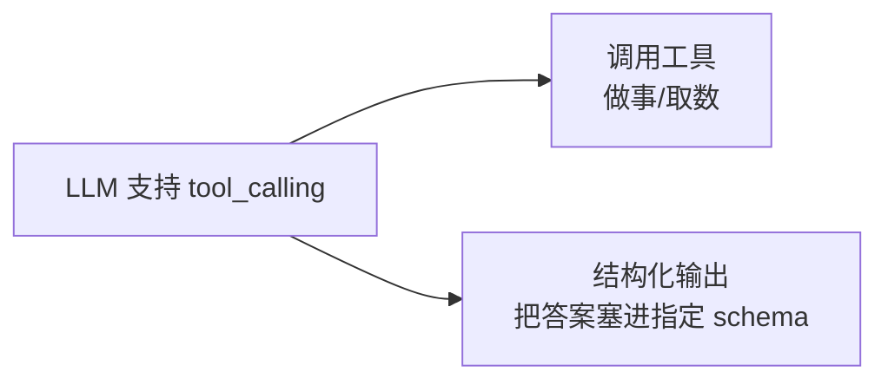
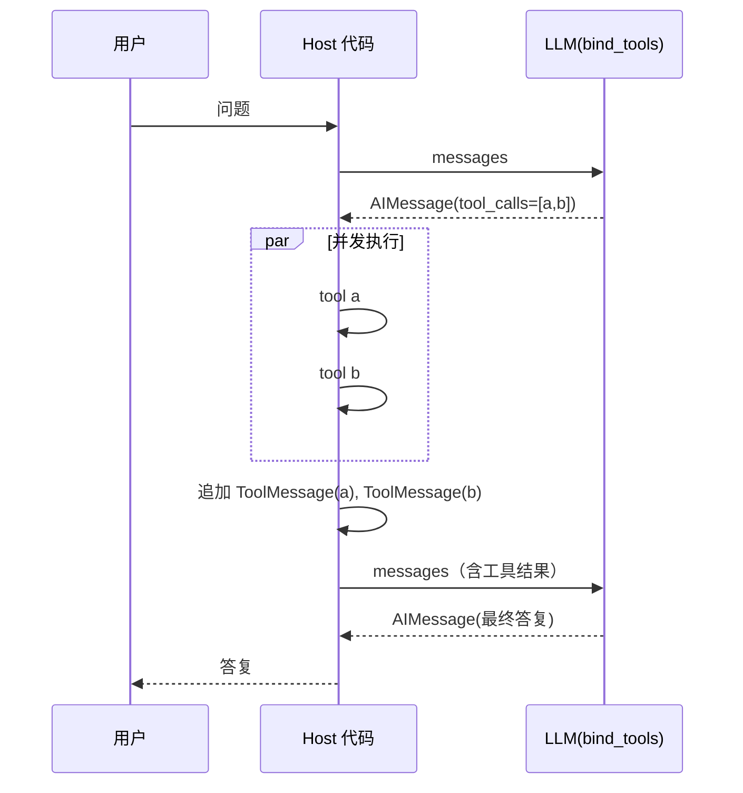
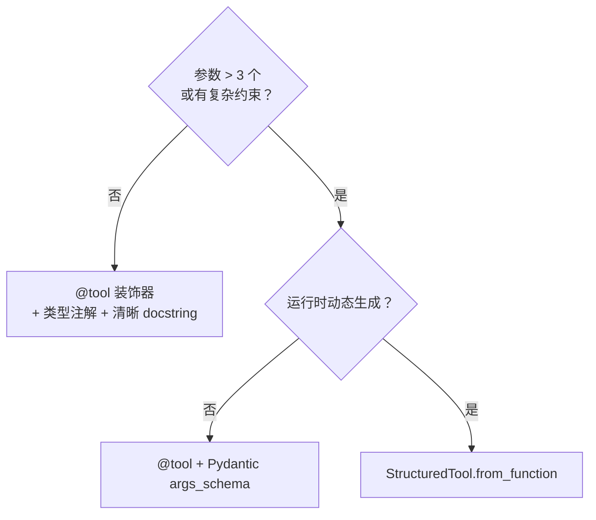
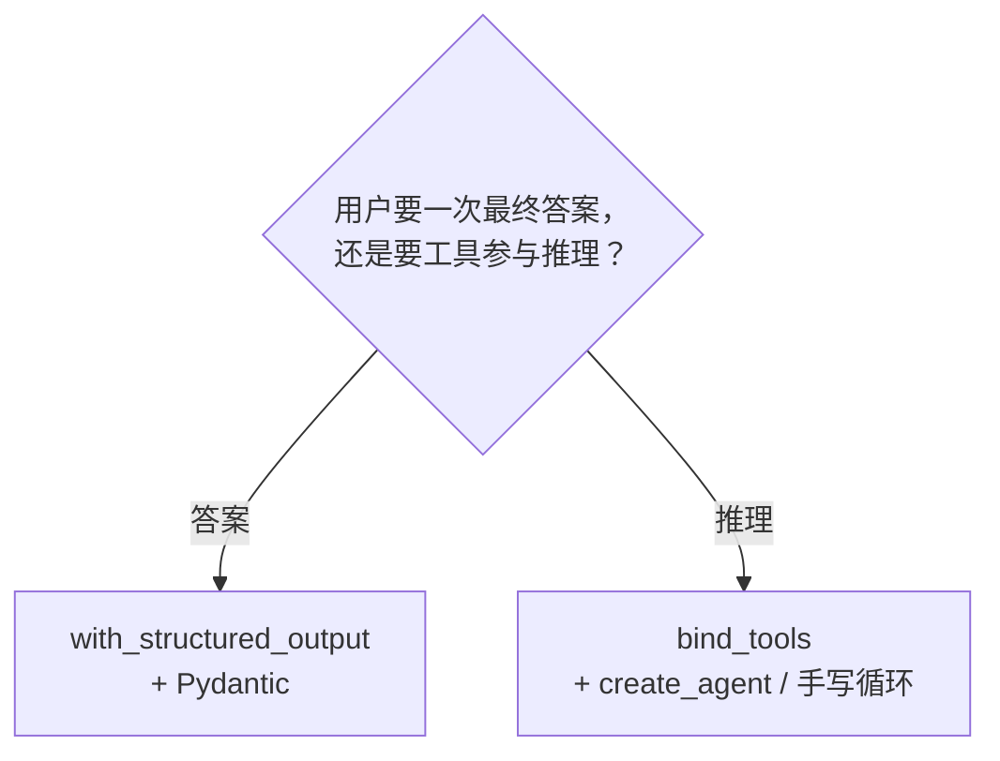

# 工具调用与结构化输出

## 前言

**C：** 这一篇把 LangChain 的工具侧讲透——**怎么定义工具、怎么让模型会调、怎么拿结构化输出**。上册《Function Calling》那一章讲的是**协议**，这一篇讲**LangChain 里的用法**：`@tool` 装饰器、`bind_tools`、`with_structured_output`、工具回合循环，以及它和 06 篇里的 `create_agent` 的衔接点。

<!-- more -->

## 一、三件事的关系

很多人把"**调用工具**"和"**结构化输出**"混着学——其实它们背后是**同一套机制**（tool calling），**两种用途**：



- **调用工具**：工具是**真有副作用**的函数（查天气、发邮件、SQL），产出再回喂给模型；
- **结构化输出**：工具是**假函数**——只有 schema、没有实现，模型"调用"它意味着"把答案按这个 schema 填了"。

**所以 `bind_tools` 是底层，`with_structured_output` 是上层便利**。先学底层，再学上层。

## 二、定义工具：三种方式

### 2.1 `@tool` 装饰器（最常用）

```python
from langchain_core.tools import tool

@tool
def get_weather(city: str) -> str:
    """获取指定城市的当前天气。仅当前时刻，不含预报。"""
    ...
    return f"{city} 18°C 多云"
```

规则：

- **函数必须有 docstring**——它会成为**给模型看的 `description`**；
- **类型注解必须有**——从类型自动推出 JSON Schema；
- 默认工具名 = 函数名；可 `@tool("better_name")` 重命名。

### 2.2 Pydantic 入参 schema（复杂参数推荐）

```python
from pydantic import BaseModel, Field
from langchain_core.tools import tool

class SearchArgs(BaseModel):
    query: str = Field(description="关键词")
    limit: int = Field(10, ge=1, le=50, description="返回条数 1~50")
    lang:  str = Field("zh", description="语言，zh/en/...")

@tool(args_schema=SearchArgs)
def search(query: str, limit: int = 10, lang: str = "zh") -> list[dict]:
    """在内部知识库里搜索文档。"""
    ...
```

**用 Pydantic 的好处**：

- `Field(description=...)` 能给**每个参数**写说明——模型调用的正确率显著提升；
- `ge/le/pattern/enum` 校验**协议层就能拒错**，无需再塞进函数体。

### 2.3 `StructuredTool.from_function`（动态创建）

```python
from langchain_core.tools import StructuredTool

search_tool = StructuredTool.from_function(
    func=search_func,
    name="search",
    description="搜内部知识库。仅用于已归档文档。",
    args_schema=SearchArgs,
)
```

用在**运行时动态注册**——比如你从 MCP Server 拉回来的工具清单要转成 LangChain 工具。

## 三、`bind_tools`：把工具"绑"到模型

```python
from langchain_openai import ChatOpenAI

llm = ChatOpenAI(model="gpt-4o-mini")
llm_with_tools = llm.bind_tools([get_weather, search])

resp = llm_with_tools.invoke("北京天气怎么样？")
print(resp.tool_calls)
# [{"id":"call_abc","name":"get_weather","args":{"city":"北京"},"type":"tool_call"}]
```

几个关键点：

- `bind_tools(...)` **不调用工具**——只是把它的 schema 发给模型；
- 模型回一个 `AIMessage`，`.tool_calls` 里是**模型决定要调的工具**（可以多条）；
- 如果模型觉得不需要调工具，`.tool_calls` 是空列表，`.content` 直接是答案。

### 3.1 `tool_choice`：控制调用倾向

```python
llm.bind_tools(tools, tool_choice="auto")     # 默认
llm.bind_tools(tools, tool_choice="any")      # 强制调某一个工具
llm.bind_tools(tools, tool_choice="search")   # 指定名字
```

"**强制调工具**"是结构化输出的常用技巧，下面会用到。

## 四、手工跑一圈"工具回合"

先用手写代码把循环跑通——**心里有数了**再用 `create_agent`。

```python
from langchain_core.messages import HumanMessage, ToolMessage

tools_by_name = {"get_weather": get_weather, "search": search}
llm_t = llm.bind_tools(list(tools_by_name.values()))

messages = [HumanMessage("帮我查下北京天气，再搜一下'台风路径 2026'")]

while True:
    resp = llm_t.invoke(messages)
    messages.append(resp)

    if not resp.tool_calls:
        print(resp.content)
        break

    for tc in resp.tool_calls:
        tool_fn = tools_by_name[tc["name"]]
        result  = tool_fn.invoke(tc["args"])
        messages.append(ToolMessage(
            content=str(result),
            tool_call_id=tc["id"],
        ))
```

一张流程图：



这就是整个上册 Function Calling 那章的"**Agent Loop**"在 LangChain 里的最小实现。

### 4.1 并发跑工具

上面示例是**顺序**跑。要并发：

```python
import asyncio

async def run_tool(tc):
    result = await tools_by_name[tc["name"]].ainvoke(tc["args"])
    return ToolMessage(content=str(result), tool_call_id=tc["id"])

tool_msgs = await asyncio.gather(*[run_tool(tc) for tc in resp.tool_calls])
messages.extend(tool_msgs)
```

**`create_agent` / `create_react_agent` 默认就给你并发跑**——不用自己写。下一篇讲。

## 五、结构化输出：`with_structured_output`

### 5.1 用 Pydantic 约束输出

```python
from pydantic import BaseModel, Field

class Person(BaseModel):
    name: str = Field(description="姓名")
    age:  int = Field(description="年龄，整数")
    city: str = Field(description="居住城市")

structured = llm.with_structured_output(Person)

p = structured.invoke("介绍：李雷，32 岁，北京人")
print(p)            # Person(name='李雷', age=32, city='北京')
print(p.name)
```

返回的已经是 **Pydantic 实例**，不是 dict、也不是 `AIMessage`。

### 5.2 用 TypedDict / JSON Schema

```python
from typing import TypedDict

class Person(TypedDict):
    name: str
    age:  int
    city: str

structured = llm.with_structured_output(Person)
structured.invoke("李雷，32，北京")
# {"name":"李雷","age":32,"city":"北京"}
```

或直接给 JSON Schema：

```python
schema = {
    "title": "Person",
    "type":  "object",
    "properties": {
        "name": {"type":"string"},
        "age":  {"type":"integer"},
    },
    "required": ["name","age"],
}
structured = llm.with_structured_output(schema)
```

### 5.3 两种底层策略：`method` 参数

```python
llm.with_structured_output(Person, method="function_calling")  # 默认
llm.with_structured_output(Person, method="json_schema")       # 新模型可用
llm.with_structured_output(Person, method="json_mode")         # 老 API
```

- **`function_calling`**：最通用，把 schema 装成一个伪工具强制调用；
- **`json_schema`**：新模型原生支持 schema 输出（OpenAI Structured Outputs / Anthropic output tool）；
- **`json_mode`**：仅保证**是合法 JSON**，**不保证 schema**——校验自己来。

优先用默认就好。**本地模型不可靠**时试 `json_mode`+ 自己 Pydantic 校验。

### 5.4 包含原始消息

```python
structured = llm.with_structured_output(Person, include_raw=True)
out = structured.invoke(...)
out["parsed"]    # Person 实例
out["raw"]       # 原始 AIMessage
out["parsing_error"]  # 解析错时非空
```

**生产里建议打开**，方便调试和降级。

## 六、工具调用的几类典型坑

### 6.1 **docstring 写太糙**

```python
# 坏示例
@tool
def search(q): ...     # 没 docstring → description 是空 → 模型完全不知道啥时候用
```

**无 docstring 的工具模型基本不调**。上册《Schema 设计》那篇原则全部适用。

### 6.2 **类型注解缺失导致 schema 畸形**

```python
# 坏示例
@tool
def search(query, limit=10):   # 缺类型 → schema 字段都是 any → 模型瞎填
    ...
```

**`@tool` 强制要求类型注解**——新版会直接报错。

### 6.3 **用 `bind_tools` 后又直接 `invoke([...])`**

```python
llm.bind_tools(...).invoke("问题")   # OK：字符串/dict
llm.bind_tools(...).invoke(messages) # OK：消息列表
```

两种都行，**但**：如果你把之前手搓的 messages 再传进来，要确保**已经把 ToolMessage 追加进去了**——漏一条就陷入"模型一直要求同一个工具"的死循环。

### 6.4 **结构化输出的"空字符串恐慌"**

某些模型在被 `with_structured_output` 包着时，偶尔返回**空 content**——这是"只调工具不出文本"的副作用。`include_raw=True` + 检查 `parsing_error` 可以兜底。

### 6.5 **并发工具返回顺序错位**

并发时**不要**依赖 `resp.tool_calls` 的顺序做关联。一律按 `tool_call_id` 回填：

```python
msgs_by_id = {m.tool_call_id: m for m in tool_msgs}
messages.extend(msgs_by_id[tc["id"]] for tc in resp.tool_calls)
```

## 七、ToolMessage 的几种"花活"

### 7.1 附带 artifact（协议里没有但 LangChain 独有）

```python
from langchain_core.messages import ToolMessage

ToolMessage(
    content="查到 3 篇相关文档。",
    tool_call_id=tc["id"],
    artifact={"docs":[{...}, {...}, {...}]},   # 不给模型看，给你后续代码用
)
```

`artifact` **不会**进入下轮 LLM 请求——但会保留在 state 里，供你后端代码读。做"检索 → 引用来源"类功能非常方便。

### 7.2 手动标错误

```python
ToolMessage(
    content='{"ok":false,"error":"rate_limited","hint":"60s 后再试"}',
    tool_call_id=tc["id"],
    status="error",
)
```

`status="error"` 帮助 agent 运行时识别是"**业务失败**"，便于重试策略和审计。

### 7.3 让返回值**直接**给用户（绕过模型）

```python
@tool(response_format="content_and_artifact")
def generate_report(...) -> tuple[str, dict]:
    ...
    return ("报告已生成", {"path":"/tmp/report.pdf"})
```

配合 `create_agent` 的 `response_format`，可以让工具产出的"给用户看的内容"直接返回，**不再过一次模型**——省 token、降延迟。

## 八、三条"决策树"

### 8.1 工具定义：`@tool` vs Pydantic vs `StructuredTool`



### 8.2 要"**结果**"还是"**过程**"



### 8.3 选 `function_calling` 还是 `json_schema`

```mermaid
flowchart TB
  m{"模型原生支持\nJSON Schema?"}
  m -->|支持\n(GPT-4o / Claude Sonnet+ / Gemini 2+)| js["method='json_schema'"]
  m -->|不确定/不支持| fc["method='function_calling'（默认）"]
  m -->|本地模型\n不稳| jm["method='json_mode'\n+ 自己校验"]
```

## 九、小结

- **工具定义**三选一：`@tool`（最常用）/ `@tool + args_schema=Pydantic`（复杂参数）/ `StructuredTool.from_function`（动态）；
- **绑定**用 `llm.bind_tools(...)`；模型返回 `AIMessage.tool_calls`；
- **循环**的最小实现：拿到 tool_calls → 执行工具 → 追 ToolMessage → 再 invoke；并发 / 顺序不丢靠 `tool_call_id`；
- **结构化输出**用 `llm.with_structured_output(Pydantic)`——底层就是 tool calling，通用性最好；
- **坑**：docstring、类型注解、并发顺序、空 content、空消息；
- **ToolMessage** 里 `artifact`、`status="error"`、`response_format` 是几张好使的"生产化牌"；
- **下一步**：再往上一层，是 `create_agent`——把这套循环、并发、持久化打包好，见第 06 篇。

::: tip 延伸阅读

- [Tool Calling 文档](https://python.langchain.com/docs/concepts/tool_calling/)
- [Structured Output 文档](https://python.langchain.com/docs/concepts/structured_outputs/)
- 上册：`ai-basics/02-Function-Calling与Tool-Use/03-Schema 设计` 全部原则仍然适用
- 下一篇：`05-RAG 实战`

:::
