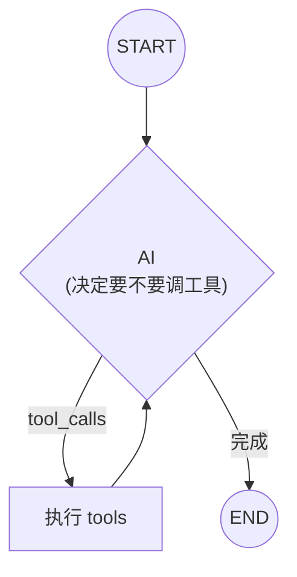
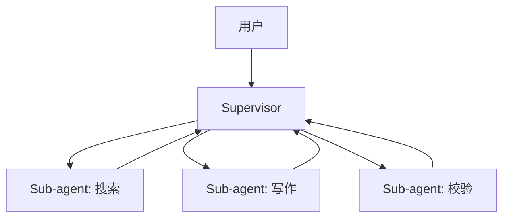

# LangGraph 与 create_agent：构建生产级 Agent

## 前言

**C：** 这一篇是整章的**核心高地**。LangGraph 是 LangChain 1.0 时代**Agent 的标准运行时**——`create_agent / create_react_agent` 都建在它之上。我们从**为什么要它**开始，一路走到**StateGraph 自己写节点和边**、**持久化**、**Human-in-the-Loop**，最后给一个可以直接抄的生产模板。

<!-- more -->

## 一、为什么要 LangGraph

上一篇（第 04 篇）我们手搓过一个"工具回合循环"：

```python
while True:
    resp = llm_with_tools.invoke(messages)
    messages.append(resp)
    if not resp.tool_calls: break
    for tc in resp.tool_calls:
        messages.append(ToolMessage(...))
```

**可以跑，但生产上会被这些需求揍**：

- **并发**跑多个 tool（别串行等）；
- **限步数 / 限 token / 限时**防死循环；
- **中断**等待用户确认后**恢复**；
- **持久化**会话、崩了能接着跑；
- **观测**每一步：输入输出、耗时、成本；
- **多 agent 协作**。

把这些**横切关注点**统一抽象成"**图**"——节点 = 计算，边 = 流转——就是 **LangGraph**。



**ReAct** 模式就是这么一张最小图。

## 二、两种使用姿势

LangGraph 给你两种颗粒度：

| 姿势 | 入口 | 适合 |
| -- | -- | -- |
| **高阶**：`create_agent` / `create_react_agent` | 一行建好 ReAct | 标准工具调用、快速落地 |
| **低阶**：手写 `StateGraph` | 自己定义 state / 节点 / 边 | 定制流程、多 agent、条件路由 |

先学高阶（80% 场景就够），再学低阶。

## 三、高阶：`create_agent` 一行起 Agent

### 3.1 安装

```bash
pip install "langchain>=1.0" langgraph langgraph-prebuilt langchain-openai
```

### 3.2 最小可用 Agent

```python
from langchain.agents import create_agent
from langchain_core.tools import tool

@tool
def get_weather(city: str) -> str:
    """获取指定城市当前天气。"""
    return f"{city} 18°C 多云"

@tool
def search_docs(query: str) -> list[dict]:
    """搜内部知识库。"""
    return [{"title":"t1","url":"u1"}]

agent = create_agent(
    "openai:gpt-4o-mini",
    tools=[get_weather, search_docs],
    system_prompt="你是生活助理，回答简洁。",
)

out = agent.invoke({
    "messages": [{"role": "user", "content": "北京今天天气怎么样？"}]
})
print(out["messages"][-1].content)
```

**关键点**：

- `agent` 本身是一个 Runnable——**`invoke / stream / astream_events` 全套都支持**；
- 输入永远是 `{"messages": [...]}`；输出是 `{"messages": [...包括中间 ToolMessage...]}`；
- 工具**自动并发**；
- **默认把循环封装好**（防死循环 25 步上限）。

### 3.3 结构化最终输出

让 agent 不只是返回文本，而是按 schema 返回：

```python
from pydantic import BaseModel

class TripPlan(BaseModel):
    city: str
    days: int
    budget_usd: int

agent = create_agent(
    "openai:gpt-4o-mini",
    tools=[search_flights, search_hotels],
    response_format=TripPlan,
)

out = agent.invoke({"messages":[{"role":"user","content":"帮我订 5 天东京行程，预算 2000 美金"}]})
plan: TripPlan = out["structured_response"]
```

### 3.4 限步 / 限时

```python
agent = create_agent(
    "openai:gpt-4o-mini", tools=tools,
    state_schema=..., checkpointer=..., # 见后面
)

agent.invoke(
    {"messages":[...]},
    config={
        "recursion_limit": 10,         # 最多跑 10 轮
        "configurable": {"thread_id":"t1"},
    },
)
```

### 3.5 动态工具集 / 前后中间件

`create_agent` 暴露了 **`AgentMiddleware`**，可在**调用模型前**改请求、**调用工具前**做拦截、**调用后**做后处理——典型用途：

- `wrap_model_call`：按用户权限动态增删工具；
- `wrap_tool_call`：统一错误兜底 / 审计日志 / 速率限制；
- 在对话里**注入 RAG 上下文**。

```python
from langchain.agents.middleware import AgentMiddleware, ModelRequest

@wrap_model_call
def inject_time(request: ModelRequest, handler):
    request.messages.insert(0, SystemMessage(f"现在是 {now()}"))
    return handler(request)

agent = create_agent(model, tools, middleware=[inject_time])
```

## 四、低阶：`StateGraph` 手搓一张图

### 4.1 `State`：共享的数据袋

用 TypedDict 定义：

```python
from typing import TypedDict, Annotated
from langchain_core.messages import AnyMessage
from langgraph.graph.message import add_messages

class State(TypedDict):
    messages: Annotated[list[AnyMessage], add_messages]
    user_id:  str
```

`Annotated[..., add_messages]` 表示**这个字段在不同节点的返回值**会被**"追加合并"**，而不是覆盖。**消息型 state 必用**。

### 4.2 节点：普通函数

节点接受 **state**，返回一个**部分 state**（会被合并回去）：

```python
from langchain_openai import ChatOpenAI
from langchain_core.messages import SystemMessage

llm = ChatOpenAI(model="gpt-4o-mini")

def call_llm(state: State) -> dict:
    msgs = [SystemMessage("你是助手")] + state["messages"]
    return {"messages": [llm.invoke(msgs)]}

def call_tools(state: State) -> dict:
    ...
```

### 4.3 图 + 边

```python
from langgraph.graph import StateGraph, START, END

graph = StateGraph(State)
graph.add_node("llm",   call_llm)
graph.add_node("tools", call_tools)

graph.add_edge(START, "llm")
graph.add_edge("tools", "llm")
graph.add_conditional_edges(
    "llm",
    lambda s: "tools" if s["messages"][-1].tool_calls else END,
    {"tools": "tools", END: END},
)

app = graph.compile()
```

用 `add_conditional_edges` 根据 state 动态决定下一步去哪。

### 4.4 跑起来

```python
app.invoke({"messages":[HumanMessage("北京天气怎么样？")], "user_id":"u1"})
```

app 也是 Runnable，支持 `stream / ainvoke / astream_events`。

### 4.5 预制 `ToolNode` + `tools_condition`

自己写 `call_tools` 太 boilerplate。LangGraph 提供：

```python
from langgraph.prebuilt import ToolNode, tools_condition

tools = [get_weather, search_docs]
llm_t = llm.bind_tools(tools)

def call_llm(state): return {"messages":[llm_t.invoke(state["messages"])]}

graph = StateGraph(State)
graph.add_node("llm",   call_llm)
graph.add_node("tools", ToolNode(tools))   # 并发、错误捕获、ToolMessage 回填
graph.add_edge(START, "llm")
graph.add_edge("tools", "llm")
graph.add_conditional_edges("llm", tools_condition)
app = graph.compile()
```

这段等价于 `create_react_agent`——但**你能自由改**。

## 五、持久化：Checkpointer 让 Agent "记忆活着"

**没有持久化的 Agent 跟**"**无状态请求**"**一样健忘**。把一个 `checkpointer` 塞进来就解决：

```python
from langgraph.checkpoint.memory import MemorySaver  # 进程内
# 生产用：
# from langgraph.checkpoint.postgres import PostgresSaver
# from langgraph.checkpoint.sqlite import SqliteSaver

checkpointer = MemorySaver()
app = graph.compile(checkpointer=checkpointer)

# 用 thread_id 标识一个会话
config = {"configurable": {"thread_id": "user-42-session-1"}}

app.invoke({"messages":[HumanMessage("我叫李雷")]}, config=config)
app.invoke({"messages":[HumanMessage("我叫什么？")]}, config=config)
# → "李雷"——因为它记得上一步
```

Checkpointer 提供：

- **跨请求记忆**：下一次用同一 `thread_id` 继续；
- **崩溃恢复**：上一步结果落盘；
- **时间旅行**：读某个 checkpoint、回放、分叉；
- **多用户隔离**：按 `thread_id` 隔离会话。

### 5.1 读历史

```python
snapshot = app.get_state(config)
snapshot.values["messages"]      # 全部消息
snapshot.next                    # 下一步将要跑的节点

for snap in app.get_state_history(config):
    print(snap.config["configurable"]["checkpoint_id"])
```

### 5.2 时间旅行 / 分叉

```python
old = list(app.get_state_history(config))[3]
# 回到某个点、改一条消息、继续跑
app.invoke(None, config=old.config)
```

调试 / 复盘场景真金白银的好功能。

## 六、Human-in-the-Loop：`interrupt_before` / `interrupt_after`

高风险工具（付款、发邮件、写数据库）**必须在跑之前等用户点同意**。LangGraph 原生支持：

```python
app = graph.compile(
    checkpointer=checkpointer,
    interrupt_before=["tools"],   # 执行 tools 节点前暂停
)

# 第一轮：跑到 tools 前停下
state = app.invoke({"messages":[HumanMessage("帮我删除项目 X")]}, config=config)
print("暂停，等待审核。下一步：", state["next"])

# 人类检查后，同意或修改 state
# 继续（传 None 意味着"沿用 state 继续"）
app.invoke(None, config=config)
```

更灵活的做法：在节点里调用 `interrupt()` 产生 "**resumable**" 暂停，把一个**审批载荷**发给 UI，UI 填了继续。

```python
from langgraph.types import interrupt, Command

def approval_node(state):
    answer = interrupt({
        "question": "确定删除？",
        "target":   state["target"],
    })
    return {"approved": answer}

# 外面：
# 第一次 invoke → 拿到 interrupt payload；UI 给用户看。
# 用户点"同意" → app.invoke(Command(resume=True), config=config)
```

## 七、流式：`stream_mode` 四件套

```python
for ev in app.stream(inputs, config, stream_mode="updates"):
    print(ev)
```

`stream_mode`：

| mode | 产出什么 |
| -- | -- |
| `values` | **每步完成后**的完整 state |
| `updates` | **每步产出的增量**（`{node_name: returned_dict}`）|
| `messages` | 只流式 **消息 token**（打字机效果）|
| `debug` | 非常啰嗦的 debug 事件 |

```python
async for chunk, meta in app.astream(inputs, config, stream_mode="messages"):
    if meta["langgraph_node"] == "llm":
        print(chunk.content, end="")
```

**前端想要**：
- 打字机：`messages`；
- "正在查..."/"正在调工具..."提示：`updates`；
- 调试：`debug`。

## 八、生产模板：把前面所有东西拼到一起

```python
from typing import TypedDict, Annotated
from langchain_core.messages import AnyMessage, SystemMessage, HumanMessage
from langchain_core.tools import tool
from langchain_openai import ChatOpenAI
from langgraph.graph import StateGraph, START, END
from langgraph.graph.message import add_messages
from langgraph.prebuilt import ToolNode, tools_condition
from langgraph.checkpoint.sqlite import SqliteSaver

# ---- 工具 ----
@tool
def search_kb(query: str) -> list[dict]:
    """在内部知识库检索 FAQ。"""
    return [{"title":"...","snippet":"..."}]

@tool
def open_ticket(title: str, desc: str) -> dict:
    """开工单。有副作用，需审核。"""
    return {"id":"T-001"}

# ---- 模型（带可配置）----
llm = ChatOpenAI(model="gpt-4o-mini", temperature=0)
tools = [search_kb, open_ticket]
llm_t = llm.bind_tools(tools)

# ---- State ----
class State(TypedDict):
    messages: Annotated[list[AnyMessage], add_messages]

def agent_node(state: State):
    system = SystemMessage(
        "你是客服。先尝试用 search_kb 回答；确需开工单时才调 open_ticket。"
    )
    out = llm_t.invoke([system] + state["messages"])
    return {"messages":[out]}

graph = StateGraph(State)
graph.add_node("agent", agent_node)
graph.add_node("tools", ToolNode(tools))

graph.add_edge(START, "agent")
graph.add_edge("tools", "agent")
graph.add_conditional_edges("agent", tools_condition)

# ---- 持久化 ----
checkpointer = SqliteSaver.from_conn_string("./.agent.sqlite")

app = graph.compile(
    checkpointer=checkpointer,
    interrupt_before=["tools"],   # 工具执行前人工确认（可按工具名细粒度过滤）
)
```

一套：**State / 节点 / 条件边 / 工具并发 / 持久化 / 人工审核**都齐了。

FastAPI 暴露成接口：

```python
from fastapi import FastAPI
from langchain_core.messages import HumanMessage

api = FastAPI()

@api.post("/chat")
async def chat(payload: dict):
    thread_id = payload["thread_id"]
    text      = payload["text"]
    cfg = {"configurable": {"thread_id": thread_id}}

    # 新消息
    state = await app.ainvoke(
        {"messages":[HumanMessage(text)]}, config=cfg,
    )
    # 如果停在工具前
    if app.get_state(cfg).next:
        return {"status":"pending_approval", "state": state}
    return {"status":"ok", "reply": state["messages"][-1].content}

@api.post("/approve")
async def approve(payload: dict):
    cfg = {"configurable":{"thread_id":payload["thread_id"]}}
    state = await app.ainvoke(None, config=cfg)   # 继续跑
    return {"reply": state["messages"][-1].content}
```

## 九、几种多 Agent 模式

### 9.1 Supervisor（主管-执行）

一个"**主 agent**"拿到任务后**选**若干子 agent 协作：



LangGraph 提供 `langgraph-supervisor`（单独包）一行起 supervisor。

### 9.2 Swarm / 对等

每个 agent 都能**把控制权转给别人**（`Command(goto="agent_b")`）——一群 agent 像蜂群。

### 9.3 Hierarchical

多层 supervisor——更复杂的组织结构。

**提醒**：新项目 90% 先用单 agent + 工具做起来。多 agent **复杂度爆炸**很快，除非问题本身就有明显的角色分工。

## 十、什么时候**别**用 LangGraph

- **纯单步 LLM 调用**：`prompt | model | parser` 就够了，套 graph 纯粹增加心智负担；
- **批处理 / 数据流水**：更适合 Airflow / Prefect / Dagster；
- **实时延迟极度敏感**：Graph 的 checkpointer、state merge 有开销，每步几毫秒，几十步后会被感觉到；
- **固定规则的业务**：如果流程**不需要模型决策**，写 if/else 状态机更稳。

## 十一、小结

- **LangGraph** 是 LangChain 1.0 时代 Agent 的**标准运行时**；
- 两条路：高阶 `create_agent` / `create_react_agent`、低阶手写 `StateGraph`；
- **State** 用 TypedDict + `add_messages` reducer；**节点**返回部分 state 合并；**边**可条件；
- **ToolNode + tools_condition** 给你工具并发、错误捕获、自动 ToolMessage；
- **Checkpointer** = 记忆 / 恢复 / 时间旅行，生产必上；
- **Interrupt** 实现 Human-in-the-Loop，破坏性工具要走审核；
- **流式** `stream_mode = updates/messages` 满足前端不同粒度；
- 多 agent 看需要选 Supervisor / Swarm / Hierarchical。

::: tip 延伸阅读

- [LangGraph 官方](https://langchain-ai.github.io/langgraph/)
- [`create_agent` 文档](https://docs.langchain.com/oss/python/langchain/agents)
- [LangGraph 持久化](https://langchain-ai.github.io/langgraph/concepts/persistence/)
- [LangGraph HITL](https://langchain-ai.github.io/langgraph/concepts/human_in_the_loop/)
- 下一篇：`07-生产化：LangSmith、流式、缓存与部署`

:::
