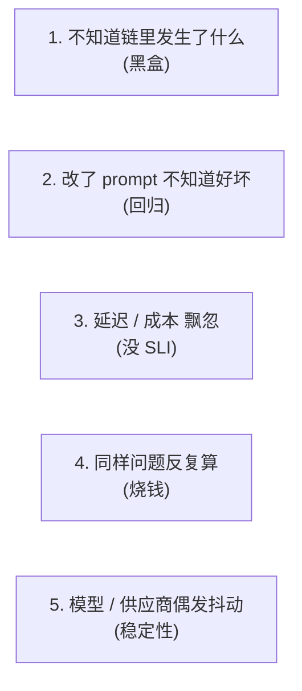
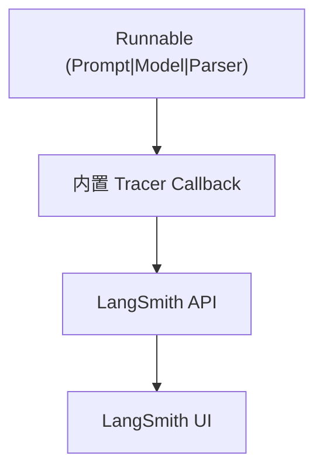
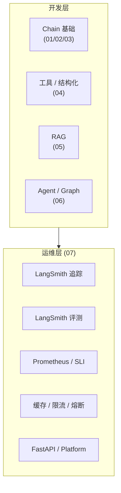

# 生产化：LangSmith、流式、缓存与部署

## 前言

**C：** 前六篇让 LangChain 能"**跑起来**"；这一篇让它"**活下来**"——观测、评测、加速、降本、部署。核心工具是 **LangSmith**（LangChain 自家的观测 & 评测平台），辅助是 **缓存 / 回调 / 速率限制 / FastAPI 部署**。

<!-- more -->

## 一、生产化的五个常见痛点



分别对应本篇五节：**LangSmith 追踪 → 评测 → 指标监控 → 缓存 → 容错 & 限流**。最后讲**部署形态**。

## 二、LangSmith：一次环境变量启用"全链路追踪"

### 2.1 一行开追踪

```bash
export LANGSMITH_TRACING=true
export LANGSMITH_API_KEY=lsv2_pt_...
export LANGSMITH_PROJECT=my-app-prod    # 一个项目一个仪表盘
```

**不用**改任何代码。所有 Runnable 调用会把 span 发到 LangSmith。



LangSmith 会看到：

- 每一步输入输出；
- 每步耗时、token、成本（含模型定价自动换算）；
- 工具调用参数、结果、错误；
- 异常堆栈；
- 完整的 messages 时间线。

### 2.2 给一次运行**打 tag / 加 metadata**

```python
chain.invoke(
    {"question": q},
    config={
        "tags": ["prod", "rag", "zh"],
        "metadata": {"user_id": uid, "plan": "pro"},
        "run_name": "rag_v2.answer",
    },
)
```

好处：**按用户、按功能、按版本在 LangSmith 里筛 trace**——线上出问题能**30 秒定位**。

### 2.3 不想上云：**自托管 Tracer**

- `@traceable` 装饰器 + 自部署的 LangSmith Server（闭源）；
- 或对接 **OpenTelemetry** exporter（开源路径，接你的 Jaeger / Grafana）。

基本思路都一样：把 span 发出去、在 UI 里看。

## 三、评测：从"改动是否更好"开始

### 3.1 造数据集

```python
from langsmith import Client

ls = Client()
ds = ls.create_dataset(
    dataset_name="rag-faq-v1",
    description="FAQ 问答样本集",
)

# 手工灌样本
ls.create_examples(
    dataset_id=ds.id,
    inputs=[{"question":"..."},{"question":"..."}],
    outputs=[{"answer":"..."},{"answer":"..."}],
)
```

或直接 **从生产 trace 反向采**：UI 里勾选"把这些 trace 加入 dataset"——这是 LangSmith 最强的能力之一。

### 3.2 跑评测

```python
from langsmith.evaluation import evaluate
from langsmith.evaluation import LangChainStringEvaluator

def run_chain(inputs):
    return {"answer": my_rag.invoke(inputs["question"])}

evaluate(
    run_chain,
    data="rag-faq-v1",
    evaluators=[
        LangChainStringEvaluator("cot_qa"),        # LLM-as-judge
        LangChainStringEvaluator("criteria",
            config={"criteria":"conciseness"}),
        "embedding_distance",                       # 向量相似
        lambda run, example: {
            "key":"cited",
            "score": 1 if "[1]" in run.outputs["answer"] else 0,
        },
    ],
    experiment_prefix="rag-v2",
)
```

评测能力：

- **字符串判定**（exact / regex / similarity）；
- **LLM-as-judge**（带 rubric）；
- **自定义 Python**；
- **pairwise 比较**（v1 vs v2）；
- 结果在 LangSmith UI 里出**表格**——按指标排序、找 regression 一目了然。

### 3.3 持续评测

线上有新 trace **自动触发** 一条评测链，把异常 trace 扔进"待检查"队列——高级玩法，**适合有 QA 团队**的项目。

## 四、监控：把业务指标和 SLI 装上

除了 LangSmith 的追踪，**业务侧**还要关心：

| 指标 | 目的 | 典型实现 |
| -- | -- | -- |
| **P50/P95/P99 延迟** | 性能 SLO | Prometheus histogram |
| **token 成本 / 请求** | 成本治理 | `response.usage_metadata` |
| **工具调用成功率** | 可靠性 | callback 按 tool 名打点 |
| **空回复率** | 质量告警 | content == "" 计数 |
| **结构化输出失败率** | 质量告警 | parser 异常率 |

### 4.1 自定义 Callback 抓指标

```python
from langchain_core.callbacks import BaseCallbackHandler
from prometheus_client import Histogram, Counter
import time

LLM_LAT = Histogram("llm_latency_seconds", "", ["model"])
TOK_IN  = Counter("llm_tokens_in_total", "", ["model"])
TOK_OUT = Counter("llm_tokens_out_total", "", ["model"])

class Metrics(BaseCallbackHandler):
    def on_chat_model_start(self, serialized, messages, **kw):
        self._t = time.monotonic()
        self._model = kw.get("invocation_params", {}).get("model","unk")

    def on_chat_model_end(self, response, **kw):
        LLM_LAT.labels(self._model).observe(time.monotonic() - self._t)
        meta = response.generations[0][0].message.usage_metadata or {}
        TOK_IN.labels(self._model).inc(meta.get("input_tokens",0))
        TOK_OUT.labels(self._model).inc(meta.get("output_tokens",0))
```

挂上去：

```python
chain.invoke(x, config={"callbacks":[Metrics()]})
```

## 五、缓存：一张表省掉一堆调用

### 5.1 全局 LLM 缓存

```python
from langchain_core.globals import set_llm_cache
from langchain_community.cache import SQLiteCache, RedisCache, InMemoryCache

set_llm_cache(SQLiteCache(database_path=".llm.sqlite"))
# 生产
# set_llm_cache(RedisCache(redis_))
```

含义：**同样的 model + messages + params** → 直接命中缓存，**不再调 API**。

**坑**：

- `temperature > 0` 时缓存**仍命中**——有人会觉得"每次随机"失效了；需要时设 `cache=False`；
- **Agent 循环**里如果某轮 messages 一模一样会命中**旧**的 tool_calls → 陷入死循环——Agent 场景慎用全局 LLM cache；
- **tool 返回值**不在 LLM cache 范围内——要单独缓存。

### 5.2 工具侧缓存

```python
from functools import lru_cache

@tool
def get_weather(city: str) -> str:
    """..."""
    return _cached_weather(city)

@lru_cache(maxsize=1024)
def _cached_weather(city: str) -> str:
    ...
```

更工程化：用 Redis 或 `diskcache` 做 TTL 缓存。**副作用工具**（发邮件、写库）**别缓存**——幂等键 / 去重表才是正道。

### 5.3 Embedding 缓存

```python
from langchain.embeddings import CacheBackedEmbeddings
from langchain.storage import LocalFileStore

store = LocalFileStore("./.emb-cache")
emb = CacheBackedEmbeddings.from_bytes_store(
    underlying_embeddings=OpenAIEmbeddings(model="text-embedding-3-small"),
    document_embedding_cache=store,
    namespace="v1",
)
```

**RAG 重建索引**时能省 90% 的 embedding 费用——文件没变就不重算。

## 六、流式：到 HTTP 层的正确姿势

前面讲过 `stream / astream_events / stream_mode`，这里拼到**HTTP 服务**：

### 6.1 SSE（Server-Sent Events）——最常用

```python
from fastapi import FastAPI
from fastapi.responses import StreamingResponse
import json

api = FastAPI()

@api.post("/chat")
async def chat(payload: dict):
    async def gen():
        async for chunk, meta in app.astream(
            {"messages":[HumanMessage(payload["text"])]},
            config={"configurable":{"thread_id":payload["thread_id"]}},
            stream_mode="messages",
        ):
            if meta.get("langgraph_node") == "agent":
                yield f"data: {json.dumps({'t':chunk.content})}\n\n"
        yield "data: [DONE]\n\n"
    return StreamingResponse(gen(), media_type="text/event-stream")
```

### 6.2 WebSocket

想要双向（用户边说边打断）就用 WS。LangChain **本身不提供 WS adapter**，自己写。

### 6.3 流式时的"中断"

用户关浏览器 → FastAPI 的请求被取消 → 你需要**把取消传下去**：

```python
from fastapi import Request

async def gen(req: Request):
    async for ev in chain.astream(x):
        if await req.is_disconnected(): break
        yield ...
```

## 七、容错与速率限制

### 7.1 自动重试 / 降级 / 超时

（第 03 篇讲过，这里回顾）：

```python
robust = (
    primary_model
    .with_retry(stop_after_attempt=3, wait_exponential_jitter=True)
    .with_fallbacks([secondary_model])
)
```

### 7.2 速率限制

LangChain 提供 `InMemoryRateLimiter`（单进程）：

```python
from langchain_core.rate_limiters import InMemoryRateLimiter

limiter = InMemoryRateLimiter(
    requests_per_second=5,
    check_every_n_seconds=0.1,
    max_bucket_size=10,
)

llm = ChatOpenAI(model="gpt-4o-mini", rate_limiter=limiter)
```

多进程 / 多副本**不适用**——生产用 Redis 令牌桶 / 网关侧（Kong / Envoy / LiteLLM Router）。

### 7.3 配额 & 成本硬上限

- **per-user 日预算**：请求前查 Redis key；超了返 `429`；
- **per-run token 上限**：`recursion_limit` + `agent.invoke(..., config={"recursion_limit":N})`；
- **全局熔断**：过去 5 分钟错误率 > 30% → 切到 fallback 模型或离线回答。

## 八、部署形态

### 8.1 FastAPI + Uvicorn/Gunicorn（最主流）

- 一个 FastAPI 服务包所有 endpoint；
- 用 Gunicorn `-k uvicorn.workers.UvicornWorker --workers 4` 跑；
- 前面放 Nginx / ALB 做 SSE 友好超时（**keepalive 足够长**）；
- Checkpointer 用 **PostgresSaver** 或 **RedisSaver**，**不要** MemorySaver；
- LangSmith 打开，tag 上 `env=prod / version=...`。

### 8.2 LangServe（legacy）

```python
from langserve import add_routes

add_routes(app, chain, path="/my-chain")
```

一行暴露 `invoke / batch / stream / playground`——Demo 很好用。生产上**已不推荐**（维护收敛到 LangGraph Platform）。

### 8.3 LangGraph Platform（LangChain 官方托管）

把你的 `graph = compile(...)` 部署成一个托管服务：

```bash
pip install langgraph-cli
langgraph deploy
```

特性：

- 自动 HTTP 接口（含 SSE）；
- Checkpointer / 持久化托管；
- 和 LangSmith 打通；
- 适合**不想自己运维**的团队。

### 8.4 Serverless（Lambda / Cloud Run）

可行，但注意：

- 冷启动**一次**要装 deps + 加载 embedding 模型，别让用户第一次等 10 秒；
- Checkpointer 必须用**外部存储**（Postgres / Redis）；
- SSE 在 API Gateway 下支持不完整——很多团队转 WS 或轮询。

### 8.5 Docker 常用基底

```dockerfile
FROM python:3.12-slim
WORKDIR /app
COPY requirements.txt .
RUN pip install --no-cache-dir -r requirements.txt
COPY . .
ENV LANGSMITH_TRACING=true
CMD ["gunicorn","-k","uvicorn.workers.UvicornWorker","app:api",
     "--workers","4","--timeout","120"]
```

## 九、一份生产自检 Checklist

上线前过一遍：

- [ ] 环境变量：`OPENAI_API_KEY / LANGSMITH_*` 都从 secret manager 拿；
- [ ] LangSmith 打开、tag 规范（env/service/version/user_id）；
- [ ] 至少一个 evaluator 跑在 CI 上（改 prompt 必跑）；
- [ ] 关键工具有**幂等键** 或 DB 唯一约束；
- [ ] 破坏性工具 `interrupt_before`，或走审批 tool；
- [ ] Checkpointer 用 Postgres/Redis，**不是** Memory；
- [ ] 至少一套 fallback 模型（供应商抖动时顶上）；
- [ ] 流式端到端验证（SSE 不被 Nginx 缓冲）；
- [ ] **日 token 成本**告警；
- [ ] **Error log** 采样（别只看 metric）；
- [ ] 上线后 24 小时**人工抽查** 50 条 trace。

## 十、回到本章起点

七篇的主线：

1. **01** 生态与选型 → 知道在哪、装什么；
2. **02** 第一个 Chain → 上手三件套；
3. **03** LCEL → 组合、流式、配置；
4. **04** 工具调用 / 结构化输出 → 让模型动手；
5. **05** RAG → 挂外挂记忆；
6. **06** LangGraph & Agent → 复杂工作流与状态；
7. **07** 生产化（本篇） → 上线 & 持续改进。

这套组合基本能覆盖 **绝大多数 LLM 应用**的生产需要。下面这一张图把七篇编排成一张**生产地图**：



## 十一、小结

- **LangSmith** 一行环境变量开追踪，tag/metadata 搜 trace；评测靠 dataset + evaluators；
- **监控**关注 P95 延迟、token 成本、工具成功率、空回复率、结构化失败率；
- **缓存**三层：LLM（小心 Agent 死循环）、Tool（自己做）、Embedding（RAG 省钱大户）；
- **流式**到 HTTP 走 SSE，别忘了 Nginx 不缓冲 + disconnect 下游取消；
- **容错**：`with_retry / with_fallbacks / recursion_limit / InMemoryRateLimiter`；
- **部署**优先 FastAPI + Postgres Checkpointer，省心用 LangGraph Platform，老派 LangServe 已退场；
- 上线前过一份自检 Checklist，出事后看 LangSmith 30 秒定位。

至此 **`ai-agent / 03-LangChain`** 章节全部结束。把这七篇当一本小手册用，基本能做到"**从 demo 一路推到生产**"。

::: tip 延伸阅读

- [LangSmith 文档](https://docs.smith.langchain.com/)
- [LangGraph Platform](https://langchain-ai.github.io/langgraph/cloud/)
- [LangChain Deploy 文档](https://python.langchain.com/docs/how_to/#deployment)
- 同站：`ai-basics/02-Function-Calling与Tool-Use/04-调度器设计` —— 循环 / 并行 / 错误回喂的底层原理
- 同站：`ai-basics/03-Model-Context-Protocol` —— MCP 协议全貌，LangChain 可以通过 adapter 消费 MCP Server

:::
