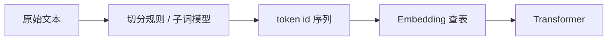

# 从词到 Token：Tokenizer 是怎么回事

## 前言

**C：** 模型并不认识"字"，它认识的是**整数 id**。Tokenizer 就是把人类文本翻译成 id、再翻译回来的那道关。看懂它，你才能解释为什么一段中文比同样意思的英文"贵"、为什么有的词会被切成奇怪的半截。

<!-- more -->

## 一句话定义

Tokenizer = **文本 ↔ 整数序列**的双向映射器。训练阶段它决定了词表（vocabulary），推理阶段它决定了你每句话被切成多少块、计费多少。



注意："token"不等于"单词"，也不等于"汉字"。它是**模型词表里的一个条目**，可能是一个字母、一个词根、一个汉字，甚至是一个常见短语。

## 三种主流切法

| 算法 | 代表模型 | 直觉 |
| -- | -- | -- |
| BPE（Byte-Pair Encoding） | GPT 系列 | 从字符出发，反复把"最常一起出现的两个 token"合成一个新 token |
| WordPiece | BERT | 思路类似 BPE，但合并时用的是**似然增益**而不是纯频率 |
| SentencePiece / Unigram | T5、LLaMA | 先假设一个大词表，再按概率裁剪，天然不依赖空格分词 |

对普通使用者来说，差异主要体现在**切出的 token 粒度**和**多语言友好度**。SentencePiece 因为不依赖空格，处理中日韩/代码时更稳。

## 为什么中文"更贵"

英文 `"hello world"` 常被切成 `["hello", " world"]` 两个 token；同样意思的 `"你好 世界"` 在 GPT-4o 的 tokenizer 下大约是 4~5 个 token，因为：

- 模型词表是在**以英文为主的语料**上训练的，中文高频字/词进词表的比例偏低；
- 不在词表里的字会被**回退到 UTF-8 字节**，一个汉字要 3 个字节 → 有时直接等于 3 个 token。

这件事直接影响**计费**和**上下文预算**：同一个窗口（比如 128k）能塞的英文远多于中文。

## 一个最小示例

OpenAI 家的 `tiktoken`：

```python
import tiktoken

enc = tiktoken.get_encoding("o200k_base")   # GPT-4o 系列词表
print(enc.encode("hello world"))            # [24912, 2375]
print(enc.encode("你好，世界"))              # 长度通常 > 汉字数
print(enc.decode([24912, 2375]))            # 'hello world'
```

HuggingFace 生态：

```python
from transformers import AutoTokenizer

tok = AutoTokenizer.from_pretrained("Qwen/Qwen2.5-7B-Instruct")
ids = tok("你好，世界").input_ids
print(len(ids), ids)
print(tok.convert_ids_to_tokens(ids))
```

跑一下你就能直观看到："同一段文字在不同 tokenizer 下被切成什么样"——这是后面所有成本估算的起点。

## 常被忽略的几个点

- **前导空格算在 token 里**：`"world"` 和 `" world"` 在多数 BPE 词表里是两个不同 token，拼 prompt 时别在词前多打空格。
- **特殊 token**：`<|im_start|>`、`<|endoftext|>` 这种是**占一个 token 位的控制符**，由聊天模板自动插入，不要手写。
- **数字会被切得很碎**：`"1234567"` 经常不是 1 个 token，做数学题时 tokenizer 就已经在"帮倒忙"。
- **词表大小不是越大越好**：大词表省 token，但 embedding 矩阵和 softmax 也更大，推理更慢。

## 小结

- Tokenizer 是文本和模型之间的**翻译层**，决定了 id 序列长什么样。
- 主流算法是 BPE / WordPiece / SentencePiece，差异多在粒度和多语言支持。
- 中文比英文占更多 token，直接影响预算和上下文利用率。
- 想估成本、想调 prompt，先用 `tiktoken` 或 `AutoTokenizer` 实际 encode 一次。

::: tip 延伸阅读

- OpenAI Cookbook：*How to count tokens with tiktoken*
- 论文：*Neural Machine Translation of Rare Words with Subword Units*（BPE 原始论文）
- 下一篇：`02-Transformer注意力机制直觉理解`

:::
