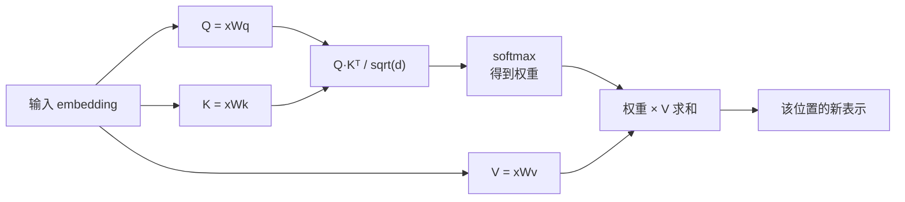

# Transformer 注意力机制直觉理解

## 前言

**C：** 注意力（Attention）是 Transformer 的心脏，但教科书一上来就推公式，很容易只记住形状忘掉含义。这篇只讲一件事：**为什么"Q·K 打分 + softmax + 加权 V"能让模型理解上下文**。

<!-- more -->

## 一个类比：模糊查字典

把一句话里的每个 token 想象成**既是查询方、也是被查询方**：

- **Query (Q)**：我正在看这个位置，我想知道"和我相关的别人说了啥"。
- **Key   (K)**：我这个位置挂了一个"标签"，告诉别人我是关于什么的。
- **Value (V)**：真要有人看上我，我就把这份"内容"交出去。

查字典是**精确匹配**；注意力是**用 Q 和每个 K 算相似度**，然后按相似度**加权平均所有 V**。相似度高的贡献大，相似度低的贡献小——这就是"模糊查字典"。



## 为什么要除以 `sqrt(d)`

维度 `d` 越大，`Q·K` 的点积绝对值会越大，softmax 之后分布会变得**极端尖锐**（接近 one-hot），梯度几乎为零。除以 `sqrt(d)` 只是把分数拉回"合理区间"，让 softmax 别一上来就冻住。

## 多头（Multi-Head）的直觉

一个头只能学一种"看待上下文的方式"。多头 = **同时从多个角度看**：

- 有的头可能学到"代词 → 它指代谁"
- 有的头可能学到"动词 → 它的主语在哪"
- 有的头可能学到"括号 → 对应的另一半"

每个头独立算注意力，最后把所有头的输出拼起来再投影一次。你可以把多头想成**多个探头并行扫描**，扫完汇总。

## 位置编码：告诉模型"谁在前谁在后"

注意力本身对顺序是**不敏感**的（打乱输入，输出只是跟着乱序，权重不变）。为了让模型知道"我是第 3 个 token"，需要额外加位置信息：

| 方案 | 代表 | 特点 |
| -- | -- | -- |
| 绝对位置（sin/cos） | 原始 Transformer | 简单，外推一般 |
| 可学习位置向量 | BERT | 训练集窗口外就废 |
| RoPE（旋转位置编码） | LLaMA、Qwen | 用旋转矩阵注入相对位置，外推友好 |
| ALiBi | MPT、Baichuan | 在 attention 分数上加线性偏置，天然支持长上下文 |

今天几乎所有长上下文模型都是 **RoPE + 各种外推技巧**（如 NTK-aware、YaRN）的组合。

## 因果掩码：为什么"只能看前面"

生成式 LLM 在训练时用的是**因果自注意力（causal self-attention）**：位置 `i` 只能看到 `≤ i` 的 K/V。实现上就是给 attention 分数加一个上三角 `-inf` 掩码：

```text
score[i][j] += -inf   if j > i
```

这样 softmax 之后未来位置权重就是 0。训练并行、推理自回归，都靠这一层掩码统一。

## KV Cache 从哪来

推理时，已经生成的每个 token 的 K、V 都可以**缓存**下来，下一步只需为新 token 算新的 Q，然后和已有 K/V 做一次注意力即可。这就是后一篇要讲的 KV Cache 的由来——它本质上是**注意力计算的中间结果复用**。

## 小结

- 注意力 = Q·K 相似度打分 → softmax → 用权重加权 V。
- 多头 = 从多个子空间并行看上下文。
- 顺序靠位置编码注入；生成式模型靠因果掩码只看前文。
- 理解这套机制后，KV Cache、长上下文、RoPE 外推都只是它的自然推论。

::: tip 延伸阅读

- 论文：*Attention Is All You Need*
- 博客：Jay Alammar *The Illustrated Transformer*
- 下一篇：`03-上下文窗口、KV-Cache与成本模型`

:::
