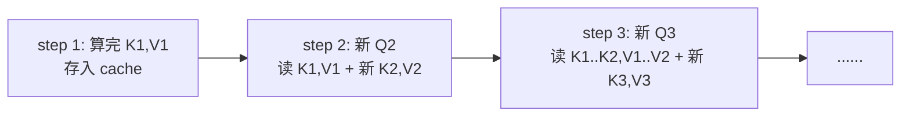

# 上下文窗口、KV Cache 与成本模型

## 前言

**C：** "为什么塞到 100k token 就变慢、变贵？"——这个问题背后牵着三件事：**上下文窗口、KV Cache、按 token 计费**。它们是一条链，弄懂了，你就知道该把什么东西放进 prompt、什么东西拆出去。

<!-- more -->

## 上下文窗口是什么

上下文窗口（context window）= 模型**一次前向能看到的 token 总数上限**，包括：

- 你传进去的 system / user / 历史消息
- 模型即将生成的 assistant 回复

128k 的窗口 ≠ 你可以塞 128k 输入 + 再生成 128k 输出，而是**两者之和必须 ≤ 128k**。输出长度通常要预留（`max_output_tokens`）。

为什么不能无限拉长？两件事在打架：

- **显存**：KV Cache 随长度线性增长（见下节）。
- **计算**：朴素注意力是 `O(n²)`，即使用 FlashAttention 这类优化，长序列依然越来越贵。

## KV Cache：续写为什么比重算快

自回归生成时，每步只产生一个新 token。如果每步都把前 `n` 个 token 重算一遍，复杂度就是 `O(n²)` 重复劳动。实际做法是：

- 把已经算过的每层 K、V 张量**缓存**在显存里；
- 新 token 来了，只为它算新的 Q，然后和缓存里的 K/V 做一次注意力。



KV Cache 的显存占用大致是：

```text
mem ≈ 2 × batch × seq_len × n_layers × n_kv_heads × head_dim × dtype_bytes
```

一个典型 7B 模型、bf16、32 层、8 个 KV 头、head_dim=128、单 batch：每个 token 约 **128 KB** 左右。8k token 就是 1GB 级别的常驻显存——长上下文的"重"主要重在这里，而不是参数本身。

::: tip 为什么 GQA/MQA 流行

Grouped-/Multi-Query Attention 让多个查询头**共享一套 K/V**，KV Cache 直接小一个量级，这是 LLaMA-2 之后几乎所有开源模型都切过去的原因。

:::

## 成本模型的最小公式

主流 API 的计费结构：

```text
cost = input_tokens × price_in + output_tokens × price_out
```

通常 `price_out > price_in`（输出贵，因为每个 token 都要过一遍完整前向 + 采样）。再往上有两个常见优化：

- **Prompt Cache / Prefix Cache**：同一段长 system prompt 反复用时，服务端会缓存它的 KV，命中时 input 按更低价计费（有时只收 10%~25%）。
- **Batching**：同一个 GPU 上多个请求共享 attention kernel，吞吐提升，单价下降。这部分通常由平台隐式完成。

## 一次性长 prompt vs. 分段对话

假设要处理一本 60k token 的文档，问 20 个问题。两种做法：

| 方案 | 每次 input | 每次 output | 可否命中 prefix cache | 特点 |
| -- | -- | -- | -- | -- |
| A：每次都把整本塞进去 | 60k + 问题 | 约 500 | 可以，大头很便宜 | 简单直给，答案一致性好 |
| B：先做摘要/索引，按需检索塞入 | 2k~5k | 约 500 | 部分 | 便宜、快，但召回有损失 |
| C：把文档切片做 RAG | 1k~3k | 约 500 | 部分 | 最省但最依赖检索质量 |

结论不是"哪个最好"，而是：**当 prefix cache 能稳定命中时，A 往往比你以为的便宜**；反之就该走 B/C。选择之前，先估一下 token 再说。

## 一个简单的估算脚本

```python
import tiktoken
enc = tiktoken.get_encoding("o200k_base")

def estimate(prompt, expected_output=500,
             price_in=2.5/1e6, price_out=10/1e6):
    n_in = len(enc.encode(prompt))
    return {
        "input_tokens": n_in,
        "output_tokens": expected_output,
        "cost_usd": n_in * price_in + expected_output * price_out,
    }

print(estimate(open("doc.md").read()))
```

把它塞进你的开发工具里，每次要把大段内容丢给模型前先跑一下，比拍脑袋靠谱。

## 几个常踩的坑

- **把历史全拼进去**：多轮对话中天真地把所有历史往 prompt 里堆，成本会**线性上升**，且离新一轮对话远的内容并没有多少帮助。
- **忽略系统提示**：几千 token 的 system prompt 每次调用都要花钱，能抽公共部分就抽，配合 prefix cache。
- **输出不设上限**：`max_output_tokens` 不设，模型可能"啰嗦到天亮"，尤其是指令跟随能力差的小模型。
- **以为"128k 窗口"等于"128k 有效记忆"**：长上下文里**中段**的检索准确率通常显著低于首尾（lost-in-the-middle），这是模型结构+数据共同的锅。

## 小结

- 上下文窗口是**输入+输出合并上限**，不是输入单独上限。
- KV Cache 让自回归生成从 `O(n²)` 降到每步 `O(n)`，但显存随长度线性涨。
- 成本 ≈ `input × in_price + output × out_price`，prefix cache 是省钱大杀器。
- 选"长 prompt"还是"RAG/摘要"，取决于命中缓存的概率和质量要求，先估算再决定。

::: tip 延伸阅读

- 论文：*Efficient Memory Management for Large Language Model Serving with PagedAttention*（vLLM）
- 博客：Anthropic *Prompt caching*、OpenAI *Prompt caching*
- 下一篇：`04-采样策略：temperature与top-p怎么选`

:::
