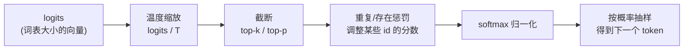

# 采样策略：temperature 与 top-p 怎么选

## 前言

**C：** 模型每一步输出的不是一个词，而是**整个词表上的概率分布**。采样策略决定了"从这张分布里怎么挑一个字"。`temperature / top-k / top-p / repetition_penalty` 这几个旋钮，调对了是锦上添花，调错了输出立刻变脑瘫。

<!-- more -->

## 从 logits 到 token 的全流程



四个参数对应四个阶段，调它们其实是**在改这张分布的形状**。

## temperature：分布的"锐度"

`softmax(logits / T)`：

- `T → 0`：分布尖锐到接近 one-hot，每次几乎都选最大概率的那个 token（**贪心**）。
- `T = 1`：原始分布。
- `T → ∞`：分布趋于均匀，输出近似**随机乱码**。

经验：

| T 范围 | 适用场景 |
| -- | -- |
| 0 ~ 0.2 | 代码、抽取、分类、结构化输出 |
| 0.3 ~ 0.7 | 常规问答、摘要、改写 |
| 0.7 ~ 1.0 | 创意写作、头脑风暴 |
| > 1.0 | 非常规玩法，容易胡说 |

## top-k 与 top-p：截断尾巴

直接按分布抽样容易被**长尾**带跑（偶尔抽到一个极不合理的 token）。所以常在 softmax 前做截断：

- **top-k**：只保留概率最高的 k 个 token，其他置 `-inf`。
- **top-p (nucleus)**：按概率从大到小累加，累计到 `p` 为止的那部分保留，剩下全扔掉。

top-p 是自适应的——分布很尖时保留少，分布很平时保留多，所以更常用。常见组合：

```text
temperature = 0.7
top_p       = 0.9
top_k       = 0   # 关掉，只用 top-p
```

## repetition / presence / frequency penalty

这三个是"防复读机"：

| 参数 | 作用 | 常见默认 |
| -- | -- | -- |
| `repetition_penalty` | 对已出现过的 token 乘以一个 >1 的系数来**压低**其 logit | 1.0~1.2 |
| `presence_penalty` | 只要出现过就扣一个定值，鼓励引入新话题 | 0 |
| `frequency_penalty` | 出现越多扣得越多，抑制明显复读 | 0 |

代码/翻译任务里这些参数**建议保持默认 0 / 1.0**，强行开会破坏结构化输出（变量名都不敢复用了）。

## `temperature=0` 为什么仍不确定

理论上 `T=0` + 贪心 = 确定性。实际 API 却不一定，原因：

- 多卡推理时不同请求落到不同 GPU，**浮点累加顺序不同**，最大 logit 可能并列出现。
- 部分平台会在 `T=0` 下内部退化为极小温度（如 `1e-6`），仍是采样而非 argmax。
- 平台会升级模型权重、升级 kernel，**相同 prompt 在不同日期结果不同**。

想要尽量稳定：`temperature=0`、`top_p=1`、固定 `seed`（如果平台支持），并且**把"输出会变"写进你的测试预期**。

## 实战 cheat sheet

| 任务 | temperature | top_p | 备注 |
| -- | -- | -- | -- |
| 单元测试生成 / 代码补全 | 0 ~ 0.2 | 1.0 | 要稳，要可回放 |
| JSON / 结构化抽取 | 0 | 1.0 | 配合 JSON mode / function calling |
| 普通对话 / 客服 | 0.3 ~ 0.6 | 0.9 | 略有人味又不飘 |
| 文案、起名、广告 | 0.7 ~ 0.9 | 0.9 ~ 0.95 | 多样性优先 |
| 头脑风暴 / 多候选 | 0.8 ~ 1.0 | 0.95 | 同时把 `n` 调大，一次要多个 |

## 几个常见误区

- **"温度越高越聪明"**：相反，高温只是更发散，推理任务反而常见 0.0~0.3。
- **同时开 top-k 和 top-p**：没必要，两个叠加行为反直觉，选一个即可（通常选 top-p）。
- **把 penalty 当作防幻觉手段**：它解决的是"重复"，不是"瞎编"。幻觉问题靠检索+约束，见下一篇。
- **不 review 就上生产**：同一组参数，不同模型版本表现可能差很多，换模型时要**重评一遍**。

## 小结

- 采样 = 按分布抽样，旋钮就是**改分布形状**。
- 确定性任务用低温 + top-p=1；创造性任务用中高温 + top-p=0.9 附近。
- `temperature=0` 不等于完全复现，别把它当哈希用。
- 把参数连同 prompt、模型版本一起记录，才有办法复盘输出差异。

::: tip 延伸阅读

- 论文：*The Curious Case of Neural Text Degeneration*（nucleus sampling）
- OpenAI / Anthropic API 文档中 sampling 参数章节
- 下一篇：`05-为什么会幻觉：从训练到推理的解释`

:::
