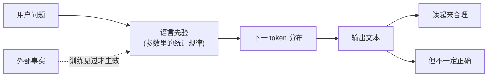
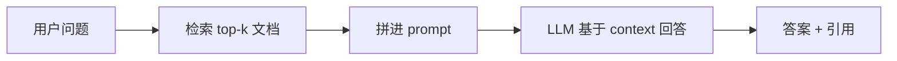

# 为什么会幻觉：从训练到推理的解释

## 前言

**C：** "幻觉"不是 bug，是**语言模型目标函数的自然推论**。理解了它的来源，你就不会期待"把温度调低"能根治这件事，也就能在合适的地方选对缓解手段。这篇是本子目录的收尾，给下一步的提示工程、RAG、Agent 做个过渡。

<!-- more -->

## 本质：下一个 token 最大似然 ≠ 事实正确

LLM 训练目标只有一个：**给定前文，预测下一个 token 的概率分布**，让训练语料里的真实序列尽量高概率。它优化的是"像不像人写的"，不是"对不对"。

所以当你问：

> "《XX 小说》第 3 章的第一句是什么？"

模型做的不是**查资料**，而是**生成一个读起来最像那句话的字符串**。如果训练集里没看过这本书，它仍然会按语言先验写出一段看起来合理、实则胡编的话——这就是典型幻觉。

## 常见来源

| 来源 | 解释 | 典型表现 |
| -- | -- | -- |
| 训练数据噪声 | 爬虫语料含矛盾、段子、错答 | 引经据典但"典"是错的 |
| 长尾知识 | 见得少，参数里压缩损失大 | 冷门人名、论文年份、API 签名 |
| 压缩损失 | 几十亿参数压海量事实，必有丢失 | 相似实体张冠李戴 |
| 过度泛化 | 模型太会"举一反三"，对着不该反三的反了 | 造 API、造引用、造法条 |
| 提示引导 | 用户问题预设了不存在的事实 | 模型配合演出，把"假设"讲成"事实" |
| RLHF 副作用 | 奖励"自信、流畅"的表达 | 不确定也不肯说"不知道" |

## 为什么低温解决不了

采样参数只影响分布的**形状**，不影响**含义**。如果模型对错误答案本身给了高 logit，调低温度只是让它**更坚定地输出错的**——不仅不救，反而更难发现。

换句话说：幻觉不是采样问题，是**内容生成问题**。

## 缓解手段速览

这些在后续分册会逐一展开，这里只给直觉：

### 1. 提示约束（Prompt Engineering）

- 明确告诉模型"**不知道就说不知道，不要编**"。
- 要求**引用来源**或**给置信度**，输出结构化：`{answer, source, confidence}`。
- 少量示例（few-shot）里演示"正确的拒答"。

效果：对简单场景有效，对长尾知识依然救不了。

### 2. 外部检索（RAG）

把知识**放到 prompt 里**，模型只负责"根据提供的片段回答"，不鼓励它靠记忆：

- 检索质量决定上限；向量 + 关键词混合检索通常优于单一。
- 必须在提示里强调"**只基于提供的材料回答**"，否则模型还是会越界。

### 3. 工具调用（Function Calling / MCP）

把"查事实"这件事**外包给工具**：数据库、搜索引擎、计算器、内部 API。模型只负责决定"该调什么、参数是什么"，真答案从工具返回。

这是当前最稳定的降幻觉方式，代价是架构更复杂，工具本身要可靠。

### 4. 自一致性 / 多轮校验

- **Self-Consistency**：同一问题跑 n 次，多数投票。
- **Verifier / Critic**：让另一个模型（或同一个模型换个 prompt）去**审查**第一遍的答案。
- **Chain-of-Verification**：先出草稿 → 列出可验证点 → 逐点核对 → 产出终稿。

贵，但在对错判罚很重的场景（医疗、法律、金融）值回票价。

## 什么时候必须接受幻觉

不是所有任务都需要"事实正确"：

- **头脑风暴 / 起名 / 文案**：发散才是目的，幻觉是特性。
- **写代码脚手架**：API 即便"编"出来，跑一下就暴露，迭代成本低。
- **改写 / 翻译 / 摘要**：输入里有事实，输出只要"忠于输入"而非"忠于世界"。

对应地，**事实性高风险**任务——医疗建议、法律结论、财务数字、引用文献——必须走 RAG / 工具路线，并做事后校验。

## 本子目录收尾

看到这里，你手上已经有五块拼图：

1. **Tokenizer**：文本怎么变 id
2. **注意力**：模型怎么理解上下文
3. **上下文窗口 & KV Cache**：记忆的容量和成本
4. **采样**：从分布里挑字的旋钮
5. **幻觉**：语言模型的能力边界

接下来的自然延伸：

- `提示工程` 子目录：怎么用语言把任务讲清楚，避开常见陷阱。
- `RAG` 子目录：检索-重排-生成的最小闭环，和工业化所需的各种补丁。
- `智能体工具` 分册：进一步把模型嵌进工具链里，做"可执行"的助手。

::: tip 延伸阅读

- 论文：*Survey of Hallucination in Natural Language Generation*
- 论文：*Retrieval-Augmented Generation for Knowledge-Intensive NLP Tasks*
- 博客：Anthropic *On the biology of a large language model*（机理解释向）

:::
