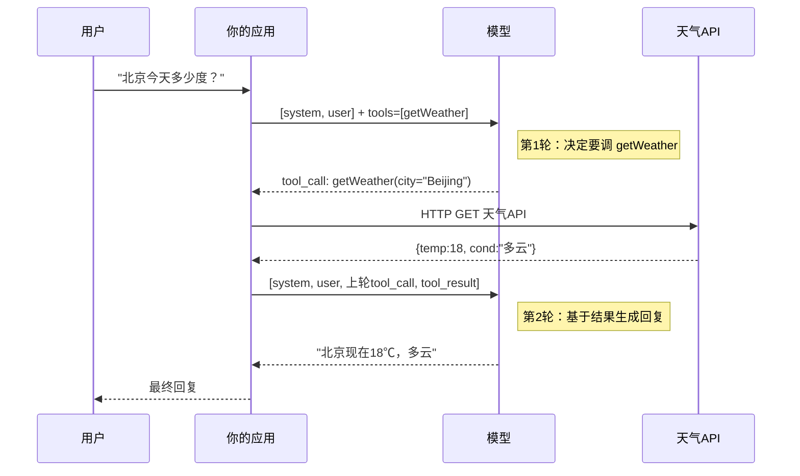
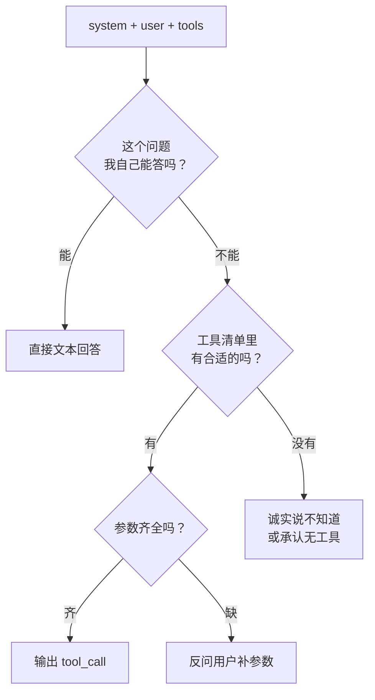
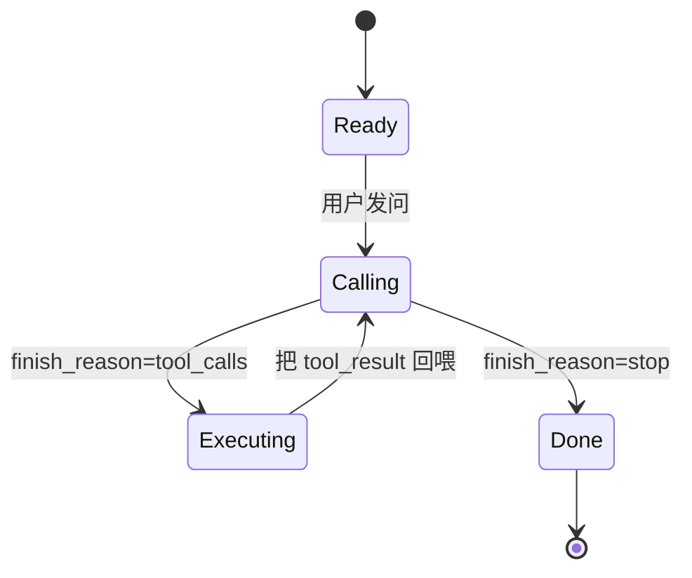

# Function Calling 是什么：从一次请求说起

## 前言

**C：** 这一节的目标只有一个——让你看完之后，**在脑子里完整走一遍"用户问一句话 → 模型调了一次外部函数 → 用户收到答复"的全过程**，而且知道每一步谁在做什么、谁在输出什么。后面几篇全部建立在这个心智模型上。

<!-- more -->

## 一、先破除一个误会

很多人第一次听说 Function Calling 时以为：

> "模型能自己联网"、"模型能执行代码"、"模型能访问我的数据库"。

**全错。** 模型什么都做不了，它只会输出文本。**Function Calling 的全部精髓在于**：

> 让模型**输出一段结构化文本**，这段文本说"**请帮我调用函数 X，参数是 {...}**"——剩下的**执行 / 读库 / 联网**，**全部由你的应用代码完成**。

拿快递做比喻：

- **模型** = 前台接待，**只会登记诉求、写工单**；
- **你的应用** = 真正的派送员，**按工单去仓库取件**；
- **工单格式** = 协议（就是 Function Calling 的 JSON schema）。

前台写错了工单，派送员无法派送；前台没有工单模板，就不知道能派啥。**协议 = 模板 = 共识**。

## 二、最小可用例子：问天气

我们从最朴素的场景开始。用户说：

> "北京今天多少度？"

如果你没给模型 Function Calling 能力，模型只能靠训练数据**猜**（还常常猜错，甚至编个"23℃、晴"出来——典型幻觉）。

**有了 Function Calling，模型会改为说**："请调 `getWeather(city='Beijing')`"。你执行完发现是 18℃，再把结果喂回模型，它就能准确回答"北京现在 18℃，多云"。

### 2.1 两段对话分成四步



看清楚这四个"**谁给谁**"的箭头：

1. **应用 → 模型**（第一次）：带上 user 提问 + 可用工具清单；
2. **模型 → 应用**：回的不是答案，而是"请调某工具"的指令；
3. **应用 → 模型**（第二次）：**把之前所有消息 + 执行结果**再喂一次；
4. **模型 → 应用**：这才是最终回答。

## 三、协议里的四种角色

协议用**消息列表 + 角色**来承载。每一条消息都有一个 `role`：

| role | 谁发的 | 放什么 |
| -- | -- | -- |
| `system` | 你 | 身份设定、约束、工具策略 |
| `user` | 用户 | 用户原话 |
| `assistant` | 模型回的 | **要么文本，要么 tool_call** |
| `tool` | 你 | 某次 tool_call 的**执行结果** |

**一次完整的任务可能涉及多轮、多条 `assistant` + `tool` 交替。** 下面是上面天气例子真实的消息序列，按时间顺序：

```
[0] system:    "你是一个天气助手..."
[1] user:      "北京今天多少度？"
[2] assistant: tool_calls=[{id:"c1", name:"getWeather", args:{city:"Beijing"}}]
[3] tool:      tool_call_id="c1", content='{"temp":18,"cond":"多云"}'
[4] assistant: "北京现在18℃，多云"
```

**第 2 次请求发给模型时，消息列表是 [0, 1, 2, 3] 这 4 条**。你**不能**只喂一条结果——模型需要看到它自己上一轮说了什么，才能把结果接上去。

::: tip 一句话记住
`assistant` 的 tool_call 和 `tool` 的 result 必须**配对出现 + 挂同一个 id**，不然模型会错乱。
:::

## 四、为什么要设计成"两轮"，不能一步到位？

刚接触的人常问：模型为啥不能一步直接告诉我"18℃"？

因为**模型不知道**。它只见过训练时的数据，对"**今天**"是什么日期都没有准确概念。"两轮"的意义是：

1. **第 1 轮**：模型承认自己不知道，**用工具把知识拉进来**；
2. **第 2 轮**：模型基于**真实数据**组织回答。

本质上 Function Calling 是一种**按需检索的扩展机制**——跟 RAG 思想同源，但 RAG 是"**先检索再回答**"，Function Calling 是"**模型自己决定要不要检索，还能决定用哪个工具**"。

## 五、模型做了哪些判断？

在第 1 轮，模型同时要做几件事：



三件事哪件做错都会出问题：

- **能答的硬调工具** → 浪费钱、延迟大；
- **不能答的硬答** → 幻觉；
- **参数缺失还硬调** → schema 校验失败、甚至编参数。

`system` 提示词里的"**工具使用策略**"就是为了把这几个判断掰正。例子：

```text
你是客服助手。凡涉及"订单 / 物流 / 退款"的问题必须通过 getOrder/listShipments 工具取数，不要凭记忆回答；
若用户没给订单号，先反问，不要编造。
```

## 六、第一次看到真实 JSON 时的震撼

让我们把前面那轮"问天气"的**真·请求/响应**贴出来（OpenAI 兼容格式）：

**第 1 次请求体**：

```json
{
  "model": "gpt-4.1",
  "messages": [
    {"role": "system", "content": "你是天气助手"},
    {"role": "user",   "content": "北京今天多少度？"}
  ],
  "tools": [{
    "type": "function",
    "function": {
      "name": "getWeather",
      "description": "获取指定城市的当前天气",
      "parameters": {
        "type": "object",
        "properties": {
          "city": {"type": "string", "description": "城市英文名"}
        },
        "required": ["city"]
      }
    }
  }]
}
```

**第 1 次响应**：

```json
{
  "choices": [{
    "message": {
      "role": "assistant",
      "content": null,
      "tool_calls": [{
        "id": "call_x1",
        "type": "function",
        "function": {
          "name": "getWeather",
          "arguments": "{\"city\":\"Beijing\"}"
        }
      }]
    },
    "finish_reason": "tool_calls"
  }]
}
```

注意三个**新手必踩**的点：

- `content` 是 `null`——**它没说话**，只给了 tool_call；
- `finish_reason` 是 `"tool_calls"` 而不是 `"stop"`——这是你判断"还要继续循环"的信号；
- `arguments` **是字符串**，不是对象，要自己 `JSON.parse`。

**第 2 次请求体**（把第 1 次的 assistant 原样放回来，再加 tool 结果）：

```json
{
  "model": "gpt-4.1",
  "messages": [
    {"role": "system", "content": "你是天气助手"},
    {"role": "user",   "content": "北京今天多少度？"},
    {"role": "assistant", "content": null, "tool_calls": [
      {"id":"call_x1","type":"function",
       "function":{"name":"getWeather","arguments":"{\"city\":\"Beijing\"}"}}
    ]},
    {"role": "tool", "tool_call_id": "call_x1",
     "content": "{\"temp\":18,\"cond\":\"多云\"}"}
  ]
}
```

**第 2 次响应**（这次模型正常出文本）：

```json
{
  "choices": [{
    "message": {"role": "assistant", "content": "北京现在 18℃，多云。"},
    "finish_reason": "stop"
  }]
}
```

`finish_reason: "stop"` = 循环结束，**可以把 content 发给用户了**。

## 七、心里模型总结

到这里你应该能默写出这张"状态机"了：



三句话抓住本质：

1. **Function Calling 是协议，不是能力**——能力始终在应用代码里。
2. **消息列表是一卷胶片**，一轮一轮往后加，不清不截，**模型靠这卷胶片读出当前状态**。
3. **tool_call 和 tool_result 必须成对出现**，以 id 对齐。

## 八、下一步

这一篇刷了最基础的心智。后面的编排：

- **02** 讲三家（OpenAI/Anthropic/Gemini）协议的**字段差异**和迁移注意事项；
- **03** 专攻 Schema 怎么写——这是**模型愿意正确调用**的第一因素；
- **04** 攻调度器：循环、并行、上限、错误回喂；
- **05** 汇总十大常见坑，每个都带错例 vs 好例；
- **06** 讲 Function Calling 与 **MCP** 的关系。

## 小结

- Function Calling = 模型**输出意图**，应用**真正执行**；
- 一次完整任务通常至少**两轮请求**，消息列表必须把 tool_call 和 tool_result **按序带上**；
- `assistant.tool_calls` 和 `tool.tool_call_id` 必须**成对**；
- `finish_reason` 是调度循环的**唯一退出信号**，不看它就会死循环或提前截断。

::: tip 延伸阅读

- 官方文档：[OpenAI Function Calling](https://platform.openai.com/docs/guides/function-calling)
- 同册：`01-大模型基本原理/05-为什么会幻觉`（为什么 Function Calling 能减少幻觉）
- 下一篇：`02-三家协议对比：OpenAI、Anthropic、Gemini`

:::
