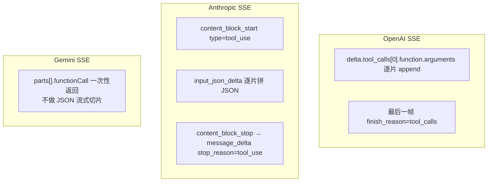

# 三家协议对比：OpenAI、Anthropic、Gemini

## 前言

**C：** 心智上 Function Calling 是同一件事，但三家的**字段名**、**JSON 结构**、**流式事件**都各不相同。换厂商、做代理、做多模型编排的时候，这些差异**每一条都可能让你的代码崩一次**。这一篇把三家拉通对比，并给出迁移与兼容层的写法。

<!-- more -->

## 一、一眼看完的三家对照表

先从高层概念对应起来：

| 概念 | OpenAI | Anthropic | Gemini |
| -- | -- | -- | -- |
| 工具清单字段 | `tools` | `tools` | `tools.functionDeclarations` |
| 单个工具描述 | `{type:"function", function:{...}}` | 扁平对象 | `functionDeclarations` 元素 |
| 入参 schema | `function.parameters` | `input_schema` | `parameters` |
| 模型发出的调用 | `assistant.tool_calls[]` | `content[] type:"tool_use"` | `candidates.content.parts[] functionCall` |
| 调用唯一 id | `tool_calls[].id` | `tool_use_id` | 无显式 id（按顺序/name 对齐）|
| 参数载体 | `arguments`（**字符串**）| `input`（**对象**） | `args`（**对象**）|
| 结果回喂角色 | `role:"tool"` | `role:"user"` + `content type:"tool_result"` | `role:"function"` 或 parts 里 `functionResponse` |
| 结果关联字段 | `tool_call_id` | `tool_use_id` | 按 `name` 对齐 |
| 调用策略字段 | `tool_choice` | `tool_choice` | `tool_config.function_calling_config` |
| 结束信号 | `finish_reason:"tool_calls"` → `"stop"` | `stop_reason:"tool_use"` → `"end_turn"` | `finishReason:"STOP"` + `functionCall` 是否存在 |

**三件要记的差异**：

1. **OpenAI 的 arguments 是字符串**，另外两家是对象；
2. **Anthropic 把 tool 结果塞回 user 消息**的 content 里，不用独立 role；
3. **Gemini 没有独立 id**，靠 `name` 对齐，并发时需要小心。

## 二、请求体并排对比

还是天气例子，城市参数一个。下面三份 JSON**跑出来行为一致**。

### 2.1 OpenAI

```json
{
  "model": "gpt-4.1",
  "messages": [
    {"role": "user", "content": "北京多少度？"}
  ],
  "tools": [{
    "type": "function",
    "function": {
      "name": "getWeather",
      "description": "获取指定城市当前天气",
      "parameters": {
        "type": "object",
        "properties": { "city": {"type":"string"} },
        "required": ["city"]
      }
    }
  }],
  "tool_choice": "auto"
}
```

### 2.2 Anthropic

```json
{
  "model": "claude-sonnet-4-5",
  "max_tokens": 1024,
  "messages": [
    {"role": "user", "content": "北京多少度？"}
  ],
  "tools": [{
    "name": "getWeather",
    "description": "获取指定城市当前天气",
    "input_schema": {
      "type": "object",
      "properties": { "city": {"type":"string"} },
      "required": ["city"]
    }
  }],
  "tool_choice": {"type": "auto"}
}
```

### 2.3 Gemini

```json
{
  "contents": [{
    "role": "user",
    "parts": [{"text": "北京多少度？"}]
  }],
  "tools": [{
    "functionDeclarations": [{
      "name": "getWeather",
      "description": "获取指定城市当前天气",
      "parameters": {
        "type": "object",
        "properties": { "city": {"type":"string"} },
        "required": ["city"]
      }
    }]
  }],
  "toolConfig": {
    "functionCallingConfig": { "mode": "AUTO" }
  }
}
```

::: tip Schema 都是 JSON Schema 子集
三家都支持 `type/properties/required/enum/items/description`。**不支持**的：`$ref`、`allOf`、`anyOf` 在一些场景被忽略，能不用就不用；`format` 多半不校验，写了也只是给模型看。
:::

## 三、响应结构并排对比

### 3.1 OpenAI 返回 tool_call

```json
{
  "choices": [{
    "message": {
      "role": "assistant",
      "content": null,
      "tool_calls": [{
        "id": "call_x1",
        "type": "function",
        "function": {
          "name": "getWeather",
          "arguments": "{\"city\":\"Beijing\"}"
        }
      }]
    },
    "finish_reason": "tool_calls"
  }]
}
```

### 3.2 Anthropic 返回 tool_use

```json
{
  "role": "assistant",
  "stop_reason": "tool_use",
  "content": [
    {"type": "text", "text": "我来查一下。"},
    {"type": "tool_use",
     "id": "toolu_01A2",
     "name": "getWeather",
     "input": {"city": "Beijing"}}
  ]
}
```

注意两点：Anthropic 的 `content` 是**数组**，可能同时有 `text` 和 `tool_use`；`input` **已经是对象**，不用 parse。

### 3.3 Gemini 返回 functionCall

```json
{
  "candidates": [{
    "content": {
      "role": "model",
      "parts": [{
        "functionCall": {
          "name": "getWeather",
          "args": { "city": "Beijing" }
        }
      }]
    },
    "finishReason": "STOP"
  }]
}
```

和 Anthropic 一样是**分 parts 数组**，`args` 也是对象。

## 四、回喂结果并排对比

### 4.1 OpenAI：新增一条 role=tool 消息

```json
[
  {"role":"user","content":"北京多少度？"},
  {"role":"assistant","content":null,"tool_calls":[
    {"id":"call_x1","type":"function",
     "function":{"name":"getWeather","arguments":"{\"city\":\"Beijing\"}"}}
  ]},
  {"role":"tool","tool_call_id":"call_x1",
   "content":"{\"temp\":18,\"cond\":\"多云\"}"}
]
```

### 4.2 Anthropic：塞回 user 消息里

```json
[
  {"role":"user","content":"北京多少度？"},
  {"role":"assistant","content":[
    {"type":"tool_use","id":"toolu_01A2","name":"getWeather",
     "input":{"city":"Beijing"}}
  ]},
  {"role":"user","content":[
    {"type":"tool_result","tool_use_id":"toolu_01A2",
     "content":"{\"temp\":18,\"cond\":\"多云\"}"}
  ]}
]
```

**关键差异**：结果不是独立角色，而是**伪装成下一轮 user 消息里的一个 content 块**。整体还是 user/assistant 交替。

### 4.3 Gemini：role=function（或 tool）

```json
[
  {"role":"user","parts":[{"text":"北京多少度？"}]},
  {"role":"model","parts":[{
    "functionCall":{"name":"getWeather","args":{"city":"Beijing"}}
  }]},
  {"role":"function","parts":[{
    "functionResponse":{
      "name":"getWeather",
      "response":{"temp":18,"cond":"多云"}
    }
  }]}
]
```

**关键差异**：没有 id，**按 `name` 对齐**；并发多调用时，若同名要小心顺序（后面调度章节细讲）。

## 五、流式（streaming）差异

三家都支持流式 tool_calls，但**组装方式完全不同**，换一家要重写解析器。



要点：

- **OpenAI / Anthropic**：`arguments` / `input` 是**一片一片拼**出来的 JSON，必须缓冲到 `stop` 事件才是完整参数；
- **Gemini**：`functionCall` 原子返回，但**整段文本回复**仍是流式；
- **多工具并发**时：OpenAI 用 `tool_calls[idx]` 索引，Anthropic 用 `index`，必须按索引聚合，别按到达顺序。

## 六、`tool_choice` 细节对比

| 策略 | OpenAI | Anthropic | Gemini |
| -- | -- | -- | -- |
| 放任 | `"auto"` | `{"type":"auto"}` | `"mode":"AUTO"` |
| 禁止 | `"none"` | `{"type":"none"}` | `"mode":"NONE"` |
| 必须调一个 | `"required"` | `{"type":"any"}` | `"mode":"ANY"` |
| 强制某个 | `{"type":"function","function":{"name":"X"}}` | `{"type":"tool","name":"X"}` | `"allowedFunctionNames":["X"]` |

**坑**：

- OpenAI 的 `"required"` 跟 Anthropic 的 `"any"` 名字不一样但语义相同；
- Gemini 用 `allowedFunctionNames` **数组**，可以限定子集；
- 强制调用时**模型可能硬编参数**，优先仍是"必要时才用"，非结构化抽取不要乱开。

## 七、迁移 checklist：OpenAI ↔ Anthropic

大多数团队都是"**起步 OpenAI，后来加 Claude**"。一次迁移要做这些事：

- [ ] `tools[i].function.parameters` → `tools[i].input_schema`；包一层或铺平；
- [ ] 响应解析：`tool_calls[]` → 遍历 `content[] where type=="tool_use"`；
- [ ] **`arguments` parse**：OpenAI 是字符串要 parse，Anthropic 是对象直接用；
- [ ] 回喂：别再加 `role=tool` 消息，**改塞进 user 的 tool_result 块**；
- [ ] id 字段：`tool_call_id` → `tool_use_id`；
- [ ] 结束判定：`finish_reason=="tool_calls"` → `stop_reason=="tool_use"`；
- [ ] 流式：换一整套 event 解析；
- [ ] `tool_choice`：对象形式而非枚举字符串；
- [ ] **Anthropic 必须给 `max_tokens`**，OpenAI 不填有默认；
- [ ] 测一遍**含特殊字符 / 中文 / 嵌套对象**的参数。

## 八、写一个最小兼容层

每次迁移都全量改业务太痛，推荐在**业务代码和 API 之间**加一层 adapter。

```python
@dataclass
class UnifiedToolCall:
    id: str
    name: str
    args: dict

def parse_response(provider: str, resp) -> tuple[list[UnifiedToolCall], str | None]:
    """返回 (tool_calls, text) 两件套，业务只认 Unified 结构。"""
    if provider == "openai":
        msg = resp.choices[0].message
        calls = [
            UnifiedToolCall(c.id, c.function.name, json.loads(c.function.arguments))
            for c in (msg.tool_calls or [])
        ]
        return calls, msg.content
    if provider == "anthropic":
        calls, text = [], None
        for b in resp.content:
            if b.type == "tool_use":
                calls.append(UnifiedToolCall(b.id, b.name, b.input))
            elif b.type == "text":
                text = (text or "") + b.text
        return calls, text
    if provider == "gemini":
        calls, text = [], None
        parts = resp.candidates[0].content.parts
        for p in parts:
            if "functionCall" in p:
                fc = p["functionCall"]
                calls.append(UnifiedToolCall(fc["name"], fc["name"], fc.get("args", {})))
            elif "text" in p:
                text = (text or "") + p["text"]
        return calls, text
    raise ValueError(provider)
```

回喂也同理：**业务构造一个中间结构**，adapter 各自转成三家要求的形状。**你的业务代码只应该认 `UnifiedToolCall`**。

## 九、小结

- 心智一致，字段各异；**最容易翻车的三处**：`arguments` 类型、结果回喂方式、流式事件组装。
- 迁移 OpenAI↔Anthropic 比 OpenAI↔Gemini 坑更密集，因为 Anthropic 把结果塞回 user 消息这件事非常反直觉。
- 生产代码**一定要加一层 adapter**，业务只认 `UnifiedToolCall`；换厂商只动 adapter。
- `tool_choice` 名字不一样但语义对得上，写迁移表时把它加进来。

::: tip 延伸阅读

- [OpenAI Function Calling](https://platform.openai.com/docs/guides/function-calling)
- [Anthropic Tool Use](https://docs.anthropic.com/en/docs/agents-and-tools/tool-use)
- [Gemini Function Calling](https://ai.google.dev/gemini-api/docs/function-calling)
- 下一篇：`03-Schema 设计：怎么写出模型愿意正确调用的工具描述`

:::
