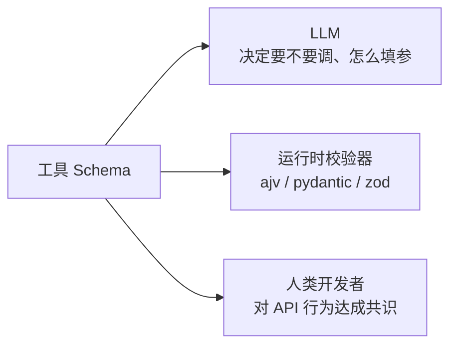
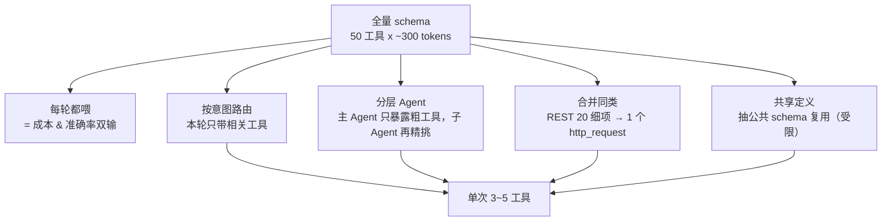

# Schema 设计：怎么写出模型愿意正确调用的工具描述

## 前言

**C：** 生产里 Function Calling 的**准确率**主要不是模型问题，而是**schema 写得好不好**的问题。模型看不到你函数的真实实现，只看那几行 `description` 和 `parameters`——写不清楚，就调错；写不明白，就漏参；写得冲突，就根本不调。这一篇讲怎么把 schema 当"**面向 AI 的 API 文档**"来写。

<!-- more -->

## 一、Schema 的三个受众，写给谁看决定怎么写



三类受众需求不同：

- **LLM** 需要**自然语言指引** + **字段语义**；
- **校验器**需要**严格类型** + **required/enum**；
- **人类**需要**行为边界** + **版本信息**。

**绝大多数 schema 都只满足 2）**——跑代码没问题，但模型经常用错。把 1) 放在第一位，其他两位反而容易顺手达成。

## 二、黄金原则：description 是给模型读的 prompt

`description` 不是"人类看的注释"，它就是**塞进模型上下文的一段 prompt**。每个字段都算钱、都影响决策。

### 2.1 工具级 description 的四件事

一个好的 function description 应该回答：

1. **是什么**：函数的核心功能；
2. **何时用**：什么样的用户意图应该触发；
3. **何时不用**：有没有相邻但不该用的场景；
4. **返回什么**：简要描述返回结构（帮模型规划下一步）。

**差版本**：

```
description: "获取天气"
```

**好版本**：

```
description:
获取**指定城市当前**天气（不含未来预报）。
用于回答"XX 现在多少度 / 天气怎么样 / 会不会下雨"类问题。
**不要用于**"明天 / 下周 / 昨天"等非当前时间的问询——那应该调 getForecast。
返回 {temp:int(摄氏), cond:string(中文天气状况), humidity:int(百分比)}。
```

这一段确实**比函数本身还长**，但模型可能每轮都看到它，**投资回报率极高**。

### 2.2 字段级 description 同样重要

```json
"city": {
  "type": "string",
  "description": "城市名，使用**中文官方名**（如 '北京'、'上海市浦东新区' 的话只取 '上海'）。不要用拼音 / 英文。"
}
```

不写 description，模型常用英文；写清楚，准确率立刻上去。

## 三、类型与约束：让合法输入进得来，非法挡在外

JSON Schema 子集里最常用的就十来个字段，拉表对照一次性记住：

| 需求 | Schema 写法 | 备注 |
| -- | -- | -- |
| 必填 | `"required": ["a","b"]` | 漏填模型会编 |
| 枚举 | `"enum": ["a","b","c"]` | 模型会严格选其一 |
| 范围 | `"minimum":1,"maximum":100` | 部分模型会当参考但不硬卡，校验器要兜 |
| 字符串格式 | `"pattern":"^\\d{11}$"` 或 `"format":"email"` | `format` 不一定执行，`pattern` 更可靠 |
| 最小/最大长度 | `"minLength":1,"maxLength":200` | 写上能抑制模型灌水 |
| 数组元素类型 | `"type":"array","items":{"type":"string"}` | 必写，不然模型可能塞混合类型 |
| 对象嵌套 | `"type":"object","properties":{...}` | 嵌套 ≤ 3 层，深了模型容易乱 |
| 允许为 null | `"type":["string","null"]` | 不如加 enum / default 稳 |
| 默认值 | `"default":"c"` | 部分模型识别，校验器可兜底 |

两条重要经验：

- **能 enum 就绝对不要自由字符串**：模型选枚举的准确率远高于生成字符串；
- **布尔别放数字或字符串**：`{"type":"boolean"}` 比 `"yes"/"no"` 稳得多。

## 四、命名就是 prompt 的一半

字段名和函数名是**自然语言提示**，不要为了代码风格牺牲可读性。

### 4.1 函数名

| 差 | 好 | 理由 |
| -- | -- | -- |
| `do` | `sendEmail` | 动宾结构、意图清晰 |
| `query1` | `searchCustomers` | 别用编号 |
| `get` | `getOrderById` / `listOrders` | get 和 list 区分开 |
| `chk` | `checkInventory` | 别缩写 |
| `update_user_v2` | `updateUser` | 版本别放函数名里 |

命名套路推荐：

- **取数**：`get / list / search`
- **改数**：`create / update / delete / send / cancel`
- **校验**：`check / validate / assertXxx`
- **计算**：`calculate / estimate / score`

### 4.2 参数名

字段名直接影响模型是否填对：

```json
// 差
"x": {"type":"string"}

// 好
"orderId": {"type":"string","description":"订单号，格式 ORD-XXXXXXXX"}
```

另外，**camelCase 还是 snake_case 统一一种**。模型对不一致很敏感——一会儿 `orderId` 一会儿 `order_id`，它偶尔就会自己改回去。

## 五、几种高频工具的 schema 模板

### 5.1 搜索类

```json
{
  "name": "searchDocs",
  "description": "在公司知识库里按关键词搜索文档，返回 top-N 片段。用于回答任何涉及'公司内部 / 项目文档 / 操作手册'的问题。",
  "parameters": {
    "type": "object",
    "properties": {
      "query":   {"type":"string","description":"搜索关键词，中文，2~20 字"},
      "top_k":   {"type":"integer","minimum":1,"maximum":10,"default":5,
                  "description":"返回条数，默认 5"},
      "filters": {
        "type":"object",
        "properties":{
          "project":{"type":"string","description":"项目名，可选"},
          "after":  {"type":"string","description":"ISO8601 日期，只返回之后的"}
        }
      }
    },
    "required": ["query"]
  }
}
```

### 5.2 带副作用的写操作

```json
{
  "name": "sendEmail",
  "description": "发送一封邮件。**危险工具**，调用前须向用户确认收件人与主题。不要用于大规模群发。",
  "parameters": {
    "type":"object",
    "properties":{
      "to":      {"type":"array","items":{"type":"string","format":"email"},
                  "minItems":1,"maxItems":10},
      "subject": {"type":"string","maxLength":100},
      "body":    {"type":"string","maxLength":5000},
      "idempotency_key": {
        "type":"string",
        "description":"幂等键，同一 key 只发一次，格式: <user>-<timestamp>"
      }
    },
    "required": ["to","subject","body","idempotency_key"]
  }
}
```

几个技巧：

- 工具 description 显式标"**危险**"，配合上层调度走 Ask 档；
- `idempotency_key` 做**必填**，实现侧用它去重；
- 收件人数组加 `maxItems` 防群发事故。

### 5.3 计算 / 评分类（倾向 enum）

```json
{
  "name": "ratePriority",
  "description": "给工单排优先级。只根据描述内容判断，不要参考提交时间。",
  "parameters": {
    "type":"object",
    "properties":{
      "ticket_id": {"type":"string"},
      "priority":  {"type":"string","enum":["P0","P1","P2","P3"],
                    "description":"P0=业务中断；P1=严重影响；P2=一般问题；P3=改进建议"},
      "reason":    {"type":"string","description":"一句话解释判定依据"}
    },
    "required": ["ticket_id","priority","reason"]
  }
}
```

**把判断规则写在 enum 的 description 里**，比写在 system prompt 更稳，因为模型在选这一步时会直接"对照着"选。

## 六、抽取式 JSON：Function Calling 当 structured output 用

很多时候我们要的不是"真的调函数"，而是"让模型**吐出指定结构的 JSON**"。做法：

1. 定义一个专用工具 `submitXxx`；
2. 把 `tool_choice` 强制指向它；
3. 实现侧就是把 `arguments` 直接当输出用，**不执行任何副作用**。

例子：抽取简历关键字段：

```json
{
  "name": "submitResumeParse",
  "description": "把简历抽取成结构化字段。必须调用一次，不要用自然语言回答。",
  "parameters": {
    "type":"object",
    "properties":{
      "name":  {"type":"string"},
      "email": {"type":"string","format":"email"},
      "skills":{"type":"array","items":{"type":"string"},"maxItems":20},
      "years_of_exp":{"type":"integer","minimum":0,"maximum":60}
    },
    "required":["name","skills"]
  }
}
```

请求里加：

```json
"tool_choice": {"type":"function","function":{"name":"submitResumeParse"}}
```

模型就一定会把结果塞进这个工具的 `arguments`。**比 JSON mode 稳、比自由文本再 parse 更靠谱**，是生产抽取 SOP。

## 七、schema 太大？几种瘦身手法

50 个工具 × 每工具几百字符，单次请求 schema 部分轻松 10k token。优化：



具体：

- **意图路由**：用一个小模型或规则分类，命中"天气"就只挂天气相关工具；
- **分层 Agent**：主 Agent 工具只有 `query_internal_kb / escalate_to_dbs / escalate_to_ops`，每个再交子 Agent 展开；
- **合并同类**：电商 `getOrder / getShipment / getRefund` 合成 `getOrderRelated(kind)`，参数用 enum 切分；
- **不要**在一次请求里靠 `$ref` 引用公共 schema——很多实现不展开，等于白写。

## 八、版本治理：向后兼容的 3 条规则

schema 对模型是合约，改动等于改 prompt，要当 API 改一样管：

1. **只加不减**：新加字段 + 给 default；老字段保留，标记 `deprecated: true`。
2. **改语义必改名**：`getUser` 语义变了就新开 `getUserV2`，旧的保留到业务切流完毕。
3. **description 变更也要记 changelog**：description 改了模型行为会跟着变，团队内要能追溯。

## 九、自我检查清单

写完一个 schema，对照这 10 条：

- [ ] 函数名是**动宾短语**，一看知道干嘛；
- [ ] description 里有"**何时用 / 何时不用**"；
- [ ] 每个参数都有 description；
- [ ] 能 enum 的全 enum；
- [ ] required 写全，没漏；
- [ ] 字符串参数有 `maxLength` / `pattern` 约束；
- [ ] 数组参数有 `items` 和 `maxItems`；
- [ ] 嵌套 ≤ 3 层；
- [ ] 副作用工具有 `idempotency_key` 等防重字段；
- [ ] 用同领域两个真实用户问法**在真实模型上跑一遍**，tool_call 和参数都对。

最后一条比前九条加起来都重要——**别猜模型会怎么用，去问它**。

## 十、小结

- Schema 是 prompt，不是注释；先写给模型看，再顺带满足校验器和人类。
- **命名**、**枚举**、**required**、**description 写清边界**，是准确率的四大杠杆。
- 抽取式场景用 `tool_choice` 指向一个"**submit 工具**"，把 Function Calling 当 structured output 用。
- schema 体积越大，**选对工具的准确率越低**；先路由再动手。
- 像 API 一样治理版本，description 变更也记 changelog。

::: tip 延伸阅读

- [JSON Schema 官方](https://json-schema.org/)
- [OpenAI Structured Outputs](https://platform.openai.com/docs/guides/structured-outputs)
- 下一篇：`04-调度器设计：循环、并行、错误回喂`

:::
