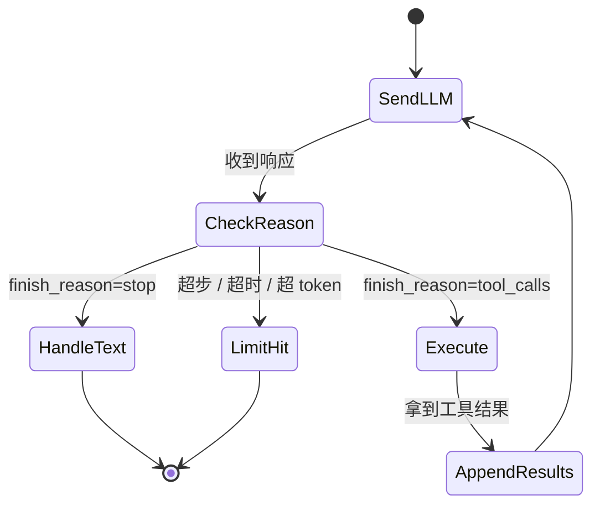
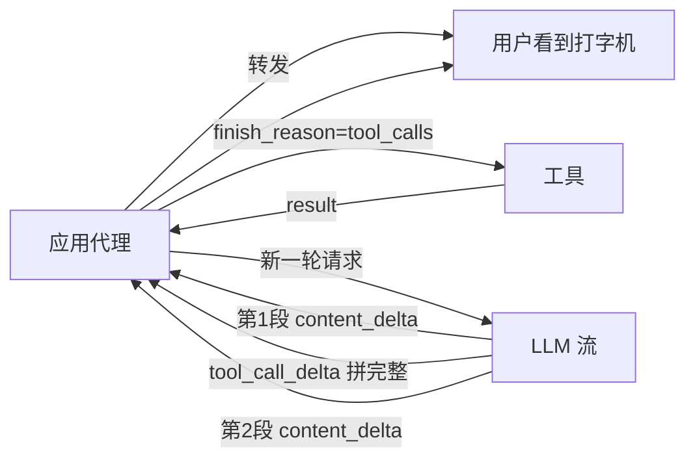

# 调度器设计：循环、并行、错误回喂

## 前言

**C：** 前面几篇讲的是"协议"和"描述"。到这一节我们进入真正写代码的那一层——**调度器（Agent Loop）**。它是一段在模型和工具之间转圈的循环逻辑，长得简单但 edge case 不少。写得好，Agent 稳如老狗；写得糙，线上每天都在炸。

<!-- more -->

## 一、调度器到底在做什么

用一张状态机图先把它钉死：



一轮一轮转，退出条件有三类：

1. 模型不想再调工具（正常收敛）；
2. 触发上限（步数 / 时长 / token）；
3. 应用侧主动打断（用户取消、权限拒绝）。

## 二、最小可用调度器：先把骨架立起来

```python
import json

MAX_STEPS = 16
MAX_WALL_SECONDS = 120

def run_agent(user_input: str, tools: dict, schemas: list) -> str:
    messages = [
        {"role": "system", "content": SYSTEM_PROMPT},
        {"role": "user",   "content": user_input},
    ]
    t_start = time.time()

    for step in range(MAX_STEPS):
        if time.time() - t_start > MAX_WALL_SECONDS:
            return bail_out(messages, reason="timeout")

        resp = llm.chat(model=MODEL, messages=messages, tools=schemas)
        msg  = resp.choices[0].message
        messages.append(msg.to_dict())

        if not msg.tool_calls:
            return msg.content or ""

        results = execute_calls_parallel(tools, msg.tool_calls)
        for call, result in zip(msg.tool_calls, results):
            messages.append({
                "role": "tool",
                "tool_call_id": call.id,
                "content": json.dumps(result, ensure_ascii=False),
            })

    return bail_out(messages, reason="max_steps")
```

**干净**，不花里胡哨。但真要跑生产还差四件事：**并行、超时、错误、上限兜底**。下面一块一块补。

## 三、并行执行：一轮多个 tool_call

模型经常在一轮里**同时声明多个调用**（天气查两个城市、RAG 检索 + 查 user 画像并行）。调度器要能并行执行。

```python
from concurrent.futures import ThreadPoolExecutor, as_completed

def execute_calls_parallel(tools, tool_calls, timeout=30):
    results = [None] * len(tool_calls)
    with ThreadPoolExecutor(max_workers=min(8, len(tool_calls))) as ex:
        future_to_idx = {
            ex.submit(exec_one, tools, c): i
            for i, c in enumerate(tool_calls)
        }
        for fut in as_completed(future_to_idx, timeout=timeout):
            i = future_to_idx[fut]
            try:
                results[i] = fut.result()
            except Exception as e:
                results[i] = {"ok": False, "error": f"exec: {type(e).__name__}: {e}"}
    # 用超时兜底填补未完成
    for i, r in enumerate(results):
        if r is None:
            results[i] = {"ok": False, "error": "timeout"}
    return results
```

三件事要特别注意：

### 3.1 顺序对齐，不是到达顺序

`as_completed` 是**完成顺序**，但我们要按 `tool_calls` 原始顺序写回。上面的代码用 `future_to_idx` 把索引绑死——**不要用 list.append**。

### 3.2 并发度要卡

别开 100 个 worker。一个工具可能打 API，一窝蜂把对方限流打挂。合理范围 `max_workers = min(8, N)`，对高成本 / 限流敏感的工具再单独降级。

### 3.3 独立超时

每个工具**自己**有 `timeout`，外面再套一个**整体超时**兜底。

## 四、错误回喂：把失败变成下一轮的线索

模型看不见 stack trace，工具抛异常你不能任由它穿出去。**必须**把错误翻译成结构化的 `tool_result` 喂回去，让模型做分支处理。

### 4.1 错误分类

```python
def exec_one(tools, call):
    name = call.function.name

    if name not in tools:
        return {"ok": False, "error_type": "unknown_tool",
                "error": f"unknown tool: {name}",
                "hint": "check tool list"}
    try:
        args = json.loads(call.function.arguments)
    except json.JSONDecodeError as e:
        return {"ok": False, "error_type": "bad_json",
                "error": f"arguments is not valid JSON: {e}",
                "hint": "resend with valid JSON arguments"}

    try:
        jsonschema.validate(args, tools[name].schema)
    except jsonschema.ValidationError as e:
        return {"ok": False, "error_type": "schema",
                "error": e.message,
                "path": list(e.absolute_path),
                "hint": "fix the invalid field and retry"}

    try:
        data = tools[name].fn(**args)
        return {"ok": True, "data": data}
    except RetryableError as e:
        return {"ok": False, "error_type": "retryable",
                "error": str(e), "retry_after": e.retry_after}
    except PermissionDenied as e:
        return {"ok": False, "error_type": "forbidden",
                "error": str(e),
                "hint": "ask the user to authenticate or skip this step"}
    except Exception as e:
        return {"ok": False, "error_type": "runtime",
                "error": f"{type(e).__name__}: {e}"}
```

三条**非常实用**的经验：

1. **error_type 标准化**：让模型能按类别反应（`schema` → 改参数重试，`forbidden` → 反问用户，`unknown_tool` → 放弃换工具）；
2. **hint 一句话建议下一步**：这是教模型"**遇到这种情况该怎么干**"的 inline coaching；
3. **结构化不要文字**：`{"ok":false,"error":"..."}` 胜过 `"错误：..."`——模型对 JSON 里字段的遵从度远高于散文。

### 4.2 错误回喂循环的收敛问题

模型拿到 error 有时会**一直试同一个错参数**。兜底：

```python
RETRY_CAP_PER_CALL = 3

def run_agent(...):
    retry_counter = {}
    for step in ...:
        ...
        for call in msg.tool_calls:
            key = (call.function.name, call.function.arguments)
            retry_counter[key] = retry_counter.get(key, 0) + 1
            if retry_counter[key] > RETRY_CAP_PER_CALL:
                # 回喂一个"换路子"的提示
                results.append({"ok": False, "error_type": "abort",
                                "error": "too many retries with same args",
                                "hint": "change approach or ask user"})
                continue
```

## 五、步数 / token / 费用三个上限

步数只是一种上限，生产里**必须**至少有三个开关：

```python
class Budget:
    def __init__(self, max_steps=16, max_tokens=50_000, max_cost_usd=1.0):
        self.max_steps = max_steps
        self.max_tokens = max_tokens
        self.max_cost_usd = max_cost_usd
        self.steps = self.tokens = 0
        self.cost_usd = 0.0

    def charge(self, usage):
        self.steps += 1
        self.tokens += usage.total_tokens
        self.cost_usd += estimate_cost(usage)

    def exhausted(self):
        if self.steps >= self.max_steps:   return "max_steps"
        if self.tokens >= self.max_tokens: return "max_tokens"
        if self.cost_usd >= self.max_cost_usd: return "max_cost"
        return None
```

为什么三件都要？

- **步数**：防死循环；
- **token**：单次聊崩上下文；
- **费用**：防夜里被刷爆（最严重的线上事故多半是费用失控）。

触顶时**不要默默返回**——**返回一个带"我为什么停下"的消息**，方便观测。

## 六、Streaming 下的调度

如果你返回给用户的是流式 UI（打字机），调度会有点不一样。



要点：

- **边流边缓冲 tool_call**：OpenAI 流式 `arguments` 是一段一段来，必须缓到 `stop` 事件才能 parse；
- **content 和 tool_call 可能交错**（Claude 尤其明显）：text 直接打字，tool_call 缓冲，**别把缓冲写到前端**；
- **用户取消**：要把中间的 partial 消息也**正确地追加进 messages**，不然下一轮历史就残了；
- 用户长时间等候时，中间**插入"正在查 XX"的占位文本**是好 UX（从 assistant 的 tool_use 前置 text 里就能提取）。

## 七、可观测性：这一段决定你能不能调得动 Agent

Agent 调不调得动，和观测做得好不好**直接相关**。至少记录这些：

| 字段 | 为什么要 |
| -- | -- |
| `trace_id` | 串联一次用户对话里的所有请求 |
| `step` | 循环第几步 |
| `model`, `tool_choice` | 同一 trace 内可能切换 |
| `input_tokens / output_tokens / cached_tokens` | 费用归因 |
| `tool_name, tool_call_id, args_hash, duration_ms, ok, error_type` | 工具维度 SLI |
| `retry_count` | 发现循环打转 |
| `finish_reason` / `stop_reason` | 循环退出原因 |
| `budget_exhaust_reason` | 哪个上限撞到了 |

进一步可做 **Langfuse / OpenTelemetry** 这种 AI 专用追踪，**每次 tool_call 是一个 span**——Timeline 一眼看清"谁慢、谁错、谁重试"。

## 八、常见五种调度器模式

除最小骨架，还有几种工程里常见的变种：

### 8.1 Router-then-Tool

主 Agent 只用一个"分流"工具 `route(intent)`，模型先输出意图，再去对应子 Agent。用于**工具数量爆炸**的场景。

### 8.2 Plan-then-Act

先让模型**只做规划**，输出一个 JSON 任务列表；然后**用另一个 session**按任务列表执行。规划和执行分离，**规划 session 不会被执行噪声污染**。

### 8.3 Parallel Fan-out

"**给我在 GitHub/GitLab/Gitee 都搜一遍**"。调度器识别可并行的独立子任务，**一把 Promise.all**。这种适合**只读** + **互不依赖**的任务。

### 8.4 Reflexion（自反省）

每个 tool_result 出来后，额外加一轮让模型"**检查刚才的结果是否达成意图**"；不满意就让它再调一次。对关键任务有用，但**每轮多一次 LLM 开销**。

### 8.5 Human-in-the-loop

副作用工具调用前**暂停调度器**，前端弹确认；拒绝就把"user rejected"当错误回喂，接受就继续。**副作用工具的默认档**。

```mermaid
flowchart TB
  call["工具调用"]
  danger{"dangerous?"}
  ask["等用户确认"]
  run["直接执行"]
  res["tool_result"]
  call --> danger
  danger -->|是| ask -->|同意| run
  ask -->|拒绝| reject["tool_result: user_rejected"]
  danger -->|否| run
  run --> res
```

## 九、把它封装成可复用的 Agent

等你这些都搭好，一个比较成熟的 Agent 签名大致长这样：

```python
class Agent:
    def __init__(self, *, model, tools: list[Tool],
                 system: str,
                 budget: Budget = Budget(),
                 on_tool_start=None, on_tool_end=None,
                 confirm=None,  # (call) -> bool/async
                 tracer=None):
        ...

    def run(self, user_input: str, *, extra_context=None) -> str:
        ...

    def stream(self, user_input: str):
        # yields events: text / tool_start / tool_end / done
        ...
```

它的调用方式**不应该比 `openai.chat.completions.create` 复杂太多**——复杂度全部藏在实现里，业务代码只关心"喂问题 / 拿答复 / 订事件"。

## 十、小结

- 调度器 = 循环 + 并行执行 + 错误回喂 + 三重上限。
- **并行对齐按索引**；**错误一定结构化**；**上限至少步数/token/费用三件**。
- Streaming 下要同时处理**text 流式转发**与 **tool_call 缓冲**；用户取消要**保证 messages 不残**。
- 可观测性是 Agent 工程的命脉，**每一步一个 span**，事后才能追问"为什么它这么做"。
- 复杂场景（router、plan-then-act、fan-out、reflexion、HITL）不是你一上来就要写，**遇到了再加层**。

::: tip 延伸阅读

- [OpenAI Agents SDK](https://github.com/openai/openai-agents-python)
- [LangGraph 调度模型](https://langchain-ai.github.io/langgraph/)
- [Anthropic Building Effective Agents](https://www.anthropic.com/engineering/building-effective-agents)
- 下一篇：`05-十大常见坑与最佳实践`

:::
