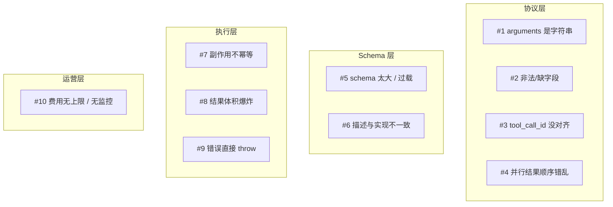
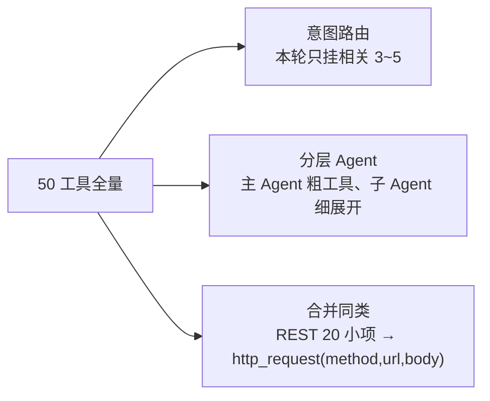
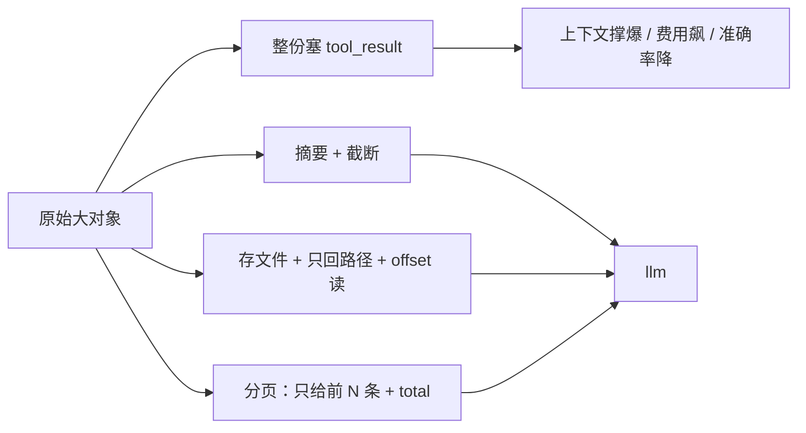
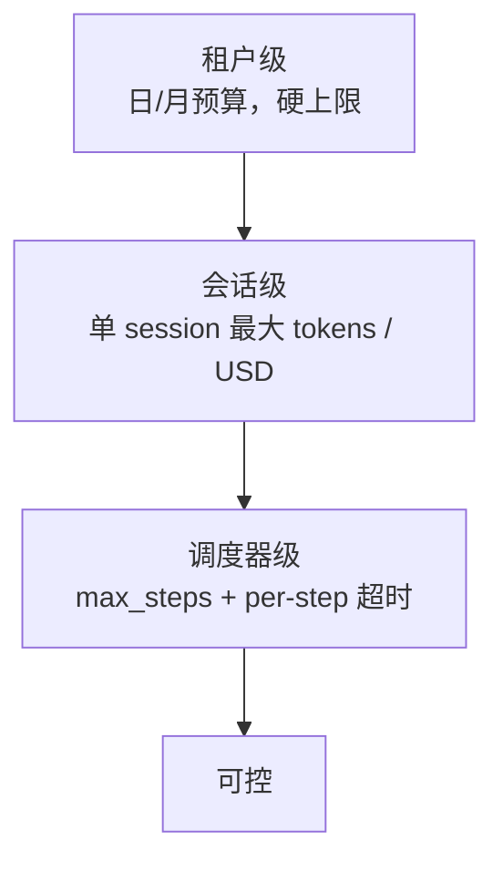

# 十大常见坑与最佳实践

## 前言

**C：** 这一篇全是**踩过的坑**。每一个都会给错例 / 正确例 / 为什么。按优先级排序，越靠前的坑出现频率越高、影响越大——建议先把前 5 个排查完再往下看。

<!-- more -->

## 全景图：十大坑在哪一层



## 坑 1：`arguments` 是字符串，不是对象

**只发生在 OpenAI 兼容 API。** 这是最常见、一天被踩十次的坑。

```python
# ❌
args = call.function.arguments
city = args["city"]           # TypeError: string indices must be integers

# ✅
args = json.loads(call.function.arguments or "{}")
city = args.get("city")
```

**顺带防御**：

- 空字符串 / None 也要兜底（模型偶尔会给 `""`）；
- parse 失败**不要让它穿出去**——按坑 9 的姿势回喂 `{"ok":false,"error_type":"bad_json"}`。

## 坑 2：模型给出非法 JSON / 缺字段 / 编造函数名

即使给了 schema，模型依然会：

- 加多的逗号 / 注释；
- 把 `true` 写成 `"true"`；
- 必填字段漏了；
- 调了个**你没声明**的 `getCurrentTime` 之类的工具。

**处理**：

```python
if name not in tool_registry:
    return {"ok": False, "error_type":"unknown_tool",
            "error": f"'{name}' is not in the tool list",
            "hint": "use one of: " + ", ".join(tool_registry.keys())}
```

**模型带着 `hint` 回来**通常会改对。三次仍然不对，**abort 这一分支**（参见坑 9）。

## 坑 3：回喂忘记挂 `tool_call_id`

```python
# ❌
messages.append({"role":"tool","content": json.dumps(result)})

# ✅
messages.append({
    "role": "tool",
    "tool_call_id": call.id,        # 必须
    "content": json.dumps(result),
})
```

Anthropic 对应 `tool_use_id`。漏了会发生两件事之一：**请求直接被 API 拒绝**；**或者模型接收到"一个没人要的结果"**，直接忽略，让循环失败。

Gemini 没有显式 id，用 `name` 对齐——**多调用同名工具并发时，顺序别打乱**，否则也会 mismatch。

## 坑 4：并行执行后，结果顺序错乱

```python
# ❌：按完成顺序 append
for fut in as_completed(futures):
    results.append(fut.result())      # 顺序不对！

# ✅：按索引写回
for fut in as_completed(future_to_idx):
    i = future_to_idx[fut]
    results[i] = fut.result()
```

为什么影响大？因为 `tool_calls[i]` 的 `id` 是和原始顺序对应的，顺序错乱后每条结果挂到了**错 id** 上——**行为完全不一致、非常难查**。

## 坑 5：Schema 太大 / 工具过载

50 个工具每个 200+ tokens，**每次请求**都把全量 schema 塞进上下文，单次轻松 10k+ tokens。结果：

- **成本翻番**（schema 部分全算在 input_tokens）；
- **准确率下降**（模型在长清单里更容易选错）；
- **上下文提前爆**。

### 三种收手法



**额外一条**：**频繁重复的系统提示 + 工具 schema** 很适合走 **prompt cache**。OpenAI / Anthropic 都支持缓存首段 system+tools，成本降到 1/10（前提是 **schema 顺序和文本稳定**，每次请求一字不差）。

## 坑 6：description 和实现不一致

```
description: "返回最近 5 条订单"
实际：       # 改过代码之后返回了 10 条
```

模型根据 description 以为只 5 条，就不追问"还要更多吗"——**行为发散你完全看不到**。

规则：**schema 是合约**，实现改了 description 必须同步改，CI 里应该挡住 diff。几种维护手法：

- **代码即 schema**：pydantic / zod / dataclass 描述参数，反射生成 schema——改代码的时候 schema 自动跟着改；
- **description 审查进 code review**：谁改行为谁改 description；
- **有条件的自动测试**：用评测集跑一次常见 query，断言 tool_call 的参数 / 顺序符合预期。

## 坑 7：副作用工具没做幂等

模型 + 网络 + 用户，三方都可能让同一个调用**触发两次**：

- **模型**自己重试（`retryable` error 回喂后还选这个工具）；
- **网络**：你超时重试一次，但实际上第一次到了；
- **用户**：刷页面又点一次。

**不幂等的 `sendEmail` / `createOrder` / `chargeCard`**，就是线上事故。

### 正确姿势

```json
"idempotency_key": {
  "type":"string",
  "description":"幂等键：同一 key 只生效一次，推荐 <userId>-<actionId>-<yyyymmddhhmm>"
}
```

实现侧用 Redis / DB 做去重：

```python
def send_email(to, subject, body, idempotency_key):
    if redis.set(f"idem:{idempotency_key}", "1", nx=True, ex=3600) is None:
        return {"ok": True, "dedup": True, "msg": "already sent"}
    real_send(to, subject, body)
```

**只读工具不用幂等**，重点卡写入 / 发送 / 扣款。

## 坑 8：tool_result 体积爆炸

返回一整个表（5k 行）、一整份 PDF 原文、一个 300KB 的 JSON——下一轮上下文直接爆。



**一些经验值**：

- 文本类回复**不超过 2~4k tokens**；
- 列表类**最多 20 条**，要更多让模型自己调 `list(offset, limit)`；
- 超大文件**存盘**，回路径 + 摘要 + `read_file(path, offset, limit)` 这种读取工具。

## 坑 9：错误直接 throw，或把异常栈塞进 content

```python
# ❌
try:
    data = call_api(...)
except Exception as e:
    messages.append({"role":"tool","content": f"错误：{traceback.format_exc()}"})
```

**两件坏事**：

1. 几百行 stack trace 占掉大量 tokens；
2. 模型看着乱七八糟的栈，经常**没法做出正确决策**。

```python
# ✅
return {"ok": False, "error_type": "runtime", "error": "db connection refused",
        "hint": "suggest ask user to retry in 1 minute"}
```

**关键字段**：

- `ok`：布尔，模型判断最简单；
- `error_type`：枚举（`schema / unknown_tool / forbidden / retryable / runtime / abort`）；
- `error`：一句话人话；
- `hint`：**告诉模型下一步怎么办**，这是提升恢复能力的杀手锏；
- 需要时加 `retry_after` / `path` / `field`。

## 坑 10：费用无上限 / 无监控

线上 Agent 最**致命**的事故永远是费用——**不是错，是太贵**。常见翻车：

- 死循环跑了一晚上，$3000 出去；
- 用户发了个 1MB 的文件，被原样塞进 context，一次请求 $80；
- 海外代理被滥用，接口跑了半小时 $5000。

### 三层防线



监控至少报这四项：

- **per-session cost**（USD）超阈值告警；
- **retry_count** 同一参数 ≥ 3 次告警（打转）；
- **schema tokens / real content tokens 占比**异常（> 50% 基本就该做 slim）；
- **p99 总步数**（持续涨可能是工具不稳定）。

## 加餐：**高级 + 容易忽略的 5 条**

这些不在 Top 10，但踩上一次就会印象深刻。

### A. system prompt 里**不要重复罗列工具**

system 已经写了"**根据以下工具清单…**"，然后把 schema 再贴一遍——**双倍 tokens、而且可能跟 `tools` 参数不一致**，直接删。

### B. 不要把**业务 Enum 的**中文标签**塞进 enum 值**

```json
// ❌
"priority": {"enum":["P0 业务中断","P1 严重影响","P2 一般问题"]}
```

枚举值只放机器值 `P0/P1/P2`，解释放进 `description`。否则模型**经常变形**写成"P0业务中断"或"P0 - 业务中断"。

### C. 时间 / 时区 / 日期**显式传**

工具如果依赖当前时间，**不要让模型推理**，直接：

```python
system_prompt += f"\n当前时间: {now_iso()} Asia/Shanghai"
```

这样 `getForecast("tomorrow")` 才能被正确解成第二天。

### D. 大模型很**难学会"两步"**

"先查订单再取消" 这种需要**串联**的任务，很多中小型号容易只调一步就急着回答。对策：

- system 里加"**完成目标前不要停止调用工具**"；
- 必要时 `tool_choice:"required"` 逼它再调一次；
- 评测集里覆盖这种多步用例。

### E. 流式里**别过早 emit 出错的 tool_call 片段**

```
"args":"{\"city\":\"Bei"        # 流式片段，JSON 还没闭合
```

这时候就显示 "getWeather({city:'Bei'})" 给用户看，等整段拼完你会发现是 `Beijing`——UI 来回跳。**缓冲到 `stop` 再 emit**。

## 小结：一张 checklist 直接贴到 PR 模板里

- [ ] `arguments` parse 有兜底 + error_type
- [ ] 工具名不认识的走 `unknown_tool` 带 `hint`
- [ ] 每条 `tool` 消息都挂了 `tool_call_id` / `tool_use_id`
- [ ] 并行结果按**索引**对齐写回，不按到达顺序
- [ ] 当前 session 动态工具数 ≤ 10，schema tokens 占比 ≤ 30%
- [ ] description 与实现一致，写进 CI 规则
- [ ] 副作用工具必填 `idempotency_key` + 服务端去重
- [ ] tool_result 有大小上限（tokens 或字节），大内容外存
- [ ] 错误结构化 `{ok,error_type,error,hint}`，不 throw 穿透
- [ ] 租户/会话/调度器三层预算，日志有 cost/retry 指标

把这十条过一遍，生产 Function Calling 的"**不稳、贵、偶发炸**"问题大概消掉 80%。

::: tip 延伸阅读

- [Anthropic: Building Effective Agents](https://www.anthropic.com/engineering/building-effective-agents)
- [OpenAI Prompt Caching](https://platform.openai.com/docs/guides/prompt-caching)
- 下一篇：`06-Function Calling 与 MCP：边界与分工`

:::
