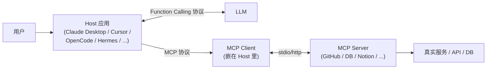
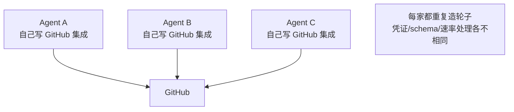
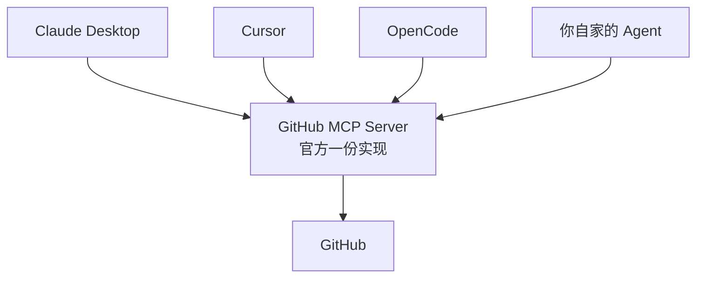
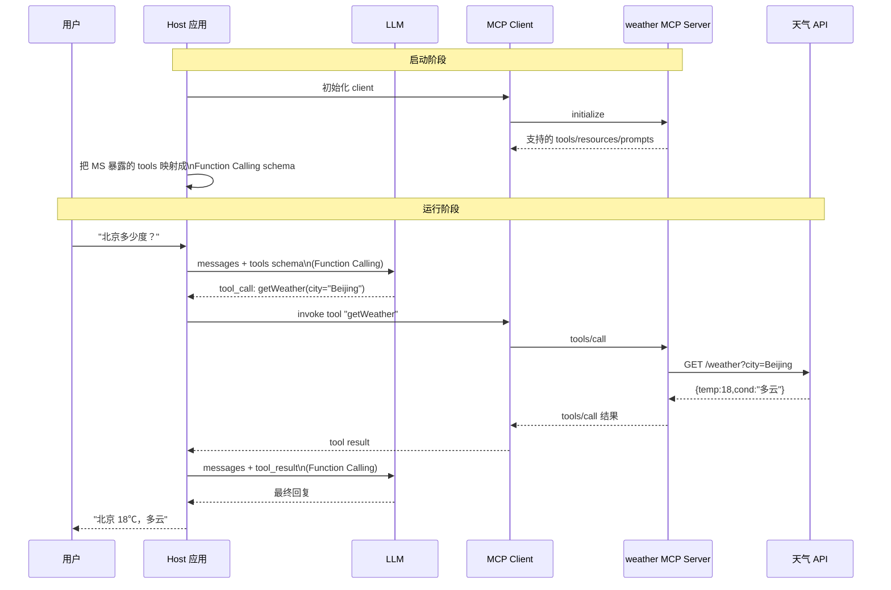
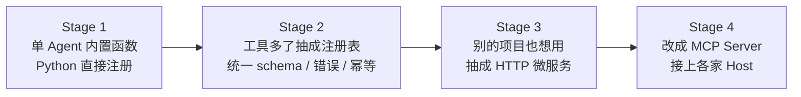
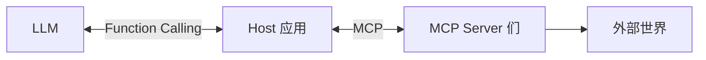

# Function Calling 与 MCP：边界与分工

## 前言

**C：** 这两个词经常被一起提，一起用，但**不是一件事**。简单一句先定性：

> **Function Calling** 是**模型 ↔ 应用**之间的约定；**MCP** 是**应用 ↔ 外部工具提供方**之间的约定。

理解这条边界之后，你才能解释清楚：为什么"接个 GitHub MCP"比"加一堆 Function"省事、MCP server 到底替你做了什么、自己要不要写 MCP。

<!-- more -->

## 一、先把**整个请求链**画出来

抛开 Function Calling 和 MCP 的名字，**真正**发生的事是这样：



**两条协议 + 两个层次**：

- 上半段（模型 ↔ 应用）= **Function Calling**
- 下半段（应用 ↔ 工具提供方）= **MCP**

两条协议**互相独立**：

- 没有 MCP 也能 Function Calling（直接 Python 函数就完事）；
- 没有 Function Calling 也能 MCP（老的 RPC、script 调用，但接到 LLM 就要绕一下）。

它们的"自然搭档"关系是：**MCP 负责把外部工具变成"标准化货架"，Function Calling 负责把货架喂给模型**。

## 二、MCP 想解决的问题

在 MCP 出现之前，Agent 接工具的世界是这样的：



每个 Host（Cursor、Claude Desktop、OpenCode、你自家的 Agent）都要**重新实现同一组集成**。协议不统一、权限不一致、升级各家自己管，最后：**能力靠 Host 堆，谁人多谁生态好**。

MCP 把它翻过来：



- **工具提供方**（GitHub / Notion / Sentry / Postgres / 你的内部系统）各出一份 MCP Server；
- **Host 应用**只需实现一次 MCP Client，就能用**所有**符合协议的 Server；
- 用户 / 团队**一套授权、一套速率、一套审计**全跑在 MCP 协议上。

一句话：**把工具生态从 M×N 降到 M+N**。

## 三、一次真实调用在两条协议里都经历了什么

还是问天气，只是这回用 MCP。假设有一个 `weather-mcp-server`：



对模型来说：**和原生 Function Calling 完全没有区别**。差别全在"**Host 如何把 MCP 的工具目录翻译成 Function Calling 的 schema，再把 tool_call 转回 MCP 调用**"。

## 四、MCP 比 Function Calling 多了什么

Function Calling 只关心"一次调用"。MCP 在它之外包了一整套**工程规范**。

| 能力 | Function Calling | MCP |
| -- | -- | -- |
| 工具调用 | ✅ | ✅（包裹一层） |
| 工具**发现**（list） | ❌ 你自己列 | ✅ `tools/list` |
| 工具**版本 / 变更通知** | ❌ | ✅ `notifications/tools/list_changed` |
| **Resources**（URL 化的只读上下文） | ❌ | ✅ `resources/list`、`resources/read` |
| **Prompts**（预置提示模板） | ❌ | ✅ `prompts/list`、`prompts/get` |
| **双向 Sampling**（Server 反向调用模型） | ❌ | ✅ `sampling/createMessage` |
| **Elicitation**（Server 请求用户补全参数） | ❌ | ✅ |
| 传输层 | HTTP（厂商自定） | stdio / streamable-http（标准） |
| **权限 / 审计统一** | ❌ 各家自管 | ✅ 由 Host 统一处理 |
| 跨 Host 互通 | 否 | **是** |

三个**实用意义**：

1. **发现和版本化**：工具改了，Host 会收通知刷新清单，Agent 不会调不存在或过期的接口；
2. **Resources**：把"**一份只读的大文档、一张表、一篇 Notion 页面**"当**上下文资源**提供，Agent 可以按需挂进 prompt——不是每次都 search；
3. **反向能力（Sampling / Elicitation）**：Server 自己**不需要一个 LLM**，可以反过来**通过 Host 借用**，极大降低写 Server 的门槛。

## 五、你什么时候该用 MCP，什么时候不用

**倾向用 MCP**：

- 工具**被多个 Host 复用**（Claude Desktop、Cursor、你自家 Agent 都要用）；
- 工具面向**第三方团队**提供；
- 工具**数量多 / 更新频繁**（动态 list 比你每次改 schema 省心）；
- 要**暴露 resources**（大量只读数据、文档、RAG 索引）；
- 要**跨语言部署**（Go / Rust 的 MCP server 都能用）。

**倾向直接 Function Calling**：

- 就是**自家一个 Agent 内部**用的几个小函数；
- 工具特别**性能敏感**，多一层 IPC 开销难以接受；
- 完全**私密的**、只在本进程里存在的能力（读内存、本地 Python 状态）；
- PoC / 一次性脚本，**不值得搞 server 化**。

一个常见做法：**内部小工具直接 Function Calling；凡是会被 Cursor/Claude Desktop 等其他 Host 共用的，全部 MCP 化**。

## 六、从 Function Calling 上手到写一个 MCP Server 的心路历程

一般团队会经历这几个阶段：



每一步触发点：

- 1 → 2：**工具 > 5 个**，重复代码开始冒烟；
- 2 → 3：**第二个项目**要用了，开始想共享；
- 3 → 4：开始用 Claude Desktop / Cursor / OpenCode 等 Host，不想**每家都写一份 adapter**。

## 七、把一个 Function 变成 MCP Server：最小例子

假设你有一个 `getWeather(city)`，用官方 TS SDK 包一下：

```typescript
import { McpServer } from "@modelcontextprotocol/sdk/server/mcp.js";
import { StdioServerTransport } from "@modelcontextprotocol/sdk/server/stdio.js";
import { z } from "zod";

const server = new McpServer({ name: "weather", version: "0.1.0" });

server.registerTool(
  "getWeather",
  {
    title: "获取当前天气",
    description: "根据城市查询当前天气，仅当前时刻。",
    inputSchema: { city: z.string().describe("城市中文名，如 '北京'") },
  },
  async ({ city }) => {
    const data = await fetchWeather(city);
    return {
      content: [
        { type: "text", text: `${city} 当前 ${data.temp}°C，${data.cond}` },
      ],
    };
  }
);

await server.connect(new StdioServerTransport());
```

跑起来：

```bash
node weather-mcp-server.js
```

在 Claude Desktop / Cursor / OpenCode 的配置里挂进去（stdio 方式），就能被所有 Host 共用。上层**一行业务代码都不用改**。

## 八、权限 / 安全：MCP 让这件事好管还是难管？

两面性。

**好的一面**：权限**集中**在 Host 里。用户点一次"允许 GitHub MCP"，所有 Agent session 都按统一策略跑；Host 能在 MCP Client 层**做审计、做限流、做敏感词拦截**。

**需要当心的一面**：

- MCP Server 一旦授权，**它本身**就拥有了对应系统的写能力。你挂一个陌生 MCP 等同于"**让一个陌生程序代表你操作 GitHub**"；
- Server 可以通过 **Sampling** 反向调用 Host 的模型，一个恶意 Server 能**用你的 token 跑任务**；
- 2026 年前后有过多起对公开 MCP Server 的供应链攻击，**第三方 Server 来源要审**。

实用建议：

- **生产 / 开发两套配置**，生产域 MCP 单独保管；
- 社区 MCP 只在**沙箱里试**，生产用官方 / 自建的；
- 高危 MCP（能写仓库、能发邮件）保持 **Ask 档**，不要 YOLO；
- Host 侧把 **MCP 调用也纳入可观测** 栈（日志、耗时、审计）。

## 九、常见 Host 里的 MCP 体验一览

| Host | 配置位置 | 运输 | 体感 |
| -- | -- | -- | -- |
| Claude Desktop | `claude_desktop_config.json` | stdio | 开箱即用，插一个重启一次 |
| Cursor | `~/.cursor/mcp.json` / 项目 | stdio / HTTP | 工具可见性好，可按项目挂 |
| OpenCode | `.opencode/config.json` | stdio / HTTP | 和 Claude Code 可**共用同一批 Server** |
| Claude Code | `~/.claude.json` | stdio / HTTP | 官方认证最好 |
| 自家 Agent | 自定义 | stdio / HTTP | 用官方 SDK 几十行接入 |

"**Server 写一次，到处能用**"在这里真正变现。

## 十、小结：一张记住的图



- **Function Calling** = 上半段协议，关心"**模型怎么说要调谁**"。
- **MCP** = 下半段协议，关心"**工具怎么被标准化暴露**"。
- 小场景直接 Function Calling；跨 Host / 跨团队共享就上 MCP。
- 写 MCP Server 不贵，但**权限、版本、审计**要当生产系统管。
- 前五篇讲**上半段**，MCP 讲**下半段**——两段组合起来，就是现在整个 AI Agent 生态的中轴。

::: tip 延伸阅读

- [Model Context Protocol 官方](https://modelcontextprotocol.io/)
- [MCP Servers 目录](https://github.com/modelcontextprotocol/servers)
- 同站：`vibe-coding/01-Claude-Code/04-进阶：Subagents、Hooks、MCP 与 Plugins`
- 同站：`vibe-coding/02-OpenCode/04-进阶：多 session、LSP、MCP 与 IDE/桌面扩展`

:::
