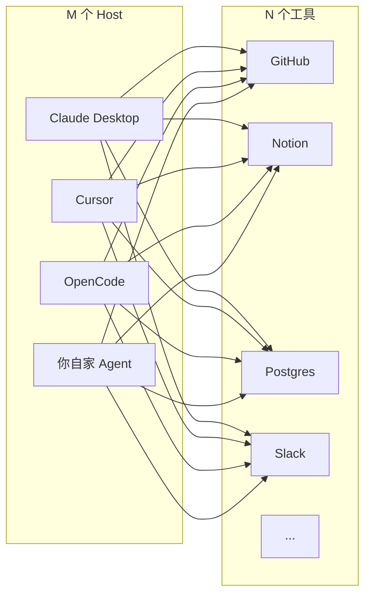
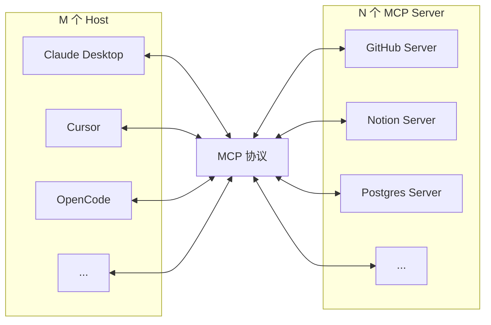
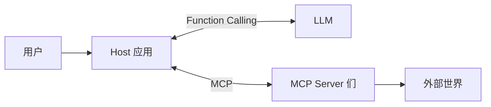
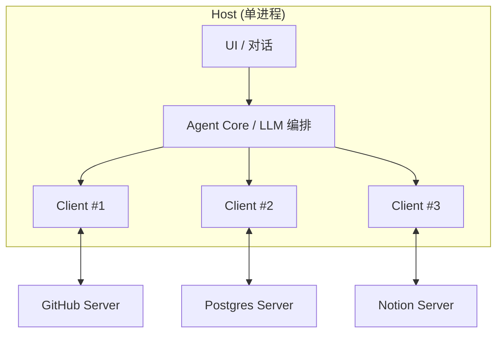

# MCP 是什么：为什么需要一个新协议

## 前言

**C：** 这一章把 MCP（Model Context Protocol）当成一套**独立的协议**来讲——不是讲"怎么用某个 MCP Server"，而是讲协议本身：**它想解决什么**、**它规定了什么**、**哪些事它故意没管**。这篇开篇，先把 MCP 在整张生态图里的位置钉住。

<!-- more -->

## 一、一句话先定性

> MCP = 为 AI 应用设计的"**开放、标准化、带身份的**工具与上下文接口协议"。

类比：

- 像**LSP**之于编程语言——任何编辑器只实现一次 LSP Client，就能用所有语言的 Server；
- 像**USB-C**之于硬件——任何设备只要一个接口，就能连键盘鼠标显示器供电一整套。

MCP 之于 AI 应用：**Host 应用只实现一次 MCP Client，就能接所有符合协议的 Server；工具提供方只写一次 Server，就能被所有 Host 使用**。

## 二、没有 MCP 的时代：M × N 地狱

在 MCP 诞生之前，AI 应用接工具的现状是这样的：

每家 Host 都要**重新实现一遍**全部集成。**整合成本 O(M × N)**。

结果是：

- 小 Host 接不到足够多的工具，生态输给大厂；
- 工具方要给每个 Host 单独写插件，升级困难；
- 用户要**在每个 Host 里各配一次**凭证；
- 发现一个 bug 要**在 M 个 Host 里修 M 次**。

## 三、MCP 把问题扳成 M + N

MCP 把 Host 和工具**解耦**，中间插一层协议：

**谁各写一次**：

- Host 侧：**一次 MCP Client**；
- 工具侧：**一次 MCP Server**；
- 用户侧：**一次授权** + **一套配置**。

整合成本从 O(M × N) 降到 O(M + N)，这是 MCP 最大的结构红利。

## 四、不是替代 Function Calling，而是**补充**一层

上一章末尾已经铺垫过，这里再钉一次图：

- **Function Calling** 是**模型 ↔ 应用**之间的约定（上章六篇讲透）；
- **MCP** 是**应用 ↔ 工具提供方**之间的约定（本章要讲的）。

两者**不冲突**：Host 内部仍然用 Function Calling 跟模型沟通，只是它暴露给模型的"工具清单"现在可以**从任意 MCP Server 动态获取**，而不再是写死的本地函数。

## 五、MCP 的三名主角

MCP 规定了三种角色：

| 角色 | 谁扮演 | 干什么 |
| -- | -- | -- |
| **Host** | Claude Desktop、Cursor、OpenCode、你自家 Agent | 宿主，负责 UI、管理模型调用、**发起 MCP 连接** |
| **Client** | 嵌在 Host 里的 MCP 连接器 | **一个 Host 里可以有多个 Client**，每个连一个 Server |
| **Server** | 独立进程 / 微服务 | 对外暴露 Tools / Resources / Prompts |

关键点：**Host 和 Client 不是同一个东西**——一个 Host 内部会**并行运行多个 Client**，每个 Client 绑一个 Server。这使得 Host 能同时挂 GitHub、Postgres、Notion 等多个 Server。

## 六、MCP 到底规定了什么

MCP 规范（当前版本 `2025-11-25`）规定了这几件事：

1. **消息格式**：全部用 **JSON-RPC 2.0**（下一篇讲）；
2. **生命周期**：`initialize` 握手 → 正常交互 → 优雅关闭；
3. **能力协商**：Host 和 Server 都声明自己支持的 capabilities，**只聊双方都支持的**；
4. **三个服务端原语**：
   - **Tools**（工具）：模型可调用的函数；
   - **Resources**（资源）：只读的上下文数据（文件、文档、表行）；
   - **Prompts**（提示）：可重用的对话模板；
5. **三个客户端原语**（服务端可反向调用）：
   - **Sampling**：Server 让 Host 代跑一次 LLM；
   - **Roots**：Server 向 Host 问"你授权我操作哪些路径/URI"；
   - **Elicitation**：Server 让 Host 弹表单向用户要额外输入；
6. **通知机制**：列表变更、日志、进度、取消；
7. **传输层**：stdio（本地）和 **Streamable HTTP**（远程），早期的 SSE 已降级。

"**三 + 三 + 一**"：三种服务端原语 + 三种客户端原语 + 一套基础设施（JSON-RPC / 生命周期 / 传输）。这就是本章要展开的全部内容。

## 七、MCP **故意不管**的东西

这一节比什么都重要——要是期待 MCP 做了它没做的事，你会被坑。

MCP **不负责**：

- **模型怎么推理、怎么选工具**：那是 Host 自己的事；
- **具体的鉴权方案**：规范里建议 OAuth2.1，但实现由 Host/Server 自己做；
- **UI 呈现**：Server 暴露的 prompt / resource 长什么样，**Host 自己决定**怎么展示；
- **数据存储与缓存**：Server 要不要缓存结果、Host 要不要缓存 resources，协议不管；
- **工具行为的正确性**：工具的 description 和实现不一致，MCP 不给你兜底；
- **限流、配额、计费**：完全交给 Server 或 Host 实现。

换句话说：**MCP 只管"协议层"，不管"策略层"**。

## 八、为什么不直接用 REST / gRPC / OpenAPI？

有人会问："一个 REST API 也能被 AI 调用，为啥还要搞 MCP？"几个关键差别：

| 维度 | REST / OpenAPI | MCP |
| -- | -- | -- |
| 连接形态 | 每次请求独立 | **有状态会话**，支持通知 |
| 发现 | OpenAPI 读一遍 | `tools/list` + 变更通知 |
| 反向通信 | 不行 | Server 可 `sampling` / `elicitation` 回调 Host |
| 上下文供给 | 只能 API 返回 | **Resources** 天生为 LLM 设计 |
| 提示模板 | 无 | **Prompts** 一等公民 |
| 统一授权 | 每家写一遍 | 规范推荐 OAuth2.1，Host 统一处理 |
| 面向对象 | 人类开发者 | **AI 应用 + 人**同为受众 |

简单说：REST 是"给人 / 服务用"的，MCP 是**专门为 AI 应用设计的**。硬套 REST 也能跑，但 resources、prompts、sampling 这些 AI 原生概念在 REST 里都没有。

## 九、MCP 生态的现在

到 2026 年初：

- **规范**：由 Anthropic 起头、现在已经是**独立的开放规范**，由 modelcontextprotocol.io 维护，采用日期版本（如 `2025-06-18`、`2025-11-25`）；
- **主流 Host**：Claude Desktop / Claude Code / Cursor / OpenCode / Windsurf / Zed / Continue / 自家 Agent 框架；
- **SDK**：官方 TypeScript / Python / Java / Kotlin / Rust / Swift / C# 都有；
- **社区 Server**：从 GitHub / GitLab / Postgres / SQLite / Slack / Notion / Linear / Jira 到 Kubernetes / AWS / Figma / Blender，数百个；
- **注册表**：[modelcontextprotocol.io/servers](https://modelcontextprotocol.io)、awesome-mcp 等公开清单；
- **治理**：SEP（Spec Enhancement Proposal）模式推进演进，**和语言标准的流程一致**。

## 十、心智模型 & 本章后续

到这里你应该能回答三个问题：

1. **为什么存在**：解决 M×N 集成地狱；
2. **不是什么**：不是 Function Calling 的替代，而是**它下面那层的标准化**；
3. **规定了什么**：JSON-RPC + 生命周期 + 三+三+一 的原语和基础设施。

后面五篇的编排：

- **02** 协议基础（JSON-RPC、握手、传输）
- **03** Tools（工具）——**核心原语一**
- **04** Resources（资源）——**核心原语二**
- **05** Prompts（提示）——**核心原语三**
- **06** 客户端原语与生产化（Sampling、Roots、Elicitation + 安全 + 调试 + 版本）

::: tip 延伸阅读

- [MCP 官方规范（2025-11-25）](https://modelcontextprotocol.io/specification/2025-11-25)
- [MCP Cheat Sheet](https://www.webfuse.com/mcp-cheat-sheet)
- 上一章回顾：`ai-basics/02-Function-Calling与Tool-Use/06-Function-Calling与MCP：边界与分工`

:::
