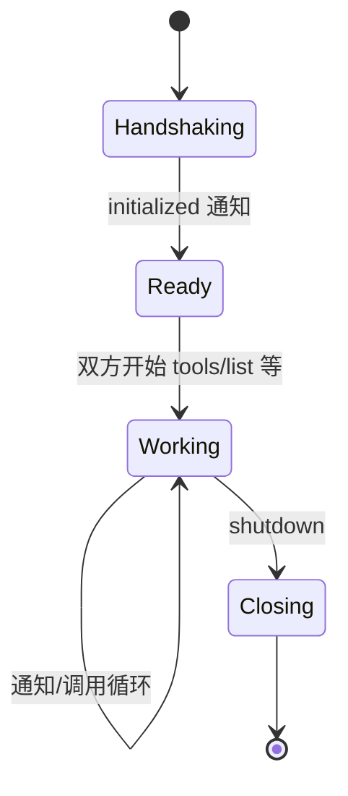
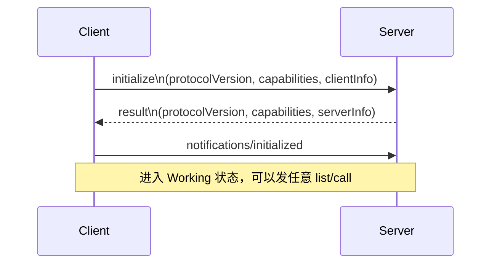
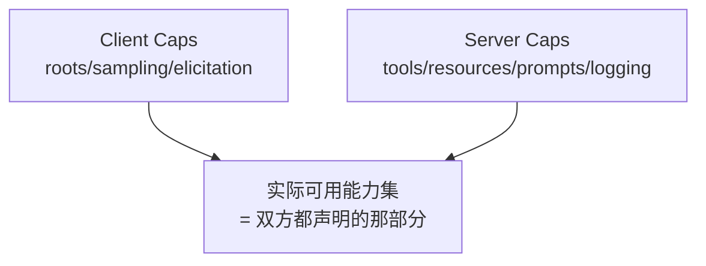
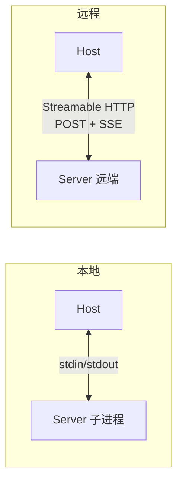
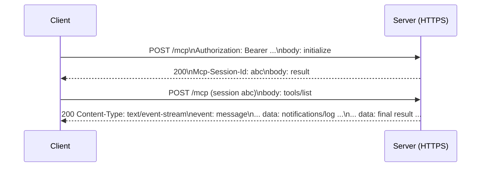
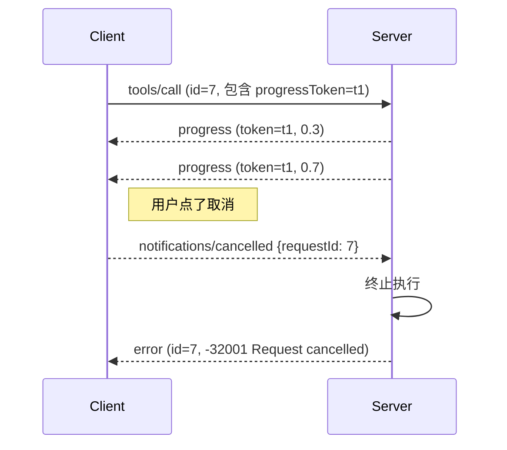

# 协议基础：JSON-RPC、生命周期与传输

## 前言

**C：** 这一篇讲 MCP 的"**底层**"——Tools / Resources / Prompts 还没上桌，先把**消息格式**、**握手过程**、**传输方式**三件事弄清楚。这部分在整个协议里占比不大，但每一条都是生产踩坑的常客。

<!-- more -->

## 一、消息格式：JSON-RPC 2.0

MCP 所有消息都走 **JSON-RPC 2.0**。这是一个**轻量级、对称、双向**的 RPC 规范，只有三类消息。

### 1.1 三类消息

| 消息 | 方向 | 必含字段 | 作用 |
| -- | -- | -- | -- |
| **Request** | 任一方 → 另一方 | `jsonrpc, id, method, params?` | 请求，**期待回复** |
| **Response** | 对方 → 发起方 | `jsonrpc, id, result or error` | 回复，id 必须匹配 request |
| **Notification** | 任一方 → 另一方 | `jsonrpc, method, params?` | **单向**，不期待回复，**不带 id** |

关键点：

- 所有消息必须带 `"jsonrpc": "2.0"`；
- `id` 用于匹配 request/response，**notification 没有 id**；
- 消息是**对称的**——Server 可以向 Client 发 request，Client 也能向 Server 发 request（这就是 Sampling / Elicitation 能成立的根基）。

### 1.2 一个真实的 Request / Response 例子

Client 调用工具：

```json
{
  "jsonrpc": "2.0",
  "id": 42,
  "method": "tools/call",
  "params": {
    "name": "getWeather",
    "arguments": { "city": "Beijing" }
  }
}
```

Server 返回：

```json
{
  "jsonrpc": "2.0",
  "id": 42,
  "result": {
    "content": [
      {"type": "text", "text": "北京当前 18°C，多云"}
    ]
  }
}
```

失败时 `error` 替代 `result`：

```json
{
  "jsonrpc": "2.0",
  "id": 42,
  "error": {
    "code": -32602,
    "message": "Invalid params: city is required"
  }
}
```

### 1.3 标准错误码

JSON-RPC 规定了几个保留错误码，MCP 实现几乎都会用到：

| code | 含义 | 场景 |
| -- | -- | -- |
| `-32700` | Parse error | 请求不是合法 JSON |
| `-32600` | Invalid Request | 结构不符合 JSON-RPC |
| `-32601` | Method not found | 不支持的方法（如客户端没开 roots 能力）|
| `-32602` | Invalid params | 参数错 |
| `-32603` | Internal error | 服务端异常 |

MCP 自己**没有**大量增补新错误码，多数错误都用这 5 个；业务语义错误通常放到 `tools/call` 的结果里（`isError: true`），而不是 JSON-RPC 层。

## 二、生命周期：初始化 → 正常运转 → 关闭

MCP 是**有状态连接**，一次会话有明确的生命周期。



### 2.1 initialize 握手的四步



四步：

1. **Client 发 `initialize`**：带上客户端版本号、自己支持哪些 capability、自己的 name/version；
2. **Server 回 result**：确认协议版本（**或发起降级**），报出自己支持的 capability 和 name/version；
3. **Client 发 `notifications/initialized`**：告诉 Server "可以开张了"；
4. **此后**任何一方发 list / call / read / get，或发各种通知。

如果 Server 没等到第 3 步就收到别的请求——**按规范应拒绝**，错误码 `-32002` 或类似。

### 2.2 initialize 请求的真实样子

```json
{
  "jsonrpc": "2.0",
  "id": 0,
  "method": "initialize",
  "params": {
    "protocolVersion": "2025-11-25",
    "capabilities": {
      "roots": { "listChanged": true },
      "sampling": { "tools": {} },
      "elicitation": {}
    },
    "clientInfo": { "name": "claude-desktop", "version": "1.3.0" }
  }
}
```

Server 返回：

```json
{
  "jsonrpc": "2.0",
  "id": 0,
  "result": {
    "protocolVersion": "2025-11-25",
    "capabilities": {
      "tools":     { "listChanged": true },
      "resources": { "subscribe": true, "listChanged": true },
      "prompts":   { "listChanged": true },
      "logging":   {}
    },
    "serverInfo": { "name": "github-mcp-server", "version": "0.8.2" }
  }
}
```

### 2.3 Capability 协商：**只聊双方都支持的**



几个规矩：

- **没声明的能力不能用**——Server 没声明 `resources`，Client 就不应该发 `resources/list`；
- **sub-capability** 细粒度：`resources.subscribe` 是否支持订阅、`tools.listChanged` 是否发列表变更通知；
- **版本不兼容**时，Server 可以**返回自己最高支持的版本**，Client 决定是否降级；
- **能力不对称**很常见：一个不支持 sampling 的 Host 也能正常使用只暴露工具的 Server。

### 2.4 版本号长什么样

MCP 用**日期字符串**版本号：`2024-11-05` → `2025-03-26` → `2025-06-18` → `2025-11-25`。

优点：演进看得见，**不会像 SemVer 那样两位数字就压不住大改动**。

缺点：要在代码里比较版本要手动字符串比较，不能 `>= 1.2.3`。

**兼容策略**：

- Client 请求 X，Server **若支持 X 就用 X**；
- Server **更高**的版本也可能兼容 X（规范里说 SHOULD）；
- Server 更低的版本 → 回一个更低的，Client 可以选择"拉倒不聊"。

## 三、传输层：stdio 和 Streamable HTTP 两条路

MCP 把**消息格式**（JSON-RPC）和**传输**解耦。当前规范里有两种传输：



### 3.1 stdio：本地优先

- Host **把 Server 作为子进程**启动；
- 通过 **stdin 写、stdout 读** 交换 JSON 行（每行一条 JSON）；
- stderr 留给日志；
- 零配置、零端口、**最安全**（不开监听）。

最典型的用法：

```json
{
  "mcpServers": {
    "github": {
      "command": "npx",
      "args": ["-y", "@modelcontextprotocol/server-github"],
      "env": { "GITHUB_TOKEN": "ghp_..." }
    }
  }
}
```

Host（Claude Desktop / Cursor / OpenCode）启动时会**自动拉起**这些子进程。

### 3.2 Streamable HTTP：远程服务

为了把 Server 部署到远端，MCP 规范定义了 **Streamable HTTP**（早期有过 "HTTP + SSE" 两路版本，已经合并成这一种）：

- **请求**：POST 到一个 URL，body 是 JSON-RPC request；
- **响应**：
  - 如果是一次 Request-Reply，直接 HTTP 响应体里放 JSON-RPC response；
  - 如果 Server 需要推流（通知、进度、中间结果），响应用 **SSE（`text/event-stream`）** 流式返回多条消息；
- **会话标识**：用 `Mcp-Session-Id` 响应头 + 后续请求头维持"有状态会话"；
- **鉴权**：规范推荐 **OAuth 2.1**，Bearer Token 放 `Authorization` 头。

示意流程：



### 3.3 SSE-only（legacy）

2024 年那版 **HTTP + SSE 双通道**现在已经归入"**Legacy**"。新项目一律用 Streamable HTTP；旧 Server 仍在运作的话，Client 通常仍保留兼容实现。

### 3.4 传输与能力无关

规范有意让传输和能力**解耦**：stdio 和 HTTP 上暴露什么原语**完全相同**。差别只在运维形态：

| 维度 | stdio | Streamable HTTP |
| -- | -- | -- |
| 部署 | 进程内、Host 启动 | 远端服务，独立部署 |
| 鉴权 | 由 Host 注入 env | OAuth2.1 / Bearer Token |
| 多用户 | 一个进程一人 | 一个服务多人（隔离由 Server 管）|
| 延迟 | 极低 | 与网络相关 |
| 生命周期 | Host 退就死 | 独立运行 |
| 适合 | 本地工具 / 个人用 | SaaS 化工具 / 团队共享 |

## 四、通知机制：除了 request 以外的"轻推送"

MCP 里有一整组**单向通知**，Server 和 Client 都能发。常见的：

| 通知方法 | 方向 | 干啥 |
| -- | -- | -- |
| `notifications/initialized` | Client → Server | 握手完成，可开始工作 |
| `notifications/tools/list_changed` | Server → Client | 工具列表变了，请重刷 |
| `notifications/resources/list_changed` | Server → Client | 资源列表变了 |
| `notifications/resources/updated` | Server → Client | 被订阅的资源有更新 |
| `notifications/prompts/list_changed` | Server → Client | 提示模板变了 |
| `notifications/roots/list_changed` | Client → Server | Roots 变了 |
| `notifications/message` | Server → Client | 日志 / 调试消息 |
| `notifications/progress` | 双向 | 长任务进度 |
| `notifications/cancelled` | 双向 | 取消一次正在处理的 request |

**两个实用点**：

- **list_changed 要订阅**：如果你的 Server 动态增删工具（比如根据用户权限），务必在 `initialize` capabilities 里声明 `listChanged: true`，再在工具变化时发通知，Client 才会刷新；
- **进度通知要配 token**：发起 request 时可以在 `_meta.progressToken` 里放一个标记，Server 后续的 `progress` 通知就带这个 token，Client 按 token 归组显示进度条。

## 五、取消与超时：别让一次调用拖死会话

JSON-RPC 本身没有超时概念；MCP 补了一条：

- 发起方可以随时发 `notifications/cancelled { requestId }`；
- 接收方**应当**尽早中断正在处理的请求，并可发一条带 `isError` 的错误回执；
- 超时本身**由两端自己设**——一般 Host 给每个 request 一个默认 60s 左右；
- 对长任务一律配**进度通知**。



## 六、一次完整对话的真实消息序列

合起来看一次"问天气"从握手到拿结果的全部消息：

```text
# ——握手——
→ {"jsonrpc":"2.0","id":0,"method":"initialize", "params":{...}}
← {"jsonrpc":"2.0","id":0,"result":{...}}
→ {"jsonrpc":"2.0","method":"notifications/initialized"}

# ——发现——
→ {"jsonrpc":"2.0","id":1,"method":"tools/list"}
← {"jsonrpc":"2.0","id":1,"result":{"tools":[{"name":"getWeather",...}]}}

# ——LLM 决定调用——
→ {"jsonrpc":"2.0","id":2,"method":"tools/call",
   "params":{"name":"getWeather","arguments":{"city":"Beijing"}}}
← {"jsonrpc":"2.0","id":2,"result":{"content":[{"type":"text","text":"18°C 多云"}]}}

# ——关闭（stdio 下通常省略，直接 kill 子进程）——
```

多么"朴素"—— JSON-RPC + 握手 + 几个 list/call，**这就是 MCP 的全貌骨架**。后面几篇往这个骨架上填肉。

## 七、小结

- **消息格式**：JSON-RPC 2.0 三类消息——Request / Response / Notification，双向对称。
- **生命周期**：`initialize` 握手 → `notifications/initialized` → 正常交互 → 关闭；Capability 协商"**只聊双方都支持的**"。
- **版本号**：日期字符串，字符串比较，支持降级。
- **传输层**：stdio（本地子进程）和 Streamable HTTP（远程、OAuth2.1）；旧 SSE 已归 Legacy。
- **通知**：list_changed、updated、progress、cancelled，是把协议做得"活"的关键补充。
- **取消**：靠 `notifications/cancelled`，超时两端自管。

::: tip 延伸阅读

- [MCP Spec · Base Protocol](https://modelcontextprotocol.io/specification/2025-11-25/basic)
- [MCP Spec · Transports](https://modelcontextprotocol.io/specification/2025-11-25/basic/transports)
- [JSON-RPC 2.0 官方](https://www.jsonrpc.org/specification)
- 下一篇：`03-Tools（工具）：模型可调用的能力`

:::
