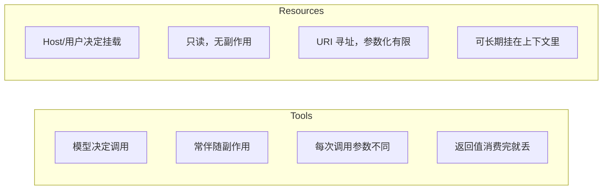
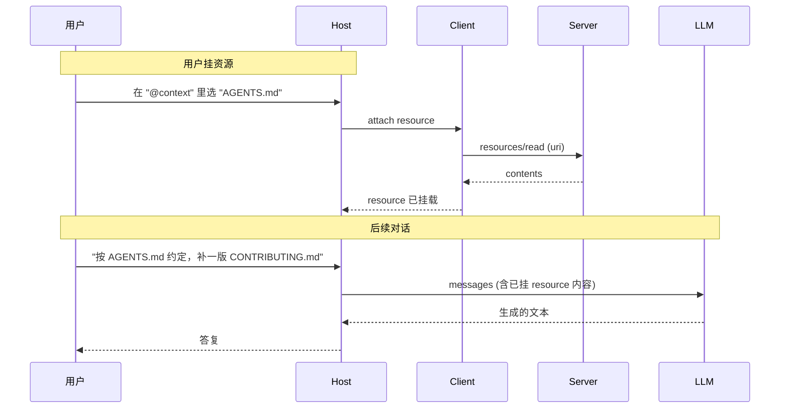
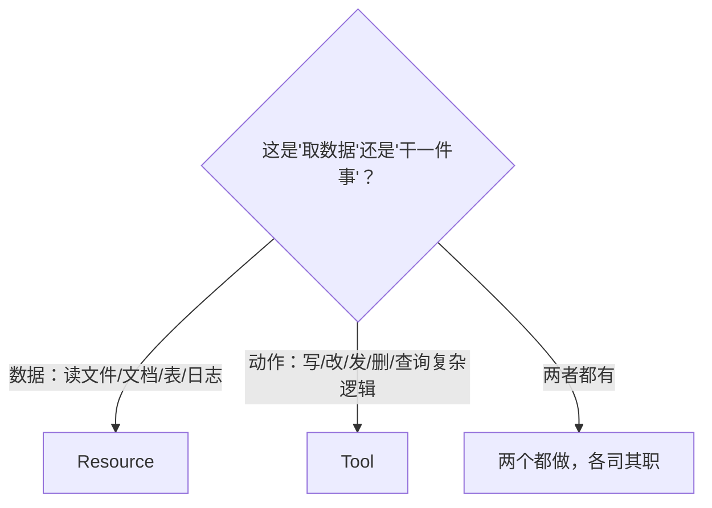

# Resources（资源）：给模型挂上只读上下文

## 前言

**C：** Tools 是"让模型**动手**"的原语；Resources 则是"给模型**看的材料**"的原语。它们的区别常被新手忽略——导致一上来什么都塞进 tools，结果工具列表爆炸、调用准确率低、上下文还浪费。这一篇把 Resources 的设计哲学和协议细节讲清。

<!-- more -->

## 一、Resources 到底是什么

**官方定义**：Resources 是**由 Server 暴露、以 URI 为标识的只读数据**，可以被 Host 展示给用户、或者注入到对话上下文里。

拿一个真实类比：**浏览器标签页**。

- 你打开一个标签页 = Host 挂了一个 resource；
- 标签页里是只读的网页内容 = resource 的 contents；
- 你可以**一次开多个**、**随时关**、**按需刷新**——resources 也是这样用的。

## 二、Resources 与 Tools 的本质区别



| 维度 | Tools | Resources |
| -- | -- | -- |
| **谁决定触发** | **模型** | **Host / 用户** |
| **作用** | 执行动作 / 获取数据 | 提供上下文 |
| **副作用** | 可能有 | **必须无** |
| **寻址** | name + arguments | **URI** |
| **上下文里存在感** | 一次一 message | **可长期常驻** |
| **发现方式** | `tools/list` | `resources/list` / `resources/templates/list` |
| **读取方式** | `tools/call` | `resources/read` |

**一句话对照**：读文件内容给模型看——用 **Resource**；让模型自己决定**要不要读**某个文件——用 **Tool**。

## 三、URI：Resources 的身份证

Resources 用 **URI** 唯一标识，规范只要求"**一个合法 URI**"，不限 scheme。现实中常见的 scheme：

| Scheme | 含义 | 例 |
| -- | -- | -- |
| `file://` | 本地文件（最常见）| `file:///repo/AGENTS.md` |
| `https://` | 远端文档 | `https://docs.example.com/spec.md` |
| 自定义 | Server 自行约定 | `pg://db/public/orders/1001` |
| `screen://` | 当前屏幕 | `screen://display/0`（屏幕捕获类 Server）|
| `git://` | Git 对象 | `git://repo/HEAD/README.md` |
| `doc://` | 自家知识库 | `doc://confluence/page/12345` |

**注意**：URI 的 scheme **没有注册中心**；不同 Server 互不冲突，但**同一 Host 里两个 Server 使用了同一种 scheme**，Host 可能会根据来源把它们分开处理。

## 四、协议面：四个方法

Server 要暴露 resources 能力，`initialize` 时声明：

```json
{
  "capabilities": {
    "resources": {
      "subscribe": true,
      "listChanged": true
    }
  }
}
```

- `subscribe`：是否支持订阅资源变更；
- `listChanged`：是否会发列表变更通知。

协议提供四组方法：

### 4.1 `resources/list`：列出所有资源

Request：

```json
{"jsonrpc":"2.0","id":1,"method":"resources/list",
 "params":{"cursor": null}}
```

Response：

```json
{
  "jsonrpc":"2.0","id":1,
  "result":{
    "resources":[
      {
        "uri":   "file:///repo/AGENTS.md",
        "name":  "AGENTS.md",
        "title": "项目约定",
        "description":"团队级编码与 AI 协作规范",
        "mimeType":"text/markdown",
        "size":  3421
      },
      {
        "uri":   "pg://db/public/orders",
        "name":  "orders",
        "mimeType":"application/json"
      }
    ],
    "nextCursor": null
  }
}
```

字段要点：

- `uri` 必填、**必须能被 `resources/read` 读**；
- `name` 用户可见的简称；
- `title` 更长、给人看的友好名；
- `description` 给用户 / 模型看的用途说明；
- `mimeType` 尽量写——Host 按它决定如何展示；
- `size` 可选（字节），对大文件很重要；
- `nextCursor` 游标分页。

### 4.2 `resources/read`：取内容

Request：

```json
{"jsonrpc":"2.0","id":2,"method":"resources/read",
 "params":{"uri":"file:///repo/AGENTS.md"}}
```

Response：

```json
{
  "jsonrpc":"2.0","id":2,
  "result":{
    "contents":[
      {
        "uri":"file:///repo/AGENTS.md",
        "mimeType":"text/markdown",
        "text":"# AGENTS.md\n..."
      }
    ]
  }
}
```

几件重要的事：

- **结果是数组**：一个 URI 可能对应**多条内容**（想象目录 URI 读取出下一级所有文件）；
- **二进制用 `blob`**：`{ "uri": ..., "mimeType":"image/png", "blob": "<base64>" }`——`text` 和 `blob` 二选一；
- **大文件的分页 / 切片**由 Server 决定；规范没有规定 offset/limit，常见做法是**用不同 URI 表达分片**（`file:///big.log#0-4096`）。

### 4.3 `resources/templates/list`：参数化资源

不是所有资源都能枚举（想象一个"按订单 ID 查详情"的资源）。MCP 定义了**模板资源**：

```json
{"jsonrpc":"2.0","id":3,"method":"resources/templates/list"}
```

```json
{
  "jsonrpc":"2.0","id":3,
  "result":{
    "resourceTemplates":[
      {
        "uriTemplate": "pg://db/public/orders/{orderId}",
        "name": "order",
        "title": "订单详情",
        "description":"按订单号拉一条订单的完整 JSON",
        "mimeType":"application/json"
      }
    ]
  }
}
```

`uriTemplate` 采用 **RFC 6570** 语法，客户端替换变量后再 `resources/read`：

```text
pg://db/public/orders/1001
```

### 4.4 订阅与通知

两类通知相关：

```json
// 列表变了
{"jsonrpc":"2.0","method":"notifications/resources/list_changed"}

// 某个已订阅资源有更新
{"jsonrpc":"2.0","method":"notifications/resources/updated",
 "params":{"uri":"pg://db/public/orders/1001"}}
```

订阅：

```json
{"jsonrpc":"2.0","id":4,"method":"resources/subscribe",
 "params":{"uri":"pg://db/public/orders/1001"}}
```

取消订阅：

```json
{"jsonrpc":"2.0","id":5,"method":"resources/unsubscribe",
 "params":{"uri":"pg://db/public/orders/1001"}}
```

**使用场景**：

- 文档被别人改了，Server 推 updated；
- 数据库行被修改，Host 可以让模型基于最新数据继续推理；
- 配合 Host 的"**自动刷新**"UI，用户看到的永远是最新。

## 五、一次完整的用户视角流程



区别于 Tools：**resource 是"预先注入"的上下文**，模型看到的时候它已经在 prompt 里了，模型**不需要**主动调用来获取。

## 六、Host 端的几种呈现模式

规范没有规定 UI，实际 Host 大致这几种：

- **@ 提及挂载**（Claude Desktop、Cursor、OpenCode）：用户打 `@` 从 resource 列表中选择，内容塞到对话；
- **侧边栏 Picker**：列出 Server 暴露的所有 resources，复选勾进当前会话；
- **命令挂载**（`/attach`、`/context`）：命令式接口；
- **自动挂载**：Host 根据 roots + 文件类型自动把特定文件当 resource 挂入（少见，谨慎使用）。

## 七、Tools 里"引用"一个 resource

上一章 Tools 的 `content[]` 里有两种和 resource 相关的块：

```json
"content": [
  {"type":"resource_link",
   "uri":"pg://db/public/orders/1001",
   "name":"订单 1001"},

  {"type":"resource",
   "resource": {
     "uri":"pg://db/public/orders/1001",
     "mimeType":"application/json",
     "text":"{...}"
   }}
]
```

两种用法：

- **`resource_link`**：只给个引用，Host 负责决定**要不要现在就 read**——适合大对象，按需读；
- **`resource`**：直接**内嵌**内容——适合小对象，立即可见。

实际工程里常见模式：**"查询工具"返回 resource_link 列表，让模型随后自己按需 read**，可以显著降低 token 占用。

## 八、设计原则：什么场景该做 resource 而不是 tool

### 8.1 **数据 vs 动作**二分法



### 8.2 **枚举 vs 查询**判断

- **可枚举的少量对象**（项目文件树、仓库根目录配置文件） → `resources/list` 一把拉；
- **参数化的对象集**（按 ID 查的订单、Jira 工单） → **模板资源**；
- **复杂条件查询**（full-text search、多维过滤） → **工具**（`searchOrders`），返回的 hit 里用 `resource_link` 指回去。

### 8.3 **"一次性 vs 常驻"**判断

Tools 返回值一般是一次性的，Resources 适合**挂在对话里反复用**：

- 问三次同一个文档的不同段落 → **挂 resource 一次就够**；
- 每次都要现查一份新数据 → **用工具**；
- 既想常驻又想实时 → **resource + `subscribe`**。

## 九、一个完整的 Resource Server 示例（TypeScript）

```typescript
import { McpServer, ResourceTemplate }
  from "@modelcontextprotocol/sdk/server/mcp.js";
import { StdioServerTransport }
  from "@modelcontextprotocol/sdk/server/stdio.js";
import { promises as fs } from "fs";
import path from "path";

const server = new McpServer({ name: "project-docs", version: "0.1.0" });

server.registerResource(
  "agents-md",
  "file:///project/AGENTS.md",
  {
    title: "项目约定",
    description: "团队 AI 协作规则",
    mimeType: "text/markdown",
  },
  async (uri) => ({
    contents: [{
      uri: uri.href,
      mimeType: "text/markdown",
      text: await fs.readFile("/project/AGENTS.md", "utf-8"),
    }],
  })
);

server.registerResource(
  "doc-by-slug",
  new ResourceTemplate("doc://project/{slug}", { list: async () => {
    const files = await fs.readdir("/project/docs");
    return {
      resources: files.map(f => ({
        uri:  `doc://project/${path.basename(f, ".md")}`,
        name: path.basename(f, ".md"),
        mimeType: "text/markdown",
      })),
    };
  }}),
  { title: "项目文档", description: "按 slug 读一篇文档" },
  async (uri, { slug }) => ({
    contents: [{
      uri: uri.href,
      mimeType: "text/markdown",
      text: await fs.readFile(`/project/docs/${slug}.md`, "utf-8"),
    }],
  })
);

await server.connect(new StdioServerTransport());
```

重点：

- **静态资源**一行 `registerResource(id, uri, metadata, reader)`；
- **模板资源**用 `ResourceTemplate` + 一个 `list` 回调（可枚举时）+ 一个 reader；
- 返回 `contents` 数组，每条带 `uri/mimeType/text|blob`。

## 十、安全与隐私

Resources 是**数据出口**，安全比 Tools 还敏感（工具要触发后才读数据，resource 可以**一挂就泄露**）。

**Server 侧**：

- 最小授权——暴露给 Host 的 resource 只能是用户**显式允许**的；
- 文件型 Server 必须在 **roots**（见 06 篇）范围内工作，禁止路径穿越；
- 大文件**分片**，避免单次 read 拖死进程；
- 敏感字段（密码、密钥）在 `resources/read` 出口处**脱敏**。

**Host 侧**：

- UI 明示"**这段内容来自哪个 Server**"；
- **不要**把别的 Server 的 resource 原样转发给另一个 Server 的 tool——**跨源污染**最常见的供应链陷阱；
- 记录 resource 挂载、read、update 事件进审计日志。

## 十一、小结

- Resources = **"挂给模型看的只读材料"**，Tools = **"让模型动手的接口"**，两者互补。
- 以 URI 作为标识，支持静态清单（`resources/list`）和模板（`resources/templates/list`）。
- 读取用 `resources/read`，返回 `contents[]`（text 或 blob）。
- 通过 `subscribe` + `notifications/resources/updated` 让内容保持实时。
- Tools 的返回里可以用 `resource_link` / `resource` 引用/内嵌 resource，减少 token 占用。
- 判断用法两问：**数据还是动作？** **要不要常驻？**
- 安全是数据出口——最小授权、脱敏、严格 roots。

::: tip 延伸阅读

- [MCP Spec · Resources](https://modelcontextprotocol.io/specification/2025-11-25/server/resources)
- [RFC 6570 URI Template](https://www.rfc-editor.org/rfc/rfc6570)
- 下一篇：`05-Prompts（提示）：可重用的对话模板`

:::
