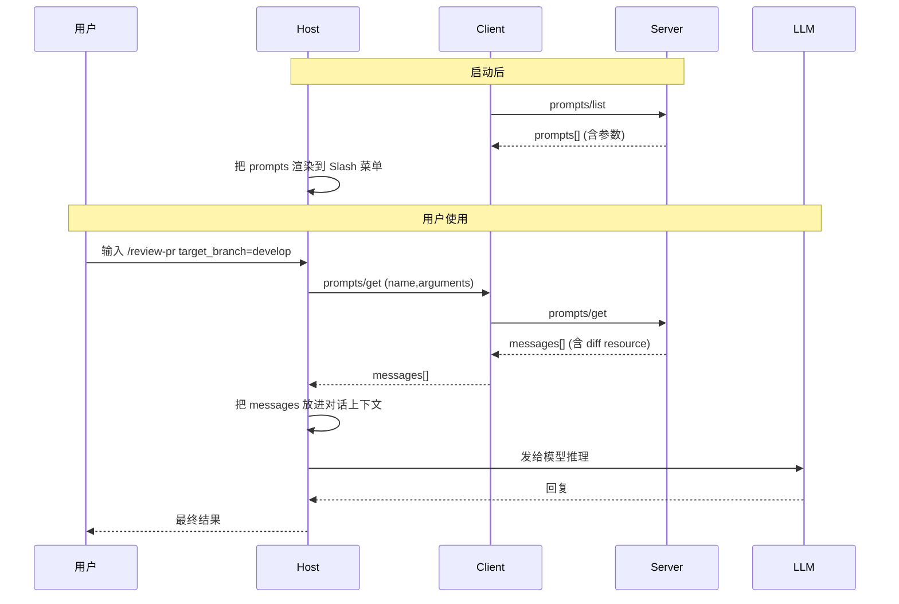
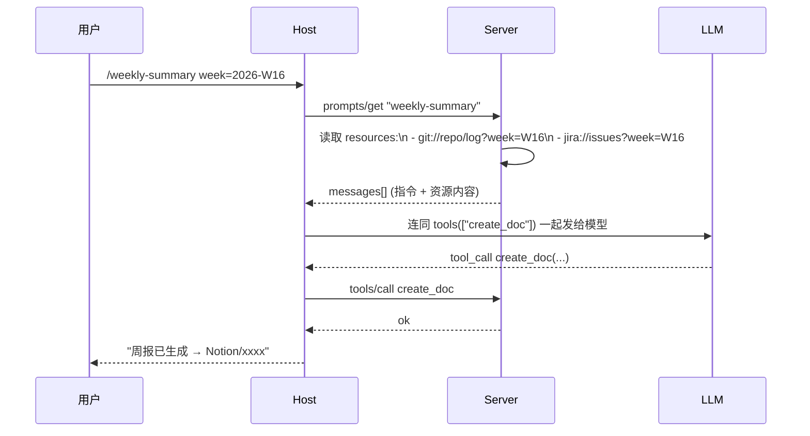

# Prompts（提示）：可重用的对话模板

## 前言

**C：** Prompts 是三大服务端原语里**最容易被低估**的一个。它既不像 Tools 那样"热闹"，也不像 Resources 那样"看得见摸得着"，但它恰好填上了前两者中间的一块空白——**把一个复杂的、重复用的对话起手式，变成一个带参数的模板**。

<!-- more -->

## 一、一句话定性

> **Prompt** = Server 预置给用户的、**用户触发**的对话模板，调用一次会得到一组 **messages[]**（可能包含文本 + resource），直接塞到 LLM 对话里。

再精准一点：

- 它**不是**给模型看的工具清单的一部分；
- 它**不是**用户要读的只读数据；
- 它是**"按个按钮，就开启一段预置对话"**——用户为主体、一次性、可参数化。

## 二、三原语一张表：各自的定位

前两篇已经拎过一次，Prompts 一加进来坐标就清楚了：

| 原语 | 谁触发 | 本质 | 典型 UI |
| -- | -- | -- | -- |
| **Tools** | 模型 | 可调用函数 | 自动化执行 |
| **Resources** | Host/用户 | 只读数据 | 挂载到对话 |
| **Prompts** | **用户** | **可重用的对话起手式** | **Slash 菜单 / @ 模板** |

所以在大多数 Host 里的表现：**Tools 隐身背后、Resources 走挂载、Prompts 走 Slash 命令或 "/@" 菜单**。

## 三、Prompt 能装什么

一个 prompt 被"展开"后，产出一个 `messages[]`。每条 message 的 `content` 可以是：

| `type` | 用途 |
| -- | -- |
| `text` | 最常见，提示文本 |
| `image` | 图片（多模态模型用）|
| `audio` | 音频 |
| `resource` | 内嵌一个 resource（把一份文档塞进提示里）|
| `resource_link` | 引用一个 resource，Host 决定要不要挂 |

所以一个 prompt **可以**把"**system 指令 + 一份 AGENTS.md + 一张截图 + 用户起手发问**"打包成一条按钮。这是 Prompts 最强的地方——**用户一按，模型就看到一整套预置上下文**。

## 四、协议面：两个方法

Server 要暴露 prompts 能力，`initialize` 时声明：

```json
{
  "capabilities": {
    "prompts": {
      "listChanged": true
    }
  }
}
```

只有两个方法。

### 4.1 `prompts/list`：列模板

Request：

```json
{"jsonrpc":"2.0","id":1,"method":"prompts/list"}
```

Response：

```json
{
  "jsonrpc":"2.0","id":1,
  "result":{
    "prompts":[
      {
        "name": "review-pr",
        "title": "对当前分支做 Code Review",
        "description": "对相对 main 的 diff 做审阅，输出 🟢🟡🔴 三档",
        "arguments": [
          {
            "name": "target_branch",
            "description": "基线分支，默认 main",
            "required": false
          },
          {
            "name": "focus",
            "description": "额外关注点，自由文本",
            "required": false
          }
        ]
      },
      {
        "name": "explain-file",
        "title": "解释文件",
        "description": "把一个文件用自然语言讲给新同事",
        "arguments": [
          {"name": "path", "description": "文件路径", "required": true}
        ]
      }
    ]
  }
}
```

字段：

- `name` 唯一标识；
- `title` 人类可读标题（UI 上显示）；
- `description` 作用说明；
- `arguments[]` 参数列表，每个含 `name / description / required`；
- （可选）`icon`、`mimeType` 等辅助字段，Host 可选识别。

### 4.2 `prompts/get`：渲染模板

Request：

```json
{
  "jsonrpc":"2.0","id":2,
  "method":"prompts/get",
  "params":{
    "name":"review-pr",
    "arguments":{ "target_branch":"develop","focus":"性能" }
  }
}
```

Response：

```json
{
  "jsonrpc":"2.0","id":2,
  "result":{
    "description":"对当前分支做 Code Review",
    "messages":[
      {
        "role":"user",
        "content":{
          "type":"text",
          "text": "请对 `git diff origin/develop...HEAD` 做代码审阅，重点关注：\n- 性能\n\n输出：\n🟢 通过 / 🟡 建议 / 🔴 阻断"
        }
      },
      {
        "role":"user",
        "content":{
          "type":"resource",
          "resource":{
            "uri":"git://repo/diff?base=develop..HEAD",
            "mimeType":"text/x-diff",
            "text":"--- a/src/...\n+++ b/src/..."
          }
        }
      }
    ]
  }
}
```

注意几件事：

- 返回**是 `messages[]`**，而不是单条文本——更接近一段"预置对话"；
- 可以**多条 message**，甚至**多 role**（user / assistant）；
- **内嵌 resource** 让模板直接把外部内容带进来；
- 模板渲染**不一定**只用 Server 自己的数据——Server 也可以**调用 Resources / 查数据库**后再组合。

## 五、完整一次使用的流程



**关键心智**：Prompt 不是"给模型的一段 prompt string"，而是**"一段预置的对话开头"**——Host 拿到的是 **messages**，直接拼到已有对话后面，立刻可发。

## 六、什么场景用 Prompt，不用 Tool 或 Resource

三个典型判断：

### 6.1 "这是一套**起手式**吗？"

- 固定几句起手 + 一份资料 + 用户的参数 → **Prompt**；
- 单纯地查询资料 / 执行一个函数 → **Resource / Tool**。

### 6.2 "用户会**明确主动**按它吗？"

- 用户会打 `/review-pr`、`/explain-file`、`/summarize-week` 去触发 → **Prompt**；
- 模型决定什么时候调 → **Tool**。

### 6.3 "参数是**给渲染用**、还是**让代码执行用**？"

- 参数用来**填充对话文本 / 拼上下文** → **Prompt**；
- 参数用来**当函数入参，产生副作用** → **Tool**。

对比一个真实的例子：

| 需求 | 实现 | 原语 |
| -- | -- | -- |
| "每周一总结上周事项" | 用户打 `/weekly-summary` → 模板拼上 resource | **Prompt** |
| "给工单分配优先级" | 模型看到工单文本后自己选 P0~P3 | **Tool**（`ratePriority`）|
| "挂一份 API 文档到对话" | 用户 @ 选择文档 | **Resource** |

## 七、Completion：Server 为参数提供自动补全

Prompts 的参数可以很多，手打容易错。MCP 规范提供 `completion/complete` 方法，让 Server 给 Client 的**参数输入提供候选**。

Request：

```json
{
  "jsonrpc":"2.0","id":3,
  "method":"completion/complete",
  "params":{
    "ref":  {"type":"ref/prompt","name":"explain-file"},
    "argument":{"name":"path","value":"src/co"}
  }
}
```

Response：

```json
{
  "jsonrpc":"2.0","id":3,
  "result":{
    "completion":{
      "values":["src/components/Button.tsx","src/controllers/order.ts"],
      "hasMore": false,
      "total": 2
    }
  }
}
```

Host 可以把这些候选渲染成下拉菜单——用户输入 `src/co` 时就能选。**`completion/complete` 同样可用于 resource 的模板变量补全**（`ref/resource`）。

## 八、典型 Prompt 范式

实战里常见几种 prompt 模板：

### 8.1 "Runbook 型"：把一次标准动作打包

```text
/deploy-check env=staging
↓
prompts/get 返回：
- 一段 "检查以下清单" 指令
- 从 k8s resource 里读到的部署状态
- 从 Sentry resource 里拉到的最近 24h 错误
- 最后留一条空 user message 让模型接着答
```

### 8.2 "Wrapper 型"：对一段已有内容做事

```text
/review-pr target=develop
↓
prompts/get 返回：
- system: "你是严格的 reviewer..."
- user: 把 diff resource 嵌进去
- user: "请按 🟢🟡🔴 输出"
```

### 8.3 "Few-shot 型"：内置示例

```text
/classify-intent text=..."
↓
messages[]:
- user: "示例 1: ... → 意图 A"
- assistant: "A"
- user: "示例 2: ... → 意图 B"
- assistant: "B"
- user: "现在: {text} → 意图?"
```

三种范式统一体现 Prompts 的价值：**把"**怎么开场**"从用户脑子里挪到模板里**。

## 九、一个完整的 Prompt Server 示例（TypeScript）

```typescript
import { McpServer } from "@modelcontextprotocol/sdk/server/mcp.js";
import { StdioServerTransport }
  from "@modelcontextprotocol/sdk/server/stdio.js";
import { z } from "zod";
import { execSync } from "child_process";

const server = new McpServer({ name: "pr-helper", version: "0.1.0" });

server.registerPrompt(
  "review-pr",
  {
    title: "对当前分支做 Code Review",
    description: "对相对指定分支的 diff 做审阅，输出 🟢🟡🔴",
    argsSchema: {
      target_branch: z.string().default("main").describe("基线分支"),
      focus:         z.string().optional().describe("额外关注点"),
    },
  },
  async ({ target_branch, focus }) => {
    const diff = execSync(
      `git diff origin/${target_branch}...HEAD`, { encoding: "utf-8" }
    );
    const focusLine = focus ? `\n重点关注：${focus}` : "";

    return {
      description: "Code Review 模板",
      messages: [
        {
          role: "user",
          content: {
            type: "text",
            text:
`请对以下 diff 做代码审阅：${focusLine}

输出格式：
- 🟢 通过项
- 🟡 建议项（含文件:行号）
- 🔴 阻断项`
          },
        },
        {
          role: "user",
          content: {
            type: "resource",
            resource: {
              uri: `git://repo/diff?base=${target_branch}..HEAD`,
              mimeType: "text/x-diff",
              text: diff,
            },
          },
        },
      ],
    };
  }
);

await server.connect(new StdioServerTransport());
```

SDK 里 `registerPrompt` 帮你做了：

- 自动把 zod schema 翻译成 `arguments[]` 元数据；
- 自动处理 `prompts/list` / `prompts/get` 的分发；
- 自动在参数校验失败时返回 `-32602`。

你只负责**拿参数 → 组装 messages**。

## 十、常见坑

### 10.1 把 Prompt 当"system 提示"

很多人以为 prompt 就是一行 system 指令——**不对**。`messages[]` 通常以 **user** 起头，有时加一两条 **assistant** 做 few-shot。**如果你想改 system，靠 Host 的全局 system prompt**。

### 10.2 Prompt 参数不等于 Tool 参数

Prompt 参数**只决定模板如何渲染**，不用 JSON Schema 的全套约束（**不需要 enum 做严格校验**，更像"用户输入辅助"）。所以：

- `arguments[]` 只有 `name/description/required`，**没有 `schema`**；
- 校验复杂结构**不要放这里**；
- 上面 TS 例子用 zod 是 SDK 的便利——协议层并不强制。

### 10.3 忘了发 `list_changed`

Prompt 集通常是配置型、**变得不多**——但有一类 Server 会把"**当前项目支持的 prompt**"按 roots 动态生成，这种务必声明 `listChanged: true` 并在变化时发通知。

### 10.4 拿 Prompt 做"隐身工具"

有人用 Prompt 模板让模型"自动跑一段代码"——协议上没禁，但**混淆了触发模型**：用户以为是"展开一段话"，其实背后调了副作用。**要副作用就走 Tool**，别藏到 Prompt 里。

## 十一、Prompt / Tool / Resource 合奏的一个真实模式

三者组合最强的一种场景："**一键生成周报**"：



- **Prompt** 提供一键入口 + 预置指令；
- **Resource** 提供原料（git log、Jira 工单）；
- **Tool** 落盘结果（生成 Notion 文档）。

## 十二、小结

- Prompts = **用户触发**的可重用对话模板，渲染产出 **messages[]**；
- 协议只有 `prompts/list` + `prompts/get` 两个方法；
- 参数声明简单（name/description/required），细的校验由 Server 侧完成；
- 可配合 **`completion/complete`** 提供参数自动补全；
- **何时用**：起手式、用户主动触发、参数用于渲染——三条中一条强烈对上就该用 Prompt；
- 真正的 MCP 威力在**三原语合奏**：Prompts 开场、Resources 提供料、Tools 动手落地。

::: tip 延伸阅读

- [MCP Spec · Prompts](https://modelcontextprotocol.io/specification/2025-11-25/server/prompts)
- [MCP Spec · Completion](https://modelcontextprotocol.io/specification/2025-11-25/server/utilities/completion)
- 下一篇：`06-客户端原语与生产化：Sampling、Roots、Elicitation 与安全`

:::
