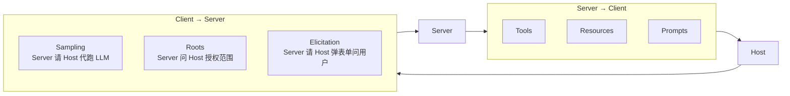
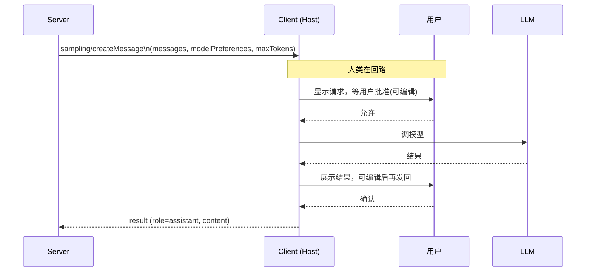
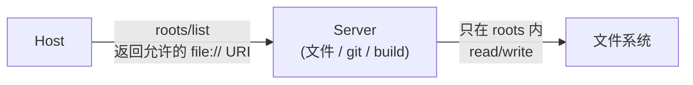
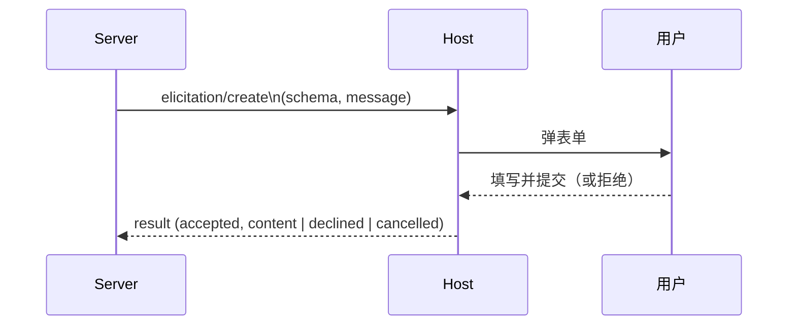
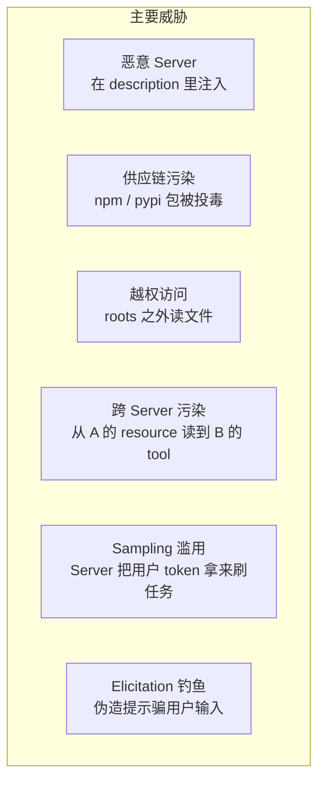
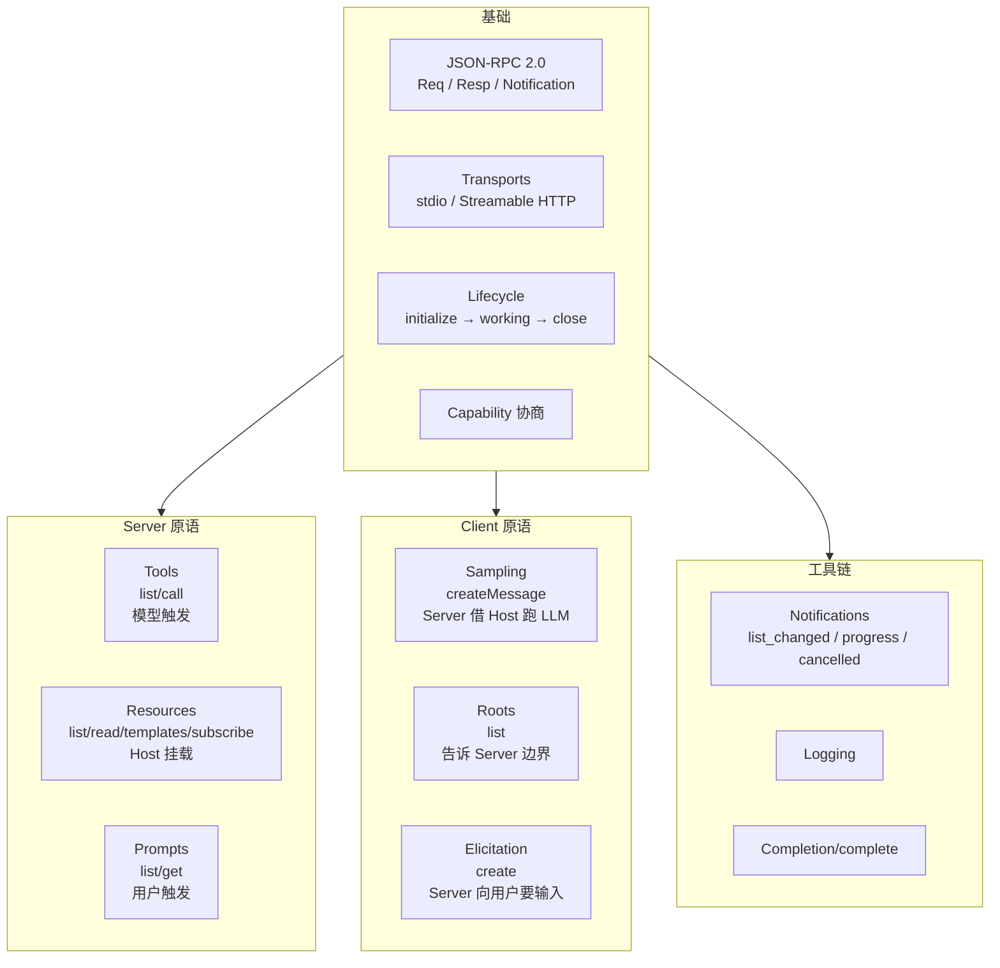

# 客户端原语与生产化：Sampling、Roots、Elicitation 与安全

## 前言

**C：** 前三篇把 Tools / Resources / Prompts 说透了——这三件事都是 Server → Client 的方向。本篇讲**反方向的三件事**：**Server 向 Client 发起请求**（Sampling / Roots / Elicitation），再把**生产落地**的话题（调试、可观测、安全、版本演进）收尾。这部分是让 MCP Server 真正"活得下来"的工程面。

<!-- more -->

## 一、客户端原语：为什么 Server 需要反向通信

先回顾一下**全景**。MCP 是对称的 JSON-RPC，**请求可以双向发**：



**为什么要有客户端原语**：

- **Sampling**：Server 自己不必集成 LLM、不必持 API Key；
- **Roots**：Server 想访问本地文件，需要先知道"哪里允许"；
- **Elicitation**：Server 有时需要用户补一段输入，但它又没有 UI。

三件事共同让 Server 变"**瘦**"——只管业务，不管模型接入、不管 UI、不管凭证。

## 二、Sampling：Server 借 Host 跑一次模型

### 2.1 它想解决的问题

很多 MCP Server 需要"再过一次模型"：

- **结构化抽取**：把网页抓回来后，让模型提取字段；
- **翻译 / 摘要**：返回长文前做一次压缩；
- **Agentic 子任务**：Server 内部有个小规划 / Reflexion 循环。

如果 Server 自己配模型：

- 要管 API Key、计费、多厂商适配；
- 用户在 Host 上的上下文**不可见**；
- Host 无法统一控制成本 / 审计。

**Sampling 的做法**：Server 发 `sampling/createMessage`，**Host 拿自己的模型 + 上下文策略跑一次**，把结果回给 Server。



**注意**两个强制要求：

1. **人类在回路（human-in-the-loop）是 SHOULD**：Host **应当**让用户审核请求、审核结果；
2. **Server 不知道 Host 用什么模型**：通过 `modelPreferences` **只表达偏好**，Host 最终决定。

### 2.2 请求体

```json
{
  "jsonrpc":"2.0","id":1,
  "method":"sampling/createMessage",
  "params":{
    "messages":[
      {"role":"user","content":{"type":"text","text":"把下面网页提取成 {title, author} JSON"}},
      {"role":"user","content":{"type":"text","text":"<长网页原文>"}}
    ],
    "systemPrompt":"You are a data extractor.",
    "maxTokens": 256,
    "modelPreferences":{
      "hints":[{"name":"claude"}, {"name":"sonnet"}],
      "intelligencePriority":0.8,
      "costPriority":0.3,
      "speedPriority":0.4
    }
  }
}
```

几件事：

- `modelPreferences.hints` 是**子串匹配**：写 "claude" 或 "sonnet"，Host 在**自己能用的**模型池里挑最接近的；
- 三个 priority（0~1）：intelligence / cost / speed，Host 结合自家模型定价做一次加权；
- `systemPrompt` 可选；Server 不能强加自己的 system——Host 可以**合并/忽略**。

### 2.3 带 tools 的 Sampling（2025-11 新增）

Sampling 也能让模型**在 Host 端跑 Function Calling 循环**：

```json
{
  "method":"sampling/createMessage",
  "params":{
    "messages":[...],
    "tools":[ /* Server 临时暴露的工具 */ ],
    "toolChoice":"auto"
  }
}
```

Client 声明 `sampling.tools` 能力后可用。这让 Server 能构造**临时的 Agent 回合**，而无需自己维护 Function Calling 调度器。

### 2.4 安全要点

- **Server 可见性有限**：规范明确说 Host **可以过滤**发给模型的 messages，避免泄露；
- **用户可拒绝**：User rejection 会回 `error code -1` 或类似；
- **不要用 Sampling 做无限循环**：Host 应限制每个 Server 的 Sampling 频次。

## 三、Roots：告诉 Server "你能在哪活动"

### 3.1 目的

文件系统型 Server（代码仓库、本地文档、构建日志）总需要一个"**允许操作的范围**"。Roots 就是 Host 向 Server 声明的**边界**。



- **Host 决定**哪些路径暴露；
- **Server 承诺**不越界；
- **协议本身**不强制 OS 级别隔离——真要硬隔离靠 Host 的沙箱（docker、macOS sandbox-exec、Landlock 等）。

### 3.2 Capability

Client 在 `initialize` 里声明：

```json
{
  "capabilities": {
    "roots": { "listChanged": true }
  }
}
```

### 3.3 协议消息

Server 发：

```json
{"jsonrpc":"2.0","id":1,"method":"roots/list"}
```

Client 回：

```json
{
  "jsonrpc":"2.0","id":1,
  "result":{
    "roots":[
      {"uri":"file:///home/user/projects/foo","name":"foo 仓库"},
      {"uri":"file:///home/user/projects/bar","name":"bar 仓库"}
    ]
  }
}
```

当用户在 Host 里**切换项目**、**开/关一个 root**时，Client 发通知：

```json
{"jsonrpc":"2.0","method":"notifications/roots/list_changed"}
```

Server 应**再 `roots/list`** 拉新范围，并**立即停止**对旧 root 的访问。

### 3.4 当前规范里的限制

- 目前 `uri` **必须是 `file://`**（未来可能扩展）；
- 不支持 glob、白/黑名单这些复杂规则——**只说"目录"**；
- 权限（读 / 写）协议里没区分，由 Host 自己配合沙箱控制。

## 四、Elicitation：Server 要一段结构化用户输入

### 4.1 一个典型需求

Server 在跑一个任务中途发现：

- 用户**没配**邮件发件人；
- 用户**没指定**目标仓库；
- 用户要在**若干选项**里挑一个。

Server 自己没 UI——它让 Host 帮它弹一个表单，把用户填的结果送回来。



### 4.2 请求体

```json
{
  "jsonrpc":"2.0","id":1,
  "method":"elicitation/create",
  "params":{
    "message":"请填写邮件发件人与签名",
    "requestedSchema":{
      "type":"object",
      "properties":{
        "sender":   {"type":"string","description":"发件人姓名"},
        "sender_email":{"type":"string","format":"email"},
        "signature":{"type":"string","description":"签名档"}
      },
      "required":["sender","sender_email"]
    }
  }
}
```

Host 根据 schema 自动渲染一个表单，内容可支持字符串、数字、枚举、布尔等基础类型。**不支持**任意复杂对象嵌套——**表单是给人填的**，不是给 AI 填的。

### 4.3 三种结果

```json
// 同意
{"action":"accept","content":{"sender":"Alice","sender_email":"a@x"}}
// 拒绝
{"action":"decline"}
// 取消（关了对话框）
{"action":"cancel"}
```

Server **一定要处理全部三种**。

### 4.4 不要把它当"普通 UI"用

Elicitation **不是**一般的前端表单替代品：

- **只在运行中**需要用户补充时用；
- **不做导航、不做多步向导**——那交给 Host 自己的 UI；
- **一次请求、一次表单**；要做复杂流程请组合多次 `elicitation/create`。

## 五、调试：mcp-inspector 是救命稻草

生产之前，MCP Server 必过的一关。官方出的 **MCP Inspector** 是 Server 的"**Postman**"：

```bash
# stdio 子进程
npx @modelcontextprotocol/inspector node ./my-server.js

# HTTP server
npx @modelcontextprotocol/inspector --url http://localhost:3000/mcp
```

启动后会拉一个 Web UI，左侧能看到：

- **Tools**：列清单 / 执行一次 `tools/call`；
- **Resources**：列清单 / 读一条；
- **Prompts**：列清单 / 渲染一次 `prompts/get`；
- **Messages**：完整 JSON-RPC 往返日志；
- **Capabilities**：双方声明的能力。

调 Server 时**养成先过 Inspector 再挂 Host 的习惯**——九成坑能在这层发现。

## 六、可观测：该记录什么

把 MCP 的每次交互当一次分布式调用，**至少记**这些字段：

| 字段 | 层 | 用途 |
| -- | -- | -- |
| `trace_id` | Host | 贯穿一次用户对话 |
| `server_name` + `server_version` | Host | 是哪个 Server |
| `method` | 协议 | `tools/list` / `tools/call` / `resources/read` / ... |
| `duration_ms` | 协议 | 单次往返耗时 |
| `isError / error_code / error_message` | 协议/业务 | 错因分类 |
| `tool_name / args_hash / result_size` | Tools | 工具维度 |
| `uri / size` | Resources | 资源维度 |
| `prompt_name / args_hash` | Prompts | 提示维度 |

**推荐栈**：OpenTelemetry + 一个 MCP 专用 tracer（社区已有 `mcp-otel` 等）。每一次 JSON-RPC call/response 是一个 span，**可视化后排查问题效率提升 10 倍**。

## 七、安全：生产 MCP 的真正门槛

上一章已经讲过若干原则，本节做一次收敛**，并补几个具体动作**。

### 7.1 威胁模型



### 7.2 Host 侧硬件化 checklist

- **只装信任的 Server**：第三方 Server 先在沙箱里跑；
- **Destructive / 写 tool 默认 Ask 档**；
- **roots** 明确限定到当前项目，不给 `$HOME`；
- **Sampling 限额**：每 Server 每小时 N 次，超了要用户确认；
- **Elicitation 显示来源**：必须标"**这个请求来自 Server X**"；
- **凭证不过 Host**：OAuth token 放 Host 的 keychain，MCP 上只过一个 session；
- **审计日志**：至少 7 天；
- **prompt injection 防御**：Server description / resource 内容**不可作为 prompt 一等信任源**，Host 自己的 system 应把"**不要让外部内容改变行为**"写死。

### 7.3 Server 侧自律

- 工具描述**不要**放可执行指令一类的诱导文字；
- 越权访问**主动**返回 `-32602` 或业务错，不要默默执行；
- 结果**脱敏**：密钥 / 邮箱 / 手机号 该 redact 的 redact；
- 升级**发公告**：变更 tool 名 / 语义 / resource scheme 要在 Release Note 里醒目写出。

## 八、版本演进与治理

MCP 用**日期字符串版本**，演进原则**类似 Kubernetes API**：

- **Alpha/Beta/GA** 概念弱化，但规范里有 SEP（Spec Enhancement Proposal）流程；
- **向后兼容**：旧客户端 / 服务端在新规范里仍能用（通过降级协商）；
- **废弃**路径：先标 soft-deprecated（规范里明写），一两版本后移除。

截至 2026 年初，**推荐的生产实践**：

- 固定你支持的 **protocolVersion 范围**（两到三个邻近版本），日常只跟随官方的 **两年有效期** 推移；
- 每次规范发新版时，**先上 Inspector 测**，再升线上；
- 关注**能力协商的子项**：例如 `resources.subscribe`、`sampling.tools`、`roots.listChanged`——子项的增删比主版本号影响大。

## 九、从协议回到产品：一张"心智总图"

写到这儿，整个 MCP 的**协议层全景**可以压进一张图：



**五大组件**： 基础协议 / 服务端原语 / 客户端原语 / 通用工具链 / 运维层。记住这张图，你对 MCP 的掌握就能在任何 Host 或 SDK 上复用。

## 十、小结

- **Sampling** 让 Server 借 Host 的模型跑 LLM——Server 变瘦、Host 统一管账；
- **Roots** 是 Host → Server 的文件系统授权边界；
- **Elicitation** 让 Server 通过 Host 临时向用户要结构化输入；
- 三者合起来让 MCP 成为一个**真正的双向协议**；
- 生产化靠四件事：**Inspector 调试** + **结构化观测** + **安全硬件化** + **版本协商治理**；
- 协议本身只管"**能不能说**"，**安全与体验** 最终仍由 Host / Server / 用户共同维护。

至此，**`ai-basics / 03-Model-Context-Protocol`** 章节结束。你可以把这 6 篇当作一本小规范读：一本自下而上搭起来的 MCP 操作手册。

::: tip 延伸阅读

- [MCP Spec · Sampling](https://modelcontextprotocol.io/specification/2025-11-25/client/sampling)
- [MCP Spec · Roots](https://modelcontextprotocol.io/specification/2025-11-25/client/roots)
- [MCP Spec · Elicitation](https://modelcontextprotocol.io/specification/2025-11-25/client/elicitation)
- [MCP Inspector GitHub](https://github.com/modelcontextprotocol/inspector)
- 完整协议索引：[modelcontextprotocol.io](https://modelcontextprotocol.io)
- 同站：`vibe-coding/01-Claude-Code/04-进阶：Subagents、Hooks、MCP 与 Plugins`
- 同站：`vibe-coding/02-OpenCode/04-进阶：多 session、LSP、MCP 与 IDE/桌面扩展`

:::
