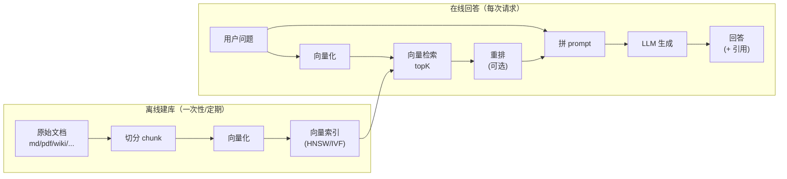
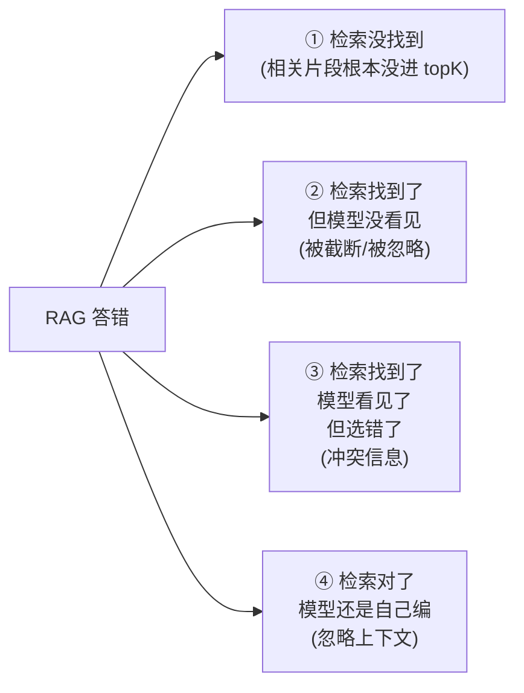

# RAG 是什么：从参数记忆到检索记忆

## 前言

**C：** RAG（Retrieval-Augmented Generation）这个词已经泛滥到一度显得廉价——"接个向量库就是 RAG"。这一篇不讲怎么搭，先把一个更本源的问题问清楚：**语言模型已经"记"了那么多东西，为什么还需要检索？**

<!-- more -->

## 一、语言模型其实有两种"记忆"

一个训练好的 LLM，把知识装在两处：

| 存储位置 | 叫法 | 特性 | 典型容量 |
|---|---|---|---|
| 模型权重 | **参数记忆 (parametric memory)** | 稳定、零延迟、不可编辑 | ~TB 级权重压缩出来的 GB 级知识 |
| 提示上下文 | **上下文记忆 (contextual memory)** | 即时、可编辑、按 token 付费 | 受 context window 限制（8K–1M） |

两者都有但都不够用：

- **参数记忆**：你新写的文档、昨天改的 API、内部只能看的合同——**权重里没有**；
- **上下文记忆**：你把公司全部文档塞进 prompt？**塞不下，也塞不起**。

**RAG 的定位**：在两者之间引入**第三种记忆**——

> **外部检索记忆 (retrieval memory)**：把知识存在模型**外部**的数据库里，用"检索"把当前问题所需的**相关片段**挑出来，拼进 prompt。

一句话：**RAG 不是"让模型变聪明"，是"让模型每次回答前翻几页书再张嘴"。**

## 二、三种方案的对比：为什么多数场景选 RAG

给同一个目标"让模型能准确回答公司内部文档的问题"，三条路：

| 方案 | 原理 | 更新成本 | 精度 | 适用性 |
|---|---|---|---|---|
| **换模型** | 用知识更新的更大模型 | 高（依赖供应商） | 高，但仍是**通用知识** | 通用问答 |
| **微调 / 继续训练** | 把知识压进权重 | 每次更新都要重训，小时–天 | 高，但**难溯源** | 风格 / 领域语言 / 格式 |
| **RAG** | 在外库挂文档，查后再答 | **实时**，秒级索引 | 依赖检索质量 | 需要**引用 / 时效 / 权限**的场景 |

**真实的决策边界**：

- 想让模型"**换一种说话风格**" → 微调（或 LoRA）；
- 想让模型"**知道一件新事**" → RAG；
- 想让模型"**既会说话又知道新事**" → 微调的**模型** + RAG 的**知识**，两者**正交**，不是二选一。

## 三、一条 RAG 请求到底发生了什么



两条流水线**时间尺度完全不同**：

- **离线侧**：跑一次可能几小时，产物是一份**向量索引**；
- **在线侧**：每个用户问题都要跑一遍，预算通常在**200–800 ms**（检索 + 生成）。

分开看：

### 3.1 离线建库

1. **Loader**——把文档读进内存（md、pdf、wiki、DB 行……）；
2. **Splitter / Chunker**——切成几百 token 的片段；
3. **Embedding**——把每个片段投到一个 768 / 1024 / 3072 维向量；
4. **Indexer**——把向量写入支持 ANN 的库（pgvector / Qdrant / Milvus…）。

这条线决定了**你能不能查准**——后续三篇会分别深挖 Chunking、Embedding、ANN。

### 3.2 在线回答

1. **Query Embedding**——把问题向量化（**必须**用建库时同一个模型）；
2. **Retrieve**——到索引里取 top-K 相似片段；
3. **Rerank**（可选）——用更贵更准的模型再排序一次；
4. **Compose**——把片段塞进 prompt 模板，通常是：

   ```text
   回答用户问题，仅基于下面给出的参考片段。
   若参考片段不足以回答，请回答"不知道"。
   ---
   [1] ... 片段一 ...
   [2] ... 片段二 ...
   ---
   问题：{user_query}
   ```

5. **Generate**——LLM 吃完这段 prompt 输出答案，**带引用**（`[1]`、`[2]`……）；
6. **Postprocess**——过滤、去引用、合规校验、落日志。

## 四、RAG 真正"增强"了什么

再看一遍名字：**Retrieval-Augmented** Generation——被增强的是**生成**，被用来增强的是**检索**。具体增强了四件事：

| 维度 | 没有 RAG | 有 RAG |
|---|---|---|
| 时效性 | 受训练截止日期限制 | 加新文档即刻生效 |
| 可溯源 | "我模型说的就是这样" | 每句可以带 `[source.md:L10]` |
| 权限隔离 | 模型知识对所有人一样 | 根据用户 scope **过滤** chunk |
| 可编辑 | 错了要重训 | 错了**改一行 markdown** |

这四点才是 RAG 在企业场景难以被替代的原因——不是 accuracy，是**可控性**。

## 五、RAG 不是银弹：它会坏在哪里

常见失败模式：



这四类分别对应四条调优路径：

- **① 召回低** → 改 chunking、换 embedding、上混合检索（第 05 篇）；
- **② 上下文丢失** → 压缩片段、控制 top-K、用 long-context 模型；
- **③ 选错来源** → 加 rerank、用元数据过滤、给每个源打可信度；
- **④ 幻觉依旧** → 调 prompt（"仅基于片段"）、降 temperature、加"拒答"分支。

一个朴素但管用的原则：

> **"你看不见一个 RAG 系统的召回率，就看不见它的 accuracy。"**

先把**"相关片段是否进了 top-K"**这件事度量出来，再谈生成侧。第 06 篇会专门讲评测。

## 六、一个能跑的最小 RAG（30 行）

纯原理层面，不依赖任何框架：

```python
import numpy as np
from openai import OpenAI
client = OpenAI()

def embed(texts: list[str]) -> np.ndarray:
    r = client.embeddings.create(model="text-embedding-3-small", input=texts)
    return np.array([e.embedding for e in r.data])

DOCS = [
    "公司年假政策：每年 15 天，入职满一年生效。",
    "公司报销流程：在 OA 提交发票，5 个工作日内打款。",
    "公司食堂：周一至周五 11:30–13:00 开放。",
]
DB = embed(DOCS)                              # 离线一次性

def ask(q: str, k: int = 2) -> str:
    qv   = embed([q])[0]
    sims = DB @ qv / (np.linalg.norm(DB, axis=1) * np.linalg.norm(qv))
    idxs = sims.argsort()[::-1][:k]
    ctx  = "\n".join(f"[{i+1}] {DOCS[j]}" for i, j in enumerate(idxs))
    msg  = [
        {"role":"system","content":"仅基于下面资料回答，不足以回答就说不知道。"},
        {"role":"user",  "content": f"资料：\n{ctx}\n\n问题：{q}"},
    ]
    return client.chat.completions.create(
        model="gpt-4o-mini", messages=msg
    ).choices[0].message.content

print(ask("年假有几天？"))
```

30 行里已经包含 RAG 的**全部骨架**：embed → search → compose → generate。剩下的工程问题——更好的切分、更好的向量、更快的索引、更稳的 rerank——都是在这条骨架上做**局部优化**。

## 七、本册 RAG 章节的路线图

| 篇 | 主题 | 一句话 |
|---|---|---|
| 01（本篇） | RAG 是什么 | 理解"为什么需要检索记忆" |
| 02 | Chunking 切分 | 切得不对，后面全错 |
| 03 | Embedding | 你把文本变成了**什么样**的几何体 |
| 04 | ANN 与向量库 | HNSW/IVF 和怎么选库 |
| 05 | 混合检索与重排 | BM25 + 稠密 + rerank 才是工业版 |
| 06 | 评测与优化 | 能测才能改 |

这六篇是**通用原理**；框架层面的落地（LangChain/LlamaIndex 的 `Retriever` 怎么写）放在 **ai-agent / 03-LangChain / 05** 那篇。

## 八、小结

- LLM 有参数记忆和上下文记忆，RAG 加了第三种：**外部检索记忆**；
- RAG 不是让模型变聪明，而是让它回答前**翻相关资料**；
- 核心增值在**时效、溯源、权限、可编辑**，accuracy 只是副产品；
- 失败模式分四类，**先量化召回再调生成**是最常被忽视的一步；
- 30 行就能写出一个 RAG 的"骨架"，难点全在**骨架上的每一层怎么做对**。

::: tip 延伸阅读

- 原始论文：[Retrieval-Augmented Generation for Knowledge-Intensive NLP Tasks (Lewis et al., 2020)](https://arxiv.org/abs/2005.11401)
- 综述：[A Survey on RAG (2024)](https://arxiv.org/abs/2312.10997)
- 实用：[Pinecone: RAG from First Principles](https://www.pinecone.io/learn/retrieval-augmented-generation/)
- 本册下一篇：`02-切分Chunking：把文档变成可检索单元`

:::
