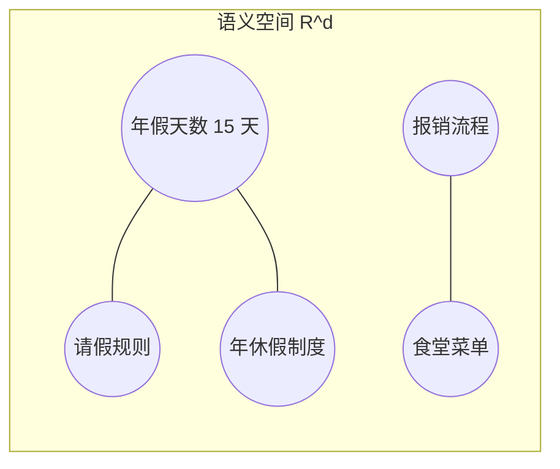
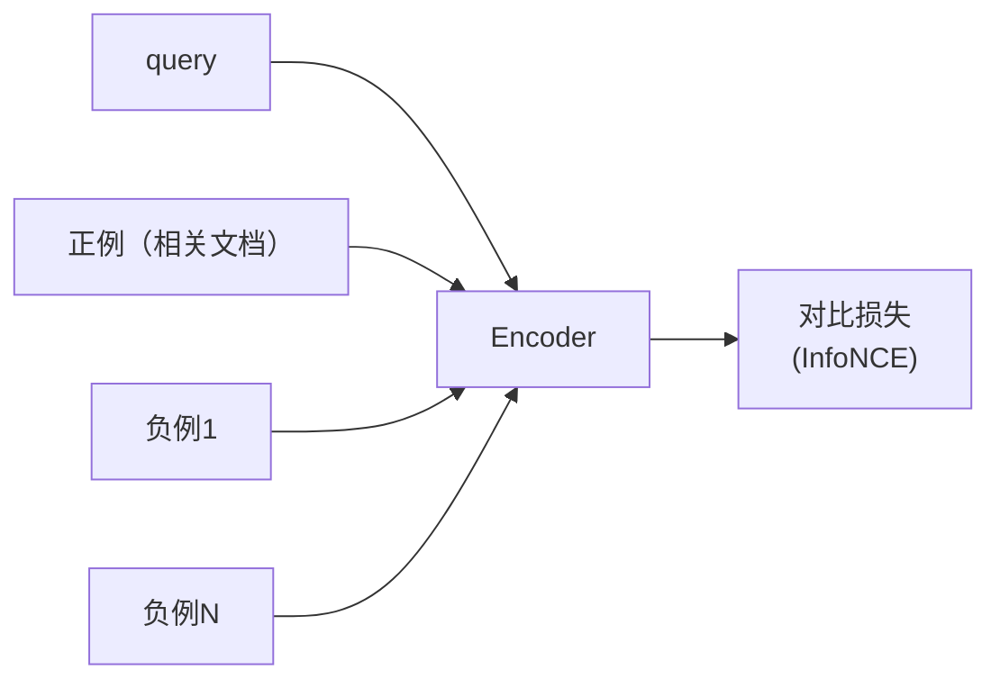

# Embedding：把文本投影到语义空间

## 前言

**C：** 上一篇切好了 chunk，下一件事就是"**把每个 chunk 变成一个向量**"。这件事听起来平平无奇，但它决定了你的 RAG 系统**什么叫相关**——embedding 定义了"语义"在你的系统里到底是什么。

<!-- more -->

## 一、Embedding 是什么

一句直白的定义：

> **Embedding 是一个函数 `f(text) → R^d`，它把任意文本映射到一个 d 维空间里的点，并保证"语义相近的文本，在空间里距离也近"。**

一个典型的 `d`：384、768、1024、1536、3072。比如 OpenAI 的 `text-embedding-3-small` 是 1536 维。

几何直觉：



- `年假天数` 和 `年休假制度` 几乎重合——**近义**；
- `报销流程` 和 `食堂菜单` 都和年假无关，但它俩之间也差很远——**不同的远**。

这种"高维空间里的距离"就是 RAG 做相似度搜索的依据。

## 二、这个函数从哪来：三代 embedding 的谱系

### 2.1 词向量时代（Word2Vec / GloVe，~2013）

早期 embedding 是**词级别**的，每个词一个固定向量。

- 优点：简单、开箱即用；
- 缺点：**"苹果"**（水果 vs 公司）只有一个向量；短语/句子一般靠词向量平均——信息损失大；对上下文完全不敏感。

### 2.2 句向量时代（Sentence-BERT，2019）

把 BERT 拿过来做**双塔对比学习**：同义句拉近、非同义句推远。产物是 `sentence-transformers`（`all-MiniLM-L6-v2`、`bge-base`、`m3e-base` 都是这路子）。

- 支持**句子级/段落级**向量；
- 质量高、速度快、可本地部署；
- 绝大多数开源 RAG 至今跑的是这一代。

### 2.3 大模型时代（E5 / BGE / OpenAI v3 / Gemini embedding，2023+）

用**更大的 encoder + 更大规模的对比学习 + instruction tuning**，诞生了一批超强通用 embedding：

- **OpenAI** `text-embedding-3-small / -large`（1536 / 3072 维，支持 Matryoshka 可变维度）；
- **BGE-M3 / BGE-multilingual**（多语言、支持稠密 + 稀疏 + 多向量）；
- **E5 / Jina**（开源强模型）；
- **多模态**：CLIP、BGE-Visual 能把图文映射到**同一空间**。

如今谈 "embedding 选型"，默认是选第三代。

## 三、怎么训练出这种语义空间：对比学习

所有现代 embedding 模型都走**对比学习（contrastive learning）**：



目标：**query 和正例的相似度 > query 和所有负例的相似度**。

数学上就是最小化：

\[
\mathcal{L} = -\log \frac{\exp(\text{sim}(q, d^+)/\tau)}{\sum_{d \in \{d^+\} \cup D^-} \exp(\text{sim}(q, d)/\tau)}
\]

`τ` 是温度系数，控制区分度。

**这带来三个副作用你必须知道**：

1. **模型只学了它见过的"相关"的定义**——训练集里怎么配对，生产中相关性就是那样；
2. **负例的质量决定上限**——全用随机采样的负例，模型会只学"一眼看出不相关"的粗颗粒；配**难负例**（表面相似但实际不相关）才能学到细致语义；
3. **不同模型的向量互不兼容**——同一句话过两个模型得到两个向量，**不在同一个空间**，不能混用。

第三点最容易踩坑：

> **建库用什么模型，查询就必须用同一个模型**——哪怕只是换了版本号。

## 四、选型：你到底该用哪个 embedding

没有万能答案。按三个维度选：

### 4.1 语言

| 语言分布 | 候选 |
|---|---|
| 纯英文 | `text-embedding-3-small`、`bge-large-en-v1.5`、`e5-large-v2` |
| 中英混 | `bge-m3`、`bge-large-zh-v1.5`、`jina-embeddings-v3` |
| 多语言 | `bge-m3`、`multilingual-e5`、`cohere-embed-multilingual-v3` |
| 代码 | `bge-code`、`jina-embeddings-v2-base-code`、`voyage-code` |

中文别默认用 OpenAI 英文模型——在中文**长文档**上召回会差一截。

### 4.2 部署方式

| 方式 | 代表 | 成本 | 延迟 | 隐私 |
|---|---|---|---|---|
| **云 API** | OpenAI、Cohere、Voyage、Jina | 按调用 | 20–100 ms | 数据出域 |
| **本地开源** | BGE、E5、M3E（HuggingFace） | 显存 + 电费 | 5–30 ms（GPU） | 完全可控 |
| **本地量化** | bge-small int8 / GGUF | 最低 | 15–50 ms（CPU） | 可控 |

内部文档 / 合规敏感 → 本地部署几乎是唯一选项。

### 4.3 质量 vs 维度 vs 速度

经验排序（质量）：

> **bge-m3 ≈ voyage-3 ≈ openai-v3-large > e5-large ≈ bge-large ≈ openai-v3-small > bge-base ≈ MiniLM-L6**

但质量高往往意味着**维度大、速度慢、库大**。

一个很有用的新特性叫 **Matryoshka Embedding**：模型训练时让前 k 维也是一个有效 embedding，推理时可以**截断**来换速度：

```python
# OpenAI v3 支持 dimensions 参数
emb = client.embeddings.create(
    model="text-embedding-3-large",
    input=text,
    dimensions=512,         # 原始 3072 → 截断到 512
)
```

截 1/6 维度，召回下降往往只有 1–3%，内存和查询耗时直接少 6 倍。

## 五、工程上要当心的几件事

### 5.1 归一化（normalize）

余弦相似度 `cos(a,b) = (a·b) / (|a||b|)`——如果把所有向量先**除以自己的范数**，那么 `cos(a,b) = a·b`，用内积比余弦快得多。

```python
v = v / np.linalg.norm(v)
```

**OpenAI 的 embedding 已经归一化**（范数 ≈ 1），直接内积即可。开源模型**建议自己归一化一次**，入库前落盘，一劳永逸。

### 5.2 相似度度量

| 度量 | 公式 | 何时用 |
|---|---|---|
| Cosine | `(a·b)/(|a||b|)` | 默认 |
| Inner product | `a·b` | 向量已归一化，= Cosine，更快 |
| L2 / 欧氏距离 | `|a−b|` | 训练时用了 L2（BGE 部分变体） |

**规则**：看模型说明书，它是用什么度量训练的，你就用什么。别把用 L2 训出来的模型配 cosine 查询。

### 5.3 Query 和 Passage 是否要加 instruction

现代 embedding 模型很多是 **instruction-tuned**：训练时在 query 前加固定前缀，在 passage 前加另一个前缀。BGE 是典型：

```python
query    = f"为这个句子生成表示以用于检索相关文章：{q}"   # query 侧
passages = [f"{p}" for p in docs]                       # passage 侧直接用
```

M3E、E5 都有各自约定：`"query: ..."` / `"passage: ..."`。**不加前缀精度能差 5–15%**，这是新手最常见的"怎么 embedding 很差"的根因。

### 5.4 批量化（batch）

向量化 100 万 chunk 如果一条一条发 API，一天都跑不完。

- 云 API：一次性 100–500 条一批，注意**总 token 数**不要超上限；
- 本地模型：`encoder.encode(texts, batch_size=64)`，GPU 效率能高 10–100 倍。

### 5.5 Token 截断

Embedding 模型也有最大输入 token 上限（常见 512、8192），超过会**默默截断**。

- 长 chunk 要**先截再 embed**；
- 或者换支持长文档的模型（`bge-m3` 8192 tok、`jina-v3` 8192 tok）。

千万别假设"我 chunk 切到 1500 tok，模型都能收"——不一定。

### 5.6 缓存

embedding **确定性映射**：同一模型 + 同一文本 = 同一向量。

- 建库层面：对 `hash(model_name, text)` 做缓存，改了 chunking 但内容没变的不要重跑；
- 查询层面：如果某些 query 很热（比如"怎么重置密码"），缓存 query 向量可以省一次调用。

## 六、多向量与多模态：下一个前沿

### 6.1 多向量（ColBERT 家族）

传统 embedding 一个 chunk 一个向量，所有 token 的信息被压成 1 个点，**细节丢失**。

**ColBERT**：保留每个 token 的向量，检索时做"**后期交互**"（late interaction）——

```text
score(q, d) = Σ_i max_j ( q_i · d_j )
```

即 query 的每个 token 与 doc 的所有 token 做最大匹配再求和。

- 优点：精度显著高于单向量；
- 缺点：存储和计算都贵 10 倍以上；
- 代表：ColBERTv2、JaColBERT、bge-m3 的 multi-vector 模式。

一般做法：稠密单向量做**粗召回**，ColBERT 做**重排**（见第 05 篇）。

### 6.2 多模态 embedding

把图像、音频、视频和文本**投影到同一空间**：

- **CLIP** / **SigLIP**：文本 ↔ 图像；
- **CLAP**：文本 ↔ 音频；
- **BGE-Visualized / Jina-CLIP**：文档图像 + 文本。

多模态 RAG 的典型用途：扫描版 PDF、产品图、视频片段检索。

## 七、一段可用的生产侧代码

```python
import numpy as np
from FlagEmbedding import BGEM3FlagModel

# 1. 加载模型（本地 GPU，~1.5G 显存）
model = BGEM3FlagModel("BAAI/bge-m3", use_fp16=True)

def embed(texts: list[str], is_query: bool = False) -> np.ndarray:
    # 2. 批量编码；BGE-M3 的稠密输出已归一化
    out = model.encode(
        texts,
        batch_size=64,
        max_length=2048,
        return_dense=True,
        return_sparse=False,
        return_colbert_vecs=False,
    )
    v = out["dense_vecs"]
    # 3. 双保险：再归一化一次
    v = v / np.linalg.norm(v, axis=1, keepdims=True)
    return v.astype("float32")

# 建库
doc_vecs = embed(chunks)

# 查询
q_vec    = embed([user_query], is_query=True)[0]
scores   = doc_vecs @ q_vec
top      = np.argsort(scores)[::-1][:10]
```

几个已经考虑到的点：

- 模型固定（`bge-m3`）、`fp16` 降显存；
- batch 64、max_length 2048、稠密输出；
- 归一化两次确保后续用内积 = cosine；
- 查询走相同的 `embed` 函数，保证**模型、长度、归一化策略完全一致**。

## 八、最常见的 embedding 故障

### 8.1 "召回完全不相关"

- 查询没加 instruction 前缀（BGE 系列必踩）；
- 查询和建库用了**不同模型**或**同模型不同版本**；
- 查询没做和建库一样的预处理（大小写、去标点）。

### 8.2 "召回能找到，但同义词失效"

- 模型太小（`MiniLM-L6`）或太老（`Word2Vec`）；
- 换 `bge-m3` / `e5-large` / `openai-v3` 级别通常立竿见影。

### 8.3 "同一句话向量每次略不同"

- 推理时开了 dropout / 多 GPU 非确定性；
- 生产务必 `model.eval()` + fp32 或固定 seed，保证离线/在线向量一致。

### 8.4 "向量存库后，cosine 都 > 0.99"

- 向量是未训练或训崩的模型产物——所有向量聚在一小块；
- 或者没归一化，但库里把 `|v|` 当索引 key 了；
- 换模型前先做一次"向量方差"体检：`np.var(vecs, axis=0)` 每一维都应有明显方差。

### 8.5 "文本一长就召回崩掉"

- 超过 max_length 被截断了；
- 解决：chunk 在 embedding 前按 token 截，或切小。

## 九、小结

- Embedding 是 "**语义 = 几何**" 的具体化——它定义了你 RAG 系统里的"相关"；
- 第三代 embedding（BGE-M3、OpenAI v3、Voyage、Jina v3）在通用/中英混/多模态场景基本够用；
- 选型三维度：**语言、部署方式、质量-维度-速度**；
- 工程细节决定质量：**归一化、度量、instruction prefix、批量、截断、缓存**；
- 多向量（ColBERT）和多模态是下一步——先把单向量 RAG 做扎实再上；
- 下一篇讲**怎么在百万级向量里快速找到 top-K**——HNSW、IVF，以及各家向量库的选择。

::: tip 延伸阅读

- [Sentence-BERT 原论文](https://arxiv.org/abs/1908.10084)
- [BGE-M3 技术报告](https://arxiv.org/abs/2402.03216)
- [MTEB 排行榜（embedding 质量权威榜）](https://huggingface.co/spaces/mteb/leaderboard)
- [OpenAI v3 + Matryoshka 说明](https://openai.com/index/new-embedding-models-and-api-updates/)
- 本册下一篇：`04-向量检索与ANN：HNSW、IVF与向量库对比`

:::
