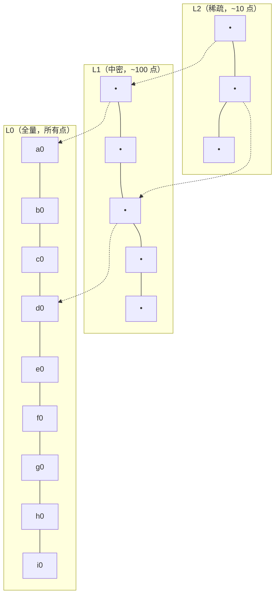
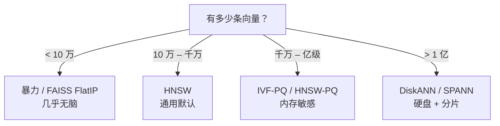
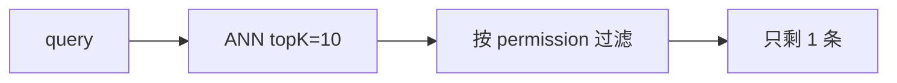

# 向量检索与 ANN：HNSW、IVF 与向量库对比

## 前言

**C：** chunk 切好了、向量算好了，下一步就是"**给我 query 向量最近的 K 个**"。100 条向量暴力比对没问题，1000 万条呢？这一篇讲**为什么不能精确找、近似找又是怎么找的**，以及主流向量库在这件事上各自是怎么做的。

<!-- more -->

## 一、问题定义：k-NN 与 ANN

给定一个 query 向量 `q` 和库里 N 个向量 `{v₁, ..., vₙ}`，目标：

> 找出**距离 `q` 最近**的 K 个向量（K 通常 5–100）。

按距离定义可以是 cosine、内积、L2。按"是否精确"分两类：

| 类别 | 英文 | 复杂度 | 做法 |
|---|---|---|---|
| 精确 k-NN | exact kNN | O(N·d) | 一条一条算距离 |
| 近似 k-NN | **A**pproximate **N**earest **N**eighbor | 亚线性 | 建索引牺牲一点精度换速度 |

- N = 1 万、d = 1024 → 暴力每次 **~10 ms**，能用；
- N = 100 万 → 暴力每次 **~1 秒**，太慢；
- N = 1 亿 → 暴力 **~100 秒**，**不可能**在线用。

所以百万以上必须走 ANN。ANN 的精度用 **recall@K** 衡量——

> recall@K = (ANN 找出的 top-K 里，有多少条是**真正的** top-K) / K

生产里 `recall@10 ≥ 0.95` 通常够用；小于 0.9 就明显感知到 "怎么找不到明明有的文档"。

## 二、ANN 算法家族

三大流派：

```mermaid
flowchart TB
  ann["ANN 算法"]
  ann --> tree["① 基于树\nKD-tree / Annoy"]
  ann --> lsh["② 基于哈希\nLSH"]
  ann --> graph["③ 基于图\nHNSW"]
  ann --> quant["④ 基于量化\nPQ / IVF-PQ / OPQ"]
  graph --> hnsw["HNSW\n(生产默认)"]
  quant --> ivfpq["IVF-PQ\n(超大库)"]
```

树 / LSH 现在已**基本退场**，工业界主力是 HNSW 和 IVF-PQ。下面分别讲清楚。

### 2.1 HNSW：分层小世界图

**Hierarchical Navigable Small World graph** —— 如今事实上的 ANN 默认选择。

核心思想：把向量组织成**多层图**，上层稀疏（长跳远）、下层密集（短跳近），像高速公路 + 市政路：



查询过程：

1. 从 top 层**入口点**开始，贪心地走到离 query 最近的邻居；
2. 到不能更近时**下降一层**，继续贪心；
3. 一直到最底层 L0，做小范围精查。

关键参数：

| 参数 | 作用 | 经验值 | 影响 |
|---|---|---|---|
| `M` | 每个点的邻居数 | 16–64 | ↑ recall，↑ 内存，↑ 建图时间 |
| `efConstruction` | 建图时搜索宽度 | 100–400 | ↑ 质量，↑ 建图时间 |
| `efSearch` | 查询时搜索宽度 | 50–200 | ↑ recall，↑ 延迟 |

**典型选择**：`M=32, efConstruction=200, efSearch=100`。内存占用大约 **`(M·2·4 + d·4)·N` bytes**。

优点：

- 查询快（log N 级）、recall 高（0.95+ 很轻松）；
- 支持**增量插入**，不用重建；
- 任何度量（cos / L2 / ip）都能用。

缺点：

- **内存开销大**——所有向量 + 图边都在内存里；
- 千万级向量需要 GB 级内存，亿级要考虑分片。

### 2.2 IVF：倒排文件索引

**Inverted File Index** —— 把空间先**聚类**，再分桶查。

建索引：

1. 对所有向量做 k-means 聚类，得到 `nlist` 个中心（例如 4096）；
2. 把每个向量分配到最近的中心，像倒排索引一样存起来。

查询：

1. 算 query 到所有 `nlist` 个中心的距离；
2. 选前 `nprobe` 个桶（例如 8–64）；
3. 在这些桶里**暴力精查**，取 top-K。

关键参数：

| 参数 | 经验值 | 影响 |
|---|---|---|
| `nlist` | `4·√N`–`16·√N`（百万级：4096–16384） | ↑ 更细，↑ 训练时间 |
| `nprobe` | 8–128 | ↑ recall，↑ 延迟 |

优点：

- 比暴力快得多；
- 可以和量化组合成 **IVF-PQ**（见下）压到极小内存。

缺点：

- 边界问题：query 正好落在两个桶之间，邻居被切到其他桶里，`nprobe` 小就漏；
- `nprobe` 调大 recall 就回来，但延迟也回来了。

现在纯 IVF 已经不太用，都用 IVF-PQ。

### 2.3 PQ / IVF-PQ：向量量化

**Product Quantization**：把一个 d 维向量拆成 m 段，每段单独做 k-means 量化到 8 bit 码字。

- 1024 维 × 4 字节 = 4096 字节/向量；
- 拆 64 段 × 1 字节 = **64 字节/向量**，**压缩 64 倍**；
- 距离可以通过查表近似计算（ADC / SDC），比暴力快很多。

**IVF-PQ** 就是 IVF + PQ 的组合：先粗聚类，再桶内 PQ 近似距离。

典型场景：**亿级向量 + 有限内存**——Faiss 经典"在 8G 内存里放 1 亿 1024 维向量"就是 IVF-PQ 的用例。

代价：**recall 会下降**（0.85–0.95 区间），通常搭配**重排**（见第 05 篇）补回精度。

### 2.4 DiskANN / SPANN：硬盘也能用

**DiskANN**（微软）和 **SPANN**（微软）把大部分数据**放在 SSD**上，只把少量 "head / pivot" 点放在内存：

- 内存占用降到 1/10；
- P99 延迟还能压在 5–10 ms；
- 代价：写入变复杂、SSD 随机读寿命。

适合**超大库 + 预算有限**的场景（10 亿+ 向量）。

## 三、算法选择决策树



80% 的工业 RAG 落在 **10 万–千万** 这一档——**HNSW 就是首选**。

## 四、主流向量库对比

向量库 = ANN 算法 + 存储 + 过滤 + 运维。不同场景侧重点完全不同。

| 向量库 | 定位 | ANN | 特点 | 适合 |
|---|---|---|---|---|
| **Faiss** | C++ 库 | HNSW / IVF-PQ / GPU | 最快、最全算法；无服务、无元数据 | 一切**单机离线**场景 |
| **pgvector** | Postgres 扩展 | HNSW / IVFFlat | SQL + ACID + JOIN；** | 已有 PG 的业务、需元数据 SQL |
| **Qdrant** | Rust 独立服务 | HNSW | 过滤表达力强、payload JSON、Rust 性能 | 中大规模生产，过滤密集 |
| **Milvus / Zilliz** | 分布式云 | 多种 | 集群、超大规模、分片副本 | 亿级、多租户 |
| **Weaviate** | Go 独立服务 | HNSW | GraphQL、hybrid search 内置 | 需要 hybrid 一站式 |
| **Elasticsearch / OpenSearch** | 搜索引擎 | HNSW | 同时有 BM25、聚合、日志生态 | 文本 + 向量混合搜索 |
| **Chroma** | Python 服务 | HNSW | 开箱即用、0 依赖 | Demo / 小项目 |
| **LanceDB** | 嵌入式列存 | IVF-PQ | Parquet 原生、无服务 | 数据湖工作流 |
| **Vespa** | Yahoo 引擎 | HNSW + rank | 工业级排序、多 stage | 真正的搜索/推荐厂 |

### 4.1 实务选择矩阵

| 你的情况 | 首推 |
|---|---|
| 已经有 PG | **pgvector**（一张表就够，运维最省） |
| 纯 demo / notebook | **Chroma** 或 **FAISS Flat** |
| 需要严格权限过滤 | **Qdrant**（payload JSON filter 是一等公民） |
| 需要混合检索（向量 + 全文） | **Weaviate** / **OpenSearch** |
| 亿级 + 多租户 | **Milvus** / **Zilliz Cloud** |
| 完全离线 / 嵌入式 | **LanceDB** / **FAISS** |

### 4.2 pgvector 建索引示例

```sql
CREATE EXTENSION vector;

CREATE TABLE kb (
    id        SERIAL PRIMARY KEY,
    text      TEXT,
    meta      JSONB,
    embedding vector(1024)
);

-- HNSW（pgvector 0.5+）
CREATE INDEX ON kb USING hnsw (embedding vector_cosine_ops)
  WITH (m = 32, ef_construction = 200);

-- 查询前调 efSearch（本次会话生效）
SET hnsw.ef_search = 100;

SELECT id, text, 1 - (embedding <=> $1) AS score
FROM kb
WHERE meta @> '{"permission":["all-staff"]}'
ORDER BY embedding <=> $1
LIMIT 10;
```

`<=>` 是 cosine 距离算子（`<->` 是 L2、`<#>` 是负内积）。

### 4.3 Qdrant 例

```python
from qdrant_client import QdrantClient
from qdrant_client.http.models import (
    Distance, VectorParams, PointStruct, Filter, FieldCondition, MatchValue,
)

client = QdrantClient(host="qdrant", port=6333)

client.recreate_collection(
    collection_name="kb",
    vectors_config=VectorParams(size=1024, distance=Distance.COSINE),
    hnsw_config={"m": 32, "ef_construct": 200},
)

client.upsert(collection_name="kb", points=[
    PointStruct(id=i, vector=v.tolist(),
                payload={"source": docs[i].meta["source"]})
    for i, v in enumerate(vectors)
])

hits = client.search(
    collection_name="kb",
    query_vector=q_vec.tolist(),
    limit=10,
    search_params={"hnsw_ef": 128},
    query_filter=Filter(must=[
        FieldCondition(key="permission", match=MatchValue(value="all-staff"))
    ]),
)
```

注意 **filter 和 HNSW 的交互**：严格过滤会把很多节点剪掉，图变稀疏，recall 会掉。Qdrant 的做法是**先过滤再走图**，并在过滤强度高时切换到精确搜索。

### 4.4 "过滤走错路"是向量库最常见的 bug



后置过滤会导致 **top-K 被过滤掉大半**。正确做法：

- 让 ANN 在**有过滤条件的子集**里搜索（pre-filter）；
- 或先粗召回 top-200，过滤后取前 10。

选库前先看它的**过滤策略文档**。

## 五、工程实践清单

### 5.1 索引建设

- [ ] 入库向量**全部归一化**（若用 cosine / inner product）；
- [ ] HNSW 的 `M/efConstruction` 一旦设定**不要随便改**——改了要重建；
- [ ] 写入走**批量 upsert**（500–2000/批），单条 upsert IO 会打满；
- [ ] 建索引与业务解耦：写一条新文档不要同步阻塞查询流程。

### 5.2 查询调参

- [ ] 先测 recall：用一个**真实 query + 正例**小集合跑一遍，`efSearch` 从 50 翻倍调到 200，看 recall 曲线；
- [ ] 再测延迟：P50/P99 都要看，别只看 P50；
- [ ] top-K 通常 20–50，之后再 rerank/截断到 5–10；
- [ ] 过滤条件放 pre-filter，别做成结果集再过滤。

### 5.3 监控

- [ ] **写入速率**：建索引速度有没有跟上新文档产生速率；
- [ ] **查询 P50/P99 延迟**：长期看；
- [ ] **recall 回归**：每周跑一次小评测集，发现 recall 下降立刻查；
- [ ] **索引体积**：涨到内存的 60% 就要准备扩容 / 分片。

### 5.4 数据生命周期

- [ ] 每个 chunk 带 `version` 字段；
- [ ] 增量更新走 **upsert by source_id**，不然会留垃圾；
- [ ] 定期做 **vacuum / compact**，别让碎片累积。

## 六、一段百万级向量库的性能参考

同一份 1M × 1024 维 float32 向量（约 4 GB）在 16 核 CPU + 32 GB 内存：

| 索引 | 建索引时间 | 内存占用 | P50 延迟 | recall@10 |
|---|---|---|---|---|
| Flat (暴力) | 0 s | 4 GB | ~200 ms | 1.000 |
| HNSW (M=32) | ~15 min | ~5 GB | **2 ms** | 0.98 |
| IVF-Flat (nlist=4096, nprobe=32) | ~5 min | ~4.1 GB | ~6 ms | 0.96 |
| IVF-PQ (nlist=4096, m=64) | ~15 min | **~0.3 GB** | ~4 ms | 0.90 |

数字仅供量级参考——不同硬件、不同向量分布会差挺多。

## 七、小结

- 百万级以上必须上 ANN；首选 **HNSW**，内存紧就 **IVF-PQ**，超大就 **DiskANN**；
- 选向量库看四件事：**算法、过滤、运维、生态**——不是"看榜单"；
- 过滤是 ANN 最容易出 bug 的地方，一定要 pre-filter；
- 参数 `M / efConstruction / efSearch` 理解为"质量与延迟的旋钮"，调之前先建一个**可重复的 recall 评测**；
- 监控四件套：写入速率、查询 P99、recall 回归、索引体积；
- 下一篇讲**为什么稠密向量不够**，以及 BM25 和 rerank 怎么和它组合成工业版 RAG。

::: tip 延伸阅读

- [HNSW 原论文 (Malkov & Yashunin, 2018)](https://arxiv.org/abs/1603.09320)
- [FAISS Wiki](https://github.com/facebookresearch/faiss/wiki)
- [pgvector 官方文档](https://github.com/pgvector/pgvector)
- [Qdrant Distance & Filtering Internals](https://qdrant.tech/documentation/concepts/filtering/)
- [ANN-Benchmarks（各种算法的 recall/延迟对比）](https://ann-benchmarks.com/)
- 本册下一篇：`05-混合检索与重排：BM25、RRF与Cross-Encoder`

:::
