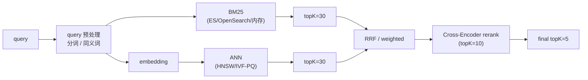
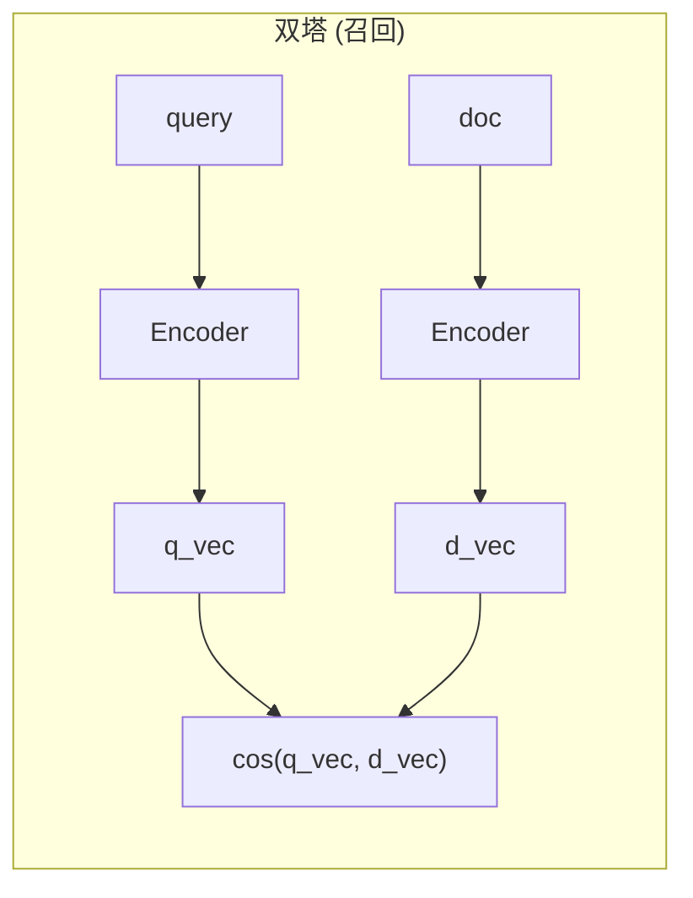
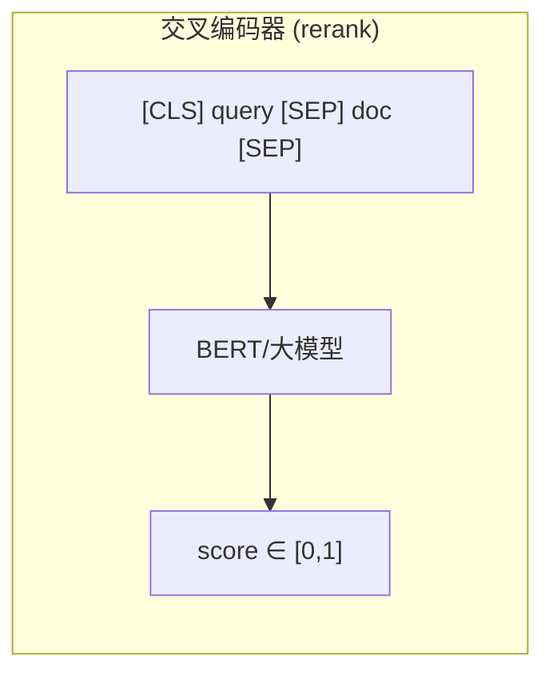
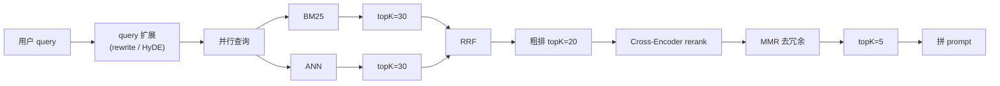

# 混合检索与重排：BM25、RRF 与 Cross-Encoder

## 前言

**C：** 如果你只用稠密 embedding 做检索，在真实业务里你会遇到一类令人抓狂的 case：

> 用户搜 "**SUP-1234**" 或 "**api_timeout_err**"，能精确匹配的那条文档**没进 top-K**。

原因是稠密 embedding**不擅长罕见 token / 精确字符串**。工业版 RAG 从来不是单一召回——而是 **BM25 + 稠密 + rerank** 的组合。这一篇把它讲清楚。

<!-- more -->

## 一、稠密 embedding 的盲区

稠密 embedding 的优点你熟悉了：**抓语义**。但它有三类典型盲区：

| 盲区 | 例子 |
|---|---|
| **罕见实体 / 标识符** | `SUP-1234`、`PROD-AUTH-42`、`err_code=E0007` |
| **长尾术语** | 领域词没出现在训练集，被编码成"一般词" |
| **纯关键词短查询** | `"GDPR"`、`"SSO 500"` 几乎没有语境供模型 pooling |

稠密 embedding 把每句话压成一个点，**细节平均掉**；对 `SUP-1234` 这种只在一小部分文档里出现的字符串来说，平均完几乎不可识别。

对症的解药是**稀疏 / 关键词检索** —— 它的本质是：**这个词出现在哪些文档里？出现了几次？** 最经典的实现就是 BM25。

## 二、BM25：统计检索的经典武器

BM25（Best Match 25）是 Robertson 在 1994 年提出的打分函数，是 Elasticsearch / Lucene 三十年的默认排序。

核心公式（给个直觉就够）：

\[
\text{BM25}(q, d) = \sum_{t \in q} \text{IDF}(t) \cdot \frac{f(t, d) \cdot (k_1 + 1)}{f(t, d) + k_1 \cdot (1 - b + b \cdot \frac{|d|}{\text{avgdl}})}
\]

翻译：

- **`f(t,d)`** — 词 t 在文档 d 里出现几次；
- **`IDF(t)`** — t 的稀有度，越稀有权重越大；
- **`|d|` / avgdl** — 文档长度相对平均长度，**长文档做惩罚**（避免长文天然匹配更多词）；
- `k1 ≈ 1.2–2.0`，`b ≈ 0.75`（默认）。

几个直觉：

- 搜 `SUP-1234`：这个 token 几乎只在一两条文档里出现过 → **IDF 极高** → 命中文档得分飙高；
- 搜 `"员工手册的年假部分"`：`的 / 部分` 这类词 IDF 接近 0，被忽略——BM25 自带"停用词减权"；
- BM25 **对词形敏感**：`login` 和 `Login` 不一样——这是它的**优点（精确）也是缺点（不懂近义）**。

### 2.1 两个实务问题

**中文分词**：BM25 的基本单位是"词"，英文空格就分了，**中文需要先分词**。
- 开源可用：jieba、pkuseg、HanLP；
- ES 里挂 `ik_max_word` 或 `smartcn`；
- 别用 unigram（单字）——会把 `"年假"` 拆成 `"年" + "假"`，精度损失大。

**同义词**：BM25 不识别 `"登陆" / "登录"`、`"bug" / "缺陷"`。
- 在索引或查询时**扩展同义词表**；
- 或者交给稠密检索那条线兜底。

### 2.2 什么时候 BM25 比稠密更强

实际业务里 BM25 常常能赢稠密的场景：

- **查工单 ID / SKU / 枚举值**；
- **查错误码 / API 名 / 函数名**；
- **短查询 + 精确匹配**；
- **法律条款号 / 合同款项号**；
- **人名 / 地名**（稀有专名）。

反过来稠密赢 BM25 的场景：

- **同义转述**："如何修改密码" vs "怎么重置登录密钥"；
- **抽象问题**："我们有什么福利" → 需要聚合式召回；
- **跨语种**（好的多语言 embedding）。

**所以工业答案是：两个都要。**

## 三、混合检索：怎么把两路结果合起来

两路召回，合并成一个 top-K，业界最主流两种做法：

### 3.1 RRF（Reciprocal Rank Fusion）

**最简单也最好用的融合方法**。不看分数，只看**排名**。

公式：

\[
\text{RRF}(d) = \sum_{i \in \text{retrievers}} \frac{1}{k + \text{rank}_i(d)}
\]

`k=60` 是论文和工业实践中的常用值，鲁棒到不用调。

```python
def rrf_merge(rankings: list[list[str]], k: int = 60, topn: int = 10):
    """rankings: 每条是一个列表，元素是 doc_id，按相关性降序"""
    score = {}
    for ranking in rankings:
        for rank, doc_id in enumerate(ranking, start=1):
            score[doc_id] = score.get(doc_id, 0) + 1 / (k + rank)
    return sorted(score, key=score.get, reverse=True)[:topn]

# 用法
bm25_ids  = bm25.search(q, topK=30)
dense_ids = vector_db.search(q_vec, topK=30)
final_ids = rrf_merge([bm25_ids, dense_ids])
```

**为什么 RRF 好**：

- 不用关心 BM25 和 cosine 的分数**完全不在一个量级**；
- 对离群分数天然鲁棒；
- 无需训练、无需调参。

### 3.2 加权线性融合

\[
\text{score}(d) = \alpha \cdot \tilde{s}_{\text{bm25}}(d) + (1-\alpha) \cdot \tilde{s}_{\text{dense}}(d)
\]

`~` 表示**归一化后的分数**（min-max 或 z-score）。`α` 经验值在 **0.3–0.5** 之间（关键词强则偏高）。

问题：

- BM25 分数无上限，min-max 归一化对异常值敏感；
- 稠密的 cosine 经常落在 `[0.5, 0.9]` 的窄区间，归一化后失真；
- `α` 要 per-domain 调。

**结论：除非你真的有调参资源，先上 RRF，简单好用。**

### 3.3 混合检索的整体图



两路召回 + 融合 + 重排——这是工业 RAG 的**事实标准**。

## 四、重排（Rerank）：精度的最后一击

### 4.1 为什么还要 rerank

召回阶段（无论是 BM25 还是 ANN）都在**把 query 和文档各自压成一个点**再算距离——我们称之为 **双塔（bi-encoder）**。它快，但粗：



它根本**没把 query 和 doc 放一起看过**。

重排器走另一条路——**交叉编码器（cross-encoder）**：



query 和 doc **拼一起过模型**，模型能看到**每个 token 之间的交互**，精度高得多。代价是**慢**：

| 项 | 双塔（召回） | 交叉编码器（rerank） |
|---|---|---|
| 建模粒度 | 各自独立 | 联合 |
| 相对精度 | 基线 | **+5–15 个点** |
| 查询延迟 | ~ms | 每对 ~10–50 ms |
| 能处理的规模 | 百万级 | 只能给**几十条**再排一次 |

所以工程做法是：

> **召回先粗召 top-30~100，然后 rerank 筛出 top-5~10。**

### 4.2 开源 / 云端 rerank 选型

| 名称 | 类型 | 特点 |
|---|---|---|
| **BGE-Reranker-v2 / bge-reranker-large** | 开源 | 中英文强；100M–550M 参数 |
| **Jina Reranker v2** | 开源 | 多语言；速度快 |
| **Cohere Rerank 3** | 云 API | 英中日多语种；效果好；按次付费 |
| **Voyage Rerank-2** | 云 API | 英文场景 SOTA |
| **ColBERTv2** | 开源 | late interaction，介于双塔和交叉之间 |
| **LLM-as-Reranker** | 任何 LLM | 直接问 GPT "把这 20 条按相关性打分" |

中文 / 混合：默认 **bge-reranker-v2-m3** 或 **Jina v2-base**；英文纯场景 **Cohere / Voyage**。

### 4.3 rerank 代码：开源方案

```python
from FlagEmbedding import FlagReranker

reranker = FlagReranker("BAAI/bge-reranker-v2-m3", use_fp16=True)

def rerank(query: str, docs: list[str], topK: int = 5) -> list[tuple[str, float]]:
    pairs  = [[query, d] for d in docs]
    scores = reranker.compute_score(pairs, normalize=True)   # [0, 1]
    ranked = sorted(zip(docs, scores), key=lambda x: -x[1])
    return ranked[:topK]

# 完整管道
coarse = hybrid_retrieve(query, topK=30)                    # 混合召回
final  = rerank(query, [c.text for c in coarse], topK=5)    # 精排
```

**性能参考**（bge-reranker-v2-m3, CPU）：
- 1 条 pair ≈ 30–50 ms；
- 30 条一次批量 ≈ 200–300 ms；
- 上 GPU/量化能压到 30–60 ms。

**工程要点**：

- 一次 rerank 条数严格控制在 **20–50**，多了延迟爆炸；
- rerank 的输入文本长度看模型：`bge-reranker-v2-m3` 支持 8192 tok，但越短越快；
- 不同 rerank 模型的分数**不能跨模型比较**——换模型就要重调阈值。

### 4.4 rerank 之外：几种"轻量重排"

不想吃交叉编码器成本的中间档选择：

- **MMR（Maximal Marginal Relevance）**——在已有的 top-K 里**按多样性重排**，避免返回三条几乎一样的 chunk。
  \[
  \text{MMR} = \lambda \cdot \text{sim}(q, d) - (1-\lambda) \max_{d' \in S} \text{sim}(d, d')
  \]
- **元数据加权**——更新时间、信源权威度、用户个性化权重乘到得分上；
- **LLM rerank**——直接让 GPT-4o-mini 对 20 条打分；贵但上限高。

## 五、查询扩展：让 query 更适合被检索

同一件事再从 query 侧补一刀：短而模糊的 query 单靠两路都难召回时，**改 query**。

### 5.1 Query Rewrite

把口语化 query 改成检索友好形式：

```text
原始：今天这个破东西为啥登不上去
改写：账号 登录 失败 500 错误码 排查步骤
```

一个 LLM 提示即可：

```python
REWRITE_PROMPT = """把下面用户问题改写成 2-3 个独立的检索查询（不要回答，只给关键词）：
用户问题: {q}
输出 JSON：{"queries":["...", "..."]}
"""
```

然后对多个 query **分别检索**、用 RRF 合并。

### 5.2 HyDE（Hypothetical Document Embedding）

先让 LLM **假装回答**一次，用这个"伪答案"做检索：


直觉：伪答案比 query 长、词密度高，向量空间里更像**真正的目标文档**。

- 好处：短 query 场景 recall 上升 5–15 个点；
- 代价：每次多一次 LLM 调用。

### 5.3 Multi-Query

最朴素：让 LLM 对同一 query 生成 N 个改写变体，**多路检索合并**。

```python
variants = llm.rewrite(q, n=3)
all_hits = []
for v in variants:
    all_hits.append(retrieve(v, topK=10))
final = rrf_merge(all_hits)
```

无脑有效，代价线性增长。

## 六、工业 RAG 的"标准骨架"

把前面五篇的结果拼一起：



这就是**工业 RAG 的 v1 模板**。之后所有优化都是在这条管道上做局部加强。

## 七、实务组合拳：按预算档位配置

不同团队有不同的成本承受力，给个参考：

| 档位 | 配置 | 单次查询成本（粗估） | 效果 |
|---|---|---|---|
| 极简 | 单稠密 HNSW + prompt | < 1ms + 1 次 LLM | 够用；ID 类查询会漏 |
| 标准 | BM25 + 稠密 + RRF | ~5 ms + 1 次 LLM | **推荐起点** |
| 生产 | + bge-reranker | ~50 ms + 1 次 LLM | **事实标准** |
| 高端 | + HyDE / Multi-Query | ~100 ms + 2 次 LLM | 长尾 query 明显改善 |
| 顶配 | + 元数据个性化 + LLM Rerank | ~200 ms + 3 次 LLM | 极致精度，成本陡升 |

**多数团队合适点在"生产"这一档**——再往上投入边际收益递减，先把评测（第 06 篇）做扎实更重要。

## 八、常见坑

### 8.1 "RRF 后结果反而变差了"

- 两路召回的 topK 太小（比如 5）→ 融合后样本不足，稠密一路没贡献；
- 把 `topK_per_retriever` 提到 20–30。

### 8.2 "BM25 和稠密总是召回同一批文档"

- 说明两路在这个 query 上**冗余**，融合没带来多样性；
- 不用焦虑——至少没变差；长期多覆盖各种 query 类型即可。

### 8.3 "Reranker 在某些 query 上比 baseline 还差"

- 很可能是 rerank 模型对**对话 / 短文本**训练不足；
- 加一个阈值：rerank 分数低于 T 就回退到原顺序。

### 8.4 "HyDE 一开就变贵 10 倍"

- 只对**短 query**（< 10 字符 / tok）开启；
- 缓存伪答案：同一 query 在 5 分钟内重复来，复用。

### 8.5 "中文检索接 ES 默认 analyzer 一点用没有"

- 默认 `standard` 分析器按字符切 → BM25 失效；
- 必须换 `ik_max_word` / `jieba_max_word` 等中文分词器。

## 九、小结

- 稠密向量有盲区，BM25 对罕见 token 和精确短查询不可替代；
- **混合检索 + 重排是工业 RAG 的事实标准**，RRF 是最省事的融合方案；
- Cross-Encoder rerank 是"精度最后一击"，但要控制在 20–50 条以内；
- 查询扩展（Rewrite / HyDE / Multi-Query）对短 query 特别有效；
- 按预算选档位，大多团队止步于"生产"档就够；
- 下一篇讲**怎么量化以上所有组合的效果**——没有评测，一切优化都是盲调。

::: tip 延伸阅读

- [BM25 维基百科](https://en.wikipedia.org/wiki/Okapi_BM25)
- [Reciprocal Rank Fusion 原论文 (Cormack et al., 2009)](https://plg.uwaterloo.ca/~gvcormac/cormacksigir09-rrf.pdf)
- [BGE-Reranker 模型卡](https://huggingface.co/BAAI/bge-reranker-v2-m3)
- [Precise Zero-Shot Dense Retrieval without Relevance Labels (HyDE)](https://arxiv.org/abs/2212.10496)
- 本册下一篇：`06-评测与优化：RAG到底准不准`

:::
