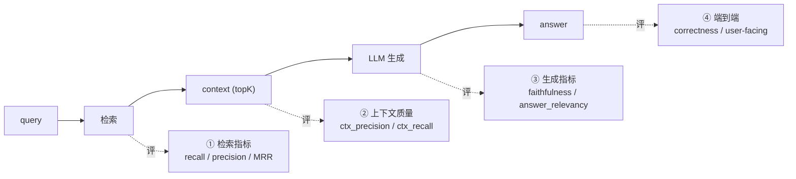
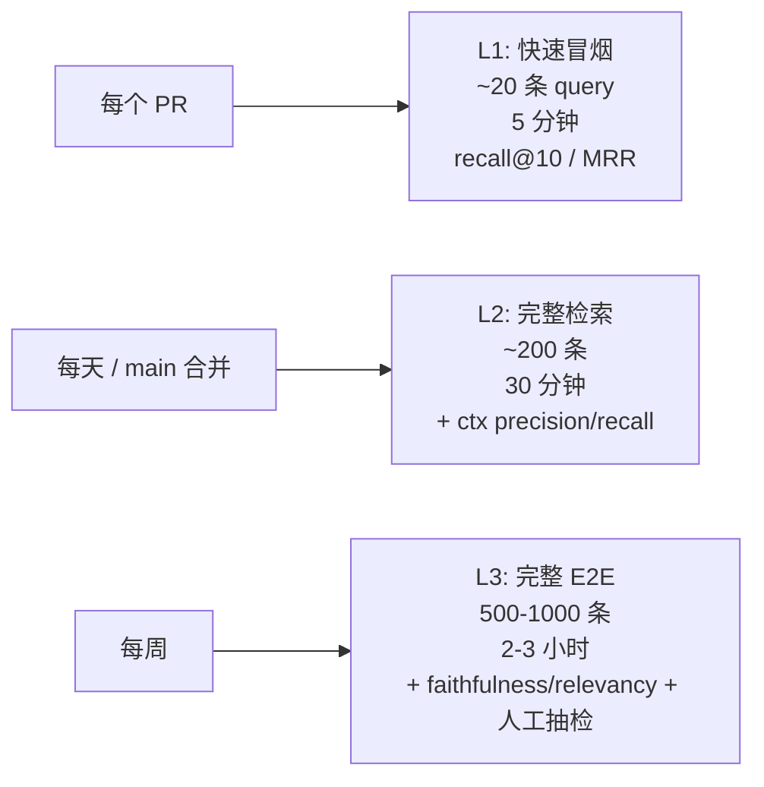
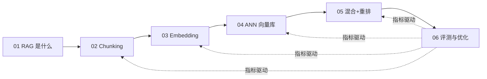

# 评测与优化：RAG 到底准不准

## 前言

**C：** 前五篇讲了 RAG 每一个零件怎么做。但实际项目里 90% 的痛苦都来自一个问题：

> **"我改了 chunk_size / 换了 embedding / 加了 rerank，效果到底是变好了还是变差了？"**

没有评测，所有优化都是**盲调**。这一篇专门讲：怎么搭一套能支撑"每周 / 每 PR 都跑一遍"的 RAG 评测管道。

<!-- more -->

## 一、先分清楚"哪一层在评"

RAG 的错可以出在**检索侧**，也可以出在**生成侧**，评测指标要分层：



每层都要有对应指标，定位问题时才能精确知道**该调哪一层**。

## 二、检索侧评测

### 2.1 recall@K：最重要的单一指标

定义：

> recall@K = (topK 结果里，包含了 ground truth 相关文档的 query 数) / (总 query 数)

直觉：**我真正需要的文档，在前 K 条里了吗**？

- `recall@10 = 0.90` 意味着 10% 的 query "该找的文档没进 topK"；
- 如果 recall 不够，生成侧再强也救不回来——模型看不到正确资料。

### 2.2 MRR（Mean Reciprocal Rank）

\[
\text{MRR} = \frac{1}{|Q|} \sum_{q \in Q} \frac{1}{\text{rank}_q}
\]

`rank_q` 是该 query 的第一个相关文档的排名。

- 第一条就是相关文档 → 贡献 1；
- 第五条才命中 → 贡献 1/5；
- 没在 topK 里 → 0。

MRR 关心"**相关文档是不是排得靠前**"——对只能取 top-3 塞进 prompt 的场景尤其重要。

### 2.3 nDCG@K

把不同相关度等级（完全相关 / 部分相关 / 不相关）量化成分数，再按位置折扣：

\[
\text{DCG@K} = \sum_{i=1}^{K} \frac{2^{\text{rel}_i} - 1}{\log_2(i+1)}
\]

\[
\text{nDCG@K} = \frac{\text{DCG@K}}{\text{IDCG@K}}
\]

用于**多等级标注**的评测集（比 recall 细）。做研究用得多，工业前几周先跑 recall@K 就够。

### 2.4 如何构造检索评测集

两种路：

**A. 人工标注（金标准）**

- 选 50–200 条真实用户 query；
- 人工找出每条对应的"相关文档 id"列表；
- 稳定、贵、一年才能更新一次。

**B. 用 LLM 合成（Ragas 式）**

伪代码：

```python
for doc in sampled_docs:
    q = llm.generate(
        prompt=f"根据下面段落生成一个用户可能提的问题：\n{doc.text}"
    )
    dataset.append({"query": q, "relevant_doc_id": doc.id})
```

- 便宜、快、自动扩充；
- 风险：生成的 query "太像文档"——指标会**虚高**；
- 补救：随机抽样人工抽检 10%，把"不自然"的剔掉。

**实务建议**：20% 人工 + 80% LLM 合成，混合使用。

### 2.5 一个最小的检索评测脚本

```python
def eval_retrieval(retriever, dataset, K=10) -> dict:
    hits = 0
    mrr  = 0.0
    for ex in dataset:
        got   = retriever.search(ex["query"], topK=K)
        ids   = [d.id for d in got]
        truth = set(ex["relevant_doc_ids"])
        if truth & set(ids):
            hits += 1
            for i, did in enumerate(ids, start=1):
                if did in truth:
                    mrr += 1 / i
                    break
    n = len(dataset)
    return {
        f"recall@{K}": hits / n,
        "mrr":         mrr  / n,
    }
```

在 CI 里跑这一段，每次 PR 都输出表格；recall 下降 2 个点就卡门。

## 三、上下文质量评测

拿到 topK 之后，正式生成之前，还能看一个中间层：

### 3.1 Context Precision

**topK 里有多少条真的相关？**

\[
\text{ctx\_precision@K} = \frac{|\text{relevant in topK}|}{K}
\]

低 precision 意味着 "召回噪声大" → 模型上下文里塞了一堆无关内容，容易分神、幻觉。

### 3.2 Context Recall

**标准答案所需的信息里，有多少在 topK 里出现过？**

给定标准答案里每个"事实句"，检查它是否能在 topK 里找到支持证据（可以用 NLI / LLM 判定）。

```text
标准答案：
① 年假 15 天  → context[2] 支持 ✓
② 满 1 年生效 → 没找到 ✗

context_recall = 1/2 = 0.5
```

低 context_recall → **缺证据** → 生成必然失败或编造。

这两个指标来自 **[Ragas](https://docs.ragas.io/)**，已是 RAG 评测事实标准。

## 四、生成侧评测

### 4.1 Faithfulness（忠实度）

**生成的答案里的每句话，是否都有给定的 context 支持？**

\[
\text{faithfulness} = \frac{|\text{claims supported by ctx}|}{|\text{claims total}|}
\]

做法：

1. 用 LLM 把答案拆成原子 claim 列表；
2. 对每条 claim，让 LLM 判断是否能从 context 推出（蕴含 / 矛盾 / 未提及）；
3. "能推出"的比例就是 faithfulness。

低 faithfulness = **幻觉**。RAG 场景这是最关键的生成指标。

### 4.2 Answer Relevancy（答非所问）

**生成的答案是不是真的在回答这个问题？**

做法：

1. 用 LLM 从答案**反向生成**"这个答案应该对应什么问题"；
2. 把反生成的 question 和真实 question 做 embedding cosine；
3. cosine 越高 → answer 和 query 主题越一致。

低 relevancy = 模型跑题。

### 4.3 Answer Correctness（正确性）

把生成答案和标准答案对比，用 LLM 打分：

```python
prompt = f"""判断下面两个回答是否在事实上一致：
标准答案: {gold}
模型答案: {pred}
给出 0-1 之间的分数和解释。
"""
```

代价高但可靠。适合小评测集。

## 五、端到端评测：把指标拼起来

一个完整的 RAG 评测 run 输出至少 6 个数字：

| 层 | 指标 | 代表问题 |
|---|---|---|
| 检索 | recall@10 | 相关文档进没进 topK |
| 检索 | MRR | 相关文档排得靠前吗 |
| 上下文 | ctx_precision | topK 噪声多吗 |
| 上下文 | ctx_recall | 证据够不够 |
| 生成 | faithfulness | 幻觉严重吗 |
| 生成 | answer_relevancy | 跑题吗 |

任何一个变差都能直接对应某一层的调优动作——这就是**分层指标的价值**。

### 5.1 Ragas 的最小接入

```python
from datasets import Dataset
from ragas import evaluate
from ragas.metrics import (
    context_precision, context_recall,
    faithfulness, answer_relevancy,
)

records = []
for ex in my_queries:
    ctx  = retriever.search(ex["query"], K=10)
    ans  = generator.answer(ex["query"], ctx)
    records.append({
        "question":        ex["query"],
        "contexts":        [c.text for c in ctx],
        "answer":          ans,
        "ground_truth":    ex["gold_answer"],
    })

ds     = Dataset.from_list(records)
result = evaluate(ds, metrics=[
    context_precision, context_recall,
    faithfulness, answer_relevancy,
])
print(result)
```

输出类似：

```text
context_precision: 0.78
context_recall:    0.82
faithfulness:      0.91
answer_relevancy:  0.88
```

### 5.2 LLM-as-Judge 的三大陷阱

几乎所有生成侧指标都依赖 LLM 打分，它不是免费的："

1. **位置偏差**：先给哪个答案它更偏向哪个；
   - 对策：A/B 顺序做 2 次，取平均。
2. **模型自偏**：用 GPT-4 做裁判评价 GPT-4 的答案，分会偏高；
   - 对策：裁判用**别家**模型；或用人类抽检校准。
3. **不稳定**：同一 sample 跑两次分值可能差 0.1+；
   - 对策：`temperature=0` + 多次取众数 / 中位数。

## 六、不是每次都全跑：评测流水线的分级

每次 PR 都跑完整 ragas → 成本太高、时间太长。建议分三档：



**关键**：L1 必须在 PR 门槛上——不通过不合并。L2/L3 做趋势图，用于定方向。

## 七、优化的"指标驱动"流程

有了指标，优化就不再是拍脑袋：

### 7.1 按指标定位症状

| 哪个指标掉了 | 多半是哪里出问题 | 调什么 |
|---|---|---|
| recall@10 ↓ | 检索侧丢了 | chunking / embedding / hybrid |
| MRR ↓（但 recall 稳） | 排序不准 | rerank / weights |
| ctx_precision ↓ | 混入无关 | 过滤 / 去重 / topK 调小 |
| ctx_recall ↓ | 证据不全 | topK 调大 / 多粒度入库 |
| faithfulness ↓ | 幻觉变严重 | prompt 更严格 / 降 temperature |
| answer_relevancy ↓ | 跑题 | prompt 模板 / 换模型 |

**关键就是：不要同一次改 3 件事**——改一件、跑一轮、看哪个指标动了。

### 7.2 一个典型优化轨迹

```text
baseline         : recall@10=0.72  faithfulness=0.81
+ overlap 80     : recall@10=0.80  faithfulness=0.81   # chunking 改进
+ bge-m3         : recall@10=0.85  faithfulness=0.83   # embedding 升级
+ BM25 hybrid    : recall@10=0.91  faithfulness=0.82   # 加 BM25
+ bge-reranker   : recall@10=0.91  MRR=0.76 → 0.88     # rerank 提升排序
+ prompt 严格化  : faithfulness=0.89                   # 修幻觉
```

每一步都可以**回滚**，都可以**解释**——这是评测带来的最大价值。

### 7.3 Error Analysis：比指标更重要

纯数字会骗人。每轮评测后**必须**做 error analysis：

1. 找 10 条分数最低的 case；
2. 人工读：是检索没找到？还是 rerank 排错？还是生成幻觉？
3. 把每类错误计数，**最频繁的那类**就是下一轮要攻的方向。

举个常见输出：

```text
Bottom-10 error breakdown:
  - 3 条：BM25 没分词（中文 token 错）
  - 2 条：chunk 边界把答案切到两段
  - 2 条：模型把 "30 天" 看成 "3 天"（生成侧幻觉）
  - 2 条：文档本身过时
  - 1 条：query 含打字错误
```

**看到这个表，你就知道这一周该做什么了**——不是拍脑袋去升级 embedding。

## 八、在线评测：从离线到线上

离线跑的是你准备好的评测集；线上真实 query 才是最终裁判。

### 8.1 Logging

每次 RAG 请求都落这些字段：

```json
{
  "trace_id":     "req_abc",
  "query":        "...",
  "retrieved":    [{"id":"...","score":0.82}, ...],
  "ctx_used":     ["..."],
  "answer":       "...",
  "latency_ms":   430,
  "model":        "gpt-4o-mini",
  "user_id":      "u_123",
  "thumbs":       null
}
```

### 8.2 User feedback signals

- **👍 / 👎 按钮**：最直接；注意**负反馈更真实**（一般没人点赞）；
- **重试 / 改问**：用户立刻又问了个类似问题 → 上一次很可能答错；
- **点引用链接**：引用被点击 → 这条来源有用；
- **会话长度**：明显缩短 / 升级到工单 → 答得好 / 不好的间接信号。

### 8.3 A/B 测试

同一批流量分 50/50 跑 baseline 和 new_version，**一周以上**再看：

- 👍 率提升/下降；
- 人均交互轮数；
- 升级到人工的比例。

别看离线指标就上全量——**离线和线上的差距常常比想象大**。

## 九、一个能落地的评测脚手架

```text
eval/
├── datasets/
│   ├── L1_smoke.yaml         # 20 条，PR 卡门
│   ├── L2_retrieval.yaml     # 200 条，日常
│   └── L3_e2e.yaml           # 1000 条，每周
├── metrics/
│   ├── retrieval.py          # recall / MRR / nDCG
│   ├── ragas_wrapper.py      # faithfulness / relevancy 等
│   └── judges.py             # LLM-as-judge + 偏差控制
├── runners/
│   ├── run_l1.py
│   ├── run_l2.py
│   └── run_l3.py
├── reports/
│   ├── 2026-04-14.md
│   ├── 2026-04-21.md         # diff 到上一份
│   └── baseline.json
└── ci/
    └── github-actions.yml    # PR 上 run_l1.py，失败卡合并
```

配套一个简单 diff 脚本：

```python
def diff_reports(old, new, threshold=-0.01):
    for k in set(old) | set(new):
        delta = new.get(k,0) - old.get(k,0)
        mark  = "❌" if delta < threshold else ("✅" if delta > -threshold else "·")
        print(f"{mark} {k:25s} {old.get(k,0):.3f} → {new.get(k,0):.3f}  ({delta:+.3f})")
```

PR 里贴一次输出，所有 reviewer 一眼看懂："哪个指标动了、动了多少、是不是 regress"。

## 十、常见误区

### 10.1 "只看端到端 correctness"

问题：一个数字上下波动，你不知道是检索变了还是生成变了。
对策：**分层指标缺一不可**。

### 10.2 "评测集用同一批文档生成"

问题：用 doc → 生成 query → 评测 doc 的检索——数据泄漏；指标虚高。
对策：评测集**必须**与训练/索引数据来源有**时间或主题上的隔离**。

### 10.3 "一次评测跑一遍就完了"

问题：LLM 本身有随机性，单次运行不稳。
对策：重点指标 **跑 3 次取中位数**。

### 10.4 "上新模型就换，不跑评测"

问题：新模型在你的**数据上**不一定更强。
对策：MTEB 榜单只是先验，自己数据上的评测才是终审。

### 10.5 "指标都高，用户还是骂"

问题：你的评测集和真实 query 分布**不一致**。
对策：定期从线上日志抽 50 条新 query 加进评测集——**评测集要活着**。

## 十一、本章回顾：六篇如何串在一起



- 01 建立心智模型——RAG 为什么存在；
- 02–05 逐层看**每个组件**的设计空间；
- 06 把整条线用**指标闭环**起来——没有评测，上面 5 篇学了也白学。

## 十二、小结

- 评测要**分层**：检索层 recall/MRR、上下文层 precision/recall、生成层 faithfulness/relevancy、端到端 correctness；
- Ragas 是当前最成熟的开源 RAG 评测框架，直接接入；
- **L1 冒烟 / L2 完整 / L3 E2E** 三档流水线，匹配 PR / 日常 / 每周节奏；
- 优化流程：**改一件 → 跑一轮 → 看指标 → error analysis** 循环；
- 离线不是终点，线上 👍/👎 和 A/B 是最终裁判；
- 五个最常见的评测误区里，**"评测集用同批文档生成"和"评测集一成不变"**是两个隐形杀手。

::: tip 延伸阅读

- [Ragas 官方文档](https://docs.ragas.io/)
- [TruLens：另一套 RAG 评测工具](https://www.trulens.org/)
- [Evaluating RAG Applications with Ragas (DeepLearning.AI)](https://www.deeplearning.ai/short-courses/building-evaluating-advanced-rag/)
- 本册回到起点：`01-RAG是什么：从参数记忆到检索记忆` —— 回头看一遍 Section 5 的"四种失败模式"，现在你有了度量每一种的手段

:::
