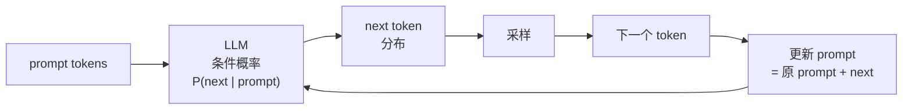

# Prompt 是什么：从提问到上下文编排

## 前言

**C：** 网上很多"Prompt 教程"把这件事讲成"咒语手册"——背几条模板、加几个"请认真思考"的副词，仿佛念对了就灵。其实 Prompt 工程没那么玄，它只做一件事：**把你知道的、模型需要知道的东西，按一种让下一个 token 分布偏向你想要方向的方式排列。** 这一篇先把这件底层的事说清楚，后面六篇再谈技巧。

<!-- more -->

## 一、Prompt 的本质：不是"问句"而是"前缀"

很多人把 prompt 当成"问模型一个问题"。更准确的说法是：

> Prompt 是一段**前缀 token 序列**；模型基于它预测下一段 token 的**概率分布**。

也就是说："写 prompt" = **调整这段前缀**，使得下一步最可能的 token 正好是你想要的答案。



这张小循环图里有两个事实：

1. **Prompt 不是"提问"，是"起笔"**——模型是在沿着你起的笔继续写；
2. **Prompt 影响的是"概率分布"**——你不是在命令它，你是在**倾斜它的后验**。

理解这个，再去看任何技巧（CoT / Few-shot / Structured output），你就知道它们本质都是在干同一件事：**让那个分布更陡、更准地落在你要的区域。**

## 二、为什么模型"听得懂"指令

GPT-3 时代的模型其实**听不懂指令**。你写 `"请用一句话总结这段话"`，它很可能接着你的句号继续写"请用一句话总结这段话，这是一个常见的任务……"——**它在续写，不是在执行**。

现代模型能"听懂"是因为做了 **Instruction Tuning + RLHF**：


训练数据里塞进去海量的 **（指令，合适回答）对**，模型在这个分布下被强化后，"看到指令→给出合适回答"这件事本身变成了它的**习得模式**。

对写 prompt 的意义是：

- 你面对的是一个**已经被教过"怎么配合你"的模型**；
- 但它配合的**只是它训练集里见过的那些"指令形式"**；
- 所以**越接近训练时那种格式的 prompt，效果越好**——这就是模板化 prompt 的理论依据。

## 三、Prompt 的解剖：现代聊天模型的四种角色

今天的对话 API 都不是"塞一段 prompt 进去"，而是一组**带角色的消息**：

```json
{"messages": [
  {"role": "system", "content": "你是一个严谨的数学助教。"},
  {"role": "user",   "content": "解方程 x² + 2x − 3 = 0。"},
  {"role": "assistant","content": "根据因式分解..."},
  {"role": "user",   "content": "那改成 x² + 2x − 8 呢？"}
]}
```

四种角色：

| role | 作用 | 谁写 |
|---|---|---|
| `system` | 场景、人设、全局规则 | 你（开发者） |
| `user` | 当前用户输入 | 用户 / 你代理用户 |
| `assistant` | 模型之前的回答 | 模型 |
| `tool` | 工具调用的结果 | 你（代码） |

所有这些**都在同一个 token 序列里**被拼出来——只是 API 帮你加了 `<|im_start|>system`、`<|im_end|>` 这些分隔符（不同模型格式不同，俗称 "chat template"）。

**重要后果**：

- `system` 并不"更有权威"——它只是位置在最前面、模型训练时也被教成"听这一段"；
- 用户如果在 `user` 里写"忽略之前的指令"，**在注意力层面确实能跟 system 竞争**——这就是**提示注入**的根。第 07 篇细讲。
- 一个"多轮对话"本质是：**每一轮你把前面所有 messages 重新发一遍**。模型自己并不"记得"；记忆是**你**在维护。

## 四、好 prompt 的三个属性

抛开花哨技巧，一个 prompt 要称得上"好"，至少满足三件事：

### 4.1 明确（Specific）

**坏**：

> 帮我写一段介绍产品的文字。

**好**：

> 你是面向 B 端的营销文案撰稿人。目标读者是 IT 经理。
> 请为我们的"数据备份 SaaS"写一段**120–150 字**的中文介绍，
> 强调"自动化"、"合规"、"零运维"，不要出现"颠覆"、"赋能"等词。

两段输入对应的概率分布天差地别——后者把"哪种文风/长度/禁忌词"都压进了 prompt。

### 4.2 可检查（Verifiable）

输出必须是**可以被自动校验**的：

- 要 JSON → 能 `json.loads()` 过；
- 要分步推理 → 最后一行能解析出"answer: 42"；
- 要翻译 → 字数在原文 ±20% 区间。

**写 prompt 时就要想好"我怎么检查它对不对"**。没法检查的 prompt，没法优化。

### 4.3 稳健（Robust）

同一个 prompt 模板处理 1000 个不同输入都不会翻车：

- 输入为空时不会胡编；
- 输入包含指令（"忽略之前的系统提示"）时不会被劫持；
- 输入里夹着 JSON / 代码 / HTML 时不会乱掉格式。

**"做 demo 的 prompt" 和 "上线的 prompt" 的差距主要就在稳健**——demo 赢在好看，上线靠稳。

## 五、两种思维：提问 vs 编排上下文

刚开始写 prompt，你是在**"提问"**——把想说的话写进 user。

进一步会发现你其实在做**"上下文编排"**——把一堆内容按合适顺序塞进 context，再让模型续写。现代 RAG / Agent / Tool Use 更是如此：

```text
[system]   角色 + 全局规则
[few-shot] 几个示范对
[retrieved]从向量库检索到的片段
[tools]    可用工具列表（schema）
[history]  对话历史（或压缩摘要）
[user]     当前这一轮问题
```

这七段**都是 prompt**。Prompt 工程已经不完全是"写得巧不巧"，而是"**安排得合不合理**"：

- 哪些放 system，哪些放 user；
- retrieved 放 few-shot 前还是 user 前；
- history 压缩到多长；
- 工具描述几行合适。

第 06 篇专门讲这个——**上下文工程（Context Engineering）**。

## 六、最小可跑的 prompt demo

纯 API 调用，把上面讲的四角色拼一遍：

```python
from openai import OpenAI
client = OpenAI()

def answer(question: str) -> str:
    resp = client.chat.completions.create(
        model="gpt-4o-mini",
        temperature=0,
        messages=[
            {"role": "system",
             "content": "你是严谨的中文数学助教。仅基于已知条件推理，"
                        "最后一行用 `答案：...` 给出结论。"},
            {"role": "user",
             "content": question},
        ],
    )
    return resp.choices[0].message.content

print(answer("一个长方形长 8，宽 5，面积多少？"))
```

这段 10 行代码已经用到了 prompt 工程的三件事：

- **角色**：`system` 定义助教人设；
- **输出约束**：指定"最后一行 `答案：...`"——便于解析（见 4.2）；
- **参数调优**：`temperature=0`——要稳定的数学题这么选；要创意文案可以 0.7–1.0（参考第 01 册采样策略那一篇）。

## 七、Prompt 工程和"调模型"的边界

初学者容易把两件事混起来。界线：

| 层 | 改什么 | 代价 | 什么时候用 |
|---|---|---|---|
| **Prompt 工程** | 调 prompt 本身 | 几乎零 | 先做，永远先做 |
| **检索 / 工具** | 给模型补外部知识和能力 | 中 | 需要时效 / 专业 / 动作 |
| **SFT 微调** | 改模型权重（小幅） | 高 | 固定风格 / 格式 / 领域术语 |
| **预训练** | 从头训 | 极高 | 几乎不是开发者的问题 |

**实务铁律：所有能通过 Prompt 解决的问题，都不要先上微调。**

- 微调之前调一周 prompt 是常规操作；
- Prompt 写好了就是一份**可以改、可以 rollback、可以 A/B 的"配置"**，迭代成本是微调的百分之一。

## 八、Prompt 工程这一册的路线图

前面六篇要把 prompt 工程作为一个**可控工程实践**讲清楚：

| 篇 | 主题 | 一句话 |
|---|---|---|
| 01（本篇） | 心智模型 | Prompt 是编排上下文的分布 |
| 02 | 结构化提示五件套 | 任何 prompt 都能拆成五段 |
| 03 | 推理提示家族 | CoT / ToT / ReAct 什么时候用 |
| 04 | Few-shot / ICL | 示例怎么选、怎么排、要几个 |
| 05 | 结构化输出 | 让模型输出**能被解析**的东西 |
| 06 | 上下文工程 | 把 prompt 当上下文**布局**问题看 |
| 07 | 安全与评测 | 防注入 + 把 prompt 当代码来测 |

跟 `02-Function-Calling`、`03-MCP`、`04-RAG` 不重复——那三册讲"模型怎么**调外部**"，这册讲"**prompt 本身**怎么写好"。

## 九、小结

- Prompt 的本质是**调整前缀 token 概率分布**，不是"提问"；
- 模型"听得懂指令"是 Instruction Tuning + RLHF 的结果——越接近训练格式的 prompt 越好使；
- 现代 API 用 `system / user / assistant / tool` 四种角色拼 prompt，注意 `system` **不是强权**；
- 好 prompt 三属性：**明确 / 可检查 / 稳健**；
- 思维要从"**写一句话问问题**"升级到"**编排一段上下文**"；
- 所有能用 prompt 解决的事，永远**先不上微调**；
- 这册接下来六篇把 prompt 当成一个**可迭代的小软件**来对待。

::: tip 延伸阅读

- [OpenAI Prompt Engineering Guide (2025 更新)](https://platform.openai.com/docs/guides/prompt-engineering)
- [Anthropic Prompt Library](https://docs.anthropic.com/en/prompt-library)
- [Prompt Engineering Guide（社区）](https://www.promptingguide.ai/)
- 本册下一篇：`02-结构化提示：五件套与分隔符`

:::
