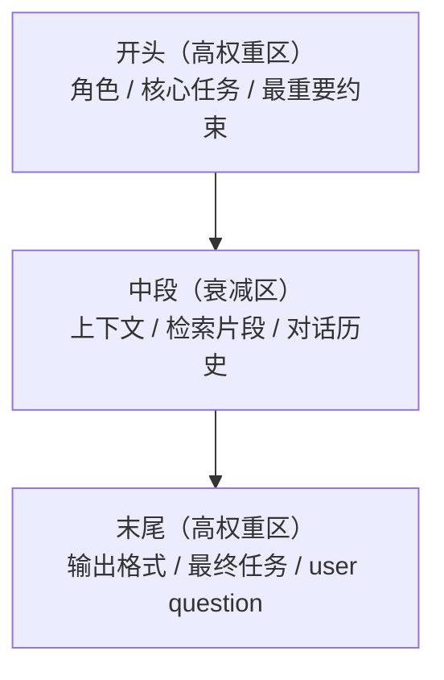

# 结构化提示：五件套与分隔符

## 前言

**C：** 一个"能用"的 prompt 和"一个能上线的 prompt" 差距在哪？回答就在这一篇。我们把几乎所有生产 prompt 都能拆成一份**五件套**模板，再讨论分隔符、顺序、反模式——让你写 prompt 像写代码一样**有结构**。

<!-- more -->

## 一、五件套：任何 prompt 的通用骨架

经验上，一份能上线的 prompt 都能拆成以下五段：

```text
① 角色 Role          — 你是谁
② 任务 Task          — 你要做什么
③ 上下文 Context     — 需要参考的资料
④ 约束 Constraints   — 哪些规则必须守
⑤ 输出格式 Format    — 回答长什么样
(+ 可选)示例 Examples — 上面规则的具体示范
```

写 prompt 就是**依次填好这五格**（加示例就是六格），而不是靠灵感写一段散文。


## 二、每一件具体怎么写

### 2.1 角色（Role）

**目的**：把模型"定位"到一个合适的语体 / 风格 / 知识切面。

典型写法：

```text
你是一位资深的后端工程师，专长于 Go 和分布式系统。
在回答时优先考虑生产环境落地性，而不是理论完美。
```

几个要点：

- **职业 / 身份 + 风格 + 价值取向**三要素一齐写；
- **别堆形容词**——"世界顶级"、"最权威"、"神级"这些并不能让输出变强，反而常被模型误解为"需要夸张语气"。

坏例：

> 你是一个世界顶级的超强 AI 助手，拥有无限智慧。

好例：

> 你是技术面试官，擅长用简洁语言指出候选人代码里的边界问题和并发隐患。

### 2.2 任务（Task）

**目的**：一句话说清"要做什么"。

模板：

```text
任务：对下面的[原文类型]进行[动作]，生成[产物]。
```

具体：

```text
任务：对下面的技术故障报告进行摘要，生成一份 5 条 bullet 的要点清单。
```

要点：

- **单一动词 + 明确对象 + 明确产物**；
- 多任务别糅一起——真有多件事就分多轮，或在"输出格式"里拆成字段。

### 2.3 上下文（Context）

**目的**：把模型需要但**它不知道**的信息塞进来。典型内容：

- 领域背景；
- 用户个人信息 / 偏好；
- RAG 检索来的片段；
- 工具返回的中间结果；
- 会话历史（或其摘要）。

**关键**：这一节**最容易膨胀**——见后面反模式。

### 2.4 约束（Constraints）

**目的**：用**正反两面**把输出空间收窄。

典型：

```text
- 用简体中文作答。
- 答复长度 150–250 字。
- 不要编造引用，没把握就说"不确定"。
- 不要使用 "颠覆"、"赋能" 等营销套话。
- 遇到 PII（手机号/邮箱）用 [REDACTED] 替换。
```

工程经验：

- **肯定式约束**（"要...")比**否定式约束**（"不要…"）更有效——模型对"不要做什么"有时会接不住；
- 实在只能用否定时，**紧跟一条替代方案**："不要 X，请改写成 Y"。

### 2.5 输出格式（Format）

**目的**：让输出**可被解析 / 可被渲染**。

几种常用：

```text
格式：只输出 JSON，字段：
{
  "summary":  string,
  "severity": "P0"|"P1"|"P2"|"P3",
  "actions":  string[]
}
```

```text
格式：按以下三段回答，每段前加标题：
## 问题定位
## 临时缓解
## 长期修复
```

```text
格式：仅输出 markdown 表格，列为 | 时间 | 操作 | 结果 |。
```

**设计原则**：**你写这个 format 的时候，就要同时想好接收端的解析代码**。两者要**互相配合地写**，不然会出现"模型认真遵守但你接不住"的尴尬。

### 2.6 示例（Examples，可选）

给 1–5 组输入输出样例作为**内嵌 few-shot**：

```text
示例：
输入：服务在 2 点突然 502，日志显示大量 connection refused。
输出：
## 问题定位
上游连接被拒，疑似后端服务崩溃或被 LB 摘除。
## 临时缓解
降级开关 A，切备用集群。
## 长期修复
加健康检查 + 自动扩容触发。
```

Few-shot 用多少合适、怎么选样例，是第 04 篇的主题，这里只讲**怎么在模板里排**。

## 三、一份生产级 prompt 的完整样子

把五件套合起来看一遍：

```text
# Role
你是企业内部 IT 运维助手。

# Task
根据下面的知识库片段和用户问题，给出**基于片段**的回答。
若片段不足以回答，明确说明"未在知识库中找到"，并给出应联系的团队。

# Context
以下是从知识库检索到的相关片段（已按相关性排序）：
<kb>
[1] ... 片段一 ...
[2] ... 片段二 ...
</kb>

# Constraints
- 使用简体中文。
- 答复长度 80–200 字。
- 引用片段时用 [1] [2] 的形式标注。
- 不要编造片段之外的事实或链接。
- 提到内部人员姓名时只给姓不给全名。

# Format
仅输出以下 JSON（不要多余文字）：
{
  "answer":    string,    // 简洁回答
  "citations": number[],  // 引用的片段编号，如 [1,2]
  "followup":  string     // 如果无法回答，填建议联系的团队；否则空串
}

# User Question
{'{'}{ user_query }'}
```

读这段 prompt，几乎每一行都能解释为什么这么写——**这是"写 prompt 像写代码"的状态**。

## 四、分隔符（Delimiters）：让段落不会打架

Prompt 里经常要同时塞 "角色说明 + 用户输入 + 参考资料 + 输出 JSON schema"，如果都是纯文本杂糅在一起，模型很容易**把资料里的指令当成给自己的任务**。分隔符的作用就是**给不同段落画边界**。

三种主流分隔符：

### 4.1 Markdown 标题

```text
## Role
你是...
## Task
...
```

**特点**：可读性最好，几乎所有模型都见过；
**缺点**：边界偏"弱"——模型可能把用户输入里的 `## xxx` 当自家标题。

### 4.2 XML-tag（Anthropic 推荐）

```text
<role>你是...</role>
<task>总结下面这份文档</task>
<document>
{'{'}{ user_content }'}
</document>
```

**特点**：

- 边界**非常强**——模型在训练时见过大量 HTML/XML 对；
- 用户输入可以整段丢进 `<document>` 里，里面即便有 `## 忽略之前的指令` 也不容易被误认作自己的 header；
- Claude 官方最常用。

### 4.3 三重反引号 / 三重引号

```text
用户输入：
"""
{'{'}{ user_input }'}
"""

请对以上文本做摘要。
```

**特点**：简单有效，代码/长文段常用；
**缺点**：如果用户输入里正好**也**有 `"""`，容易穿透边界——必要时做**转义**（把 `"""` 替换为 `\"\"\"`）。

**实务建议**：

- 有 XML-tag 条件就用 XML-tag；
- 否则用 Markdown heading + 三重反引号夹用户输入；
- **给用户输入做包装是底线**——不做包装几乎必被 prompt injection。

## 五、顺序重要吗？——重要

现代大模型在长 context 上有**位置效应（lost in the middle）**——放在**开头和结尾**的信息最容易被利用，中间部分注意力衰减。

对 prompt 结构的建议：



实操结论：

1. **角色和最关键的规则放开头**；
2. **可读可参考的内容放中段**；
3. **"请回答"或输出格式放末尾**——模型接着末尾续写，这里写什么它最照顾什么。

**反例**：把用户问题塞在 prompt 正中间、后面还写了一堆 schema → 模型会**先遵守 schema，再忘掉问题**。

## 六、模板化与参数化：把 prompt 当代码管理

上线后的 prompt 不是散文，而是一份**可版本化的模板**。推荐的做法：

### 6.1 用模板引擎，不是 f-string 拼串

```python
# 不推荐
prompt = f"你是{role}，任务是{task}，用户说：{user_input}"

# 推荐：Jinja2
from jinja2 import Template

TEMPLATE = Template("""
# Role
{'{'}{ role }'}

# Task
{'{'}{ task }'}

# User Input
<user_input>
{'{'}{ user_input | e }'}
</user_input>
""")

prompt = TEMPLATE.render(role=role, task=task, user_input=x)
```

用 Jinja 有两大好处：

- **自动转义**（`| e`）：用户输入里的 `<`、`>`、`{'{'}{` 会被转义；
- **复用 / 继承**：共用 `base.j2` + 各业务 `xx.j2`。

### 6.2 Prompt as Code

把 prompt 放进代码仓，不要放 Notion 或 Google Doc：

```text
prompts/
├── base.j2
├── support/
│   ├── answer.j2            v3
│   └── answer.test.yaml     # 5 条断言样本
└── summarization/
    └── daily.j2
```

每个模板有**伴生的 test 文件**——用固定输入跑 prompt，比对输出断言。改 prompt 和改代码走同一套 PR review。

### 6.3 版本号和回滚

- Prompt 打 semver：`support_answer@3.2.0`；
- 线上配置记录"**本次用的哪个版本**"——日志里能溯源；
- 上线是灰度：`v3.1` → `v3.2` 走 10% 流量先看指标。

**Prompt 是配置，不是秘密；一切配置都应该可版本、可回滚、可观测。**

## 七、常见反模式

### 7.1 "上下文万能论"

认为 `## Context` 塞得越多越好，把整个产品文档都贴进去。结果：

- 成本暴涨；
- 位置效应下，关键信息淹在中段；
- 模型推理速度和稳定性下降。

**对策**：上下文做筛选（参考第 04 册 RAG 那六篇），只塞相关的 2–5 段。

### 7.2 "约束像宣言"

```text
请你务必要极度认真、极其精心、高度严谨、不惜一切代价地避免任何错误。
```

这类副词堆叠对现代模型基本**无效**甚至引入噪声。现代模型已经被训练得很"守规矩"，**具体规则 > 程度副词**。

### 7.3 "Format 只说不写"

```text
请输出结构化的结果。
```

这种 format 等于没说。要写就写到能被解析的程度：JSON 的 schema、bullet 的数量、每段的标题。

### 7.4 "System 里塞用户输入"

```python
messages = [
    {"role":"system","content":f"你是助手，当前用户问：{user_input}"},
]
```

**危险**：用户输入整个掺进 system——一条恶意问题能直接改写系统规则。正确做法是 system 只放开发者控制的内容，用户输入**只**进 user（或包裹在 delimiter 里）。

### 7.5 "`temperature=0` 保万事大吉"

`temperature=0` 让输出稳定但**不等于正确**——只是每次错得一样。结构化输出要配合**可检查**的 format 和**失败时的 fallback**，不是靠采样温度。

## 八、一段可套的模板（中文通用版）

贴一份生产向模板，可以直接基于它改：

```text
# Role
{'{'}{ role | default("你是一个专业严谨的 AI 助手") }'}

# Task
{'{'}{ task }'}


# Context
以下是可参考的资料：
<context>
{'{'}{ context }'}
</context>


# Constraints

- {'{'}{ c }'}

- 用简体中文作答。
- 不要编造事实；不确定的地方明确说"不确定"。

# Output Format
{'{'}{ output_format }'}


# Examples

输入：{'{'}{ ex.input }'}
输出：{'{'}{ ex.output }'}



# User Input
<user_input>
{'{'}{ user_input | e }'}
</user_input>
```

配套驱动代码：

```python
def build_prompt(
    *, role, task, constraints, output_format,
    context=None, examples=None, user_input,
) -> list[dict]:
    sys_msg = TEMPLATE.render(
        role=role, task=task, constraints=constraints,
        output_format=output_format,
        context=context, examples=examples,
        user_input="",           # user_input 不放 system
    )
    return [
        {"role": "system", "content": sys_msg},
        {"role": "user",   "content": user_input},
    ]
```

三点要注意：

- `user_input` **不进 system**；
- Constraints 用列表传进来，模板负责渲染成 bullet，避免字符串拼接；
- Examples 可选，零 shot 时留空即可。

## 九、小结

- 任何生产 prompt 都能拆成五件套：**角色 / 任务 / 上下文 / 约束 / 输出格式**（+ 示例）；
- 每一件有各自的套路——角色别堆形容词、约束别用空洞副词、format 要跟解析代码对齐；
- 分隔符首选 XML-tag，其次 Markdown + 三重反引号；永远**包装用户输入**；
- 顺序利用位置效应：**关键规则放开头，最终任务放末尾**；
- Prompt 应当**版本化、模板化、测试化**——当作代码管理；
- 五大反模式：堆 context、堆副词、format 不落地、system 塞用户输入、依赖 `temperature=0`；
- 下一篇讲**让模型"真的思考"**的推理提示家族。

::: tip 延伸阅读

- [Anthropic: XML tags in prompts](https://docs.anthropic.com/en/docs/build-with-claude/prompt-engineering/use-xml-tags)
- [OpenAI: Prompt Engineering Best Practices](https://platform.openai.com/docs/guides/prompt-engineering)
- [Promptfoo（prompt 测试工具）](https://www.promptfoo.dev/)
- 本册下一篇：`03-推理提示：CoT、Self-Consistency、ToT与ReAct`

:::
