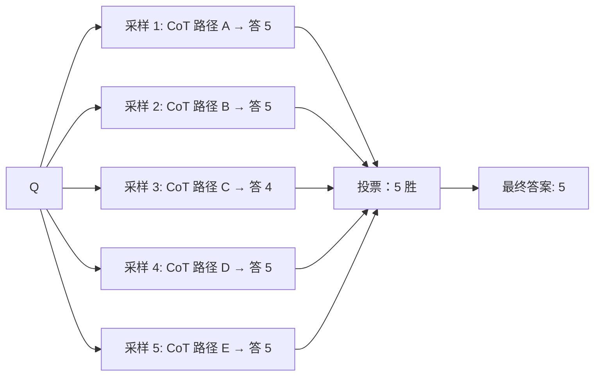
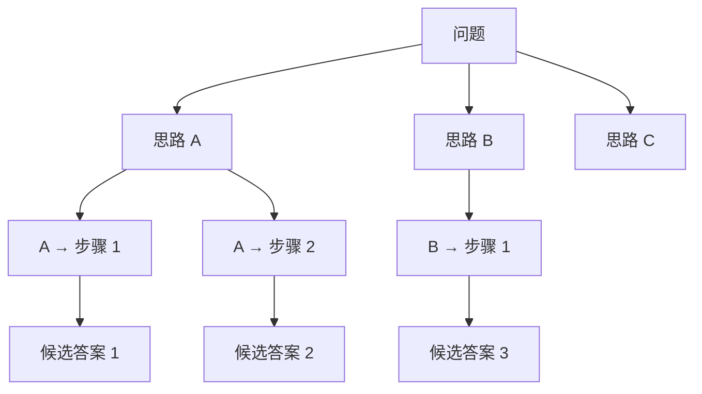
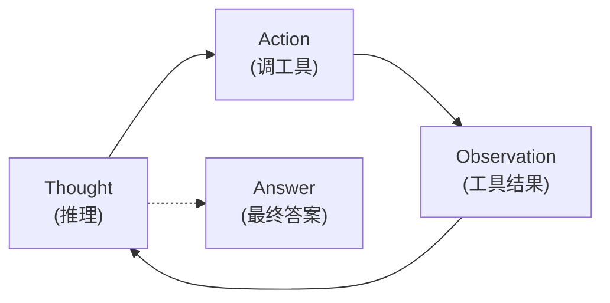
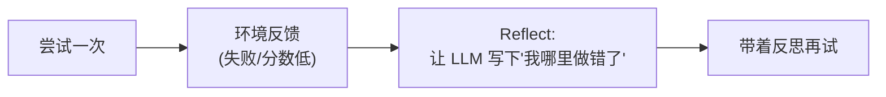
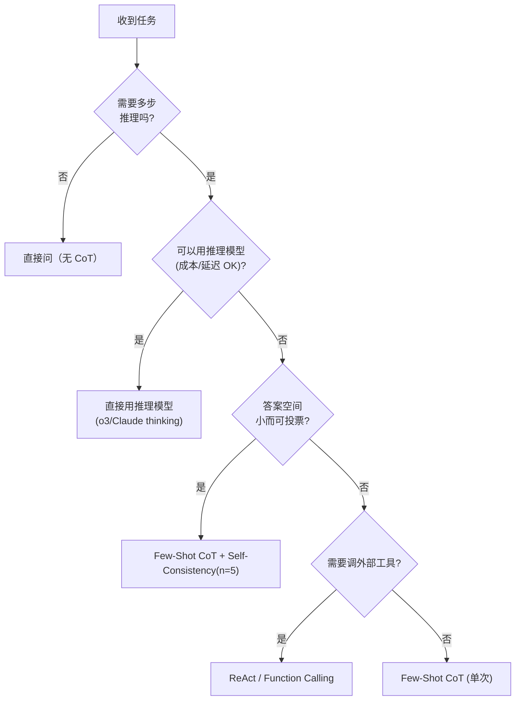

# 推理提示：CoT、Self-Consistency、ToT 与 ReAct

## 前言

**C：** 对于有"几步逻辑"的问题——数学、代码、多跳问答、带工具的 Agent——**直接问直接答往往错得离谱**。这一篇讲几种主流的"让模型展开思考"的提示范式，以及 2024–2026 年推理模型（o1 / o3 / Claude thinking 等）出现之后它们的**新定位**。

<!-- more -->

## 一、问题：为什么"直接问"会答错

看个经典例子：

```text
Q: 一个 300 页的书，小明每天读 15 页，读完需要多少天？他在第 12 天读到第几页？

A（直接回答）：20 天，第 180 页。  ❌
```

正确答案是 20 天、第 180 页。嗯……这个例子正好能答对。换一个复杂的：

```text
Q: 罗杰有 5 个网球。他又买了 2 罐网球，每罐 3 个。他现在一共有多少个网球？

A（早期 GPT-3 直接答）：11 个。  ❌（正确是 5 + 2×3 = 11，其实对了）
Q: Jack 有 10 块钱，他把其中一半的 80% 给了 Bob，然后又花了 1 块，还剩多少？

A（直接答）：3 块。  ❌（正确：10 - 10/2×0.8 - 1 = 10 - 4 - 1 = 5 块）
```

**根本原因**：Transformer 是"一步一 token"地续写，没有 scratch pad。如果它**直接蹦答案**，只走了几步前向——算术 / 多跳推理这点"步数"根本不够。

解药：**让它把"步骤"写出来**，相当于把推理的中间态显式保留在 context 里，后续 token 可以 attend 回来。这就是 Chain-of-Thought。

## 二、Chain-of-Thought（CoT）

### 2.1 最朴素的 CoT：一句 "Let's think step by step"

Kojima et al. 2022 提出 **Zero-Shot CoT**：只需在问题后加一句 `让我们一步一步思考` 或 `Let's think step by step`。

```text
Q: Jack 有 10 块钱，他把其中一半的 80% 给了 Bob，然后又花了 1 块，还剩多少？
让我们一步一步思考。

A：
1. Jack 一开始有 10 块。
2. 一半是 5 块。
3. 5 块的 80% 是 4 块，给了 Bob，剩 10 - 4 = 6 块。
4. 再花 1 块，剩 5 块。
答案：5 块。
```

一行咒语，准确率能**暴涨 20–40 个点**（数学题数据集如 MultiArith）。

### 2.2 Few-Shot CoT：示范带 rationale 的答案

更好用的是在示例里**也把推理过程写出来**：

```text
Q: 罗杰有 5 个网球。他又买了 2 罐网球，每罐 3 个。他现在一共有多少个网球？
A: 罗杰一开始有 5 个。他又买了 2 罐 × 3 = 6 个。5 + 6 = 11。答案是 11。

Q: 食堂有 23 个苹果。他们用了 20 个做午餐，又买了 6 个。现在有多少？
A: 剩下 23 - 20 = 3 个。再买 6 个，3 + 6 = 9。答案是 9。

Q: 一个花园有 12 棵树，又种了一排 8 棵。一共多少棵？
A:
```

给了范式，模型会沿着这个**格式**继续写——这是 ICL 的基本规律（第 04 篇细讲）。

### 2.3 为什么 CoT 有效

直觉上两条：

1. **把步骤落到 token 上，让后续生成能 attend 到中间结果**——相当于有了"草稿纸"；
2. **鼓励模型采取"按部就班模式"**——训练集里看到"让我们一步一步思考"之后的语料，主要就是分步推理。

### 2.4 CoT 的代价与反例

- **慢 + 贵**：输出长度变成 3–10 倍；
- **简单任务反而变差**——模型多写多错（把"3+5"写成推理反而出岔子）；
- **不能泄露给用户**时，CoT 要放"后台"——可以用 `system` 里约定 "**先写推理再用 `===` 分隔，之后只把 `===` 之后的内容给用户**" 这种技巧，但模型会偶尔破边界。

现代实务规则：

- **高推理任务** → 用 CoT；
- **简单问答/生成** → 不要 CoT（省钱省延迟）；
- **要隐藏推理** → 交给**推理模型**（见 2.5）。

### 2.5 2024–2026 的新变量：推理模型

**o1 / o3 / Claude 3.7 with thinking / Gemini 2.x thinking** 这一代模型，在**内部**自动展开长 CoT，并用 RL 特意训练过这件事。你只需**直接提问**，模型自己会生成内部 reasoning token（对用户不可见但计费），再给最终答案。

后果：

| 场景 | 用普通模型 + CoT prompt | 用推理模型 |
|---|---|---|
| 数学 / 逻辑 | 有效，但比推理模型差一截 | **首选** |
| 代码生成 | CoT 有效 | 推理模型明显更强 |
| 短问答 / 摘要 | 不要 CoT | 推理模型**反而 overkill** |
| 延迟敏感 | CoT 勉强 | **推理模型不合适**（每次都慢） |
| 成本敏感 | CoT 可控 | 推理模型贵 3–10× |

**实务结论**：**推理任务优先试推理模型**；如果业务对延迟 / 成本敏感、或无推理模型可用，再手写 CoT。

## 三、Self-Consistency：投票代替单次推理

CoT 是**一次采样一条推理链**。同一问题 **采样多次**，得到多条链，再按结果**投票**——这就是 Self-Consistency。



最小实现：

```python
def self_consistent_answer(question: str, n: int = 5) -> str:
    answers = []
    for _ in range(n):
        out = llm.chat(
            messages=[{"role":"user","content": question + "\n让我们一步一步思考。"}],
            temperature=0.7,      # 需要多样性
        )
        answers.append(parse_final_answer(out))
    return max(set(answers), key=answers.count)
```

**要点**：

- `temperature=0` 下投票没意义（样本完全一样），**必须** `temperature ≥ 0.5`；
- `n=5` 在 GSM8K 这类数学题上几乎总能比单次 CoT 再涨 5–15 个点；
- 代价是**线性变贵**——只在少量关键请求上用，不要默认开。

## 四、Tree-of-Thoughts（ToT）：显式分支与剪枝

Self-Consistency 是"采样五条独立链"。**ToT** 把问题变成**显式的搜索树**：每一步生成几个候选，由一个评价器剪枝，再对剩下的展开。



流程：

1. **生成候选**：对当前节点，让 LLM 列出 k 个可能的下一步；
2. **评估**：让另一个 LLM（或同一个 LLM 换 prompt）给每个候选打分；
3. **搜索**：DFS / BFS + 剪枝，保留 top-m 分支展开；
4. **终止**：到达 leaf（给出答案）或深度用尽。

**适合**：

- 有明显可分支的题（解方程、规划、棋局、拼词游戏）；
- 有"评价器"可写（单元测试、答案验证、成本函数）。

**代价**：

- API 调用数是 CoT 的 **几十倍**；
- 实现复杂，调 k、m、max_depth 经常很痛；
- 多数业务问题其实用 Self-Consistency 或推理模型就够——ToT 是一把**真·大锤**，不要随便抡。

## 五、ReAct：推理 + 行动的基本范式

ReAct = **Rea**soning + **Act**ing（Yao et al. 2022）。它是**Agent 的语法基础**——几乎所有 tool-use agent 内部都是 ReAct 变体。

ReAct 的输出格式：

```text
Thought: 我需要先知道今天是星期几。
Action: get_current_time()
Observation: 2026-04-22 (Wednesday)
Thought: 今天是周三，下一个周一是 4 月 27 日。我再查一下这天的会议。
Action: list_events(date="2026-04-27")
Observation: [{"title":"Design Review","time":"14:00"}]
Thought: 下周一 14:00 有 Design Review。
Answer: 下周一（4 月 27 日）14:00 有一个 Design Review。
```

三个元素循环：



**与 CoT 的区别**：

- CoT 是**纯内部推理**，不接触外部；
- ReAct 的 `Action` 调**真实工具**（第 02 章 Function Calling 的那一套），可以获取时效信息、做修改；
- ReAct **自然嵌进 Agent loop**——所以现代 LangChain / LangGraph / Claude Code 等几乎都以 ReAct 作为默认范式（见 `ai-agent/03-LangChain/06-LangGraph`）。

### 5.1 ReAct 的提示模板骨架

```text
你有以下工具：{tools_schema}

对每一步，请严格按以下格式：
Thought: <你的下一步思考>
Action: <tool_name>(<args>)
Observation: <tool 返回（由系统填）>

在足够信息时给出：
Answer: <最终答案>
```

在实际调用里，`Observation` 是你代码**拦截 Action、执行工具、把结果填回**给模型——和第 02 章讲的 Function Calling 底层一致。

现代 API（OpenAI function calling、Anthropic tool use）**把 Thought-Action 用原生 JSON 表示**，已经不用手写这段格式——但理解它的结构依旧重要。

### 5.2 Reflexion：看自己错了哪

Shinn et al. 2023 的 Reflexion 给 ReAct 加了"**失败后自省**"的一步：



效果：

- 在可编程验证的任务（代码题、数学题）上，Reflexion 能再提 10–20 个点；
- 需要**自动的失败信号**——单元测试、检索结果、数值对比之类；
- 对纯"主观"任务（写作、对话）提升有限。

## 六、几种范式的对比速查

| 范式 | 调用次数 | 适合 | 不适合 | 现代替代 |
|---|---|---|---|---|
| 直接问 | 1 | 简单问答 / 生成 | 多步推理 | —— |
| Zero-Shot CoT | 1（长） | 中等推理 | 简单 QA | 推理模型 |
| Few-Shot CoT | 1（长） | 有示范空间的任务 | 长尾 | 推理模型 |
| Self-Consistency | N | 答案空间有限、投票有意义 | 开放式生成 | —— |
| ToT | 10–100 | 可分支可评价 | 轻量任务 | —— |
| ReAct | 多次 + 工具 | 带外部工具的 Agent | 单次纯推理 | —— |
| Reflexion | 多次 + 反思 | 有自动判分 | 主观任务 | —— |
| **推理模型** | 1（内部 N） | 几乎覆盖以上全部推理场景 | 低延迟/低成本场景 | —— |

## 七、综合实务：怎么选



三个决策关节：

1. **要不要推理**——别一刀切全开 CoT；
2. **能不能用推理模型**——有就用，省心；
3. **要不要工具**——要就 ReAct，不要就 CoT。

## 八、常见反例和纠正

### 8.1 "加了 'think step by step' 反而变差"

原因：简单题（选择、改写、分类）被迫扯推理，**长链反而引入错误**。
对策：只在**需要计算 / 多跳**时触发。

### 8.2 "Self-Consistency 跑 5 次全一样"

原因：`temperature=0` 或 `top_p=0`。
对策：采样参数必须**有多样性**——`temperature=0.7`、`top_p=0.95` 常用。

### 8.3 "ToT 实现好几百行，效果还不如推理模型"

不意外。ToT 工程量大，多数场景**不值**——先用推理模型做 baseline。

### 8.4 "ReAct 模型自己编 Observation"

模型生成 "Observation: xxx" 这一行，用户代码没拦住。
对策：**Observation 由你填，不由模型填**。用 stop sequence 或 function-calling 原生 API 防逃逸（第 05 章细讲）。

### 8.5 "推理模型拿来写简单文案"

o3 / Claude thinking 去写一句微博文案——成本 10 倍，延迟 5 秒，文案并没更好。
对策：**给推理模型留大脑型任务**；日常生成用标准模型。

## 九、一段能跑的 Self-Consistency CoT

```python
import re, collections
from openai import OpenAI
client = OpenAI()

PROMPT = """解答下面题目，严格按以下格式：
先分步推理，最后一行必须是 `答案: <数字>`。

题目: {q}
"""

def ask_once(q, t=0.7):
    r = client.chat.completions.create(
        model="gpt-4o-mini",
        temperature=t,
        messages=[{"role":"user","content": PROMPT.format(q=q)}],
    )
    txt = r.choices[0].message.content
    m = re.search(r"答案[::]\s*(-?\d+(\.\d+)?)", txt)
    return m.group(1) if m else None

def self_consistent(q, n=5):
    votes = [ask_once(q) for _ in range(n)]
    votes = [v for v in votes if v is not None]
    if not votes:
        return None
    return collections.Counter(votes).most_common(1)[0][0]

print(self_consistent(
    "一列火车以 60km/h 匀速行驶。司机发现前方 1km 处有另一列火车以 40km/h 同向行驶。"
    "问两车相撞需要多久？"
))
```

40 行以内就覆盖"CoT + Self-Consistency + 结构化解析"——**不要把推理提示神秘化**。

## 十、小结

- 对"多步推理"任务，**直接答会系统性地错**，需要让模型把过程写出来；
- **Zero-shot CoT** 一句 "让我们一步一步思考" 就能涨 20–40 点；
- **Self-Consistency** 用投票把偶发错误抹掉，代价是线性调用数；
- **ToT** 是极端工具，除非有清晰评价器并且问题可分支，否则不值得；
- **ReAct** 是 Agent 的基础语法——理解它就理解了所有 tool-use 流程；
- **2024 年后**推理模型（o1/o3/Claude thinking）把"长 CoT"内化进模型——简单任务不要用、推理任务优先用；
- 选型靠三个问题：**要不要推理 / 能不能用推理模型 / 要不要工具**。

::: tip 延伸阅读

- [Chain-of-Thought Prompting (Wei et al., 2022)](https://arxiv.org/abs/2201.11903)
- [Zero-Shot CoT (Kojima et al., 2022)](https://arxiv.org/abs/2205.11916)
- [Self-Consistency (Wang et al., 2022)](https://arxiv.org/abs/2203.11171)
- [Tree-of-Thoughts (Yao et al., 2023)](https://arxiv.org/abs/2305.10601)
- [ReAct (Yao et al., 2022)](https://arxiv.org/abs/2210.03629)
- [Reflexion (Shinn et al., 2023)](https://arxiv.org/abs/2303.11366)
- OpenAI o1/o3 系统卡与推理模型白皮书
- 本册下一篇：`04-Few-Shot与In-Context Learning：示例的选、排、数`

:::
