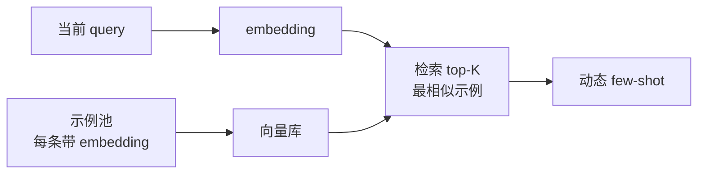

# Few-Shot 与 In-Context Learning：示例的选、排、数

## 前言

**C：** 上一篇的推理提示里多次出现"示例"这个词。这篇专门把它说透——**In-Context Learning（ICL）** 到底在学什么、示例要几个、怎么挑、怎么排。这是 prompt 工程里**收益/成本比最高**的技巧之一。

<!-- more -->

## 一、什么是 In-Context Learning

ICL 是 GPT-3 论文（Brown et al., 2020）里被命名的现象：

> 在 prompt 里放几个 `(输入, 输出)` 示例，模型就能"学会"这个任务——**无需修改任何权重**。

零 shot、单 shot、few-shot：

```text
# Zero-shot：不给示例
翻译成英文：你好。

# One-shot：1 个示例
翻译成英文：
早上好 => Good morning
你好 =>

# Few-shot：多个示例
翻译成英文：
早上好 => Good morning
再见 => Goodbye
我爱你 => I love you
你好 =>
```

注意：ICL 并不是"真的学习"——**模型权重一个字节都没变**。它是"通过看到几条示例，把自己的概率分布倾斜向这个 pattern"——本质还是上下文续写。

## 二、ICL 到底在"学"什么

研究 (Min et al., 2022) 发现一个反直觉的事实：

> **示例里的"标签是否正确"，对 ICL 的影响很小；但"标签的格式分布"和"输入的分布"非常关键。**

也就是说，示例主要在教模型：

1. **输入长什么样**（风格、领域、句式）；
2. **输出长什么样**（格式、字段、长度）；
3. **二者的映射模式**（分类类 / 抽取类 / 转换类）。

**它不是在"教知识"，是在"教格式和风格"。** 这条规律给后面所有策略定了方向：**选示例首先看风格匹配，不是答案对不对**（虽然答案尽量也正确）。

## 三、到底该用几个示例

一个常见误解：示例越多越好。事实上：

```mermaid
flowchart LR
  x0["0-shot"] --> x1["1-shot"] --> x3["3-shot"] --> x5["5-shot"] --> x10["10-shot"] --> x20["20+-shot"]
  x0 -.->|基线| base["60%"]
  x1 -.->|+15pt| p1["75%"]
  x3 -.->|+5pt|  p3["80%"]
  x5 -.->|+2pt|  p5["82%"]
  x10 -.->|+1pt| p10["83%"]
  x20 -.->|-1pt| p20["82%"]
```

数字只是示意，但**曲线形状是真实的**——收益在 1–3 shot 内就吃完了大半，之后**边际递减**，超过一定数量甚至**反降**（冗长、引入噪声、预算挤占真正任务）。

对现代强模型的经验数：

| 任务类型 | 建议示例数 |
|---|---|
| 分类、抽取、简单转换 | 0–3 |
| 风格仿写、特殊格式 | 3–5 |
| 复杂结构输出（JSON、图表） | 3–8 |
| 多步推理（CoT） | 3–5 带 rationale |
| 低频领域 / 长尾 | 5–10，但看收益 |

**实务习惯**：**从 0 开始**，试错后**逐步加**，加到收益平缓就停——别一上来堆 10 个。

## 四、示例选择：随机 vs 相似 vs 多样

怎么从库里选这 N 个示例？四种主流策略：

### 4.1 随机

从示例池里均匀随机抽。实现简单，是所有方法的 baseline。

- 优点：不增加任何基础设施；
- 缺点：命中"与当前 query 无关的例子"的概率高，尤其在异质数据集上。

### 4.2 相似度检索（K-NN / Dynamic Few-Shot）

用 embedding 把示例和 query 都向量化，每次 query 检索 top-K 相似示例：



最小实现（接前面 RAG 章节的思路）：

```python
def select_examples(query: str, pool: list[Example], k: int = 3) -> list[Example]:
    q_vec   = embed([query])[0]
    scores  = pool_vecs @ q_vec         # pool_vecs 已离线算好
    top_idx = scores.argsort()[::-1][:k]
    return [pool[i] for i in top_idx]
```

**这是目前最主流也最有效的选法**——在分布偏移大的真实业务里能比固定 few-shot 高 5–15 个点。

### 4.3 多样性（Diversity / Coverage）

只挑相似的例子容易**过于同质**——如果有 3 条几乎一样的示例，模型"只见过一种样子"，对边缘样本泛化差。

典型做法：**相似度召回 + MMR 去重**（第 4 册第 05 篇讲过）：

```python
def select_diverse_examples(query, pool, k=3, lam=0.5):
    candidates = top_n_similar(query, pool, n=20)      # 先相似度粗选
    selected = []
    for _ in range(k):
        # 在候选里选 (相关性高 && 与已选集合差异大) 的
        best = max(candidates, key=lambda c:
            lam * sim(c, query) -
            (1-lam) * max([sim(c, s) for s in selected], default=0)
        )
        selected.append(best)
        candidates.remove(best)
    return selected
```

**什么时候更优**：

- 示例池本身就高度重复（比如同一模板生成的）；
- 任务要求覆盖多种边缘 case。

### 4.4 难负例 / 对比例（Hard negatives / contrastive examples）

对**分类/判别**类任务，**示例里要混一些"刚好错的对比例"**：

```text
判断下面代码是否有空指针风险：

代码: if p: p->x = 1;
判断: 安全（有 null check）

代码: p->x = 1;
判断: 有风险（没 null check）

代码: if (p == NULL) { p->x = 1; }
判断: 有风险（判断反了）     ← 难负例

代码: {{ user_code }}
判断:
```

这类**刚好踩到陷阱**的示例，对模型泛化比一堆"一眼对/一眼错"的例子有用得多。

## 五、排序：位置很重要

同样三条示例，**换个顺序**，准确率能差 5–10 个点。这种现象叫 **order sensitivity**。

### 5.1 常见位置效应

两个经验规律：

1. **Recency bias**（近因偏差）——最后一条示例对模型影响最大，因为它**最靠近用户 query**；
2. **Lost in the middle**——中间的示例最容易被"忽视"（和上下文工程那篇一致）。

所以：

- **最具代表性 / 最接近目标的那个示例，放最后**；
- **最"边缘"的示例放中间**（偏远示例放末尾会把模型带偏）；
- **标签别集中在一头**——比如分类任务 5 条示例，不要前 4 条都是"正例"最后 1 条才是"负例"，分布混杂更稳。

### 5.2 减小顺序敏感性

- 用 **dynamic few-shot**（相似度检索）时，默认顺序按相似度降序即可（靠后的越相似）；
- 跑重要任务前，可以**多种顺序各跑一遍**，做 self-consistency；
- 高赌注场景：把示例顺序当成超参一并调。

## 六、Few-Shot 和 CoT 的组合：Few-Shot-CoT

第 03 篇提过，这里补齐格式：

```text
Q: 食堂有 23 个苹果，用了 20 个做午餐，又买了 6 个。现在有多少？
A: 一开始 23，用掉 20，剩 3；再买 6，3 + 6 = 9。答案: 9。

Q: 一个停车场有 3 辆车，又开进来 2 辆。现在几辆？
A: 3 + 2 = 5。答案: 5。

Q: 小明有 12 根棒棒糖，给了小红 5 根，又从妈妈那里拿了 7 根。现在几根？
A:
```

示例里给 **rationale + 最终答案**——模型学到的不只是"算术"，是"**分步 + 最后一句是答案**"这个**格式**。

## 七、Few-Shot 的成本模型

千万别忘了：**每多一条 shot 都要付 token 费，每一次请求都付**。

假设一条示例 200 tok，5 条示例 = 1000 tok。日调用 100w 次：

- 输入侧多 **10 亿 tok** = 按主流价位就是**几千刀**/天；
- 延迟增加 10–50 ms（长 prompt 要生成 KV cache）。

**省钱思路**：

- **尽量 0-shot**——现代强模型在多数任务上 0-shot 就够了；
- **prompt caching**：系统 prompt + 固定 few-shot 部分用 cache（Anthropic/OpenAI/Gemini 都有），命中后价格直降 80–90%；
- **动态 few-shot**：不是每个请求都配 5 条，**只在需要时**召回——小 chunk embedding 库足够。

## 八、什么场景 Few-Shot 最划算

给个决策表：

| 场景 | 用不用 few-shot |
|---|---|
| 通用问答 / 摘要 | 多数**不用**（强模型 0-shot 能打） |
| 特殊输出格式（JSON/表格/特定 markdown） | **用 1–3 个** |
| 风格仿写（公司内部邮件、文案） | **用 3–5 个** |
| 复杂抽取（嵌套字段 / 多实体） | **用 3–5 个 + CoT rationale** |
| 评分 / 打分 / 判别 | **用 3 个 + 1 个 hard negative** |
| 长尾 / 专业术语密集 | 动态 few-shot |
| 创意写作 | 可用，但别太多（限制创意） |
| 数学 / 编码推理 | 优先推理模型；没有再 few-shot CoT |

## 九、一段完整的 Dynamic Few-Shot 实现

连通第 04 册（RAG）和本册：

```python
import numpy as np
from openai import OpenAI
client = OpenAI()

# ----------- 离线：示例库 -----------
POOL = [
    {"q": "公司年假多少天？", "a": "15 天。"},
    {"q": "请假怎么申请？",   "a": "OA -> 请假申请 -> 选类型 -> 提交。"},
    {"q": "报销流程是什么？", "a": "上传发票 -> 直属领导审批 -> 5 个工作日到账。"},
    {"q": "食堂周末开吗？",   "a": "周末不开，仅周一至周五 11:30-13:00。"},
    # ...
]

def embed(texts):
    r = client.embeddings.create(model="text-embedding-3-small", input=texts)
    return np.array([e.embedding for e in r.data])

POOL_VECS = embed([ex["q"] for ex in POOL])

# ----------- 在线：检索 few-shot -----------
def select(query: str, k: int = 3) -> list[dict]:
    qv    = embed([query])[0]
    sims  = POOL_VECS @ qv
    top   = sims.argsort()[::-1][:k]
    # 按相似度升序排：最相似的放最后（靠近 user query）
    return [POOL[i] for i in reversed(top)]

# ----------- 生成 -----------
def answer(query: str) -> str:
    shots = select(query, k=3)
    messages = [{"role":"system","content": "你是公司 HR 助手。"}]
    for ex in shots:
        messages.append({"role":"user",     "content": ex["q"]})
        messages.append({"role":"assistant","content": ex["a"]})
    messages.append({"role":"user", "content": query})
    r = client.chat.completions.create(
        model="gpt-4o-mini", messages=messages, temperature=0,
    )
    return r.choices[0].message.content

print(answer("我入职半年能休年假吗？"))
```

几个工程点：

- **用 message 形式传 few-shot**，不是拼进一整段 user——model 能更清楚分辨"那几对是示例，最后一条才是真问题"；
- 示例按相似度**升序**放，最相似的最后一个；
- 真实场景里 `POOL` 会很大，用 pgvector / Qdrant 替代内存数组。

## 十、常见反模式

### 10.1 "示例和真实 query 分布完全不一样"

示例是玩具 query，线上来的是业务 query——格式、长度、风格都不对。
对策：**从真实日志里挑高质量样本**做示例库，别自己瞎编。

### 10.2 "5 个示例全是同一类"

5 个示例全是正例、全是短 query、全是同一种格式——模型遇到其他类型答案全走样。
对策：**覆盖维度**——正/负、长/短、简单/复杂，至少各占一条。

### 10.3 "示例里有错字 / 标错 label"

根据 Min et al. (2022)，label 错对分类结果影响没想象中大——但**格式的不一致会**。比 label 错更糟的是：

- 示例 1 答 "Yes"；
- 示例 2 答 "yes."（小写加句号）；
- 示例 3 答 "Correct"；

模型看到三种格式，学不到明确的输出约定。
对策：**示例格式必须完全一致**（大小写、标点、字段名）——这是 ICL 最看重的信号。

### 10.4 "Few-shot 越多越好"

忽视边际递减和噪声，硬塞 20 条，结果反而下降。
对策：**3–5 shot 起步**，只在看到指标涨再往上加。

### 10.5 "用 f-string 直接拼示例"

```python
prompt = f"Q: {examples[0]['q']}\nA: {examples[0]['a']}\n...\nQ: {user_q}\nA:"
```

示例里如果有 `{`、`}` 会炸，用户输入如果有 `Q:`、`A:` 会假装成新示例。
对策：用 messages 形式；要拼文本就用 Jinja + escape。

## 十一、小结

- ICL 的本质是**在上下文里教格式 / 风格 / 映射模式**，不是教知识；
- 示例数量**3–5 shot 起步**，收益平缓就停；
- 选示例三档：**随机 → 相似度检索 → +多样性 / 难负例**；
- 排序利用 recency bias——**最有代表性的放最后**；
- Few-Shot-CoT：示例里同时写推理过程；
- 成本可观：用 prompt caching、动态 few-shot 控制开销；
- **强模型时代，大多数任务 0-shot 已经够**——Few-shot 专治格式 / 风格 / 专业抽取；
- 下一篇专攻"让模型输出能被解析"的一切手段——JSON mode、Schema、约束解码。

::: tip 延伸阅读

- [GPT-3 论文中 In-Context Learning 的提出 (Brown et al., 2020)](https://arxiv.org/abs/2005.14165)
- [Rethinking the Role of Demonstrations (Min et al., 2022)](https://arxiv.org/abs/2202.12837)
- [Calibrate Before Use: Improving Few-Shot Performance](https://arxiv.org/abs/2102.09690)
- [Anthropic: Use Examples (Multishot Prompting)](https://docs.anthropic.com/en/docs/build-with-claude/prompt-engineering/multishot-prompting)
- 本册下一篇：`05-结构化输出：JSON、Schema与约束解码`

:::
