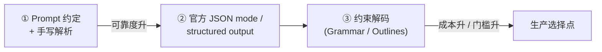
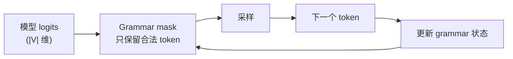

# 结构化输出：JSON、Schema 与约束解码

## 前言

**C：** 你写的 prompt 到了要**被其他代码消费**的时候，"模型的自然语言回答" 就是灾难——多一句少一句、引号方向不对、日期格式漂移，接收端天天报错。这一篇把"如何让模型输出**能被可靠解析**的结构"说清楚，并介绍三档方案：**纯 prompt 约定 → JSON mode → 约束解码（Constrained Decoding）**。

<!-- more -->

## 一、为什么要结构化

举个对比：

**自然语言回答**：

> 根据片段 [2]，密码重置需要在账号设置里点击"安全"，然后点"重置密码"按钮。

**结构化回答**：

```json
{
  "answer": "在账号设置 → 安全 → 重置密码。",
  "citations": [2],
  "confidence": 0.92,
  "needs_human": false
}
```

后者对**下游代码**的优势：

- `citations` 可以直接渲染成点击链接；
- `confidence < 0.6` 可以触发兜底分支；
- `needs_human=true` 可以自动转人工；
- **接入非对话型 UI（工单、表单、仪表盘）** 只需解析字段，不用再做 NLP。

结构化输出是**模型从"聊天机器人"变成"可靠组件"的关键一步**。

## 二、三档方案

按"可靠度 / 成本 / 实现门槛"三维度：



### 2.1 档位对比

| 档位 | 代表 | 可靠度 | 成本 | 门槛 |
|---|---|---|---|---|
| ① Prompt 约定 | 纯 prompt + `json.loads` | 80–95% | 无 | 最低 |
| ② JSON mode | OpenAI / Anthropic / Gemini 原生 | **99%+** | 接口费 | 低 |
| ③ 约束解码 | Outlines / guidance / llama.cpp grammar | **100%** | 自托管模型 | 高 |

**决策表**：

- 云 API + 生产业务 → **第 ② 档**（现代 API 已经非常成熟）；
- 自托管模型 + 严格格式 → **第 ③ 档**；
- 原型 / 成本极敏感 → 第 ① 档。

下面分别展开。

## 三、第 ① 档：Prompt 约定 + 手写解析

### 3.1 基本做法

在 prompt 里精确写清楚格式，**再配个鲁棒的解析器**。

```python
SYSTEM = """\
你是一个客服助手。仅输出以下格式的纯 JSON（不要 markdown、不要解释）：
{
  "answer": string,        // 80-200 字的回答
  "severity": "P0"|"P1"|"P2"|"P3",
  "needs_human": boolean
}
"""
```

### 3.2 为什么要有"修复层"

模型偶尔会：

- 把 JSON 包在 ```` ```json ```` 里；
- 在 JSON 前后加一句"好的，以下是结果：..."；
- 用单引号或智能引号；
- 最后多一个逗号；
- 字段名写错大小写。

**不加修复层，线上 1–5% 的请求会直接抛 `JSONDecodeError`。**

一个能用的解析器：

```python
import json, re

def safe_json_loads(raw: str) -> dict | None:
    txt = raw.strip()
    # 去掉 ```json ```
    if txt.startswith("```"):
        txt = re.sub(r"^```(json)?", "", txt).rstrip("`").strip()
    # 抽第一个 { ... }
    m = re.search(r"\{[\s\S]*\}", txt)
    if not m:
        return None
    candidate = m.group(0)
    try:
        return json.loads(candidate)
    except json.JSONDecodeError:
        # 简单修复：把智能引号替换掉 / 去 trailing comma
        fixed = (candidate
                 .replace("“","\"").replace("”","\"")
                 .replace("‘","'").replace("’","'"))
        fixed = re.sub(r",(\s*[}\]])", r"\1", fixed)
        try:
            return json.loads(fixed)
        except Exception:
            return None
```

再套一层 "失败就**让模型自己修复**"：

```python
def ask_json(prompt: str, retries: int = 2) -> dict:
    msg = [{"role":"system","content": SYSTEM},
           {"role":"user",  "content": prompt}]
    for attempt in range(retries + 1):
        raw = llm.chat(messages=msg, temperature=0)
        data = safe_json_loads(raw)
        if data is not None:
            return data
        # 请求重修
        msg.append({"role":"assistant","content": raw})
        msg.append({"role":"user","content":
            "上面回答不是合法 JSON，请严格按 system 里的 schema 重新输出，"
            "只输出 JSON，不加任何前后文字。"})
    raise RuntimeError("json parse failed after retries")
```

"自修复 + 重试"两招在没有官方 JSON mode 的模型上能把成功率从 95% 拉到 99.5%+。

### 3.3 纯 prompt 档的**必备 prompt 片段**

- **`只输出 JSON，不要 markdown、不要解释、不要前后文字`**——这一句**缺一不可**；
- 把 schema 用**类似 TypeScript 的写法**给出来，模型理解得比自然语言描述好：

  ```text
  输出结构（必须严格遵守）：
  {
    "answer":     string,
    "severity":   "P0"|"P1"|"P2"|"P3",
    "needs_human": boolean
  }
  ```

- 必要时在末尾附一个**示例 JSON**——one-shot。

## 四、第 ② 档：官方 JSON Mode / Structured Output

主流供应商都有"保证输出合法 JSON 甚至符合 schema"的原生 API。这是**生产首选**。

### 4.1 OpenAI Structured Outputs

```python
from pydantic import BaseModel
from openai import OpenAI
client = OpenAI()

class Answer(BaseModel):
    answer:       str
    severity:     str
    needs_human:  bool

resp = client.responses.parse(
    model="gpt-4o-2024-08-06",
    input=[
        {"role":"system","content":"你是客服助手。"},
        {"role":"user",  "content":"登录一直 500 怎么办？"},
    ],
    text_format=Answer,
)
print(resp.output_parsed)   # Answer(answer=..., severity=..., needs_human=...)
```

底层实现是**约束解码**——OpenAI 拿你的 Pydantic schema 转成 JSON Schema，推理时**强制每一步采样都走合法 token**。所以：

- **100% 合法 JSON**；
- **100% 符合 schema**（字段齐全、枚举值正确、类型一致）；
- **但不保证内容正确**——"合法字段 + 错内容"仍然会发生。

### 4.2 Anthropic Structured Output

Anthropic 用 **tool use** 做结构化输出——把你的 schema 包成"一个必须调用的工具"：

```python
import anthropic
client = anthropic.Anthropic()

TOOL = {
    "name": "respond",
    "description": "Structured response to the user.",
    "input_schema": {
        "type": "object",
        "properties": {
            "answer":     {"type":"string"},
            "severity":   {"type":"string","enum":["P0","P1","P2","P3"]},
            "needs_human":{"type":"boolean"},
        },
        "required": ["answer","severity","needs_human"],
    },
}

msg = client.messages.create(
    model="claude-3-5-sonnet-latest",
    max_tokens=1024,
    tools=[TOOL],
    tool_choice={"type":"tool","name":"respond"},   # 强制调用这个工具
    messages=[{"role":"user","content":"登录一直 500 怎么办？"}],
)
# tool_use 块里 input 就是结构化结果
```

和 Function Calling 共用一套机制（见第 02 章）。

### 4.3 Gemini responseSchema

Gemini 在 `generation_config` 里带 `response_schema`：

```python
import google.generativeai as genai

schema = {
  "type":"object",
  "properties":{
    "answer":      {"type":"string"},
    "severity":    {"type":"string","enum":["P0","P1","P2","P3"]},
    "needs_human": {"type":"boolean"},
  },
  "required":["answer","severity","needs_human"],
}

model = genai.GenerativeModel("gemini-2.0-flash-latest")
resp = model.generate_content(
    "登录一直 500 怎么办？",
    generation_config={"response_mime_type": "application/json",
                       "response_schema": schema},
)
```

### 4.4 三家对比

| 项 | OpenAI | Anthropic | Gemini |
|---|---|---|---|
| 调用姿势 | `text_format=Pydantic` / `response_format` | 借 tool_use + `tool_choice` | `response_schema` |
| 合法性 | 100% JSON & schema | 100%（只要模型调那个工具） | 100% JSON & schema |
| Schema 支持 | JSON Schema 子集 | JSON Schema 子集 | JSON Schema 子集 |
| 缺点 | 极长枚举会超限 | 多了一层 tool 抽象 | enum 不支持 `null` |

**共同点**：**字段的 `description` 依旧是"写给模型看"的 prompt**——schema 是地基，`description` 是引导。

### 4.5 Schema 编写注意

- 必填字段放 `required`，非必填别加；
- 枚举值（`enum`）能缩就缩——`"severity": "P0"|"P1"|"P2"|"P3"` 比纯 `string` 好得多；
- `description` 写清语义和典型值——"severity：依据影响范围判定的严重度，P0 最严重"；
- 嵌套 ≤ 3 层——更深的结构容易卡在生成速度；
- 不要在一个 schema 里混太多独立任务——每多一个字段都是 context 开销。

## 五、第 ③ 档：约束解码（Constrained Decoding / Grammar）

### 5.1 它到底在做什么

标准生成是：每一步从整个 vocab 里按概率采样下一个 token。

约束解码是：**在采样前，先用一个语法 (Grammar) 剪掉所有"不合法"的 token**，只在剩下的子集中按概率归一采样。



好处：

- **100% 符合语法**——不是"概率上不错"，是**在采样层面被禁止违反**；
- 不挑模型——任何开源模型都能装上；
- Schema 可以是任何 CFG / regex，不限于 JSON。

代价：

- **要能访问 logits** —— 云 API 多数做不到，只能在自托管模型上用；
- Grammar 写起来有学习成本；
- 对推理速度略有拖慢（每步多一次掩码）。

### 5.2 代表工具

- **[Outlines](https://github.com/dottxt-ai/outlines)**：Python 库，支持 Pydantic schema、regex、CFG；
- **[guidance](https://github.com/guidance-ai/guidance)**：微软出品，DSL 式 prompt + 结构；
- **[xgrammar](https://github.com/mlc-ai/xgrammar)** / **llama.cpp grammar**：C++ 后端的高速约束引擎；
- **vLLM / TGI** 都已经内置 grammar 解码选项。

### 5.3 最小 Outlines 示例

```python
from pydantic import BaseModel
from outlines import models, generate

class Report(BaseModel):
    summary:  str
    severity: str
    count:    int

model = models.transformers("meta-llama/Llama-3.1-8B-Instruct")
gen   = generate.json(model, Report)

result: Report = gen("总结下面故障并给出严重度... ")
print(result)         # Report(summary=..., severity=..., count=...)
```

本地 Llama 3.1 + Outlines 就能拿到 **和 OpenAI structured output 等价的 100% schema 合规性**，且完全离线。

### 5.4 不只 JSON：任何 CFG

约束解码的想象空间远大于 JSON。能写的 grammar 包括：

- **枚举列表**：`"red" | "green" | "blue"`；
- **特定格式**：日期 `\d{4}-\d{2}-\d{2}`；
- **SQL 子集**：自定义简化 SQL 语法，保证输出能跑；
- **JSONL**：逐行 JSON 对象，适合流式处理；
- **代码 AST**：接 tree-sitter 保证生成的代码在语法上一定能 parse。

这是自托管模型能超越云 API 的地方之一。

## 六、流式解析：结构化 + 流式并不矛盾

一个常见担心："我开了 structured output，就不能流式了吧？"

**可以**。三档都有对应做法：

### 6.1 JSON mode + 流式

OpenAI / Anthropic 都支持开 streaming 时仍输出 JSON——每个 chunk 是**JSON 的一部分字符**。接收端用**增量 JSON 解析器**（[partial-json](https://github.com/promplate/partial-json-parser)、[json-stream](https://pypi.org/project/json-stream/)）就能边收边渲染：

```python
from partial_json_parser import loads, Allow

buf = ""
for chunk in stream:
    buf += chunk.text
    try:
        partial = loads(buf, allow_partial=Allow.ALL)
        render(partial)       # 前端逐步填字段
    except Exception:
        pass
```

### 6.2 Grammar 流式

Outlines / xgrammar 都原生支持——grammar mask 本身就是逐 token 做的，流不流式对它没差。

**结论**：流式和结构化**在现代 API 已经完全兼容**——不要做二选一。

## 七、结构化输出不等于"不会错"

你的 JSON 合法 ≠ JSON **内容**合法。常见 traps：

### 7.1 空字段 / 幻觉引用

```json
{"answer":"根据 [3] [4]", "citations":[]}
```

引用说有 `[3][4]`，但 `citations` 是空——**格式合法，内容不合法**。

对策：

- Schema 里加约束："`answer` 文本里出现的编号必须全在 `citations` 里"；
- **应用层再校验一次**——模型给的结构永远不要全信。

### 7.2 枚举值被塞了其他字符

模型违反枚举的概率已经非常低，但偶尔会在字段里多塞一个空格或点：`"P0."`。

对策：

- OpenAI/Gemini 的 structured output 已经在 logits 层禁掉；
- 纯 prompt 路线必须在应用层 `value in ENUM`。

### 7.3 数字变字符串

```json
{"count": "3"}   // 期望 3，给成 "3"
```

对策：Schema 强类型 + Pydantic 解析——合法的 structured output 实现会直接拦住，但自己 prompt 拼的要小心。

### 7.4 "字段太多导致漏生成"

Schema 有 20 个字段 → 模型偶尔会跳过几个。

对策：

- **必填字段不要太多**；
- 不必要的字段用 `optional`；
- 非必要时用 **两步生成**：第一步生成必填，第二步根据结果追加可选字段。

## 八、何时不要结构化

别过度结构化。以下场景**保持自然语言更好**：

- **长文创作 / 对话回复** —— 硬塞进 `{"reply": "..."}` 只是白增 context；
- **解释类 / 教学类回答** —— 自由文字承载更丰富；
- **模型已经在流式到用户** —— 用户要看的是文字，不是 JSON。

**一个实用分界线**：

> **下游是代码** → 结构化；**下游是人** → 自然语言。

两者都要的场景可以**同时让模型输出 `answer_text` 和 `meta`**——前者给用户看，后者给系统用。

## 九、一段生产侧的包装函数

把三档能力封装成一个接口：

```python
from pydantic import BaseModel
from typing import Type, TypeVar
T = TypeVar("T", bound=BaseModel)

def structured(
    schema: Type[T],
    system: str,
    user:   str,
    *,
    backend: str = "openai",     # "openai" | "anthropic" | "local"
    retries: int = 2,
) -> T:
    if backend == "openai":
        resp = openai.responses.parse(
            model="gpt-4o-2024-08-06",
            input=[{"role":"system","content":system},
                   {"role":"user",  "content":user}],
            text_format=schema,
        )
        return resp.output_parsed

    if backend == "anthropic":
        tool = pydantic_to_anthropic_tool(schema, name="respond")
        r = anthropic_client.messages.create(
            model="claude-3-5-sonnet-latest",
            tools=[tool], tool_choice={"type":"tool","name":"respond"},
            messages=[{"role":"user","content": f"{system}\n\n{user}"}],
            max_tokens=1024,
        )
        payload = next(b.input for b in r.content if b.type == "tool_use")
        return schema.model_validate(payload)

    if backend == "local":
        gen = outlines_json(local_model, schema)
        return gen(f"{system}\n\n{user}")

    raise ValueError(backend)
```

业务代码直接调：

```python
class Triage(BaseModel):
    severity: str
    summary:  str
    need_hi:  bool

t = structured(Triage,
    system="你是运维 triage 助手。",
    user="登录一直 500",
    backend="openai")

if t.need_hi:
    page_oncall(t)
```

**把"选择哪档"这件事藏在包装里**——业务代码不用关心，换 backend 一行参数即可。

## 十、小结

- 结构化输出是让模型从"聊天机器人"变成"可靠组件"的分水岭；
- 三档方案：**Prompt + 解析 → JSON mode → Grammar 约束**，按可靠度升、门槛升；
- 云 API 业务首选**官方 structured output / function calling**；自托管加严苛格式用 **Outlines / Grammar**；
- Schema 的 `description` 是给**模型**看的 prompt，不只是文档；
- 流式和结构化**不矛盾**——增量 JSON 解析是现代前端范式；
- 合法结构 ≠ 正确内容——应用层永远要再校验一次；
- 下游是代码就结构化，下游是人就保持自然语言。

::: tip 延伸阅读

- [OpenAI Structured Outputs](https://platform.openai.com/docs/guides/structured-outputs)
- [Anthropic Tool Use](https://docs.anthropic.com/en/docs/build-with-claude/tool-use)
- [Gemini Controlled Generation](https://ai.google.dev/gemini-api/docs/structured-output)
- [Outlines](https://github.com/dottxt-ai/outlines)
- [xgrammar](https://github.com/mlc-ai/xgrammar)
- 本册第 02 章 `02-Function-Calling与Tool-Use` —— 和本篇强相关
- 本册下一篇：`06-上下文工程：长上下文、记忆与RAG拼接`

:::
