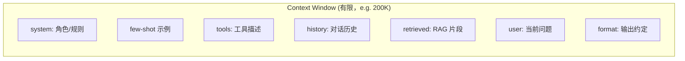
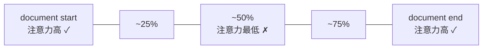
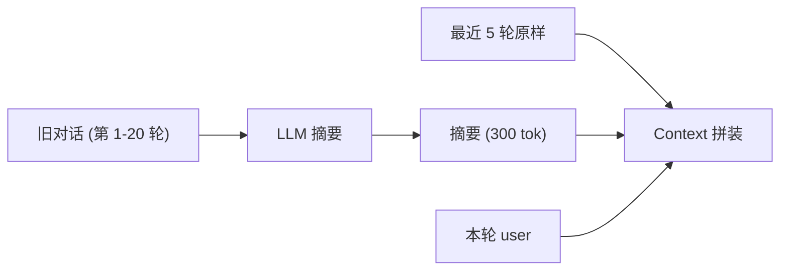

# 上下文工程：长上下文、记忆与 RAG 拼接

## 前言

**C：** 2024 年后一个被反复提起的新词是 "**Context Engineering**"（上下文工程）。为什么有这个词？因为**只写好一句 prompt 已经远远不够**——现代 LLM 应用每次都要在有限的 context window 里塞进：角色、规则、示例、历史、检索片段、工具描述、用户输入……**怎么安排它们，比每一段本身写得多精致还重要**。这一篇把 context 当成资源来管理。

<!-- more -->

## 一、从 "Prompt Engineering" 到 "Context Engineering"

"Prompt" 指的是一段你写下来的文本；"Context" 指的是**整个被送进模型的 token 窗口内容**。



**这 7 段**都属于 context。Context Engineering 要回答：

1. **每段该放多长？**（token 预算）
2. **放在哪儿？**（位置效应）
3. **动态选哪些？**（检索、压缩、摘要）
4. **怎么监控？**（命中率、成本）

这和单纯的"写一句好 prompt" 是两个维度——前者关心**模板**，后者关心**资源调度**。

## 二、Context Window 不是越大越好

2024 年开始，模型 context window 一路飙到：

| 模型 | 最大 context | 备注 |
|---|---|---|
| GPT-4o | 128K | |
| Claude 3.5/3.7 | 200K | Beta 到 1M |
| Gemini 1.5 Pro / 2.5 | **1M–2M** | |
| 开源 Llama 3.1 | 128K | RoPE scaling |

**但能放得下，不代表放得值。** 三个现实成本：

### 2.1 价格线性涨

大多数 API 按输入 token 计费。塞 100K 进去每次 ≈ $0.30–$3。一天 10w 次查询就是**几千刀/天**。

### 2.2 延迟非线性涨

Prefill 阶段是 $O(n^2)$ 的 attention 计算（抛开 KV cache）。200K prompt 的 prefill 轻松 **5–30 秒**，实际用户体验很糟。

### 2.3 注意力质量下降

这是最隐蔽的坑——研究界管它叫 "**Lost in the Middle**"（Liu et al., 2023）：

> 当关键信息放在超长 context 的**中段**时，模型命中率显著低于首尾。

一个经典压力测试叫 **Needle-in-a-Haystack**：在 100K 文档里埋一句关键事实，问模型这个事实是什么。



经验规律（不同模型强度不同）：

- **首 10%** 和 **末 10%**：命中率 >95%；
- **25%–75% 中段**：命中率 60–85%；
- 越小越老的模型，中段衰减越严重；
- Claude 3.7 / Gemini 2.5 在 1M 上表现好一些，但**不能把这当成 free lunch**。

**实务结论**：**最重要的信息放开头或结尾，别指望模型在 100K 中间翻箱倒柜**。

## 三、Context 的七段怎么排

结合位置效应，推荐顺序（自顶向下）：

```text
┌─────────────────────────────┐
│ ① system: 角色 + 全局规则   │  ← 开头高权重
├─────────────────────────────┤
│ ② tools: 工具描述            │
├─────────────────────────────┤
│ ③ few-shot examples          │  ← 中段（最耐衰减的是格式示范）
├─────────────────────────────┤
│ ④ retrieved context (RAG)    │  ← 中段（大量内容）
├─────────────────────────────┤
│ ⑤ history (摘要 + 最近几轮)   │
├─────────────────────────────┤
│ ⑥ user: 当前问题              │  ← 结尾高权重
├─────────────────────────────┤
│ ⑦ format: 输出约定            │  ← 模型紧接着续写
└─────────────────────────────┘
```

几条常被忽视的规则：

1. **关键规则重复一次不过分**——开头一遍，末尾再提一遍 "**记住：只基于检索片段回答**"，命中率明显提升；
2. **输出格式放最后**——模型续写时最"照顾"这里；
3. **用户问题靠近末尾**——别埋在海量 RAG 片段中间。

## 四、Token 预算：像分配 RAM 一样分配 context

一个**固定预算**下各段怎么拿：

| 段 | 建议占比（200K 预算） | 动态或静态 |
|---|---|---|
| system + format | 1–3% | 静态 |
| tools 描述 | 1–5% | 半静态 |
| few-shot examples | 2–10% | 半静态 |
| RAG retrieved | **40–60%** | 动态 |
| history | 10–30% | 动态 |
| user input | 5–10% | 动态 |
| 安全余量（模型输出） | ≥ 5–10% | —— |

几个经验法则：

- **输出长度预留**——很多人忘了，生成 4K 就要预留 4K。耗尽 context 会导致**截断**，答一半就停。
- **静态段 token 越少越好**——每个请求都要支付，合并重复、砍无用示例；
- **动态段按相关度裁**——RAG 别硬塞 20 条，top-5 重排后更好；
- **历史压到该压的时候**——见下一节。

## 五、对话历史：短期记忆的三种策略

### 5.1 完整历史（Full History）

每一轮都把之前所有 messages 全塞进去。

- 优点：信息零丢失；
- 缺点：**线性膨胀**，第 50 轮时 context 已经爆了。

适合：< 10 轮的短对话。

### 5.2 滑窗历史（Window）

只保留最近 N 轮或最近 K token。

```python
def windowed_history(messages, max_tokens: int = 8000):
    out = []
    total = 0
    for m in reversed(messages):
        t = count_tokens(m["content"])
        if total + t > max_tokens:
            break
        out.insert(0, m)
        total += t
    return out
```

- 优点：简单、稳定；
- 缺点：丢早期上下文——用户提过的偏好 / 身份 / 背景会**被遗忘**。

### 5.3 摘要记忆（Summary Memory）

把较早的历史**压缩成摘要**，摘要占几百 token 放在 system 附近，最近几轮保持原样：



典型实现：

- 每当历史超过阈值（e.g. 6K tok），触发一次压缩；
- 压缩 prompt："以下是对话历史，请总结为不超过 300 字，保留用户偏好、提到的实体、未解决问题"；
- 新摘要替换旧历史；把最近 2–3 轮原文留下，避免损失指称。

### 5.4 结构化记忆（Slots Memory）

摘要再进一步——**按槽位维护**：

```json
{
  "user_profile": {"role": "后端工程师", "language":"Go"},
  "topic_stack":  ["k8s 部署"],
  "open_questions":["外部流量怎么进"],
  "decided":      ["用 Ingress + cert-manager"]
}
```

每一轮让模型维护这个 JSON——类似 Agent 状态。

- 优点：精度高、token 经济；
- 缺点：实现复杂、需要调 JSON schema。

多数对话产品用 **滑窗 + 摘要** 就够，结构化记忆只在**长线 Agent**（OpenClaw / Hermes 那一类）里出现——见 `ai-agent` 册。

## 六、长期记忆：跨 session 的"记得"

会话结束不能就把用户画像扔了。**长期记忆 = 会话外可检索的数据**，最常见两种形态：

### 6.1 Profile / Preference Store

一张 KV 表或行表：

```json
{
  "user_id":     "u_123",
  "name":        "王宇",
  "lang":        "zh",
  "tz":          "Asia/Shanghai",
  "preferences": {"code_style":"no_semicolons","tldr":true}
}
```

对话开始时查一次，拼进 system prompt。

### 6.2 Episodic Memory（向量化经验）

把每一轮对话的关键结论/决策 embedding 后存向量库，后续再根据当前话题**检索相关旧经验**：

```python
# 对话收尾
reflection = llm.summarize(session_turns, ask="提炼 1-3 条可复用的记忆")
vector_db.upsert(user_id=uid, text=reflection, ts=now)

# 下次对话初始化
relevant = vector_db.search(user_id=uid, query=current_topic, topK=3)
```

这是 Hermes / OpenClaw / ChatGPT memory 底层的通用做法。

## 七、RAG 片段的"摆放艺术"

第 04 册讲了 RAG 的检索，这里讲**检索到的片段怎么摆进 prompt**。

### 7.1 数量

- **topK = 3–5 最常见**。再多容易稀释、中段衰减；
- 如果 rerank 后分数**悬崖式**分布（第 1 条 0.9、第 2 条 0.4），那其实**只用 1 条**可能更好。

### 7.2 顺序

两种流派：

- **降序**（最相关放最前面）——默认做法；
- **升序**（最相关放最后、靠近 user）—— 利用 recency bias，对某些模型 +2-5 个点。

建议：**跑 A/B 测一下**，不要预设。

### 7.3 Markup

给每条片段编号，强制引用：

```text
<kb>
[1] ... snippet 1 ...
[2] ... snippet 2 ...
[3] ... snippet 3 ...
</kb>

回答时请在句末用 [1] [2] 标注来源；不要使用片段之外的信息。
```

这一招的收益：

- 模型学会**按编号引用**，前端渲染成可点击链接；
- **降低幻觉**——"引用即证据"的压力让模型更克制。

### 7.4 过滤 vs 压缩 vs 重写

检索到的片段太长怎么办：

| 策略 | 做法 | 成本 |
|---|---|---|
| 过滤 | 只留和 query 相关的句子 | 零（规则/关键词）|
| 压缩 | 让 LLM 摘成 100 字 | 多一次 LLM 调用 |
| 重写 | 让 LLM 针对 query 重新组织 | 最贵、最精准 |

常见做法是**先压缩长片段，再按 topK 塞进 prompt**——在 context 紧张的场景特别有效（参考 LangChain 的 `ContextualCompressionRetriever`）。

## 八、Prompt Caching：让静态部分免费

OpenAI / Anthropic / Gemini 2024 年开始普遍支持 **Prompt Caching**：**静态前缀**只算一次钱/延迟，命中后的请求**直接复用 KV cache**。

典型收益：

- 价格降 **80–90%**；
- 首 token 延迟降 **50–80%**。

**怎么用好**：

1. **把静态段放最前**：system、格式说明、few-shot、tools；
2. **动态段放最后**：RAG 片段（每次变）、user；
3. 确保每次请求**前缀完全相同到字节级**（别改动 system 里的时间戳、空格）。

**反模式**：

- 把当前时间放 system 里：`"Current time: 2026-04-22 22:45:13"` —— 每秒变一次 cache 全 miss；
- 不同用户 share 同一 system：没问题；
- **动态放中段** → 动态段之后的静态内容也作废。

一个简单包装：

```python
SYSTEM_STATIC = open("prompts/support.system.j2").read()   # 每次完全一样

def chat(user_q: str, retrieved: list[str]) -> str:
    messages = [
        {"role":"system","content": SYSTEM_STATIC,         # cacheable
         "cache_control": {"type":"ephemeral"}},           # Anthropic
        {"role":"user","content": f"参考片段:\n{retrieved}\n\n问题:{user_q}"},
    ]
    return client.chat(messages=messages)
```

## 九、监控：Context 是一种"资源"

把 context 当 CPU / 内存一样管，就要有指标：

### 9.1 基础指标

- `prompt_tokens`、`completion_tokens` 每日分位数；
- `context_util = prompt_tokens / context_limit`（使用率）；
- `cache_hit_rate`（prompt cache 命中率）；
- `retrieval_topK_used`（实际被引用的 chunk 占比）。

### 9.2 危险信号

- **prompt_tokens p99 逼近 context_limit** → 很快要截断；
- **cache_hit_rate < 50%** → 静态段动了，查原因；
- **同一 trace 里 retrieved 占 80%+** → RAG 没过滤好；
- **history 超过 30%** → 摘要策略该触发了。

### 9.3 成本门槛

给每一次 API 调用打上 `$$_per_call`，汇到 Prometheus / LangSmith。**一条请求成本**超过阈值就报警——绝大多数超标都能追到 "context 爆了"。

## 十、反模式速查

### 10.1 "把公司所有文档塞进 system"

总 context 一开始就被干到 80%，后面 user / RAG 全挤不进。
对策：**系统 prompt 保持 1–3K 以内**；知识放 RAG。

### 10.2 "历史全塞 + RAG 全塞"

多轮对话 + RAG 都不裁 → 第 10 轮开始 context 爆。
对策：**优先压历史**（摘要），保留 RAG 预算。

### 10.3 "关键信息埋在第 50K 位置"

以为模型"总能找到"，实际 lost in the middle。
对策：**重要信息一次放开头，一次放结尾**。

### 10.4 "System 里带当前时间戳"

Cache 每秒失效，省钱 plan 泡汤。
对策：**时间信息放 user 或 tool 结果**，别污染静态前缀。

### 10.5 "Context window 1M 我就随便写"

价格和延迟线性涨，只是灾难被推迟。
对策：**1M 是兜底，不是日常**。

## 十一、把"上下文编排"落成代码

一段可复用的 context builder：

```python
from dataclasses import dataclass, field

@dataclass
class ContextBudget:
    limit:        int = 120_000          # 留 8K 给 completion
    system:       int = 2_000
    tools:        int = 2_000
    fewshot:      int = 3_000
    retrieved:    int = 60_000
    history:      int = 30_000
    user:         int = 5_000
    output:       int = 18_000           # 剩余给输出

def build_context(
    user_q: str,
    system: str,
    tools: list,
    retrieved: list[str],
    history: list[dict],
    budget: ContextBudget,
) -> list[dict]:
    # ① 截 system
    sys_text = truncate(system, budget.system)
    # ② tools schema
    tools_text = schemas_to_text(tools, budget.tools)
    # ③ RAG：先按 budget 取 topK + 长片段压缩
    r_text = pick_retrieved(retrieved, budget.retrieved)
    # ④ history：摘要 + 最近 N 轮
    h_text = summarize_history(history, budget.history)
    # ⑤ user
    u_text = truncate(user_q, budget.user)

    return [
        {"role":"system","content":
            f"{sys_text}\n\n{tools_text}\n\n<kb>\n{r_text}\n</kb>",
         "cache_control":{"type":"ephemeral"}},     # 前缀可缓存
        {"role":"system","content": f"历史摘要:\n{h_text}"},
        {"role":"user",  "content": u_text},
    ]
```

关键设计：

- 每段有明确**预算**；超预算时**截断 / 压缩 / 丢弃**都有兜底策略；
- **cache 友好**：静态段放第一个 system，动态段放第二个；
- 这段函数本身就是**可测试的**——给定输入，断言总 token 在 budget 内。

## 十二、小结

- 现代 LLM 应用已经从 "Prompt Engineering" 升级到 "**Context Engineering**"；
- Context window 越大越不是免费的 —— **价格、延迟、Lost-in-the-Middle**；
- 七段内容的顺序按**首尾优先**排，system / tools / few-shot / RAG / history / user / format；
- 历史记忆策略：**滑窗 → 摘要 → 结构化槽位**，按业务复杂度升；
- RAG 片段要**控数量 + 标编号 + 强制引用**；
- **Prompt Caching 是 2024 年后最大的单点优化**，别浪费；
- 把 context 当资源来管，监控**利用率、命中率、p99、成本**；
- 下一篇是最后一篇——把 prompt 当小软件做**安全与评测**。

::: tip 延伸阅读

- [Lost in the Middle (Liu et al., 2023)](https://arxiv.org/abs/2307.03172)
- [Needle in a Haystack Benchmark](https://github.com/gkamradt/LLMTest_NeedleInAHaystack)
- [Anthropic Prompt Caching](https://docs.anthropic.com/en/docs/build-with-claude/prompt-caching)
- [OpenAI Prompt Caching](https://platform.openai.com/docs/guides/prompt-caching)
- 本册第 04 章 `04-检索增强生成RAG` — 本篇的 "RAG 片段如何摆放" 依赖那一章的检索质量
- 本册下一篇：`07-注入、越狱与评测迭代`

:::
