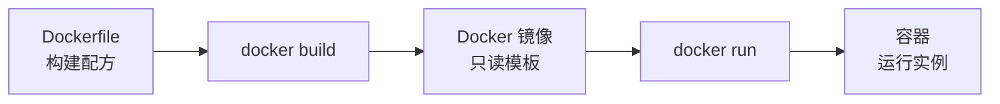
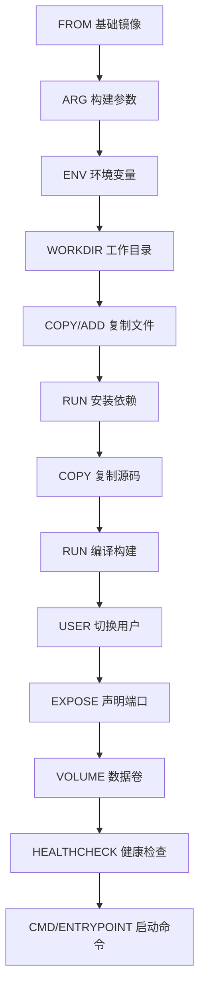

# Dockerfile 基础语法详解

## 前言

**C：** Docker 的核心价值之一就是"构建一次，到处运行"，而这个"构建"的配方就是 Dockerfile。掌握了 Dockerfile，你就能把任何应用打包成标准化的镜像。本篇从零讲解 Dockerfile 的每一条指令，配合一个完整的示例带你写出一个生产可用的镜像。

<!-- more -->

## Dockerfile 是什么

Dockerfile 是一个文本文件，包含了一系列指令，Docker 引擎按顺序执行这些指令来构建镜像。



每条指令都会在镜像上创建一个**层（Layer）**，层是可复用和可缓存的。

## 基础指令

### FROM —— 指定基础镜像

每个 Dockerfile 必须以 `FROM` 开头（除 `ARG` 外）：

```dockerfile
# 官方镜像
FROM ubuntu:22.04
FROM python:3.12-slim
FROM node:20-alpine
FROM golang:1.22-alpine

# 空白镜像（适用于静态编译的二进制）
FROM scratch
```

选择基础镜像的原则：

| 镜像类型 | 示例 | 大小 | 适用场景 |
| --- | --- | --- | --- |
| 完整版 | `ubuntu:22.04` | ~77MB | 需要完整系统工具 |
| slim 版 | `python:3.12-slim` | ~150MB | 减小体积 |
| alpine 版 | `python:3.12-alpine` | ~50MB | 最小体积（推荐） |
| distroless | `gcr.io/distroless/python3` | ~30MB | 安全性最高 |

::: tip 笔者说
优先选择 `alpine` 或 `slim` 镜像，体积小、攻击面也小。但 alpine 使用 musl libc 而非 glibc，某些预编译的二进制可能不兼容。
:::

### RUN —— 执行命令

```dockerfile
# Shell 格式
RUN apt-get update && apt-get install -y curl

# Exec 格式（推荐）
RUN ["apt-get", "update"]
RUN ["apt-get", "install", "-y", "curl"]
```

**合并 RUN 指令减少层数**：

```dockerfile
# 不好：每一行 RUN 都创建一个新层
RUN apt-get update
RUN apt-get install -y curl
RUN apt-get install -y wget

# 好：合并为一条，减少层数
RUN apt-get update && apt-get install -y \
    curl \
    wget \
    git \
    && rm -rf /var/lib/apt/lists/*
```

::: warning 注意
`&&` 链接命令确保前一条失败时后续不会继续执行。最后 `rm -rf /var/lib/apt/lists/*` 清理缓存以减小镜像体积。
:::

### COPY 与 ADD —— 复制文件

```dockerfile
# COPY：复制本地文件到镜像
COPY app.py /app/app.py
COPY config/ /app/config/          # 复制整个目录
COPY ["file with spaces.txt", "/app/"]  # 文件名有空格时用 JSON 格式

# COPY 支持 --chown 修改属主
COPY --chown=appuser:appgroup app.py /app/

# ADD：比 COPY 多了自动解压和远程 URL 支持
ADD archive.tar.gz /app/           # 自动解压 tar.gz
ADD http://example.com/file.txt /app/
```

| 特性 | COPY | ADD |
| --- | --- | --- |
| 复制本地文件 | 支持 | 支持 |
| 复制目录 | 支持 | 支持 |
| 修改属主 | `--chown` | `--chown` |
| 自动解压 tar | 不支持 | 支持 |
| 下载远程文件 | 不支持 | 支持 |

::: tip 笔者说
**优先使用 COPY**。ADD 的自动解压功能容易带来意外，且下载远程文件最好在 RUN 中用 `curl` + `tar` 替代，这样可以在后续层中清理下载文件。
:::

### WORKDIR —— 设置工作目录

```dockerfile
WORKDIR /app
# 后续的 RUN、CMD、COPY 都相对于 /app 执行
COPY app.py .                      # 等同于 COPY app.py /app/
RUN pip install -r requirements.txt
```

### ENV —— 设置环境变量

```dockerfile
# 设置环境变量
ENV APP_ENV=production
ENV PORT=8080
ENV PYTHONUNBUFFERED=1

# 多个变量一次设置
ENV APP_HOME=/app \
    APP_VERSION=1.0.0
```

### EXPOSE —— 声明端口

```dockerfile
# 仅声明，不会自动发布端口
# 真正的端口映射需要 docker run -p
EXPOSE 8080
EXPOSE 8080/udp
```

### CMD —— 容器启动命令

```dockerfile
# Exec 格式（推荐，JSON 数组）
CMD ["python", "app.py"]
CMD ["gunicorn", "-w", "4", "-b", "0.0.0.0:8080", "app:app"]

# Shell 格式
CMD python app.py
```

### ENTRYPOINT —— 容器入口点

```dockerfile
# ENTRYPOINT 定义不可变的入口命令
# CMD 提供默认参数，可以被 docker run 覆盖
ENTRYPOINT ["python"]
CMD ["app.py"]
```

| 运行命令 | 实际执行 |
| --- | --- |
| `docker run myimage` | `python app.py` |
| `docker run myimage script.py` | `python script.py` |
| `docker run --entrypoint sh myimage` | `sh` |

**CMD vs ENTRYPOINT 对比**：

```dockerfile
# 方案1：纯 CMD（适合固定命令的容器）
CMD ["nginx", "-g", "daemon off;"]

# 方案2：ENTRYPOINT + CMD（适合命令行工具容器）
ENTRYPOINT ["python"]
CMD ["app.py"]        # 用户可以 docker run myimage test.py 覆盖

# 方案3：ENTRYPOINT + CMD + exec form
ENTRYPOINT ["exec", "python", "app.py"]
```

::: warning 注意
使用 Shell 格式的 ENTRYPOINT/CMD 时，命令会作为 `/bin/sh -c` 的子进程运行，导致容器无法接收 SIGTERM 信号正常退出。**始终优先使用 Exec 格式**。
:::

### ARG —— 构建参数

```dockerfile
# 构建时变量（不进入运行时镜像）
ARG APP_VERSION=1.0.0
ARG BASE_IMAGE=python:3.12-slim

FROM ${BASE_IMAGE}

# ARG 可以在 FROM 之前使用（Docker 17.05+）
ARG BASE_IMAGE=python:3.12-slim
FROM ${BASE_IMAGE}
ARG DEBIAN_FRONTEND=noninteractive
```

```bash
# 构建时传入参数
docker build --build-arg APP_VERSION=2.0.0 -t myapp .
```

## 高级指令

### USER —— 运行用户

```dockerfile
# 创建非 root 用户
RUN groupadd -r appgroup && useradd -r -g appgroup -s /bin/false appuser

# 切换到非 root 用户
USER appuser

# 后续的 RUN、CMD、ENTRYPOINT 都以 appuser 身份运行
```

### VOLUME —— 声明挂载点

```dockerfile
# 声明数据卷（运行时自动创建）
VOLUME /data
VOLUME ["/data", "/logs"]
```

### LABEL —— 元数据

```dockerfile
LABEL maintainer="EASYZOOM <easyzoom@example.com>"
LABEL version="1.0.0"
LABEL description="My Application"
```

### HEALTHCHECK —— 健康检查

```dockerfile
# 健康检查配置
HEALTHCHECK --interval=30s --timeout=3s --start-period=5s --retries=3 \
    CMD curl -f http://localhost:8080/health || exit 1

# 禁用继承的健康检查
HEALTHCHECK NONE
```

| 参数 | 说明 | 默认值 |
| --- | --- | --- |
| `--interval` | 检查间隔 | 30s |
| `--timeout` | 超时时间 | 30s |
| `--start-period` | 容器启动后的等待期 | 0s |
| `--retries` | 连续失败次数 | 3 |

## .dockerignore 文件

在构建上下文中排除不需要的文件：

```text
# .dockerignore
.git
.gitignore
node_modules
__pycache__
*.pyc
.env
Dockerfile
docker-compose.yml
*.md
.vscode
.idea
```

::: tip 笔者说
`.dockerignore` 能显著加快构建速度——它排除了发送到 Docker daemon 的文件。大型项目（如包含 `node_modules`）不加 `.dockerignore` 可能导致构建非常慢。
:::

## 构建镜像

```bash
# 基本构建
docker build -t myapp:1.0 .

# 指定 Dockerfile 路径
docker build -t myapp:1.0 -f Dockerfile.prod .

# 不使用缓存
docker build --no-cache -t myapp:1.0 .

# 构建参数
docker build --build-arg VERSION=2.0 -t myapp:2.0 .

# 查看构建历史
docker history myapp:1.0
```

## 完整示例

```dockerfile
# ============ 阶段1：构建 ============
FROM node:20-alpine AS builder

WORKDIR /app
COPY package*.json ./
RUN npm ci --only=production && \
    npm cache clean --force
COPY . .
RUN npm run build

# ============ 阶段2：运行 ============
FROM node:20-alpine AS runtime

# 安全：创建非 root 用户
RUN addgroup -S appgroup && adduser -S appuser -G appgroup

WORKDIR /app
COPY --from=builder --chown=appuser:appgroup /app/dist ./dist
COPY --from=builder --chown=appuser:appgroup /app/node_modules ./node_modules

USER appuser
EXPOSE 3000
HEALTHCHECK --interval=30s --timeout=3s \
    CMD wget -qO- http://localhost:3000/health || exit 1

ENTRYPOINT ["node", "dist/server.js"]
```

```bash
# 构建并运行
docker build -t myapp:1.0 .
docker run -d -p 3000:3000 --name myapp myapp:1.0
```

## 指令执行顺序总结



## 常见问题

### 构建缓存失效

Docker 按层缓存，任何一层变化都会导致后续所有层重建：

```dockerfile
# 不好：每次改代码都要重装依赖
COPY . /app
RUN pip install -r requirements.txt

# 好：先复制依赖文件（变化少），再复制源码
COPY requirements.txt /app/
RUN pip install -r requirements.txt
COPY . /app
```

### 镜像体积过大

- 使用 alpine/slim 基础镜像
- 合并 RUN 指令并在同一层清理缓存
- 使用多阶段构建
- 添加 `.dockerignore`

## 小结

Dockerfile 核心指令：

1. **FROM**：选择合适的基础镜像（alpine/slim/distroless）
2. **RUN**：合并指令、清理缓存、减少层数
3. **COPY > ADD**：优先用 COPY
4. **CMD vs ENTRYPOINT**：固定命令用 CMD，CLI 工具用 ENTRYPOINT+CMD
5. **USER**：不要用 root 运行应用
6. **HEALTHCHECK**：为容器配置健康检查
7. **多阶段构建**：构建环境和运行环境分离，大幅减小镜像体积
