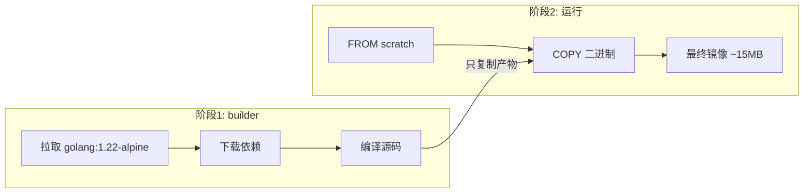

# 多阶段构建与镜像优化

## 前言

**C：** 你可能见过这样的 Dockerfile：一个简单的 Python 应用，打包出来的镜像居然 1GB+。问题往往出在构建工具链、编译中间文件、系统包缓存这些东西全被打包进了最终镜像。多阶段构建（Multi-Stage Build）就是解决这个问题的利器——把构建环境和运行环境分开，最终镜像只包含运行需要的东西。本篇深入讲解多阶段构建和各种镜像优化技巧。

<!-- more -->

## 镜像为什么这么大

一个未优化的 Go 应用镜像可能的构成：

```
┌─────────────────────────┐
│   golang:1.22 (完整)      │  ~1.1GB
│   Go 编译器和工具链        │  ~800MB
│   编译中间文件 (.a, .o)   │  ~200MB
│   git, make 等构建工具    │  ~150MB
│   ─────────────────────  │
│   你的应用程序二进制        │  ~15MB
│   运行时依赖              │  ~5MB
└─────────────────────────┘
  总计 ~2.2GB，实际只需要 ~20MB
```

## 多阶段构建基础

### 语法

使用 `FROM ... AS <name>` 命名阶段，用 `COPY --from=<name>` 复制产物：

```dockerfile
# 阶段1：构建
FROM golang:1.22-alpine AS builder
WORKDIR /src
COPY go.mod go.sum ./
RUN go mod download
COPY . .
RUN CGO_ENABLED=0 go build -o /app/server .

# 阶段2：运行（只有一个二进制文件）
FROM scratch
COPY --from=builder /app/server /server
ENTRYPOINT ["/server"]
```

最终镜像大小：**约 15MB**（只有一个静态编译的二进制）。

### 构建过程



## 各语言多阶段构建实战

### Python 应用

```dockerfile
# 阶段1：安装依赖
FROM python:3.12-slim AS builder
WORKDIR /app
COPY requirements.txt .
RUN pip install --no-cache-dir --prefix=/install -r requirements.txt

# 阶段2：运行
FROM python:3.12-slim
WORKDIR /app
COPY --from=builder /install /usr/local
COPY . .
USER appuser
CMD ["python", "app.py"]
```

### Node.js 应用

```dockerfile
# 阶段1：安装依赖 + 构建
FROM node:20-alpine AS builder
WORKDIR /app
COPY package*.json ./
RUN npm ci
COPY . .
RUN npm run build

# 阶段2：生产运行
FROM node:20-alpine
WORKDIR /app
COPY --from=builder /app/dist ./dist
COPY --from=builder /app/node_modules ./node_modules
COPY --from=builder /app/package.json ./
USER node
EXPOSE 3000
CMD ["node", "dist/index.js"]
```

### Java / Spring Boot

```dockerfile
# 阶段1：Maven 构建
FROM maven:3.9-eclipse-temurin-17 AS builder
WORKDIR /app
COPY pom.xml .
RUN mvn dependency:go-offline
COPY src ./src
RUN mvn package -DskipTests

# 阶段2：JRE 运行
FROM eclipse-temurin:17-jre-alpine
WORKDIR /app
COPY --from=builder /app/target/*.jar app.jar
EXPOSE 8080
ENTRYPOINT ["java", "-jar", "app.jar"]
```

### C/C++ 应用

```dockerfile
# 阶段1：编译
FROM gcc:13-alpine AS builder
WORKDIR /src
COPY . .
RUN gcc -static -o /app/main main.c

# 阶段2：运行
FROM alpine:3.19
COPY --from=builder /app/main /app/main
RUN apk add --no-cache ca-certificates   # HTTPS 需要
ENTRYPOINT ["/app/main"]
```

## 更多优化技巧

### 1. 合理排序 COPY 指令

```dockerfile
# 不好：任何文件变化都导致重装依赖
COPY . /app
RUN npm install

# 好：依赖文件变化少，代码变化多
COPY package.json package-lock.json /app/
RUN npm ci
COPY . /app
```

### 2. 利用构建缓存

```dockerfile
# 坏：每次都更新 apt（网络请求）
RUN apt-get update && apt-get install -y python3

# 好：更新和安装分开，apt 缓存层可以复用
RUN apt-get update
RUN apt-get install -y python3
```

### 3. 清理缓存和临时文件

```dockerfile
# apt 安装后清理
RUN apt-get update && apt-get install -y --no-install-recommends \
    python3 \
    && rm -rf /var/lib/apt/lists/*

# npm 安装后清理
RUN npm ci --production && npm cache clean --force

# pip 安装后清理
RUN pip install --no-cache-dir -r requirements.txt

# Go 编译后清理
RUN go build -o app . && rm -rf /tmp/*
```

### 4. 使用 .dockerignore

```text
# .dockerignore
.git
.github
.gitignore
node_modules
dist
build
__pycache__
*.pyc
.env
*.md
docker-compose*.yml
Dockerfile*
.vscode
.idea
*.log
.DS_Store
```

### 5. 指定确切版本

```dockerfile
# 不好：latest 随时可能变
FROM python:3
RUN pip install flask

# 好：锁定版本
FROM python:3.12.3-slim
RUN pip install flask==3.0.3
```

## 镜像分析工具

### 查看每层大小

```bash
# 查看镜像历史
docker history myapp:1.0

# 更直观的工具
docker run --rm -v /var/run/docker.sock:/var/run/docker.sock \
    wagoodman/dive:latest myapp:1.0
```

[dive](https://github.com/wagoodman/dive) 是一个交互式镜像分析工具，能逐层查看每个文件的大小和来源。

### 查找大文件

```bash
# 进入镜像查看文件大小
docker run --rm --entrypoint sh myapp:1.0 -c "du -ah / | sort -rh | head -20"

# 或者导出后分析
docker save myapp:1.0 | tar -tv | sort -k3 -rh | head -20
```

## 优化效果对比

| 策略 | 效果 |
| --- | --- |
| alpine 基础镜像 | 体积减少 50%~80% |
| 多阶段构建 | 体积减少 70%~95% |
| 合并 RUN + 清理缓存 | 体积减少 20%~40% |
| .dockerignore | 构建速度提升 50%~90% |
| 锁定版本 | 构建可复现性 100% |

综合使用上述策略，一个 Node.js 应用的镜像可以从 **1.2GB** 优化到 **120MB** 以下。

## 常见问题

### scratch 镜像中无法运行 shell 命令

`FROM scratch` 是完全空的，没有 shell、没有 libc。如果你的程序需要：

```dockerfile
# 需要时区文件
COPY --from=builder /usr/share/zoneinfo /usr/share/zoneinfo

# 需要 CA 证书（HTTPS）
COPY --from=builder /etc/ssl/certs/ca-certificates.crt /etc/ssl/certs/

# 需要时区设置
ENV TZ=Asia/Shanghai
```

### COPY --from 跨阶段复制时不存在的文件

```dockerfile
# 安全写法：确保阶段名称正确
COPY --from=builder /app/dist /app/dist
# 如果 builder 中 /app/dist 不存在，构建会失败（这是正确行为）
```

### 多阶段构建影响构建缓存

每个阶段独立维护缓存。阶段1的某层变化不影响阶段2的缓存（前提是 COPY --from 的路径未变）。

## 小结

镜像优化的核心原则：

1. **多阶段构建**：分离构建环境和运行环境
2. **选择精简基础镜像**：alpine > slim > 完整版 > scratch
3. **合并 RUN 指令**：减少层数，清理缓存
4. **利用 COPY 排序**：先复制少变的文件（依赖），再复制多变的文件（源码）
5. **.dockerignore**：排除无关文件加速构建
6. **锁定版本**：确保构建可复现
7. **用 dive 分析**：找出体积异常的层
