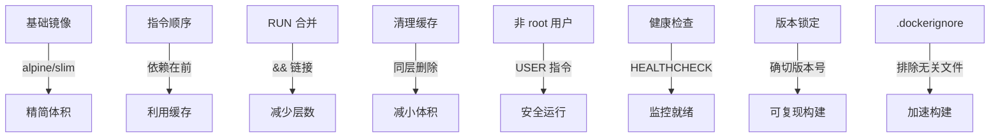

# 镜像构建进阶技巧

## 前言

**C：** 基础的 Dockerfile 写法已经能应付大部分场景了。但在实际开发中，你很快会遇到更复杂的需求：不同环境构建不同镜像、构建时需要 SSH 密钥、镜像需要版本管理、团队协作需要统一构建规范。本篇讲解这些进阶技巧，帮你写出更专业、更灵活的 Dockerfile。

<!-- more -->

## BuildKit 构建引擎

Docker 18.09+ 引入了 BuildKit，它是下一代构建引擎，提供更强的缓存、并发和安全能力。

### 启用 BuildKit

```bash
# 方式1：环境变量
DOCKER_BUILDKIT=1 docker build -t myapp .

# 方式2：docker buildx（推荐）
docker buildx build -t myapp .

# 方式3：永久启用（写入 /etc/docker/daemon.json）
{
  "features": {
    "buildkit": true
  }
}
```

### BuildKit 特性

| 特性 | 说明 |
| --- | --- |
| 并发构建 | 多阶段并行构建 |
| 缓存挂载 | `--mount=type=cache` 持久化构建缓存 |
| Secret 挂载 | `--mount=type=secret` 安全传递密钥 |
| SSH 挂载 | `--mount=type=ssh` 在构建中使用 SSH |
| 多平台构建 | 一次构建多架构镜像 |

## 缓存挂载

避免每次构建都重新下载依赖：

```dockerfile
# 构建时使用缓存挂载
RUN --mount=type=cache,target=/root/.npm \
    npm ci

RUN --mount=type=cache,target=/go/pkg/mod \
    go build -o /app/server .

RUN --mount=type=cache,target=/pip/cache \
    pip install --cache-dir=/pip/cache -r requirements.txt
```

```bash
# 构建时使用缓存
docker buildx build --cache-to type=local,dest=.buildcache \
    --cache-from type=local,src=.buildcache -t myapp .
```

效果：第一次构建正常下载依赖，后续构建直接使用缓存，**大幅缩短构建时间**。

## 构建时传递 Secret

场景：构建时需要 Git 私有仓库的 SSH 密钥或 npm 私有仓库的 token。

```dockerfile
# 使用 secret 挂载（不会留在镜像中）
RUN --mount=type=secret,id=github_key \
    mkdir -p ~/.ssh && \
    cp /run/secrets/github_key ~/.ssh/id_rsa && \
    chmod 600 ~/.ssh/id_rsa && \
    git submodule update --init && \
    rm -f ~/.ssh/id_rsa
```

```bash
# 构建时传入 secret
docker buildx build --secret id=github_key,src=~/.ssh/id_rsa -t myapp .
```

::: warning 注意
绝对不要在 Dockerfile 中直接 COPY 密钥文件——密钥会被永久留在镜像历史中。使用 `--mount=type=secret` 确保密钥不会出现在镜像层中。
:::

## SSH 转发构建

```dockerfile
# 使用 SSH Agent 转发
RUN --mount=type=ssh git clone git@github.com:myorg/private-repo.git /app
```

```bash
# 启动 SSH Agent 并构建
eval $(ssh-agent) && ssh-add ~/.ssh/id_rsa
docker buildx build --ssh default -t myapp .
```

## 条件构建

### 基于 ARG 的条件

```dockerfile
ARG TARGETPLATFORM
ARG APP_ENV=production

# 不同平台安装不同包
RUN if [ "$TARGETPLATFORM" = "linux/arm64" ]; then \
        apt-get install -y gcc-aarch64-linux-gnu; \
    else \
        apt-get install -y gcc; \
    fi

# 不同环境不同配置
COPY config/${APP_ENV}.yaml /app/config.yaml
```

```bash
# 构建开发环境镜像
docker build --build-arg APP_ENV=development -t myapp:dev .

# 构建生产环境镜像
docker build --build-arg APP_ENV=production -t myapp:prod .
```

### ONBUILD 延迟执行

```dockerfile
# 基础镜像（如 Python SDK）
FROM python:3.12-slim
ONBUILD COPY requirements.txt /app/
ONBUILD RUN pip install --no-cache-dir -r /app/requirements.txt
ONBUILD COPY . /app/
ONBUILD WORKDIR /app
```

```dockerfile
# 子镜像只需继承基础镜像
FROM my-python-sdk:1.0
CMD ["python", "app.py"]
# ONBUILD 指令会在子镜像构建时执行
```

## 多平台构建

```bash
# 创建 builder 实例
docker buildx create --use --name mybuilder

# 构建多架构镜像
docker buildx build --platform linux/amd64,linux/arm64 \
    -t myapp:1.0 --push .

# 仅构建不推送
docker buildx build --platform linux/amd64,linux/arm64 \
    -t myapp:1.0 --load .
```

Dockerfile 中使用 ARG 判断平台：

```dockerfile
FROM --platform=$BUILDPLATFORM golang:1.22-alpine AS builder
ARG TARGETOS TARGETARCH
RUN GOOS=$TARGETOS GOARCH=$TARGETARCH go build -o /app/server .
```

## 镜像标签管理

### 语义化版本标签

```bash
# 语义化标签
docker build -t myapp:1.0.0 .
docker build -t myapp:1.0 .
docker build -t myapp:1 .
docker build -t myapp:latest .

# 一次性打多个标签
docker build -t myapp:1.0.0 -t myapp:latest -t myapp:stable .
```

### Git SHA 标签

```bash
# 使用 Git commit SHA 作为标签
TAG=$(git rev-parse --short HEAD)
docker build -t myapp:${TAG} -t myapp:latest .
```

### 镜像标签规范

| 标签类型 | 示例 | 用途 |
| --- | --- | --- |
| 精确版本 | `myapp:1.2.3` | 生产部署 |
| 次版本 | `myapp:1.2` | 追踪次要更新 |
| 主版本 | `myapp:1` | 主要版本追踪 |
| latest | `myapp:latest` | 最新开发版 |
| SHA | `myapp:a1b2c3d` | CI/CD 构建 |
| 环境 | `myapp:dev`, `myapp:staging` | 环境区分 |

## 构建最佳实践清单



## 与 CI/CD 集成

### GitHub Actions 示例

```yaml
name: Build and Push
on:
  push:
    branches: [main]

jobs:
  build:
    runs-on: ubuntu-latest
    steps:
      - uses: actions/checkout@v4

      - name: Set up Docker Buildx
        uses: docker/setup-buildx-action@v3

      - name: Login to Registry
        uses: docker/login-action@v3
        with:
          registry: ghcr.io
          username: ${{ github.actor }}
          password: ${{ secrets.GITHUB_TOKEN }}

      - name: Build and Push
        uses: docker/build-push-action@v5
        with:
          context: .
          push: true
          tags: |
            ghcr.io/myorg/myapp:${{ github.sha }}
            ghcr.io/myorg/myapp:latest
          cache-from: type=gha
          cache-to: type=gha,mode=max
          platforms: linux/amd64,linux/arm64
```

## 常见问题

### 构建上下文太大导致慢

```bash
# 检查构建上下文大小
docker build --progress=plain -t test . 2>&1 | grep "Sending build context"

# 解决：完善 .dockerignore
```

### 多阶段构建中阶段间共享文件

```dockerfile
# 一个阶段依赖另一个阶段的部分产物
FROM node:20 AS frontend
RUN npm run build

FROM golang:1.22 AS backend
COPY --from=frontend /app/dist ./static/
```

### 构建时网络不可达

```bash
# 使用 BuildKit 内置代理
docker buildx build --network=host -t myapp .

# 或配置 Docker daemon 代理
```

## 小结

进阶构建技巧要点：

1. **BuildKit**：下一代构建引擎，支持缓存挂载、Secret、SSH、多平台
2. **缓存挂载**：`--mount=type=cache` 避免重复下载依赖
3. **Secret 挂载**：构建时安全传递密钥，不留痕于镜像
4. **多平台构建**：`docker buildx build --platform` 同时构建多架构
5. **标签管理**：语义化版本 + Git SHA + 环境标签
6. **CI/CD 集成**：GitHub Actions + BuildKit + 缓存
