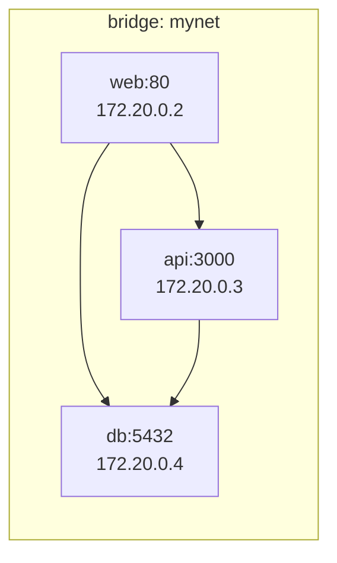
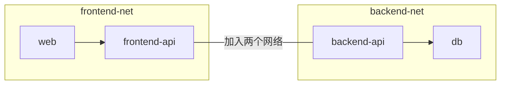
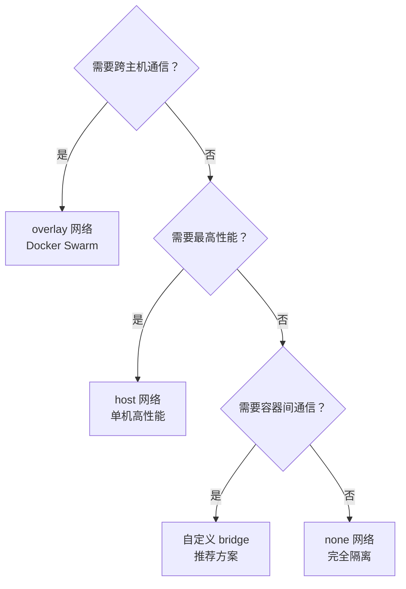

# Docker 网络详解

## 前言

**C：** 两个容器之间能通信吗？容器怎么访问外部网络？外部怎么访问容器？这些问题都涉及 Docker 的网络模型。理解 Docker 网络不仅能帮你排查"容器之间连不上"的问题，还能让你设计出安全、高效的多容器通信架构。本篇详细讲解 Docker 的四种网络模式及其适用场景。

<!-- more -->

## 四种网络模式

| 模式 | 说明 | 容器间通信 | 外部访问 | 适用场景 |
| --- | --- | --- | --- | --- |
| bridge | 默认模式，通过 veth 连接 | 同网络可通 | 需端口映射 | 单机多容器 |
| host | 共享宿主机网络栈 | 直接通 | 直接通 | 高性能场景 |
| none | 无网络 | 不通 | 不通 | 安全隔离 |
| overlay | 跨主机网络 | 跨主机通 | 需端口映射 | Swarm 集群 |

## bridge 网络

### 默认 bridge vs 自定义 bridge

```bash
# 查看网络列表
docker network ls

# 默认 bridge 网络
# 容器之间只能通过 IP 通信（不支持 DNS），不推荐生产使用

# 创建自定义 bridge（推荐）
docker network create mynet
```

| 特性 | 默认 bridge | 自定义 bridge |
| --- | --- | --- |
| 容器间 DNS | 不支持（只能用 IP） | 支持（用容器名） |
| 隔离性 | 所有容器共享 | 按网络隔离 |
| 自动 DNS 解析 | 不支持 | 支持 |
| 推荐程度 | 不推荐 | 推荐 |

### 自定义 bridge 网络

```bash
# 创建网络
docker network create --driver bridge --subnet 172.20.0.0/16 --gateway 172.20.0.1 mynet

# 创建时指定 DNS
docker network create --driver bridge --dns 8.8.8.8 mynet
```

```bash
# 容器加入自定义网络后可用容器名通信
docker run -d --name web --network mynet nginx
docker run -d --name api --network mynet myapp

# 在 api 容器中可以用 http://web:80 访问
docker exec api curl http://web:80
```

### 端口映射

```bash
# 随机端口映射
docker run -d -P nginx

# 指定端口映射
docker run -d -p 8080:80 nginx

# 指定绑定地址
docker run -d -p 127.0.0.1:8080:80 nginx    # 只允许本机访问
docker run -d -p 0.0.0.0:8080:80 nginx      # 允许所有访问
```

## host 网络

容器直接使用宿主机的网络栈，没有网络隔离：

```bash
# 使用 host 网络
docker run -d --network host nginx
# nginx 直接监听宿主机的 80 端口，无需 -p 映射

# Compose 中使用
services:
  web:
    network_mode: host
```

::: warning 注意
使用 host 网络的容器端口直接占用宿主机端口，多个容器不能使用同一端口。host 模式在 Linux 上可用，macOS/Windows 的 Docker Desktop 不支持。
:::

适用场景：
- 需要最高网络性能（零网络开销）
- 需要直接监听宿主机端口
- 监控工具（Prometheus、Node Exporter）

## none 网络

完全禁用网络：

```bash
docker run -d --network none alpine sleep 3600
# 容器内只有 lo 回环接口，没有任何外部网络
```

适用场景：安全敏感场景、离线数据处理。

## overlay 网络（跨主机）

overlay 网络用于 Docker Swarm 集群中的跨主机通信：

```bash
# 需要 Swarm 模式
docker swarm init

# 创建 overlay 网络
docker network create -d overlay my-overlay

# 在服务中使用
docker service create --name web --network my-overlay -p 80:80 nginx
```

## 容器间通信

### 同一网络



```bash
# web 容器内可以直接用容器名访问
curl http://api:3000/health       # DNS 解析
curl http://db:5432               # PostgreSQL 连接
```

### 不同网络



```bash
# 将容器加入多个网络实现跨网通信
docker network connect backend-net web

# 或者创建时指定多个网络
docker run -d --name gateway \
    --network frontend-net \
    myapp

docker network connect backend-net gateway
```

### 宿主机访问容器

```bash
# 通过映射端口
curl http://localhost:8080

# 通过容器 IP（不推荐，IP 可能变化）
docker inspect -f '{{range.NetworkSettings.Networks}}{{.IPAddress}}{{end}}' web
```

## 网络排障

### 查看网络详情

```bash
# 查看网络配置
docker network inspect mynet

# 查看容器网络
docker inspect web | jq '.[0].NetworkSettings.Networks'
```

### 常见问题排查

```bash
# 1. 容器 DNS 是否正常
docker exec web cat /etc/resolv.conf
docker exec web nslookup api

# 2. 容器能否访问外部
docker exec web ping -c 3 8.8.8.8
docker exec web curl -I https://www.baidu.com

# 3. 端口是否监听
docker exec web netstat -tlnp
# 或
docker exec web ss -tlnp

# 4. 防火墙规则
sudo iptables -L -n | grep docker
sudo ufw status
```

### 容器间通信不通

常见原因：

| 原因 | 检查方法 | 解决 |
| --- | --- | --- |
| 不在同一网络 | `docker network inspect` | 加入同一网络 |
| 使用 localhost | 容器内 localhost 指向自身 | 使用容器名 |
| 防火墙阻止 | `iptables -L` | 开放端口 |
| DNS 失败 | `docker exec web nslookup` | 使用自定义 bridge |

## Compose 中的网络

```yaml
services:
  web:
    networks:
      - frontend
      - backend       # 同时加入两个网络

  api:
    networks:
      - backend

  db:
    networks:
      - backend

networks:
  frontend:
    driver: bridge
  backend:
    driver: bridge
    internal: true    # 内部网络，禁止访问外网
```

`internal: true` 适合数据库等不需要外网的服务，提高安全性。

## 网络模式选择



## 小结

Docker 网络核心要点：

1. **优先用自定义 bridge**：支持 DNS 解析，用容器名通信
2. **避免用默认 bridge**：不支持容器名 DNS
3. **host 网络**：最高性能但无隔离，适合监控类场景
4. **跨网通信**：`docker network connect` 让容器加入多个网络
5. **overlay 网络**：Docker Swarm 跨主机通信
6. **internal 网络**：禁止外网访问，适合数据库
