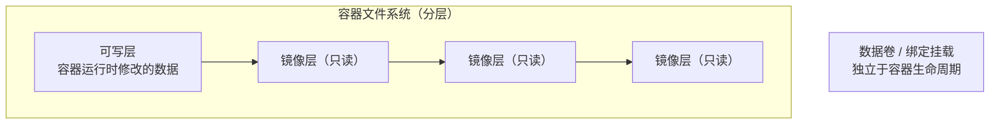

# Docker 数据卷与持久化

## 前言

**C：** 容器是临时的——`docker rm` 之后容器内的数据就没了。数据库的表、用户上传的文件、应用的日志，这些数据如果只存在容器内部，一旦容器重建就全部丢失。数据持久化是 Docker 中最重要的概念之一。本篇详细讲解 Docker 的三种数据存储方式、备份恢复策略以及生产环境的最佳实践。

<!-- more -->

## 容器的文件系统



容器删除后，**可写层的数据也会被删除**。数据卷和绑定挂载独立于容器生命周期。

## 三种数据管理方式

| 方式 | 语法 | 数据位置 | 生命周期 | 适用场景 |
| --- | --- | --- | --- | --- |
| 数据卷 | `mydata:/app/data` | `/var/lib/docker/volumes/` | Docker 管理 | 数据库数据、持久化数据 |
| 绑定挂载 | `./src:/app/src` | 宿主机指定路径 | 手动管理 | 开发时代码同步、配置文件 |
| tmpfs | `tmpfs:/app/tmp` | 内存（不落盘） | 容器停止即消失 | 临时文件、敏感数据 |

## 数据卷（Volume）

### 基本操作

```bash
# 创建数据卷
docker volume create mydata

# 查看数据卷列表
docker volume ls

# 查看数据卷详情
docker volume inspect mydata

# 删除数据卷
docker volume rm mydata

# 删除未使用的数据卷
docker volume prune
```

### 使用数据卷

```bash
# docker run 中使用
docker run -d \
    -v mydata:/var/lib/postgresql/data \
    --name db \
    postgres:15

# Compose 中使用
volumes:
  - mydata:/var/lib/postgresql/data
```

### 数据卷特点

- 由 Docker 管理，存储在 `/var/lib/docker/volumes/`
- 支持命名，方便识别和复用
- 多个容器可以挂载同一个卷（数据共享）
- 卷驱动支持远程存储（NFS、S3 等）

### 数据卷共享

```bash
# 创建共享数据卷
docker volume create shared

# 多个容器挂载同一卷
docker run -d --name writer -v shared:/data alpine sh -c "echo hello > /data/file.txt"
docker run -d --name reader -v shared:/data alpine cat /data/file.txt
```

### 远程数据卷

```bash
# NFS 数据卷
docker volume create \
    --driver local \
    --opt type=nfs \
    --opt o=addr=192.168.1.100,rw \
    --opt device=:/data/nfs \
    nfs-data

# 使用
docker run -d -v nfs-data:/data myapp
```

## 绑定挂载（Bind Mount）

```bash
# docker run 中使用
docker run -d \
    -v /opt/app/config:/app/config \
    -v /opt/app/logs:/app/logs \
    myapp

# 相对路径（相对于当前目录）
docker run -d -v ./config:/app/config myapp

# 只读挂载
docker run -d -v /opt/app/config:/app/config:ro myapp
```

### 绑定挂载 vs 数据卷

| 对比项 | 数据卷 | 绑定挂载 |
| --- | --- | --- |
| 管理方式 | Docker 全权管理 | 用户手动管理 |
| 存储位置 | `/var/lib/docker/volumes/` | 用户指定任意路径 |
| 可移植性 | 高（不依赖宿主机路径） | 低（依赖宿主机目录结构） |
| 性能 | 好（避免 overlay 开销） | 略低（需经过 overlay） |
| 权限问题 | 少 | 可能出现 UID 不匹配 |
| 适用场景 | 数据库、应用数据 | 配置文件、代码、日志 |

::: tip 笔者说
生产环境的数据库数据推荐用**数据卷**。开发时的代码同步、配置文件挂载用**绑定挂载**。
:::

## tmpfs 挂载

```bash
# 使用 tmpfs（存储在内存中）
docker run -d \
    --tmpfs /app/tmp \
    myapp

# Compose 中使用
tmpfs:
  - /app/tmp
```

适用场景：
- 敏感数据（容器停止后自动清除）
- 高速临时存储
- 会话数据

## Compose 中的卷管理

```yaml
services:
  db:
    image: postgres:15
    volumes:
      # 命名卷
      - pgdata:/var/lib/postgresql/data
      # 绑定挂载
      - ./init.sql:/docker-entrypoint-initdb.d/init.sql:ro
      # 匿名卷（由 Docker 管理）
      - /var/log/postgresql
    tmpfs:
      - /tmp

  app:
    image: myapp
    volumes:
      - ./config:/app/config:ro
      - applogs:/app/logs

volumes:
  pgdata:            # 命名卷声明
    driver: local
  applogs:
    driver: local
```

## 数据备份与恢复

### 备份数据卷

```bash
# 方式1：使用临时容器 + tar
docker run --rm \
    -v mydata:/data \
    -v $(pwd):/backup \
    alpine tar czf /backup/mydata-backup.tar.gz /data

# 方式2：直接复制（数据卷存储路径）
docker run --rm \
    -v mydata:/source \
    -v $(pwd)/backup:/backup \
    alpine cp -a /source/. /backup/
```

### 备份绑定挂载

```bash
# 绑定挂载的数据直接在宿主机上，直接备份即可
tar czf backup-$(date +%Y%m%d).tar.gz /opt/app/data/

# 或使用 rsync
rsync -avz /opt/app/data/ backup@remote:/backups/app-data/
```

### 恢复数据

```bash
# 方式1：从 tar 恢复到数据卷
docker run --rm \
    -v mydata:/data \
    -v $(pwd):/backup \
    alpine tar xzf /backup/mydata-backup.tar.gz -C /

# 方式2：从备份目录恢复
docker run --rm \
    -v mydata:/data \
    -v $(pwd)/backup:/backup \
    alpine sh -c "cp -a /backup/. /data/"
```

### 数据库备份

```bash
# PostgreSQL
docker exec db pg_dump -U admin mydb > backup.sql
docker exec -T db pg_dump -U admin mydb > backup.sql   # Compose 用 -T

# MySQL
docker exec db mysqldump -u root -p<password> mydb > backup.sql

# 恢复
docker exec -i db psql -U admin mydb < backup.sql
docker exec -i db mysql -u root -p<password> mydb < backup.sql
```

## 数据卷清理

```bash
# 查看所有数据卷
docker volume ls

# 查看未使用的数据卷
docker volume ls -qf dangling=true

# 删除未使用的卷
docker volume prune

# 删除所有未使用的卷（不提示确认）
docker volume prune -f
```

## 权限问题

### UID/GID 不匹配

容器内进程通常以 root（UID 0）或特定用户运行，可能与宿主机目录的权限不匹配：

```bash
# 查看容器内进程的用户
docker exec myapp id
docker exec myapp whoami

# 解决方案1：在 Dockerfile 中创建对应用户
RUN groupadd -r -g 1000 appgroup && \
    useradd -r -u 1000 -g appgroup appuser
USER appuser

# 解决方案2：绑定挂载时指定 chown
docker run -v ./data:/data --user 1000:1000 myapp

# 解决方案3：使用 --chown（BuildKit）
# Dockerfile 中
COPY --chown=1000:1000 . /app
```

## 常见问题

### 容器删除后数据没了

原因：数据存在容器的可写层，没有使用数据卷或绑定挂载。

```bash
# 检查容器是否有挂载卷
docker inspect myapp | jq '.[0].Mounts'
```

### 数据卷磁盘空间不足

```bash
# 查看数据卷占用
docker system df -v

# 清理未使用的卷
docker volume prune
```

### 绑定挂载性能差

绑定挂载的数据经过容器的 overlay 文件系统，性能略低于数据卷。如果性能敏感（数据库），优先使用命名数据卷。

## 小结

数据持久化要点：

1. **数据卷**：Docker 管理，适合数据库和应用数据
2. **绑定挂载**：用户管理，适合配置文件和开发时代码同步
3. **tmpfs**：内存存储，适合临时和敏感数据
4. **备份**：临时容器 + tar，或数据库自带工具
5. **权限**：注意容器内外 UID/GID 匹配
6. **清理**：`docker volume prune` 清理未使用的卷
