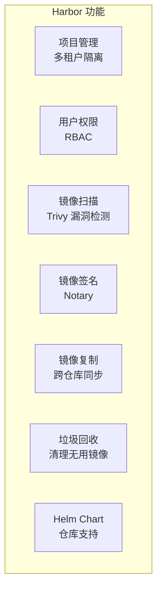

# Docker 私有仓库搭建与管理

## 前言

**C：** 你的 Docker 镜像放在哪？Docker Hub 公共仓库不适合放私有镜像——免费额度有限、推送速度慢、还有安全合规的问题。企业级场景需要搭建自己的私有镜像仓库。本篇从简单的 Docker Registry 到功能丰富的 Harbor，讲解私有仓库的搭建和管理。

<!-- more -->

## 方案对比

| 方案 | 功能 | 适用场景 |
| --- | --- | --- |
| Docker Registry（官方） | 基础存储和分发 | 开发测试、简单部署 |
| Harbor | UI + RBAC + 漏洞扫描 + 多租户 | 企业生产 |
| AWS ECR / 阿里云 ACR | 云厂商托管 | 云原生部署 |

## Docker Registry（基础版）

### 快速启动

```bash
# 拉取并运行
docker run -d \
    --name registry \
    -p 5000:5000 \
    -v registrydata:/var/lib/registry \
    --restart always \
    registry:2

# 测试
curl http://localhost:5000/v2/_catalog
```

### 配置 HTTPS

不配置 HTTPS，Docker 默认拒绝推送镜像（安全策略）。

```bash
# 生成自签名证书
mkdir -p /opt/registry/certs
openssl req -newkey rsa:4096 -nodes -sha256 \
    -keyout /opt/registry/certs/domain.key \
    -x509 -days 365 -out /opt/registry/certs/domain.crt \
    -addext "subjectAltName=DNS:registry.example.com,IP:你的服务器IP"
```

```bash
# 使用 HTTPS 启动
docker run -d \
    --name registry \
    -p 443:443 \
    -v /opt/registry/certs:/certs \
    -v registrydata:/var/lib/registry \
    -e REGISTRY_HTTP_ADDR=0.0.0.0:443 \
    -e REGISTRY_HTTP_TLS_CERTIFICATE=/certs/domain.crt \
    -e REGISTRY_HTTP_TLS_KEY=/certs/domain.key \
    --restart always \
    registry:2
```

### 客户端信任证书

```bash
# 将证书复制到 Docker 信任目录
sudo mkdir -p /etc/docker/certs.d/registry.example.com:443
sudo cp /opt/registry/certs/domain.crt /etc/docker/certs.d/registry.example.com:443/ca.crt

# 重启 Docker
sudo systemctl restart docker
```

### 推送与拉取镜像

```bash
# 给镜像打标签
docker tag myapp:1.0 registry.example.com:443/myapp:1.0

# 推送
docker push registry.example.com:443/myapp:1.0

# 拉取
docker pull registry.example.com:443/myapp:1.0

# 查看仓库中的镜像
curl -u admin:password https://registry.example.com:443/v2/_catalog
curl -u admin:password https://registry.example.com:443/v2/myapp/tags/list
```

### 带认证的 Registry

```bash
# 创建 htpasswd 文件
docker run --rm \
    --entrypoint htpasswd \
    httpd:2 -Bbn admin securepassword > /opt/registry/auth/htpasswd

# 启动带认证的 Registry
docker run -d \
    --name registry \
    -p 5000:5000 \
    -v registrydata:/var/lib/registry \
    -v /opt/registry/auth:/auth \
    -e REGISTRY_AUTH=htpasswd \
    -e REGISTRY_AUTH_HTPASSWD_REALM="Registry Realm" \
    -e REGISTRY_AUTH_HTPASSWD_PATH=/auth/htpasswd \
    --restart always \
    registry:2

# 登录
docker login registry.example.com:5000
```

## Harbor（企业级）

### 安装

```bash
# 下载安装包
wget https://github.com/goharbor/harbor/releases/download/v2.10.0/harbor-offline-installer-v2.10.0.tgz
tar xzf harbor-offline-installer-v2.10.0.tgz
cd harbor
```

### 配置

```bash
# 修改配置
cp harbor.yml.tmpl harbor.yml
vim harbor.yml
```

关键配置项：

```yaml
# harbor.yml
hostname: registry.example.com
http:
  port: 80
https:
  port: 443
  certificate: /opt/harbor/certs/domain.crt
  private_key: /opt/harbor/certs/domain.key

harbor_admin_password: Harbor12345

database:
  password: your_db_password

data_volume: /data
```

### 启动

```bash
# 安装并启动
./install.sh

# 或带 Helm Chart 仓库支持
./install.sh --with-chartmuseum

# 管理命令
docker-compose stop
docker-compose start
docker-compose down -v
```

### Harbor 功能



### 使用 Harbor

```bash
# 登录
docker login registry.example.com

# 推送
docker tag myapp:1.0 registry.example.com/myproject/myapp:1.0
docker push registry.example.com/myproject/myapp:1.0

# 拉取
docker pull registry.example.com/myproject/myapp:1.0
```

## 镜像清理

### Registry 清理

```bash
# 删除镜像标签（Registry API v2）
curl -X DELETE https://registry.example.com/v2/myapp/manifests/<digest>

# 运行垃圾回收
docker exec registry bin/registry garbage-collect /etc/docker/registry/config.yml
```

### Harbor 清理

在 Harbor UI 中：
1. 进入项目 → 仓库 → 选择镜像 → 删除
2. 系统管理 → 垃圾回收 → 运行 GC

或通过 API：

```bash
# 获取 token
TOKEN=$(curl -s -X POST \
    "https://registry.example.com/api/v2.0/auth/token" \
    -H "Content-Type: application/json" \
    -d '{"username":"admin","password":"Harbor12345"}' \
    | jq -r '.token')

# 删除镜像
curl -X DELETE \
    "https://registry.example.com/api/v2.0/projects/myproject/repositories/myapp/artifacts/<tag>" \
    -H "Authorization: Bearer $TOKEN"
```

## 常见问题

### Docker 推送报 "http: server gave HTTP response to HTTPS client"

需要配置 HTTPS 或配置 insecure-registries：

```json
// /etc/docker/daemon.json（仅测试环境使用）
{
  "insecure-registries": ["registry.example.com:5000"]
}
```

### Harbor 磁盘空间不足

```bash
# 查看占用
docker system df

# 运行 GC 清理
# Harbor UI → 系统管理 → 垃圾回收

# 或直接清理 Docker 资源
docker system prune -a --volumes
```

## 小结

私有仓库要点：

1. **Docker Registry**：适合简单场景，需配 HTTPS 和认证
2. **Harbor**：企业级方案，带 UI、RBAC、漏洞扫描、镜像复制
3. **HTTPS 必须**：Docker 默认拒绝 HTTP 推送
4. **镜像清理**：Registry 用 GC API，Harbor 用 UI 垃圾回收
5. **认证**：htpasswd 基本认证或 Harbor 的 RBAC
