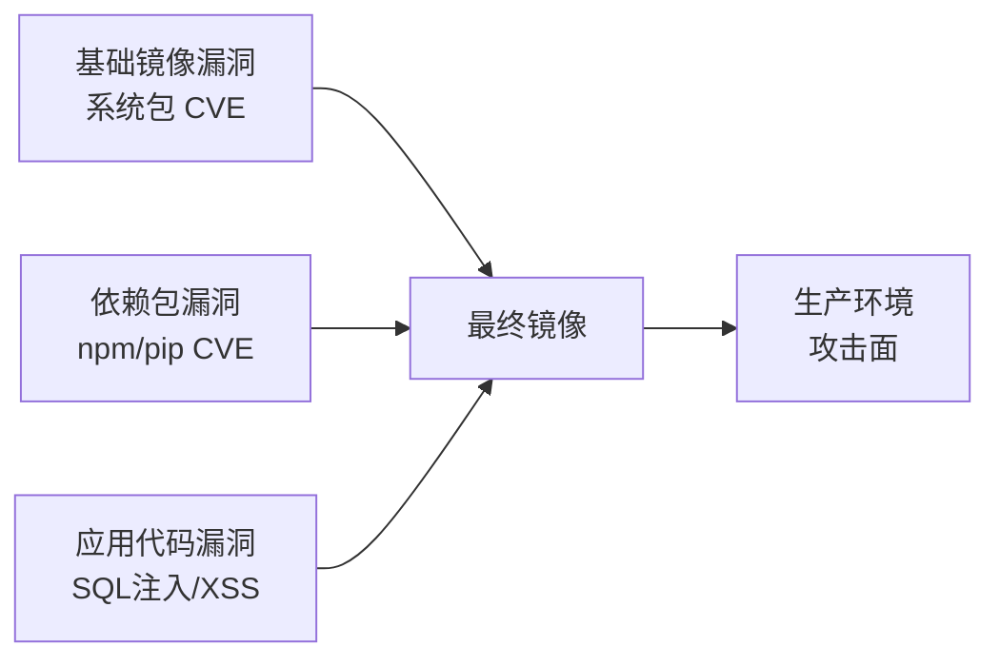

# 镜像安全扫描与分发策略

## 前言

**C：** 你从 Docker Hub 拉了一个基础镜像，里面有几百个系统包，其中可能混入了已知的漏洞（CVE）。如果你的应用跑在生产环境，这些漏洞就是攻击入口。镜像安全扫描和供应链管理是容器化部署中不可忽视的环节。本篇讲解 Trivy 扫描工具的使用、镜像签名验证和 CI/CD 中的安全集成。

<!-- more -->

## 镜像安全风险



## Trivy 扫描工具

### 安装

```bash
# Linux
curl -sfL https://raw.githubusercontent.com/aquasecurity/trivy/main/contrib/install.sh | sh -s -- -b /usr/local/bin

# macOS
brew install trivy

# Docker 方式
docker run --rm -v /var/run/docker.sock:/var/run/docker.sock \
    aquasec/trivy:latest image myapp:1.0
```

### 扫描镜像

```bash
# 扫描镜像漏洞
trivy image myapp:1.0

# 扫描并输出为表格
trivy image --format table myapp:1.0

# 扫描并输出为 JSON
trivy image --format json --output report.json myapp:1.0

# 只扫描高危和严重漏洞
trivy image --severity HIGH,CRITICAL myapp:1.0

# 只扫描特定类型
trivy image --sc vuln myapp:1.0           # 漏洞
trivy image --sc misconfig myapp:1.0      # 配置错误
trivy image --sc secret myapp:1.0          # 密钥泄露
trivy image --sc license myapp:1.0         # 许可证
```

### 扫描输出示例

```
myapp:1.0 (debian 12.2)
=========================
Total: 150 (UNKNOWN: 0, LOW: 50, MEDIUM: 80, HIGH: 15, CRITICAL: 5)

┌──────────────┬──────────────┬──────────┬──────────┬───────────────┬───────────────┐
│   Library    │ Vulnerability │ Severity │  Status  │ Fixed Version │     Title     │
├──────────────┼──────────────┼──────────┼──────────┼───────────────┼───────────────┤
│ libcurl4     │ CVE-2023-38545│ CRITICAL │   fixed  │ 7.88.1-10     │ curl SOCKS5   │
│ openssl      │ CVE-2023-5678 │  HIGH    │   fixed  │ 3.0.13-1      │ OpenSSL X.509 │
│ libxml2      │ CVE-2023-45322│  MEDIUM  │   fixed  │ 2.9.14+dfsg1  │ libxml2       │
└──────────────┴──────────────┴──────────┴──────────┴───────────────┴───────────────┘
```

### 扫描文件系统和 Git 仓库

```bash
# 扫描本地文件系统（源码目录）
trivy fs ./my-project

# 扫描 Git 仓库
trivy repo https://github.com/myorg/my-project

# 扫描配置文件（Kubernetes、Dockerfile、Terraform）
trivy config ./k8s/
trivy config ./Dockerfile
```

### 扫描 Compose 中的镜像

```bash
# 扫描 docker-compose.yml 中引用的所有镜像
trivy image --skip-files "" $(docker compose config | grep 'image:' | awk '{print $2}')
```

## CI/CD 集成

### GitHub Actions

```yaml
name: Security Scan
on:
  push:
    branches: [main]
  pull_request:
    branches: [main]

jobs:
  trivy:
    runs-on: ubuntu-latest
    steps:
      - uses: actions/checkout@v4

      - name: Build image
        run: docker build -t myapp:${{ github.sha }} .

      - name: Trivy vulnerability scan
        uses: aquasecurity/trivy-action@master
        with:
          image-ref: myapp:${{ github.sha }}
          severity: CRITICAL,HIGH
          exit-code: 1
          format: table

      - name: Trivy config scan
        uses: aquasecurity/trivy-action@master
        with:
          scan-type: 'config'
          scan-ref: '.'
          exit-code: 1
```

### GitLab CI

```yaml
trivy-scan:
  stage: test
  image: aquasec/trivy:latest
  script:
    - trivy image --severity HIGH,CRITICAL --exit-code 1 myapp:$CI_COMMIT_SHA
  allow_failure: false
```

## 镜像签名与验证

### 使用 Notary 签名

```bash
# 安装 notary
brew install notary
# 或 Docker Desktop 自带

# 添加信任
export DOCKER_CONTENT_TRUST=1

# 推送签名镜像
docker push registry.example.com/myapp:1.0
# 系统会提示输入密钥库密码并自动签名

# 拉取时验证
export DOCKER_CONTENT_TRUST=1
docker pull registry.example.com/myapp:1.0
# 如果签名不匹配，Docker 会拒绝拉取
```

### Cosign（Sigstore）

```bash
# 安装
go install github.com/sigstore/cosign/cmd/cosign@latest

# 生成密钥对
cosign generate-key-pair

# 签名镜像
cosign sign --key cosign.key registry.example.com/myapp:1.0

# 验证签名
cosign verify --key cosign.pub registry.example.com/myapp:1.0
```

## 镜像分发策略

### 镜像版本管理

```bash
# 语义化版本标签
docker tag myapp:1.0.0 registry.example.com/myapp:1.0.0
docker tag myapp:1.0.0 registry.example.com/myapp:1.0
docker tag myapp:1.0.0 registry.example.com/myapp:latest

# Git SHA 标签（CI/CD）
docker tag myapp registry.example.com/myapp:$(git rev-parse --short HEAD)
```

### 跨仓库镜像复制

Harbor 支持镜像复制规则：

1. 目标 → 新建规则
2. 选择源仓库和目标仓库
3. 设置触发条件（即时、定时、事件驱动）
4. 镜像自动同步

### 镜像分发最佳实践

| 实践 | 说明 |
| --- | --- |
| 锁定基础镜像版本 | `python:3.12.3-slim` 而非 `python:3.12` |
| 定期扫描 | CI 中集成 Trivy，PR 级别阻断高危漏洞 |
| 精简镜像 | alpine/slim 减少攻击面 |
| 签名验证 | 启用 DCT 或 Cosign 验证镜像来源 |
| 最小权限 | 使用非 root 用户运行应用 |
| 定期更新 | 跟踪基础镜像更新，及时修复 CVE |

## 常见问题

### Trivy 扫描超时

```bash
# 增加超时时间
trivy image --timeout 10m myapp:1.0

# 使用离线数据库
trivy image --download-db-only
trivy image --skip-db-update myapp:1.0
```

### Harbor 漏洞扫描数据库过旧

```bash
# 在线更新
# Harbor 系统管理 → 配置管理 → 漏洞扫描 → 更新

# 离线更新（内网环境）
# 下载最新的 Trivy DB 并导入
```

## 小结

镜像安全要点：

1. **Trivy**：免费、全面的扫描工具，支持镜像/文件系统/配置
2. **CI 集成**：PR 级别扫描，高危漏洞阻断合并
3. **镜像签名**：DCT 或 Cosign 验证镜像来源完整性
4. **精简基础镜像**：减少攻击面
5. **定期更新**：跟踪基础镜像的 CVE 修复
