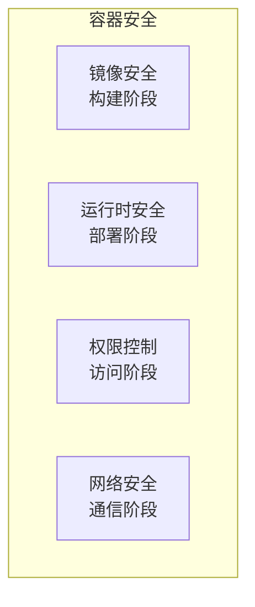

# 容器安全最佳实践

## 前言

**C：** Docker 容器虽然提供了一定程度的隔离，但"容器 ≠ 虚拟机"——容器的内核与宿主机共享，容器逃逸攻击一旦成功，攻击者就直接拿到了宿主机权限。生产环境中，容器安全是不可省略的环节。本篇从镜像安全、运行时安全、权限控制、网络隔离四个维度，系统讲解 Docker 容器安全最佳实践。

<!-- more -->

## 容器安全四层模型



## 一、镜像安全

### 1. 使用可信基础镜像

```dockerfile
# 推荐：官方镜像
FROM python:3.12.3-slim
FROM node:20-alpine

# 推荐：distroless（无 shell、无包管理器）
FROM gcr.io/distroless/python3-debian12
FROM gcr.io/distroless/nodejs20-debian12

# 不推荐：不明来源的第三方镜像
FROM someone/ubuntu-custom
```

### 2. 锁定版本

```dockerfile
# 好：锁定到确切版本
FROM python:3.12.3-slim-bookworm
RUN pip install flask==3.0.3

# 坏：版本可能变化
FROM python:3.12
RUN pip install flask
```

### 3. 不在镜像中存储密钥

```dockerfile
# 不好：密钥被永久记录在镜像历史中
COPY .env /app/.env

# 好：运行时通过环境变量注入
ENV DB_PASSWORD=${DB_PASSWORD}

# 更好：使用 Docker secrets 或 Vault
```

### 4. 精简镜像

```dockerfile
# 好：只安装必要包
RUN apt-get update && apt-get install -y --no-install-recommends \
    curl \
    && rm -rf /var/lib/apt/lists/*
```

## 二、运行时安全

### 1. 非 root 用户运行

```dockerfile
# 创建非 root 用户
RUN groupadd -r -g 1000 appgroup && \
    useradd -r -u 1000 -g appgroup -s /sbin/nologin appuser

WORKDIR /app
COPY --from=builder /app/dist ./dist
COPY --from=builder /app/node_modules ./node_modules
RUN chown -R appuser:appgroup /app

USER appuser

CMD ["node", "dist/server.js"]
```

```bash
# 验证容器运行用户
docker exec myapp id
# 应该输出 uid=1000(appuser) gid=1000(appgroup)
```

### 2. 禁止特权模式

```bash
# 不要使用 --privileged
docker run --privileged nginx   # 危险！可以访问所有设备

# 需要特定设备时，使用 --device 精确指定
docker run --device /dev/ttyUSB0 myapp
```

### 3. 限制资源

```bash
# 限制 CPU 和内存
docker run -d \
    --cpus=2 \
    --memory=4g \
    --memory-swap=4g \
    --pids-limit=100 \
    nginx
```

```yaml
# Compose 中限制
services:
  web:
    deploy:
      resources:
        limits:
          cpus: "2.0"
          memory: 4G
        reservations:
          cpus: "1.0"
          memory: 2G
```

### 4. 只读根文件系统

```dockerfile
# Dockerfile 中声明可写目录为 tmpfs
VOLUME ["/tmp", "/app/uploads"]
```

```bash
# 运行时设置只读
docker run --read-only --tmpfs /tmp --tmpfs /app/uploads myapp
```

```yaml
# Compose
services:
  web:
    read_only: true
    tmpfs:
      - /tmp
      - /app/uploads
```

### 5. 去掉不必要的 Shell

```bash
# 检查镜像中是否有 shell
docker run --rm --entrypoint sh myapp -c "which bash which sh"

# 使用 distroless 镜像（没有 shell）
FROM gcr.io/distroless/python3
```

## 三、权限控制

### 1. Rootless Docker

以非 root 用户运行 Docker daemon：

```bash
# 安装 rootless docker
dockerd-rootless-setuptool.sh install

# 启动
systemctl --user start docker

# 使用
export DOCKER_HOST=unix://$XDG_RUNTIME_DIR/docker.sock
docker ps
```

### 2. Docker Socket 权限

```bash
# docker.sock 是 Docker 的最高权限接口
# 不要随意挂载到容器中

# 危险：容器内可以控制宿主机的所有容器
docker run -v /var/run/docker.sock:/var/run/docker.sock some-image

# 如果需要（如 Portainer），使用非 root 的 docker socket
```

### 3. 能力控制

```bash
# 删除所有能力
docker run --cap-drop ALL nginx

# 只添加需要的能力
docker run --cap-drop ALL --cap-add NET_BIND_SERVICE nginx

# 查看能力
docker run --cap-drop ALL --cap-add CHOWN alpine capsh --print
```

常用能力：

| 能力 | 说明 | 何时需要 |
| --- | --- | --- |
| `NET_BIND_SERVICE` | 绑定 1024 以下端口 | 需要 80/443 端口 |
| `CHOWN` | 修改文件属主 | 某些应用需要 |
| `DAC_OVERRIDE` | 绕过文件权限检查 | 极少需要 |
| `SYS_ADMIN` | 系统管理 | 避免！ |

## 四、网络安全

### 1. 内部网络

```yaml
services:
  db:
    networks:
      - backend
    # 不对外暴露端口

  web:
    networks:
      - frontend
      - backend
    ports:
      - "80:80"

networks:
  frontend:
  backend:
    internal: true    # 禁止访问外网
```

### 2. iptables 规则

```bash
# 禁止容器直接访问外网（Docker 默认允许）
# 使用 internal 网络或在宿主机配置防火墙

# 只允许特定容器访问特定端口
sudo iptables -A DOCKER-USER -p tcp --dport 5432 -s 172.20.0.0/16 -j ACCEPT
sudo iptables -A DOCKER-USER -p tcp --dport 5432 -j DROP
```

### 3. 使用 secrets 管理敏感数据

```bash
# 创建 secret
echo "my_password" | docker secret create db_password -

# Compose 中使用
services:
  db:
    image: postgres:15
    secrets:
      - db_password

secrets:
  db_password:
    external: true
```

```yaml
# 在 Dockerfile 中读取 secret（Swarm 模式）
# 运行时通过 /run/secrets/db_password 访问
```

## 安全检查清单

| 检查项 | 命令/方法 |
| --- | --- |
| 容器以 root 运行？ | `docker exec <容器> id` |
| 使用了 --privileged？ | `docker inspect <容器> \| grep Privileged` |
| 挂载了 docker.sock？ | `docker inspect <容器> \| grep docker.sock` |
| 端口过度暴露？ | `docker port <容器>` |
| 资源无限制？ | `docker stats --no-stream <容器>` |
| 镜像有高危 CVE？ | `trivy image <镜像名>` |
| 使用了 latest 标签？ | 检查 Dockerfile 或 docker-compose.yml |

## 安全扫描工具

| 工具 | 功能 | 安装方式 |
| --- | --- | --- |
| Trivy | 漏洞扫描 | `brew install trivy` |
| dockle | Dockerfile Lint | `brew install goodwithtech/dockle/dockle` |
| Hadolint | Dockerfile 检查 | `brew install hadolint` |
| Dive | 镜像层分析 | `brew install dive` |

```bash
# Dockerfile 检查
hadolint Dockerfile

# 镜像 Lint
dockle myapp:1.0

# 镜像层分析
dive myapp:1.0
```

## 常见问题

### 容器以 root 运行的应用报权限错误

在 Dockerfile 中使用 `USER` 切换用户后，需要确保文件属主正确：

```dockerfile
RUN chown -R appuser:appgroup /app
USER appuser
```

### distroless 镜像无法调试

distroless 没有 shell，调试时临时换回普通镜像：

```bash
# 调试时
docker run --rm -it --entrypoint sh myapp-debug:1.0

# 生产时
docker run myapp:1.0
```

## 小结

容器安全核心原则：

1. **最小权限**：非 root 运行、限制能力、限制资源
2. **精简镜像**：alpine/slim/distroless，减少攻击面
3. **网络隔离**：internal 网络、不暴露数据库端口
4. **密钥管理**：不在镜像中存密钥，用 secrets 或环境变量
5. **定期扫描**：Trivy + Hadolint + Dockle
6. **禁止特权**：不用 `--privileged`，不挂载 `docker.sock`
